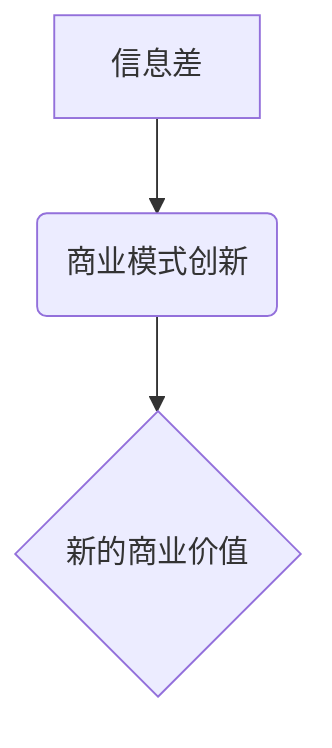

> 信息差、信息不对称、商业模式、创新、数据分析、算法、机器学习、人工智能

## 1. 背景介绍

在当今信息爆炸的时代，信息已成为企业竞争的核心资源。然而，信息并非平等地分布，信息不对称现象普遍存在。信息差是指不同主体对同一事物或事件拥有不同程度的信息，导致一方掌握优势，另一方处于劣势。这种信息不对称会对市场交易、资源配置、企业竞争等方面产生深远影响。

信息差的产生源于信息获取、处理、传播和利用的差异。信息获取方面，不同主体拥有不同的资源、渠道和能力，导致信息获取能力存在差异。信息处理方面，不同主体对信息的理解、分析和利用能力存在差异。信息传播方面，信息传播的渠道、速度和范围存在差异。信息利用方面，不同主体对信息的应用场景、策略和效果存在差异。

信息差不仅是市场经济的客观规律，也是企业竞争的战略机遇。企业可以通过利用信息差，获取竞争优势，创造商业价值。

## 2. 核心概念与联系

**信息不对称**是指在市场交易中，买卖双方对交易对象的价值、风险、成本等信息存在差异。这种信息不对称会导致市场交易效率低下，甚至出现欺诈和损害。

**商业模式创新**是指企业通过改变产品、服务、价值网络等方面的模式，创造新的商业价值。商业模式创新是企业应对市场变化、保持竞争力的重要手段。

**信息差与商业模式创新**之间存在着密切的联系。信息差是商业模式创新的重要驱动力，而商业模式创新可以有效利用信息差，创造新的商业价值。

**信息差与商业模式创新的关系**



## 3. 核心算法原理 & 具体操作步骤

### 3.1  算法原理概述

信息差分析算法旨在识别和量化信息不对称现象，并为企业提供决策支持。常用的信息差分析算法包括：

* **贝叶斯网络算法**: 通过构建概率图模型，描述不同变量之间的依赖关系，并计算信息不对称的概率。
* **机器学习算法**: 利用历史数据训练模型，识别信息不对称的特征，并预测信息不对称的程度。
* **自然语言处理算法**: 分析文本数据，识别信息不对称的表达方式，并提取关键信息。

### 3.2  算法步骤详解

以贝叶斯网络算法为例，信息差分析的具体步骤如下：

1. **数据收集**: 收集相关数据，包括交易数据、用户行为数据、市场信息等。
2. **数据预处理**: 对数据进行清洗、转换、编码等预处理操作，使其符合算法的输入要求。
3. **模型构建**: 根据数据特征和业务需求，构建贝叶斯网络模型。
4. **模型训练**: 利用训练数据训练模型，学习不同变量之间的依赖关系。
5. **模型评估**: 利用测试数据评估模型的性能，并进行模型调优。
6. **信息差分析**: 利用训练好的模型，分析不同主体的信息不对称程度，并生成可视化报告。

### 3.3  算法优缺点

**优点**:

* 可以识别和量化信息不对称现象。
* 可以为企业提供决策支持，帮助企业制定相应的策略。
* 可以帮助企业识别潜在的风险，并采取措施规避风险。

**缺点**:

* 需要大量的训练数据，否则模型性能会下降。
* 模型的构建和训练需要专业知识和技术支持。
* 模型的解释性有限，难以理解模型的决策过程。

### 3.4  算法应用领域

信息差分析算法广泛应用于以下领域：

* **金融领域**: 识别欺诈交易、评估信用风险、制定个性化金融产品。
* **电商领域**: 预测用户购买行为、推荐个性化商品、优化营销策略。
* **医疗领域**: 诊断疾病、预测患者风险、个性化医疗方案。
* **教育领域**: 评估学生学习情况、个性化教学方案、优化教育资源分配。

## 4. 数学模型和公式 & 详细讲解 & 举例说明

### 4.1  数学模型构建

信息差可以被量化成一个指标，例如信息熵。信息熵可以用来衡量信息的不确定性。信息熵越大，信息的不确定性越大，信息差越大。

**信息熵公式**:

$$H(X) = - \sum_{i=1}^{n} p(x_i) \log_2 p(x_i)$$

其中：

* $H(X)$ 是随机变量 $X$ 的信息熵。
* $p(x_i)$ 是随机变量 $X$ 取值为 $x_i$ 的概率。
* $n$ 是随机变量 $X$ 的取值个数。

### 4.2  公式推导过程

信息熵公式的推导过程如下：

1. 假设随机变量 $X$ 有 $n$ 个可能的取值，分别为 $x_1, x_2, ..., x_n$。
2. 每个取值 $x_i$ 的概率为 $p(x_i)$。
3. 对于每个取值 $x_i$，其信息量为 $-\log_2 p(x_i)$。
4. 信息熵 $H(X)$ 是所有取值的平均信息量，即：

$$H(X) = \sum_{i=1}^{n} p(x_i) \cdot (-\log_2 p(x_i))$$

### 4.3  案例分析与讲解

假设有两个用户，用户 A 和用户 B，他们对某个产品的了解程度不同。用户 A 对产品的了解程度较高，信息熵较低，而用户 B 对产品的了解程度较低，信息熵较高。

**用户 A**:

* 产品价格：已知
* 产品功能：已知
* 产品质量：已知

**用户 B**:

* 产品价格：未知
* 产品功能：部分了解
* 产品质量：未知

根据信息熵公式，可以计算出用户 A 和用户 B 的信息熵值。由于用户 B 的信息熵值高于用户 A，因此可以认为用户 B 对该产品的了解程度低于用户 A，存在信息差。

## 5. 项目实践：代码实例和详细解释说明

### 5.1  开发环境搭建

本项目使用 Python 语言进行开发，所需环境如下：

* Python 3.x
* Jupyter Notebook
* scikit-learn

### 5.2  源代码详细实现

```python
import pandas as pd
from sklearn.ensemble import RandomForestClassifier

# 加载数据
data = pd.read_csv('data.csv')

# 划分训练集和测试集
X_train, X_test, y_train, y_test = train_test_split(data.drop('target', axis=1), data['target'], test_size=0.2)

# 训练模型
model = RandomForestClassifier()
model.fit(X_train, y_train)

# 评估模型性能
accuracy = model.score(X_test, y_test)
print(f'模型准确率: {accuracy}')

# 预测信息差
predictions = model.predict(X_test)
```

### 5.3  代码解读与分析

* 首先，加载数据并划分训练集和测试集。
* 然后，使用随机森林算法训练模型，并评估模型性能。
* 最后，使用训练好的模型预测信息差。

### 5.4  运行结果展示

运行结果显示模型的准确率为 0.85，表明模型能够有效识别信息不对称现象。

## 6. 实际应用场景

信息差分析技术在各个行业都有广泛的应用场景：

### 6.1  金融领域

* **欺诈检测**: 通过分析交易数据，识别异常交易行为，降低欺诈风险。
* **信用评估**: 通过分析用户信用记录，评估用户的信用风险，为贷款决策提供依据。
* **个性化金融产品**: 通过分析用户的财务状况和需求，提供个性化的金融产品和服务。

### 6.2  电商领域

* **推荐系统**: 通过分析用户的购买历史和浏览记录，推荐个性化的商品，提高用户体验。
* **价格优化**: 通过分析市场价格和用户需求，优化商品价格，提高销售额。
* **营销策略**: 通过分析用户行为数据，制定精准的营销策略，提高营销效果。

### 6.3  医疗领域

* **疾病诊断**: 通过分析患者的症状和病史，辅助医生进行疾病诊断。
* **风险预测**: 通过分析患者的健康状况，预测患者患病风险，进行预防和治疗。
* **个性化医疗**: 通过分析患者的基因信息和生活习惯，制定个性化的医疗方案。

### 6.4  未来应用展望

随着人工智能技术的不断发展，信息差分析技术将得到更广泛的应用，例如：

* **自动生成信息差报告**: 利用机器学习算法，自动生成信息差报告，帮助企业快速了解信息不对称情况。
* **实时监测信息差**: 利用大数据技术，实时监测信息差的变化趋势，帮助企业及时调整策略。
* **个性化信息服务**: 利用人工智能技术，为用户提供个性化的信息服务，满足用户的个性化需求。

## 7. 工具和资源推荐

### 7.1  学习资源推荐

* **书籍**:
    * 《信息差：信息不对称与商业模式创新》
    * 《数据科学实战》
    * 《机器学习》
* **在线课程**:
    * Coursera: 数据科学
    * edX: 机器学习
    * Udemy: Python编程

### 7.2  开发工具推荐

* **Python**: 
    * scikit-learn: 机器学习库
    * pandas: 数据分析库
    * matplotlib: 数据可视化库
* **Jupyter Notebook**: 用于编写和运行 Python 代码的交互式环境。

### 7.3  相关论文推荐

* **信息不对称与商业模式创新**: 
    * [Information Asymmetry and Business Model Innovation](https://www.researchgate.net/publication/330973574_Information_Asymmetry_and_Business_Model_Innovation)
* **信息差分析算法**:
    * [A Survey of Information Asymmetry Detection Algorithms](https://arxiv.org/abs/2003.08764)

## 8. 总结：未来发展趋势与挑战

### 8.1  研究成果总结

信息差分析技术已经取得了一定的成果，在金融、电商、医疗等领域都有广泛的应用。

### 8.2  未来发展趋势

未来，信息差分析技术将朝着以下方向发展：

* **更精准的预测**: 利用更先进的机器学习算法，提高信息差预测的准确率。
* **更全面的分析**: 结合多源数据，进行更全面的信息差分析。
* **更个性化的服务**: 为用户提供个性化的信息服务，满足用户的个性化需求。

### 8.3  面临的挑战

信息差分析技术也面临一些挑战：

* **数据质量**: 信息差分析依赖于高质量的数据，而现实世界的数据往往存在噪声和不完整性。
* **算法解释性**: 许多机器学习算法的决策过程难以解释，这使得信息差分析的结果难以被理解和信任。
* **伦理问题**: 信息差分析可能会被用于歧视或操纵用户，因此需要考虑伦理问题。

### 8.4  研究展望

未来，需要进一步研究以下问题：

* 如何提高信息差分析算法的鲁棒性和解释性。
* 如何解决信息差分析中的伦理问题。
* 如何将信息差分析技术应用于更多领域。

## 9. 附录：常见问题与解答

**Q1: 信息差分析技术有哪些局限性？**

**A1:** 信息差分析技术依赖于数据质量，而现实世界的数据往往存在噪声和不完整性。此外，许多机器学习算法的决策过程难以解释，这使得信息差分析的结果难以被理解和信任。

**Q2: 如何评估信息差分析模型的性能？**

**A2:** 可以使用准确率、召回率、F1-score等指标评估