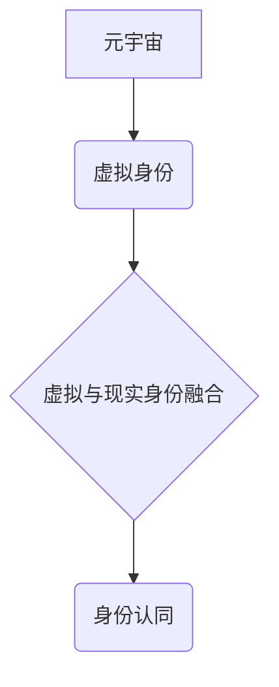

> 元宇宙、身份认同、虚拟现实、增强现实、区块链、数字孪生、人工智能、隐私保护

## 1. 背景介绍

元宇宙概念近年来备受关注，它被描绘成一个由虚拟现实 (VR)、增强现实 (AR) 和互联网连接的沉浸式数字世界。在这个虚拟世界中，用户可以创建虚拟身份，与他人互动，参与各种活动，并拥有虚拟资产。然而，元宇宙的兴起也引发了关于身份认同的深刻思考。

传统社会中，我们的身份认同主要基于现实世界中的经历、关系和社会角色。但在元宇宙中，虚拟身份将与现实身份更加紧密地融合，这将带来新的挑战和机遇。

## 2. 核心概念与联系

**2.1 元宇宙**

元宇宙是一个由虚拟现实、增强现实和互联网连接的沉浸式数字世界，它具有以下特征：

* **沉浸式体验:** 通过 VR 和 AR 技术，用户可以沉浸在虚拟环境中，体验逼真的感官刺激。
* **持久性:** 元宇宙是一个持续运行的虚拟世界，即使用户离开，虚拟世界也会继续存在。
* **去中心化:** 元宇宙由多个参与者共同构建和维护，而不是由单一实体控制。
* **经济系统:** 元宇宙拥有自己的经济系统，用户可以交易虚拟资产和服务。

**2.2 身份认同**

身份认同是指个体对自身在社会中的位置和角色的认知和理解。它包括个人特征、社会角色、价值观和信念等方面。

**2.3 虚拟与现实身份的融合**

在元宇宙中，虚拟身份将与现实身份更加紧密地融合。用户可以创建虚拟形象，并通过虚拟身份参与各种活动，与他人互动，并拥有虚拟资产。虚拟身份的丰富性和可定制性将使用户能够在元宇宙中探索不同的自我，并体验不同的生活方式。

**2.4 核心概念关系图**



## 3. 核心算法原理 & 具体操作步骤

**3.1 算法原理概述**

元宇宙身份认同的实现需要结合多种技术，包括区块链、人工智能、数字孪生等。

* **区块链技术:** 用于确保虚拟身份的唯一性和不可篡改性，防止身份盗用和欺诈。
* **人工智能技术:** 用于分析用户行为和偏好，个性化定制虚拟身份和体验。
* **数字孪生技术:** 用于创建虚拟用户的数字模型，并将其与现实世界中的用户数据同步，实现虚拟身份与现实身份的融合。

**3.2 算法步骤详解**

1. **用户注册:** 用户在元宇宙平台上注册，并提供必要的个人信息。
2. **身份验证:** 平台使用区块链技术验证用户的身份，并生成唯一的虚拟身份标识符。
3. **虚拟形象创建:** 用户可以选择或自定义虚拟形象，包括外貌、服装、道具等。
4. **身份数据绑定:** 用户可以选择将现实世界中的数据，例如社交媒体账号、兴趣爱好等，绑定到虚拟身份上。
5. **虚拟身份交互:** 用户可以使用虚拟身份与其他用户互动，参与各种活动，并拥有虚拟资产。

**3.3 算法优缺点**

* **优点:**
    * 确保身份唯一性和不可篡改性。
    * 提供个性化定制的虚拟身份体验。
    * 实现虚拟身份与现实身份的融合。
* **缺点:**
    * 需要强大的技术支持和安全保障。
    * 可能会引发隐私保护和数据安全问题。

**3.4 算法应用领域**

* **游戏:** 创建更沉浸式和个性化的游戏体验。
* **社交:** 建立虚拟社交空间，方便用户进行交流和互动。
* **教育:** 提供虚拟学习环境，增强学习体验。
* **医疗:** 创建虚拟医疗场景，进行远程医疗和疾病模拟。

## 4. 数学模型和公式 & 详细讲解 & 举例说明

**4.1 数学模型构建**

我们可以使用一个简单的数学模型来表示虚拟身份的属性和特征。

假设虚拟身份由以下属性组成：

* **外貌:**  $A = (h, f, c)$，其中 $h$ 表示身高，$f$ 表示肤色，$c$ 表示发型。
* **性格:** $P = (t, s, i)$，其中 $t$ 表示性格类型，$s$ 表示社交能力，$i$ 表示智力水平。
* **兴趣:** $I = \{i_1, i_2, ..., i_n\}$，其中 $i_j$ 表示用户的兴趣爱好。

**4.2 公式推导过程**

我们可以使用向量和集合来表示虚拟身份的属性。

* **虚拟身份向量:** $V = (A, P, I)$

* **相似度计算:** 我们可以使用余弦相似度来计算两个虚拟身份之间的相似度。

$$
\text{相似度}(V_1, V_2) = \frac{V_1 \cdot V_2}{||V_1|| ||V_2||}
$$

**4.3 案例分析与讲解**

假设有两个虚拟身份 $V_1$ 和 $V_2$，它们的属性如下：

* $V_1 = ((1.7, 0.8, 1), (1, 0.9, 0.8), \{音乐, 运动\})$
* $V_2 = ((1.8, 0.7, 2), (0.9, 0.8, 0.7), \{电影, 阅读\})$

我们可以使用上述公式计算它们的相似度。

## 5. 项目实践：代码实例和详细解释说明

**5.1 开发环境搭建**

* 操作系统: Ubuntu 20.04
* 编程语言: Python 3.8
* 开发工具: PyCharm

**5.2 源代码详细实现**

```python
import numpy as np

class VirtualIdentity:
    def __init__(self, appearance, personality, interests):
        self.appearance = appearance
        self.personality = personality
        self.interests = interests

    def calculate_similarity(self, other_identity):
        # 计算两个虚拟身份的相似度
        # ...

# 示例代码
identity1 = VirtualIdentity((1.7, 0.8, 1), (1, 0.9, 0.8), ["音乐", "运动"])
identity2 = VirtualIdentity((1.8, 0.7, 2), (0.9, 0.8, 0.7), ["电影", "阅读"])

similarity = identity1.calculate_similarity(identity2)
print(f"相似度: {similarity}")
```

**5.3 代码解读与分析**

* `VirtualIdentity` 类定义了虚拟身份的属性和方法。
* `calculate_similarity` 方法计算两个虚拟身份的相似度。
* 示例代码创建了两个虚拟身份，并计算了它们的相似度。

**5.4 运行结果展示**

运行上述代码，将输出两个虚拟身份的相似度值。

## 6. 实际应用场景

**6.1 游戏**

元宇宙身份认同可以为游戏玩家提供更沉浸式和个性化的游戏体验。玩家可以创建虚拟形象，并通过虚拟身份参与游戏活动，与其他玩家互动。

**6.2 社交**

元宇宙可以建立虚拟社交空间，方便用户进行交流和互动。用户可以使用虚拟身份创建自己的虚拟形象，并与其他用户建立联系。

**6.3 教育**

元宇宙可以提供虚拟学习环境，增强学习体验。学生可以使用虚拟身份参与虚拟课堂，与老师和同学互动，并完成虚拟实验。

**6.4 未来应用展望**

元宇宙身份认同的应用场景还在不断扩展。未来，它可能被应用于医疗、金融、艺术等领域，为人们的生活带来更多便利和可能性。

## 7. 工具和资源推荐

**7.1 学习资源推荐**

* **书籍:**
    * 《元宇宙：虚拟世界与现实世界的融合》
    * 《区块链技术入门》
    * 《人工智能基础》
* **在线课程:**
    * Coursera: 元宇宙与虚拟现实
    * edX: 区块链技术
    * Udacity: 人工智能

**7.2 开发工具推荐**

* **Unity:** 游戏开发引擎
* **Unreal Engine:** 游戏开发引擎
* **Decentraland:** 元宇宙平台
* **Sandbox:** 元宇宙平台

**7.3 相关论文推荐**

* **The Metaverse: A New Paradigm for Human Interaction**
* **Blockchain Technology for Identity Management in the Metaverse**
* **Artificial Intelligence for Personalized Experiences in the Metaverse**

## 8. 总结：未来发展趋势与挑战

**8.1 研究成果总结**

元宇宙身份认同是一个新兴的研究领域，已经取得了一些重要的成果。

* 构建了虚拟身份的数学模型和算法。
* 开发了基于区块链和人工智能的虚拟身份管理系统。
* 探索了元宇宙身份认同在游戏、社交、教育等领域的应用场景。

**8.2 未来发展趋势**

* **更沉浸式和个性化的虚拟身份体验:** 利用增强现实和虚拟现实技术，创造更逼真的虚拟世界，并提供更个性化的虚拟身份定制。
* **更安全的虚拟身份管理:** 利用区块链技术，确保虚拟身份的唯一性和不可篡改性，防止身份盗用和欺诈。
* **更广泛的元宇宙应用场景:** 元宇宙身份认同将被应用于更多领域，例如医疗、金融、艺术等，为人们的生活带来更多便利和可能性。

**8.3 面临的挑战**

* **技术挑战:** 元宇宙身份认同的实现需要克服许多技术挑战，例如如何确保虚拟身份的安全性、隐私性和可信度。
* **伦理挑战:** 元宇宙身份认同也面临一些伦理挑战，例如如何防止虚拟身份被滥用，如何保护用户的隐私和数据安全。
* **社会挑战:** 元宇宙身份认同的普及可能会改变人们的社会关系和行为模式，需要社会进行充分的讨论和准备。

**8.4 研究展望**

未来，我们将继续研究元宇宙身份认同的理论和实践，探索其在不同领域的应用，并积极应对其带来的挑战，为构建一个更加安全、公平、可持续的元宇宙贡献力量。

## 9. 附录：常见问题与解答

**9.1 如何保护我的虚拟身份安全？**

* 使用强密码并定期更换密码。
* 启用双重身份验证。
* 不要在不安全的网站或应用程序上输入您的虚拟身份信息。
* 注意网络钓鱼攻击。

**9.2 我的虚拟身份数据是否安全？**

元宇宙平台应该采取严格的安全措施来保护用户的虚拟身份数据。

* 使用加密技术保护数据。
* 限制对数据的访问权限。
* 定期进行安全审计。

**9.3 我可以删除我的虚拟身份吗？**

是的，您可以删除您的虚拟身份。

* 联系元宇宙平台的客服人员。
* 按照平台的规定操作删除您的虚拟身份。

作者：禅与计算机程序设计艺术 / Zen and the Art of Computer Programming


<end_of_turn>