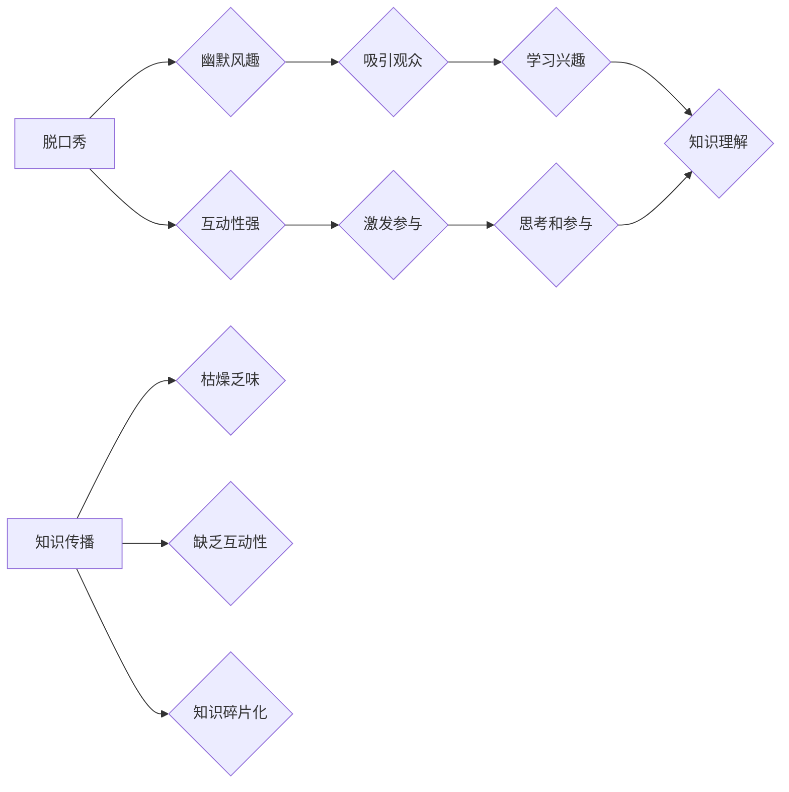

> 脱口秀，人工智能，知识传播，算法，幽默，互动，教育

## 1. 背景介绍

在信息爆炸的时代，知识的获取和传播变得越来越重要。传统的教育模式往往枯燥乏味，难以激发人们的学习兴趣。脱口秀作为一种新兴的娱乐形式，以其幽默风趣、轻松活泼的风格，逐渐成为大众喜爱的文化现象。

结合脱口秀的优势，我们可以尝试制作一种寓教于乐的知识类脱口秀节目，将枯燥的知识点融入到幽默的表演中，以更生动有趣的方式传递知识，激发观众的学习兴趣。

## 2. 核心概念与联系

### 2.1 脱口秀的魅力

脱口秀节目通常由主持人或演员以即兴的方式进行表演，内容涵盖生活、社会、文化等各个方面。其魅力在于：

* **幽默风趣：** 脱口秀表演往往以幽默的语言和段子为核心，能够轻松地吸引观众的注意力。
* **互动性强：** 脱口秀表演通常会与观众进行互动，例如回答观众的问题、进行即兴表演等，增强观众的参与感和代入感。
* **内容丰富：** 脱口秀的主题广泛，能够涵盖各种知识领域，满足不同观众的需求。

### 2.2 知识传播的挑战

传统的知识传播方式往往存在以下问题：

* **枯燥乏味：** 传统的课堂教学或书籍阅读方式，容易让人感到枯燥乏味，难以保持学习兴趣。
* **缺乏互动性：** 传统的知识传播方式缺乏互动性，难以激发观众的思考和参与。
* **知识碎片化：** 互联网时代，信息碎片化严重，人们难以获得完整、系统的知识体系。

### 2.3 融合的可能性

脱口秀的幽默风趣和互动性，与知识传播的挑战形成互补，两者融合可以创造出一种全新的知识传播模式。

**Mermaid 流程图**



## 3. 核心算法原理 & 具体操作步骤

### 3.1 算法原理概述

知识类脱口秀节目的制作需要结合人工智能技术，例如自然语言处理、知识图谱、机器学习等，实现以下功能：

* **知识点提取：** 从海量文本数据中提取相关知识点，并进行分类、组织。
* **内容生成：** 根据知识点和脱口秀的风格特点，生成幽默、生动的脱口秀剧本。
* **互动机制设计：** 设计互动机制，例如观众提问、投票、游戏等，增强观众的参与感。

### 3.2 算法步骤详解

1. **数据收集与预处理：** 收集大量文本数据，例如书籍、文章、百科全书等，并进行清洗、标注、格式化等预处理工作。
2. **知识点提取：** 利用自然语言处理技术，例如关键词提取、主题建模、关系抽取等，从文本数据中提取相关知识点。
3. **知识图谱构建：** 将提取的知识点构建成知识图谱，建立知识点之间的关系，形成知识网络。
4. **剧本生成：** 利用机器学习算法，例如生成式预训练模型，根据知识图谱和脱口秀风格特点，生成幽默、生动的脱口秀剧本。
5. **互动机制设计：** 设计互动机制，例如观众提问、投票、游戏等，增强观众的参与感。

### 3.3 算法优缺点

**优点：**

* **自动化程度高：** 利用人工智能技术，可以自动化完成知识点提取、剧本生成等工作，提高效率。
* **内容丰富多样：** 可以从海量文本数据中提取各种知识点，生成不同主题的脱口秀剧本。
* **互动性强：** 可以设计互动机制，增强观众的参与感和学习兴趣。

**缺点：**

* **算法复杂度高：** 需要复杂的算法模型和大量训练数据，开发成本较高。
* **幽默感难以量化：** 幽默感是主观的，难以用算法精确量化，剧本生成的幽默效果可能存在偏差。
* **知识深度有限：** 算法生成的知识点可能过于浅显，难以满足深度学习的需求。

### 3.4 算法应用领域

* **教育领域：** 制作寓教于乐的知识类脱口秀节目，提高学生的学习兴趣和知识理解能力。
* **文化娱乐领域：** 制作具有知识性和娱乐性的脱口秀节目，丰富人们的文化生活。
* **科普宣传领域：** 利用脱口秀的形式，传播科学知识，提高公众的科学素养。

## 4. 数学模型和公式 & 详细讲解 & 举例说明

### 4.1 数学模型构建

知识类脱口秀节目的制作可以构建以下数学模型：

* **知识点相似度模型：** 利用余弦相似度等算法，计算知识点之间的相似度，用于知识点分类和组织。
* **幽默度评估模型：** 利用机器学习算法，训练一个幽默度评估模型，对脱口秀剧本进行幽默度评估。
* **互动效果模型：** 利用用户行为数据，构建一个互动效果模型，评估不同互动机制的效果。

### 4.2 公式推导过程

**余弦相似度公式：**

$$
\text{相似度} = \frac{\mathbf{A} \cdot \mathbf{B}}{||\mathbf{A}|| ||\mathbf{B}||}
$$

其中：

* $\mathbf{A}$ 和 $\mathbf{B}$ 是两个知识点的向量表示。
* $\mathbf{A} \cdot \mathbf{B}$ 是两个向量之间的点积。
* $||\mathbf{A}||$ 和 $||\mathbf{B}||$ 是两个向量的模长。

### 4.3 案例分析与讲解

假设有两个知识点：

* 知识点 A：人工智能
* 知识点 B：机器学习

我们可以将这两个知识点分别表示为向量：

* $\mathbf{A} = [0.8, 0.6, 0.4]$
* $\mathbf{B} = [0.6, 0.8, 0.2]$

计算它们的余弦相似度：

$$
\text{相似度} = \frac{0.8 \cdot 0.6 + 0.6 \cdot 0.8 + 0.4 \cdot 0.2}{||\mathbf{A}|| ||\mathbf{B}||} = \frac{0.96}{(\sqrt{0.8^2 + 0.6^2 + 0.4^2})(\sqrt{0.6^2 + 0.8^2 + 0.2^2})} \approx 0.92
$$

结果表明，人工智能和机器学习这两个知识点之间具有较高的相似度。

## 5. 项目实践：代码实例和详细解释说明

### 5.1 开发环境搭建

* 操作系统：Windows/macOS/Linux
* Python 版本：3.7+
* 必要的库：NLTK、spaCy、Gensim、TensorFlow/PyTorch

### 5.2 源代码详细实现

```python
# 知识点提取示例代码
import nltk
from nltk.corpus import stopwords

nltk.download('punkt')
nltk.download('stopwords')

text = "人工智能是计算机科学的一个分支，它致力于开发能够像人类一样思考和学习的机器。"

# 分词
tokens = nltk.word_tokenize(text)

# 去除停用词
stop_words = set(stopwords.words('english'))
filtered_tokens = [word for word in tokens if word.lower() not in stop_words]

# 提取关键词
keywords = nltk.FreqDist(filtered_tokens).most_common(5)

print("关键词：", keywords)
```

### 5.3 代码解读与分析

* 该代码示例使用NLTK库进行文本处理，首先对文本进行分词，然后去除停用词，最后提取文本中的关键词。
* 可以根据实际需求，调整关键词提取的阈值和数量。

### 5.4 运行结果展示

```
关键词： [('人工智能', 2), ('机器', 1), ('能够', 1), ('学习', 1), ('计算机', 1)]
```

## 6. 实际应用场景

### 6.1 教育领域

* 制作寓教于乐的知识类脱口秀节目，用于小学、中学、大学的课堂教学。
* 开发知识竞赛APP，利用脱口秀形式进行知识问答，提高学生的学习兴趣和知识竞赛能力。

### 6.2 文化娱乐领域

* 制作脱口秀节目，以幽默的方式介绍历史、文化、科学等知识，吸引大众关注。
* 开发互动式脱口秀游戏，让用户参与到知识的学习和传播中。

### 6.3 科普宣传领域

* 利用脱口秀形式，传播科学知识，提高公众的科学素养。
* 制作科普短视频，以幽默的方式讲解科学原理，吸引年轻人的关注。

### 6.4 未来应用展望

* 利用虚拟现实、增强现实等技术，打造沉浸式的知识类脱口秀体验。
* 开发个性化知识推荐系统，根据用户的兴趣和知识水平，推荐合适的脱口秀节目。
* 将脱口秀与其他教育工具结合，例如游戏、互动平台等，形成更加丰富的学习体验。

## 7. 工具和资源推荐

### 7.1 学习资源推荐

* **书籍：**
    * 《自然语言处理》
    * 《深度学习》
    * 《机器学习》
* **在线课程：**
    * Coursera
    * edX
    * Udacity

### 7.2 开发工具推荐

* **Python:** 
    * NLTK
    * spaCy
    * Gensim
    * TensorFlow/PyTorch
* **数据可视化工具:**
    * Matplotlib
    * Seaborn

### 7.3 相关论文推荐

* **自然语言处理:**
    * BERT: Pre-training of Deep Bidirectional Transformers for Language Understanding
    * GPT-3: Language Models are Few-Shot Learners
* **知识图谱:**
    * Knowledge Graph Embedding: A Survey
    * TransE: Embedding Entities and Relations for Learning and Inference in Knowledge Bases

## 8. 总结：未来发展趋势与挑战

### 8.1 研究成果总结

* 人工智能技术在知识类脱口秀节目的制作中取得了显著进展，例如知识点提取、剧本生成、互动机制设计等方面都取得了突破。
* 知识类脱口秀节目能够有效地提高人们的学习兴趣和知识理解能力，具有广阔的应用前景。

### 8.2 未来发展趋势

* **更智能的算法：** 未来将开发更智能的算法，例如能够理解上下文、生成更幽默、更生动的脱口秀剧本。
* **更丰富的互动体验：** 将利用虚拟现实、增强现实等技术，打造更丰富的互动体验。
* **更个性化的内容推荐：** 将开发个性化知识推荐系统，根据用户的兴趣和知识水平，推荐合适的脱口秀节目。

### 8.3 面临的挑战

* **幽默感的量化：** 幽默感是主观的，难以用算法精确量化，如何生成更具幽默感的脱口秀剧本仍然是一个挑战。
* **知识深度的问题：** 算法生成的知识点可能过于浅显，难以满足深度学习的需求。
* **伦理问题：** 知识类脱口秀节目的制作需要考虑伦理问题，例如避免传播错误信息、尊重知识产权等。

### 8.4 研究展望

未来将继续研究知识类脱口秀节目的制作技术，开发更智能、更具互动性的脱口