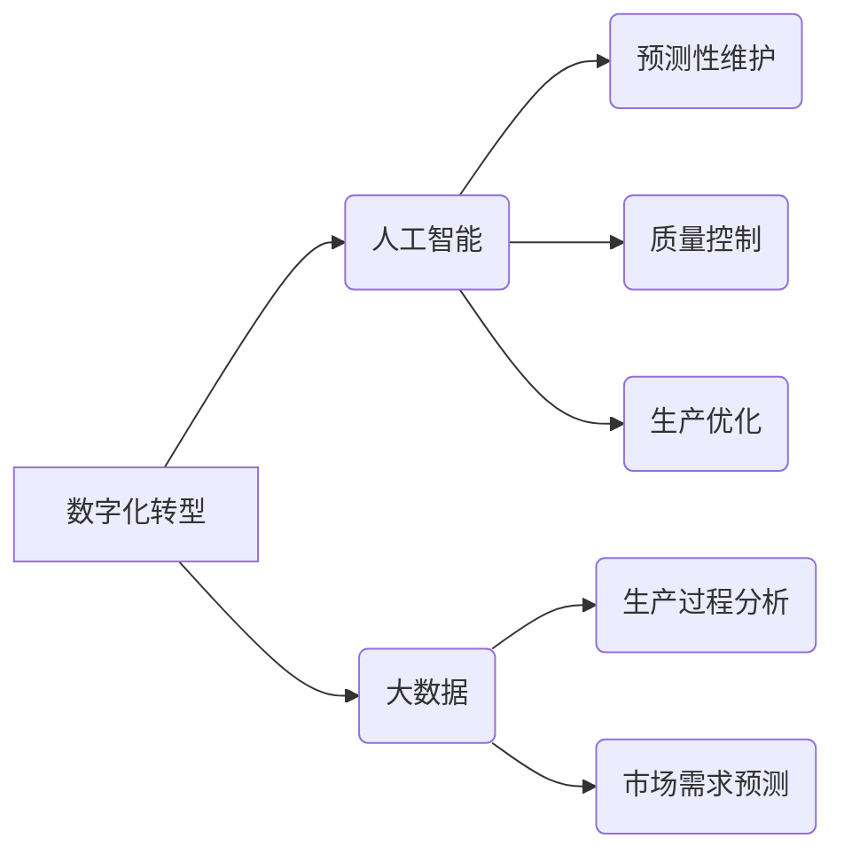

> 制造业数字化转型、人工智能、大数据、机器学习、深度学习、工业互联网、云计算、物联网

## 1. 背景介绍

制造业是国民经济的重要支柱产业，其发展水平直接关系到一个国家的经济实力和国际竞争力。近年来，随着信息技术的飞速发展，数字化、智能化、网络化成为全球制造业发展的趋势。

传统制造业面临着诸多挑战，例如生产效率低、产品质量不稳定、成本控制困难、市场竞争激烈等。而数字化、人工智能、大数据等新兴技术为制造业转型升级提供了新的机遇。

## 2. 核心概念与联系

**2.1 数字化转型**

数字化转型是指利用数字化技术和手段，对制造业的生产、管理、服务等环节进行全面升级改造，实现生产过程的智能化、自动化、可视化和数据化。

**2.2 人工智能 (AI)**

人工智能是指模拟人类智能行为的计算机系统，包括学习、推理、决策、感知、语言理解等能力。在制造业中，人工智能可以应用于预测性维护、质量控制、生产优化等领域。

**2.3 大数据**

大数据是指海量、高速、多样化的数据，通过对大数据的分析和挖掘，可以发现制造业生产过程中的规律和趋势，为决策提供数据支持。

**2.4 核心概念联系**

数字化转型是制造业发展的基础，人工智能和大数据是数字化转型的关键技术。

* 数字化转型为制造业提供了数据基础，人工智能和大数据可以对这些数据进行分析和挖掘，从而实现智能化生产和管理。
* 人工智能和大数据可以帮助制造业提高生产效率、降低成本、提升产品质量，实现智能化转型升级。

**2.5 架构图**



## 3. 核心算法原理 & 具体操作步骤

**3.1 算法原理概述**

在制造业数字化转型中，人工智能算法扮演着至关重要的角色。常见的算法包括：

* **机器学习 (Machine Learning)**：通过训练模型，从数据中学习规律，实现预测、分类、聚类等功能。
* **深度学习 (Deep Learning)**：一种更高级的机器学习算法，利用多层神经网络，能够处理更复杂的数据，例如图像、语音、文本等。

**3.2 算法步骤详解**

以机器学习为例，其基本步骤包括：

1. **数据收集和预处理**: 收集相关数据，并进行清洗、转换、特征提取等预处理工作。
2. **模型选择**: 根据具体任务选择合适的机器学习算法模型。
3. **模型训练**: 利用训练数据训练模型，调整模型参数，使其能够准确预测或分类。
4. **模型评估**: 使用测试数据评估模型的性能，例如准确率、召回率、F1-score等。
5. **模型部署**: 将训练好的模型部署到生产环境中，用于实际应用。

**3.3 算法优缺点**

* **优点**: 能够自动学习数据规律，无需人工编程，能够处理海量数据，具有较高的预测精度。
* **缺点**: 需要大量的数据进行训练，训练过程耗时，模型解释性较差。

**3.4 算法应用领域**

* **预测性维护**: 利用机器学习算法分析设备运行数据，预测设备故障，提前进行维护，降低设备故障率。
* **质量控制**: 利用机器学习算法识别产品缺陷，提高产品质量。
* **生产优化**: 利用机器学习算法优化生产流程，提高生产效率。

## 4. 数学模型和公式 & 详细讲解 & 举例说明

**4.1 数学模型构建**

在机器学习中，常用的数学模型包括线性回归、逻辑回归、支持向量机、决策树等。

**4.2 公式推导过程**

以线性回归为例，其目标是找到一条直线，使得预测值与真实值之间的误差最小。

线性回归模型的公式为：

$$y = w_0 + w_1x_1 + w_2x_2 + ... + w_nx_n$$

其中：

* $y$ 是预测值
* $w_0, w_1, w_2, ..., w_n$ 是模型参数
* $x_1, x_2, ..., x_n$ 是输入特征

**4.3 案例分析与讲解**

假设我们想要预测产品的销售量，输入特征包括产品价格、广告投入、季节等。我们可以使用线性回归模型，根据历史数据训练模型，得到模型参数。然后，我们可以利用训练好的模型预测未来产品的销售量。

## 5. 项目实践：代码实例和详细解释说明

**5.1 开发环境搭建**

* 操作系统：Windows/Linux/macOS
* Python 版本：3.6+
* 必要的库：NumPy、Pandas、Scikit-learn

**5.2 源代码详细实现**

```python
import pandas as pd
from sklearn.linear_model import LinearRegression

# 加载数据
data = pd.read_csv('sales_data.csv')

# 划分训练集和测试集
X = data[['price', 'advertising', 'season']]
y = data['sales']
from sklearn.model_selection import train_test_split
X_train, X_test, y_train, y_test = train_test_split(X, y, test_size=0.2, random_state=42)

# 创建线性回归模型
model = LinearRegression()

# 训练模型
model.fit(X_train, y_train)

# 预测测试集数据
y_pred = model.predict(X_test)

# 评估模型性能
from sklearn.metrics import mean_squared_error
mse = mean_squared_error(y_test, y_pred)
print(f'Mean Squared Error: {mse}')
```

**5.3 代码解读与分析**

* 首先，我们加载数据，并划分训练集和测试集。
* 然后，我们创建线性回归模型，并使用训练集训练模型。
* 接着，我们使用训练好的模型预测测试集数据。
* 最后，我们评估模型性能，例如使用均方误差 (MSE) 来衡量预测值与真实值之间的差异。

**5.4 运行结果展示**

运行代码后，会输出模型的均方误差值。

## 6. 实际应用场景

**6.1 预测性维护**

利用传感器数据和机器学习算法，可以预测设备故障，提前进行维护，降低设备故障率和维修成本。

**6.2 质量控制**

利用机器视觉和深度学习算法，可以识别产品缺陷，提高产品质量。

**6.3 生产优化**

利用数据分析和机器学习算法，可以优化生产流程，提高生产效率。

**6.4 未来应用展望**

* **个性化定制**: 利用人工智能技术，实现对产品的个性化定制，满足客户多样化的需求。
* **智能协作**: 利用人工智能技术，实现人机协作，提高生产效率和产品质量。
* **供应链管理**: 利用人工智能技术，优化供应链管理，降低成本和提高效率。

## 7. 工具和资源推荐

**7.1 学习资源推荐**

* **书籍**:
    * 《深度学习》
    * 《机器学习实战》
* **在线课程**:
    * Coursera
    * edX
    * Udacity

**7.2 开发工具推荐**

* **Python**: 
    * Jupyter Notebook
    * PyCharm
* **机器学习库**:
    * Scikit-learn
    * TensorFlow
    * PyTorch

**7.3 相关论文推荐**

* **机器学习**:
    * 《Support Vector Machines》
    * 《A Probabilistic Approach to Inductive Logic Programming》
* **深度学习**:
    * 《ImageNet Classification with Deep Convolutional Neural Networks》
    * 《Sequence to Sequence Learning with Neural Networks》

## 8. 总结：未来发展趋势与挑战

**8.1 研究成果总结**

近年来，人工智能、大数据等技术在制造业的应用取得了显著成果，例如提高了生产效率、降低了成本、提升了产品质量等。

**8.2 未来发展趋势**

* **更智能的制造系统**: 利用人工智能技术，实现更智能的制造系统，例如自动化的生产线、智能的机器人等。
* **更个性化的产品**: 利用人工智能技术，实现对产品的个性化定制，满足客户多样化的需求。
* **更可持续的制造业**: 利用人工智能技术，优化资源利用，降低环境污染，实现更可持续的制造业发展。

**8.3 面临的挑战**

* **数据安全**: 制造业涉及大量敏感数据，需要加强数据安全保护。
* **人才短缺**: 缺乏人工智能和数据分析方面的专业人才。
* **技术成本**: 采用人工智能和大数据技术需要一定的技术成本。

**8.4 研究展望**

未来，需要进一步加强人工智能、大数据等技术的研发，推动制造业数字化转型升级，实现智能制造的目标。

## 9. 附录：常见问题与解答

**9.1 如何选择合适的机器学习算法？**

选择合适的机器学习算法需要根据具体任务和数据特点进行选择。例如，对于分类任务，可以考虑使用逻辑回归、支持向量机等算法；对于回归任务，可以考虑使用线性回归、决策树等算法。

**9.2 如何处理不完整的数据？**

处理不完整的数据可以使用多种方法，例如删除缺失值、填充缺失值、使用缺失值指示器等。

**9.3 如何评估机器学习模型的性能？**

常用的机器学习模型性能评估指标包括准确率、召回率、F1-score、AUC等。

作者：禅与计算机程序设计艺术 / Zen and the Art of Computer Programming


<end_of_turn>