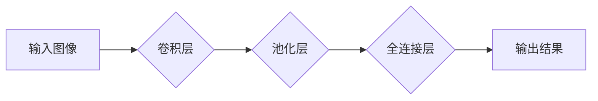

>  人工智能、深度学习、神经网络、卷积神经网络、图像识别、TensorFlow、Python

## 1. 背景介绍

人工智能（AI）近年来发展迅速，深度学习作为其重要分支，在图像识别、自然语言处理、语音识别等领域取得了突破性进展。其中，卷积神经网络（CNN）因其强大的特征提取能力，成为图像识别领域的主流模型。本文将深入讲解CNN的原理、算法、代码实现以及实际应用场景，帮助读者理解CNN的工作机制并掌握其应用技巧。

## 2. 核心概念与联系

CNN的核心思想是利用卷积操作和池化操作来提取图像特征。

**Mermaid 流程图：**



**核心概念解释：**

* **卷积层：** 利用多个卷积核对图像进行卷积运算，提取图像局部特征。
* **池化层：** 对卷积层的输出进行降维操作，减少参数量并提高模型鲁棒性。
* **全连接层：** 将池化层的输出连接到全连接层，进行分类或回归任务。

## 3. 核心算法原理 & 具体操作步骤

### 3.1  算法原理概述

CNN的算法原理主要包括卷积操作、池化操作和激活函数。

* **卷积操作：** 将卷积核滑动在图像上，计算每个位置的卷积结果，提取图像局部特征。
* **池化操作：** 对卷积层的输出进行降维操作，常用的池化方法有最大池化和平均池化。
* **激活函数：** 用于引入非线性，提高模型的表达能力。常用的激活函数有ReLU、Sigmoid和Tanh。

### 3.2  算法步骤详解

1. **输入图像预处理：** 将图像尺寸调整为CNN模型的输入要求，并进行归一化处理。
2. **卷积层操作：** 将卷积核滑动在图像上，计算每个位置的卷积结果，并进行激活函数处理。
3. **池化层操作：** 对卷积层的输出进行池化操作，例如最大池化，以减少参数量和提高模型鲁棒性。
4. **重复步骤2和3：** 叠加多个卷积和池化层，提取图像多层次特征。
5. **全连接层操作：** 将池化层的输出连接到全连接层，进行分类或回归任务。
6. **输出结果：** 全连接层的输出经过softmax函数处理，得到各个类别的概率分布。

### 3.3  算法优缺点

**优点：**

* 强大的特征提取能力，能够自动学习图像特征。
* 参数共享机制，减少了模型参数量。
* 鲁棒性强，对图像旋转、缩放等变换具有较好的适应性。

**缺点：**

* 训练时间长，需要大量的训练数据。
* 计算量大，对硬件资源要求较高。
* 对小样本数据训练效果较差。

### 3.4  算法应用领域

CNN在图像识别、目标检测、图像分割、人脸识别、医疗图像分析等领域有着广泛的应用。

## 4. 数学模型和公式 & 详细讲解 & 举例说明

### 4.1  数学模型构建

CNN的数学模型主要包括卷积操作、池化操作和激活函数。

* **卷积操作：**

$$
y_{i,j} = \sum_{m=0}^{M-1} \sum_{n=0}^{N-1} x_{i+m,j+n} * w_{m,n} + b
$$

其中：

* $y_{i,j}$ 是卷积层的输出值。
* $x_{i+m,j+n}$ 是输入图像的像素值。
* $w_{m,n}$ 是卷积核的权值。
* $b$ 是偏置项。

* **池化操作：**

$$
y_{i,j} = \max(x_{i,j}, x_{i+1,j}, x_{i,j+1}, x_{i+1,j+1})
$$

其中：

* $y_{i,j}$ 是池化层的输出值。
* $x_{i,j}$ 是卷积层的输出值。

* **激活函数：**

$$
y = f(x)
$$

其中：

* $y$ 是激活函数的输出值。
* $x$ 是输入值。

### 4.2  公式推导过程

卷积操作的公式推导过程可以参考相关文献，例如LeCun等人的论文《Gradient-Based Learning Applied to Document Recognition》。

### 4.3  案例分析与讲解

以图像分类为例，假设输入图像大小为28x28，卷积核大小为3x3，卷积层输出特征图大小为14x14。

1. 卷积操作：将3x3的卷积核滑动在28x28的输入图像上，计算每个位置的卷积结果，得到14x14的特征图。
2. 池化操作：对14x14的特征图进行最大池化操作，池化窗口大小为2x2，步长为2，得到7x7的特征图。
3. 全连接层操作：将7x7的特征图展平，连接到全连接层，进行分类任务。

## 5. 项目实践：代码实例和详细解释说明

### 5.1  开发环境搭建

* 操作系统：Windows/Linux/macOS
* Python版本：3.6+
* 深度学习框架：TensorFlow/PyTorch

### 5.2  源代码详细实现

```python
import tensorflow as tf

# 定义卷积神经网络模型
model = tf.keras.models.Sequential([
    tf.keras.layers.Conv2D(32, (3, 3), activation='relu', input_shape=(28, 28, 1)),
    tf.keras.layers.MaxPooling2D((2, 2)),
    tf.keras.layers.Conv2D(64, (3, 3), activation='relu'),
    tf.keras.layers.MaxPooling2D((2, 2)),
    tf.keras.layers.Flatten(),
    tf.keras.layers.Dense(10, activation='softmax')
])

# 编译模型
model.compile(optimizer='adam',
              loss='sparse_categorical_crossentropy',
              metrics=['accuracy'])

# 训练模型
model.fit(x_train, y_train, epochs=10)

# 评估模型
loss, accuracy = model.evaluate(x_test, y_test)
print('Test loss:', loss)
print('Test accuracy:', accuracy)
```

### 5.3  代码解读与分析

* **定义模型结构：** 使用`tf.keras.models.Sequential`定义一个顺序模型，并添加卷积层、池化层和全连接层。
* **编译模型：** 使用`model.compile`方法配置模型的优化器、损失函数和评价指标。
* **训练模型：** 使用`model.fit`方法训练模型，传入训练数据和训练轮数。
* **评估模型：** 使用`model.evaluate`方法评估模型在测试集上的性能。

### 5.4  运行结果展示

训练完成后，可以查看模型在测试集上的准确率，并可视化模型的训练过程。

## 6. 实际应用场景

CNN在图像识别、目标检测、图像分割、人脸识别、医疗图像分析等领域有着广泛的应用。

### 6.1  图像识别

CNN可以用于识别图像中的物体，例如人脸、车辆、动物等。

### 6.2  目标检测

CNN可以用于检测图像中多个目标的位置和类别，例如自动驾驶汽车中的目标检测。

### 6.3  图像分割

CNN可以用于将图像分割成不同的区域，例如医学图像分割。

### 6.4  未来应用展望

随着深度学习技术的不断发展，CNN在未来将有更广泛的应用，例如：

* 更准确的图像识别和目标检测。
* 更智能的自动驾驶汽车。
* 更精准的医疗诊断。

## 7. 工具和资源推荐

### 7.1  学习资源推荐

* **书籍：**
    * 《深度学习》
    * 《动手学深度学习》
* **在线课程：**
    * Coursera上的深度学习课程
    * Udacity上的深度学习工程师课程

### 7.2  开发工具推荐

* **深度学习框架：** TensorFlow、PyTorch
* **图像处理库：** OpenCV

### 7.3  相关论文推荐

* LeCun et al. (1998). Gradient-Based Learning Applied to Document Recognition.
* Krizhevsky et al. (2012). Imagenet Classification with Deep Convolutional Neural Networks.

## 8. 总结：未来发展趋势与挑战

### 8.1  研究成果总结

CNN在图像识别领域取得了显著的成果，其强大的特征提取能力和鲁棒性使其成为主流模型。

### 8.2  未来发展趋势

* **模型更深更广：** 探索更深层次的网络结构和更广泛的应用场景。
* **效率更高：** 提高模型训练和推理效率，降低计算成本。
* **可解释性更强：** 研究CNN的决策机制，提高模型的可解释性。

### 8.3  面临的挑战

* **数据获取和标注：** 训练高质量的CNN模型需要大量的标注数据，数据获取和标注成本较高。
* **模型复杂度：** CNN模型结构复杂，训练和部署成本较高。
* **安全性和隐私性：** CNN模型可能存在安全性和隐私性问题，需要进一步研究和解决。

### 8.4  研究展望

未来，CNN的研究将继续朝着更深、更广、更高效、更可解释的方向发展，并应用于更多领域，为人类社会带来更多福祉。

## 9. 附录：常见问题与解答

* **Q：CNN的卷积核是如何学习的？**

* **A：** 卷积核的权值通过训练过程学习，训练过程中使用梯度下降算法更新卷积核的权值，使得模型的预测结果越来越准确。

* **Q：CNN的池化层有什么作用？**

* **A：** 池化层的作用是降维，减少参数量并提高模型鲁棒性。

* **Q：CNN的激活函数有什么作用？**

* **A：** 激活函数的作用是引入非线性，提高模型的表达能力。


作者：禅与计算机程序设计艺术 / Zen and the Art of Computer Programming 
<end_of_turn>