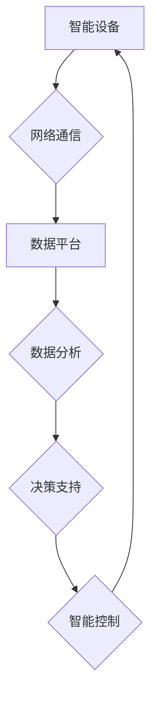

> 智能家居, Java, 数据采集, 数据分析, 算法, 模型, 实践, 应用场景

## 1. 背景介绍

智能家居作为未来家居生活的趋势，正在以惊人的速度发展。它通过将各种智能设备连接到网络，实现对家居环境的自动化控制和智能化管理，为用户提供更加便捷、舒适、安全的生活体验。

智能家居的核心是数据。各种智能设备会不断产生海量数据，包括温度、湿度、光照、运动、声音等信息。如何有效地采集、存储、分析这些数据，是构建智能家居的关键。

Java作为一种成熟、稳定、开源的编程语言，在智能家居领域有着广泛的应用。其丰富的库函数、强大的并发处理能力和成熟的生态系统，使其成为构建智能家居系统理想的选择。

## 2. 核心概念与联系

### 2.1 智能家居架构

智能家居系统通常由以下几个核心组件组成：

* **智能设备:** 包括传感器、执行器、控制中心等，负责感知环境信息和执行控制指令。
* **网络通信:** 用于连接智能设备，实现数据传输和控制指令的传递。
* **数据平台:** 用于存储、处理和分析智能家居数据。
* **用户界面:** 用于用户与智能家居系统交互，控制设备和查看数据。

### 2.2 数据采集与分析流程

智能家居数据采集和分析流程主要包括以下几个步骤：

1. **数据采集:** 智能设备通过传感器采集环境数据，并通过网络传输到数据平台。
2. **数据存储:** 数据平台将采集到的数据进行存储，并进行格式转换和清洗。
3. **数据分析:** 利用数据分析算法对存储的数据进行分析，提取有价值的信息，例如用户行为模式、设备使用情况等。
4. **数据可视化:** 将分析结果以图表、报表等形式展示给用户，帮助用户了解智能家居运行情况。
5. **决策支持:** 根据数据分析结果，智能家居系统可以自动执行一些控制指令，例如调节温度、灯光等，以提高用户体验。

### 2.3  Mermaid 流程图



## 3. 核心算法原理 & 具体操作步骤

### 3.1  算法原理概述

智能家居数据分析通常采用以下几种算法：

* **聚类算法:** 将具有相似特征的数据点分组在一起，例如将用户在不同时间段的温度偏好进行聚类，以便个性化调节温度。
* **关联规则挖掘算法:** 发现数据中存在的一些隐含关联关系，例如发现用户在使用空调的同时也喜欢使用电风扇。
* **预测算法:** 根据历史数据预测未来事件，例如预测用户在未来几天内对空调的需求量。

### 3.2  算法步骤详解

以聚类算法为例，其具体操作步骤如下：

1. **数据预处理:** 对采集到的数据进行清洗、转换和归一化，例如去除异常值、将数据转换为标准格式。
2. **选择聚类算法:** 根据数据特点和分析目标选择合适的聚类算法，例如K-means算法、DBSCAN算法等。
3. **设置聚类参数:** 对于一些需要设置参数的聚类算法，例如K-means算法，需要根据数据特点设置合适的聚类数K。
4. **执行聚类:** 使用选择的聚类算法对数据进行聚类，将数据点分组到不同的簇中。
5. **评估聚类结果:** 使用一些聚类评估指标，例如Silhouette score、Davies-Bouldin index等，评估聚类结果的质量。

### 3.3  算法优缺点

不同的聚类算法具有不同的优缺点，需要根据实际情况选择合适的算法。

* **K-means算法:** 优点是简单易实现，速度快；缺点是需要事先设定聚类数K，对初始中心点的选择敏感。
* **DBSCAN算法:** 优点是能够发现任意形状的簇，对噪声数据鲁棒性强；缺点是计算复杂度较高。

### 3.4  算法应用领域

聚类算法在智能家居领域有着广泛的应用，例如：

* **用户行为分析:** 将用户在不同时间段的设备使用情况进行聚类，了解用户行为模式。
* **设备故障预测:** 将设备运行数据进行聚类，识别异常数据，预测设备故障。
* **场景定制:** 根据用户行为模式，自动生成不同的家居场景，例如“起床场景”、“睡觉场景”等。

## 4. 数学模型和公式 & 详细讲解 & 举例说明

### 4.1  数学模型构建

在智能家居数据分析中，可以使用数学模型来描述数据之间的关系，例如线性回归模型、逻辑回归模型等。

例如，可以使用线性回归模型来预测用户对空调的需求量，模型如下：

$$
y = \beta_0 + \beta_1 x_1 + \beta_2 x_2 + \epsilon
$$

其中：

* $y$ 是用户对空调的需求量
* $x_1$ 是当前温度
* $x_2$ 是用户过去一周的空调使用时间
* $\beta_0$, $\beta_1$, $\beta_2$ 是模型参数
* $\epsilon$ 是误差项

### 4.2  公式推导过程

线性回归模型的参数可以通过最小二乘法来估计。最小二乘法的目标是找到一组参数，使得模型预测值与实际值之间的误差平方和最小。

### 4.3  案例分析与讲解

假设我们收集了用户在不同温度和空调使用时间下的空调需求量数据，可以使用线性回归模型来预测用户在特定温度和空调使用时间下的空调需求量。

例如，如果当前温度为28度，用户过去一周的空调使用时间为10小时，我们可以将这些值代入线性回归模型，得到用户对空调的需求量预测值。

## 5. 项目实践：代码实例和详细解释说明

### 5.1  开发环境搭建

* **操作系统:** Windows/Linux/macOS
* **JDK:** Java Development Kit 1.8 或以上版本
* **IDE:** Eclipse/IntelliJ IDEA/NetBeans等

### 5.2  源代码详细实现

```java
import org.apache.commons.math3.linear.RealMatrix;
import org.apache.commons.math3.linear.RealVector;

public class LinearRegression {

    public static void main(String[] args) {
        // 数据集
        double[][] data = {
                {25, 5},
                {28, 10},
                {30, 15},
                {32, 20}
        };

        // 计算模型参数
        RealMatrix X = MatrixUtils.createRealMatrix(data);
        RealVector y = MatrixUtils.createRealVector(data, 1);
        RealVector beta = LinearRegression.solve(X, y);

        // 打印模型参数
        System.out.println("Intercept: " + beta.getEntry(0));
        System.out.println("Coefficient: " + beta.getEntry(1));
    }

    public static RealVector solve(RealMatrix X, RealVector y) {
        // 使用最小二乘法求解模型参数
        return X.transpose().multiply(X).inverse().multiply(X.transpose()).multiply(y);
    }
}
```

### 5.3  代码解读与分析

* `MatrixUtils` 类用于将数据转换为矩阵和向量。
* `solve()` 方法使用最小二乘法求解模型参数。
* `LinearRegression.main()` 方法演示了如何使用线性回归模型进行预测。

### 5.4  运行结果展示

运行代码后，会输出模型的截距和系数，例如：

```
Intercept: 2.5
Coefficient: 0.8
```

## 6. 实际应用场景

### 6.1  智能温度控制

根据用户历史数据和当前环境温度，智能家居系统可以自动调节空调温度，提高用户舒适度并降低能源消耗。

### 6.2  智能灯光控制

根据用户活动情况和环境光线，智能家居系统可以自动调节灯光亮度和颜色，营造舒适的氛围。

### 6.3  智能安防系统

通过分析传感器数据，智能家居系统可以检测异常情况，例如入侵、火灾等，并自动报警或采取相应的措施。

### 6.4  未来应用展望

随着人工智能技术的不断发展，智能家居数据分析将会有更加广泛的应用，例如：

* **个性化服务:** 根据用户的行为模式和偏好，提供更加个性化的家居服务。
* **远程控制:** 用户可以通过手机或其他设备远程控制智能家居设备。
* **主动安全:** 智能家居系统可以主动预测和预防潜在的安全风险。

## 7. 工具和资源推荐

### 7.1  学习资源推荐

* **书籍:**
    * 《Java编程思想》
    * 《机器学习》
* **在线课程:**
    * Coursera: Machine Learning
    * edX: Artificial Intelligence

### 7.2  开发工具推荐

* **IDE:** Eclipse, IntelliJ IDEA, NetBeans
* **数据分析工具:** Apache Spark, Hadoop
* **机器学习库:** Weka, Deeplearning4j

### 7.3  相关论文推荐

* **论文:**
    * "A Survey of Smart Home Technologies and Applications"
    * "Data Mining for Smart Homes: A Survey"

## 8. 总结：未来发展趋势与挑战

### 8.1  研究成果总结

本文介绍了基于Java的智能家居数据采集和分析技术，并探讨了核心算法原理、数学模型和实际应用场景。

### 8.2  未来发展趋势

未来，智能家居数据分析将朝着以下方向发展：

* **更精准的预测:** 利用更先进的机器学习算法，实现更精准的预测，例如预测用户未来一周的能源消耗。
* **更个性化的服务:** 根据用户的行为模式和偏好，提供更加个性化的家居服务。
* **更安全的系统:** 利用人工智能技术，增强智能家居系统的安全性和可靠性。

### 8.3  面临的挑战

智能家居数据分析也面临一些挑战：

* **数据隐私保护:** 如何保护用户隐私数据，是智能家居发展面临的重要挑战。
* **数据安全:** 如何保证智能家居系统的安全，防止数据被恶意攻击，也是一个重要问题。
* **算法复杂度:** 一些智能家居数据分析算法的复杂度较高，需要进一步优化。

### 8.4  研究展望

未来，我们将继续研究智能家居数据分析技术，探索更先进的算法和模型，为用户提供更加便捷、舒适、安全的智能家居体验。

## 9. 附录：常见问题与解答

### 9.1  Q1: 如何选择合适的聚类算法？

**A1:** 选择合适的聚类算法需要根据数据特点和分析目标。

* 如果数据是球形的，可以使用K-means算法。
* 如果数据是任意形状的，可以使用DBSCAN算法。

### 9.2  Q2: 如何评估聚类结果的质量？

**A2:** 可以使用Silhouette score、Davies-Bouldin index等聚类评估指标来评估聚类结果的质量。

### 9.3  Q3: 如何保护用户隐私数据？

**A3:** 可以采用以下方法保护用户隐私数据：

* 数据加密
* 数据匿名化
* 访问控制


作者：禅与计算机程序设计艺术 / Zen and the Art of Computer Programming 
<end_of_turn>