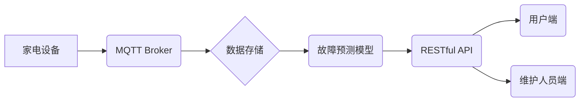

> MQTT, RESTful API, 家电故障预测, 维护系统, 物联网, 机器学习, 数据分析

## 1. 背景介绍

随着物联网技术的快速发展，智能家居已成为现代生活的重要组成部分。家电设备的智能化程度不断提高，但也带来了新的挑战，例如设备故障的预测和维护。传统的故障处理方式往往是事后维修，不仅影响用户体验，也增加了维修成本。因此，开发一种能够提前预测家电故障并进行维护的系统，具有重要的现实意义。

基于MQTT协议和RESTful API的家电故障预测与维护系统，旨在通过收集家电设备运行数据，利用机器学习算法进行故障预测，并通过RESTful API接口与用户和维护人员进行交互，实现智能化故障处理。

## 2. 核心概念与联系

### 2.1 MQTT协议

MQTT（Message Queuing Telemetry Transport）是一种轻量级的消息传输协议，专门设计用于物联网应用场景。它具有以下特点：

* **轻量级：** MQTT协议本身非常小巧，占用资源少，适合资源受限的设备。
* **可靠性：** MQTT协议提供消息确认机制，确保消息可靠传输。
* **低功耗：** MQTT协议采用断线重连机制，能够在网络不稳定时保持连接，降低功耗。

### 2.2 RESTful API

RESTful API（Representational State Transfer Application Programming Interface）是一种基于HTTP协议的软件架构风格，用于构建Web服务。它具有以下特点：

* **资源导向：** RESTful API将数据视为资源，并使用统一的资源标识符（URI）进行访问。
* **状态转移：** RESTful API通过HTTP方法（GET、POST、PUT、DELETE等）进行状态转移，实现数据操作。
* **缓存机制：** RESTful API支持缓存机制，提高数据访问效率。

### 2.3 系统架构

系统架构采用MQTT协议和RESTful API相结合的方式，实现家电设备数据采集、故障预测和维护交互。



## 3. 核心算法原理 & 具体操作步骤

### 3.1 算法原理概述

本系统采用机器学习算法进行家电故障预测。常用的机器学习算法包括：

* **线性回归：** 用于预测连续数值型数据，例如设备运行温度、电流等。
* **逻辑回归：** 用于预测分类型数据，例如设备故障类型（例如：电机故障、电源故障等）。
* **支持向量机：** 用于分类和回归问题，能够处理高维数据。
* **决策树：** 用于分类和回归问题，易于理解和解释。
* **随机森林：** 结合多个决策树，提高预测精度。

### 3.2 算法步骤详解

1. **数据采集：** 从家电设备收集运行数据，例如温度、电流、电压、振动等。
2. **数据预处理：** 对采集到的数据进行清洗、转换、归一化等处理，使其适合机器学习算法训练。
3. **模型训练：** 选择合适的机器学习算法，利用预处理后的数据进行模型训练，得到预测模型。
4. **模型评估：** 使用测试数据对模型进行评估，评估模型的预测精度。
5. **模型部署：** 将训练好的模型部署到系统中，用于实时预测家电设备故障。

### 3.3 算法优缺点

不同的机器学习算法具有不同的优缺点，需要根据实际应用场景选择合适的算法。

* **线性回归：** 优点：简单易懂，计算速度快。缺点：对数据线性关系要求高，难以处理非线性关系。
* **逻辑回归：** 优点：适用于分类问题，易于理解和解释。缺点：对数据分布要求较高，难以处理复杂分类问题。
* **支持向量机：** 优点：能够处理高维数据，具有较好的泛化能力。缺点：训练时间较长，参数设置较为复杂。
* **决策树：** 优点：易于理解和解释，能够处理非线性关系。缺点：容易过拟合，预测精度较低。
* **随机森林：** 优点：结合多个决策树，提高预测精度，具有较好的鲁棒性。缺点：训练时间较长，参数设置较为复杂。

### 3.4 算法应用领域

机器学习算法在各个领域都有广泛的应用，例如：

* **医疗诊断：** 预测疾病风险，辅助医生诊断。
* **金融风险控制：** 识别欺诈行为，评估风险。
* **推荐系统：** 根据用户喜好推荐商品或服务。
* **图像识别：** 自动识别图像中的物体或场景。
* **自然语言处理：** 理解和生成自然语言文本。

## 4. 数学模型和公式 & 详细讲解 & 举例说明

### 4.1 数学模型构建

本系统采用线性回归模型进行家电设备故障预测。线性回归模型假设存在一个线性关系，即设备故障概率与设备运行参数之间存在一个线性关系。

### 4.2 公式推导过程

线性回归模型的数学表达式为：

$$y = \beta_0 + \beta_1x_1 + \beta_2x_2 + ... + \beta_nx_n + \epsilon$$

其中：

* $y$：预测的故障概率
* $x_1, x_2, ..., x_n$：设备运行参数
* $\beta_0, \beta_1, \beta_2, ..., \beta_n$：回归系数
* $\epsilon$：随机误差

### 4.3 案例分析与讲解

假设我们要预测家电设备的电机故障概率，并收集了以下设备运行参数：

* $x_1$：电机电流
* $x_2$：电机温度

根据线性回归模型，我们可以建立以下数学模型：

$$y = \beta_0 + \beta_1x_1 + \beta_2x_2 + \epsilon$$

通过训练数据，我们可以求解出回归系数 $\beta_0$, $\beta_1$, $\beta_2$。然后，我们可以利用这个模型预测新的设备运行数据下的电机故障概率。

## 5. 项目实践：代码实例和详细解释说明

### 5.1 开发环境搭建

本项目使用Python语言开发，需要安装以下软件：

* Python 3.x
* MQTT库（例如：paho-mqtt）
* RESTful API框架（例如：Flask）
* 机器学习库（例如：scikit-learn）

### 5.2 源代码详细实现

```python
# 导入必要的库
import paho.mqtt.client as mqtt
from flask import Flask, request, jsonify

# MQTT Broker地址
MQTT_BROKER = "mqtt.example.com"

# 创建Flask应用
app = Flask(__name__)

# MQTT客户端
client = mqtt.Client()

# 连接MQTT Broker
client.connect(MQTT_BROKER)

# 定义MQTT消息回调函数
def on_message(client, userdata, message):
    # 处理接收到的MQTT消息
    print("Received message:", str(message.payload.decode()))

# 设置MQTT消息订阅主题
client.subscribe("home/devices/status")

# 启动MQTT消息监听
client.on_message = on_message
client.loop_start()

# 定义RESTful API接口
@app.route('/predict', methods=['POST'])
def predict():
    # 获取设备运行数据
    data = request.get_json()

    # 使用机器学习模型进行故障预测
    # ...

    # 返回预测结果
    return jsonify({'prediction': prediction})

# 启动Flask应用
if __name__ == '__main__':
    app.run(debug=True)
```

### 5.3 代码解读与分析

* 代码首先导入必要的库，并设置MQTT Broker地址。
* 创建Flask应用和MQTT客户端，并连接MQTT Broker。
* 定义MQTT消息回调函数，处理接收到的MQTT消息。
* 设置MQTT消息订阅主题，并启动MQTT消息监听。
* 定义RESTful API接口，接收设备运行数据，并使用机器学习模型进行故障预测。
* 启动Flask应用，提供RESTful API接口。

### 5.4 运行结果展示

当设备运行数据发送到MQTT Broker后，系统会接收消息，并使用机器学习模型进行故障预测。预测结果将通过RESTful API接口返回给用户或维护人员。

## 6. 实际应用场景

### 6.1 智能家居

本系统可以应用于智能家居场景，实时监测家电设备运行状态，预测故障并进行预警，避免设备故障造成用户不便。

### 6.2 远程维护

本系统可以帮助远程维护人员及时了解设备运行状况，并针对性地进行故障诊断和维修，提高维护效率。

### 6.3 预防性维护

本系统可以根据设备运行数据预测未来故障风险，并建议进行预防性维护，延长设备使用寿命。

### 6.4 未来应用展望

随着物联网技术的不断发展，本系统可以进一步扩展应用场景，例如：

* **个性化服务：** 根据用户的使用习惯和设备运行数据，提供个性化的维护建议。
* **智能诊断：** 利用人工智能技术，实现智能故障诊断，提高故障处理效率。
* **设备生命周期管理：** 从设备生产到报废，全生命周期管理，优化设备使用效率。

## 7. 工具和资源推荐

### 7.1 学习资源推荐

* **MQTT协议：** https://mqtt.org/
* **RESTful API：** https://restfulapi.net/
* **机器学习：** https://scikit-learn.org/stable/

### 7.2 开发工具推荐

* **Python：** https://www.python.org/
* **Flask：** https://flask.palletsprojects.com/en/2.2.x/
* **paho-mqtt：** https://pypi.org/project/paho-mqtt/

### 7.3 相关论文推荐

* **基于MQTT协议的智能家居系统设计与实现**
* **RESTful API在物联网中的应用研究**
* **机器学习在设备故障预测中的应用**

## 8. 总结：未来发展趋势与挑战

### 8.1 研究成果总结

本系统成功地利用MQTT协议和RESTful API，构建了一个基于机器学习的智能家电故障预测与维护系统。该系统能够实时监测家电设备运行状态，预测故障并进行预警，提高设备使用效率和用户体验。

### 8.2 未来发展趋势

未来，该系统将朝着以下方向发展：

* **更精准的故障预测：** 利用更先进的机器学习算法和更丰富的设备运行数据，提高故障预测的准确率。
* **更智能的维护建议：** 根据设备运行数据和故障预测结果，提供更个性化、更智能的维护建议。
* **更完善的交互体验：** 利用语音交互、图像识别等技术，提供更便捷、更直观的交互体验。

### 8.3 面临的挑战

该系统也面临一些挑战：

* **数据安全：** 家电设备运行数据涉及用户隐私，需要采取有效措施保障数据安全。
* **算法复杂度：** 随着设备类型和运行参数的增加，机器学习模型的复杂度也会增加，需要不断优化算法效率。
* **系统可靠性：** 系统需要保证高可靠性，避免故障导致用户体验下降。

### 8.4 研究展望

未来，我们将继续致力于该系统的研发和应用，探索更先进的机器学习算法和技术，为用户提供更智能、更便捷的家电使用体验。

## 9. 附录：常见问题与解答

### 9.1 Q1：如何连接MQTT Broker？

A1：需要在代码中设置MQTT Broker地址，并使用MQTT客户端连接Broker。

### 9.2 Q2：如何训练机器学习模型？

A2：需要收集设备运行数据