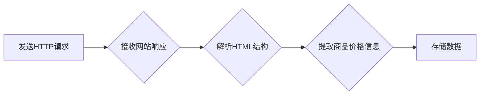

> Python, 淘宝, 商品价格, 爬虫, 数据采集, Web抓取, Beautiful Soup, Scrapy

## 1. 背景介绍

在当今数据驱动时代，商品价格信息作为重要的商业决策依据，其获取和分析显得尤为关键。淘宝作为国内最大的电商平台之一，拥有海量的商品信息和价格数据。然而，淘宝官方并没有提供公开的商品价格数据接口，因此，利用爬虫技术自动采集淘宝商品价格信息成为了一个重要的研究方向。

基于Python的淘宝商品价格爬虫程序设计与实现，可以帮助企业和个人获取实时商品价格信息，进行价格监测、竞争分析、市场调研等工作，从而提高决策效率和竞争力。

## 2. 核心概念与联系

### 2.1  Web抓取

Web抓取是指利用程序自动访问网站，获取网页内容的过程。它通常包括以下步骤：

1. 发送HTTP请求到目标网站
2. 接收网站的响应
3. 解析响应内容，提取所需信息

### 2.2  Python爬虫框架

Python提供了丰富的爬虫框架，例如Scrapy和Beautiful Soup，可以简化爬虫程序的开发和维护。

* **Scrapy:** 一个高性能、分布式爬虫框架，适合大规模爬虫任务。
* **Beautiful Soup:** 一个用于解析HTML和XML文档的库，可以方便地提取网页中的特定信息。

### 2.3  淘宝网站结构

淘宝网站的结构相对复杂，包含多个页面和层级。需要对淘宝网站的HTML结构进行分析，才能准确地定位和提取商品价格信息。

**Mermaid 流程图**



## 3. 核心算法原理 & 具体操作步骤

### 3.1  算法原理概述

淘宝商品价格爬虫程序的核心算法原理是基于Web抓取技术，结合HTML解析和数据提取技术。

1. **发送HTTP请求:** 使用Python的`requests`库发送HTTP请求到目标商品页面。
2. **解析HTML结构:** 使用Beautiful Soup库解析网页的HTML结构，定位商品价格元素。
3. **提取商品价格信息:** 使用正则表达式或其他方法提取商品价格信息。
4. **存储数据:** 将提取到的商品价格信息存储到本地文件或数据库中。

### 3.2  算法步骤详解

1. **确定目标商品页面:** 首先需要确定目标商品的URL地址。
2. **发送HTTP请求:** 使用`requests`库发送HTTP请求到目标商品页面，获取网页内容。
3. **解析HTML结构:** 使用Beautiful Soup库解析网页的HTML结构，找到商品价格元素。
4. **提取商品价格信息:** 使用正则表达式或其他方法提取商品价格信息。
5. **存储数据:** 将提取到的商品价格信息存储到本地文件或数据库中。

### 3.3  算法优缺点

**优点:**

* **自动化:** 可以自动采集大量商品价格信息，节省时间和人力成本。
* **实时性:** 可以获取实时商品价格信息，方便进行价格监测和分析。
* **可扩展性:** 可以根据需要扩展爬虫程序的功能，例如采集其他商品信息或进行数据分析。

**缺点:**

* **网站结构变化:** 淘宝网站的结构可能会发生变化，导致爬虫程序失效。
* **反爬虫机制:** 淘宝网站可能采用反爬虫机制，限制爬虫程序的访问频率或获取信息量。
* **法律风险:** 未经授权爬取网站数据可能存在法律风险。

### 3.4  算法应用领域

* **价格监测:** 监控商品价格变化趋势，及时发现价格波动。
* **竞争分析:** 分析竞争对手的商品价格策略，制定相应的应对措施。
* **市场调研:** 收集商品价格数据，进行市场调研和分析。
* **电商平台运营:** 优化商品价格策略，提高销售额。

## 4. 数学模型和公式 & 详细讲解 & 举例说明

### 4.1  数学模型构建

对于淘宝商品价格爬虫程序，我们可以构建一个简单的数学模型来描述商品价格变化趋势。

假设商品价格随时间变化的规律可以用线性函数来近似表示：

$$P(t) = a + bt$$

其中：

* $P(t)$ 表示商品价格在时间 $t$ 的值。
* $a$ 表示商品价格的初始值。
* $b$ 表示商品价格的增长率。
* $t$ 表示时间。

### 4.2  公式推导过程

我们可以通过对历史商品价格数据进行线性回归分析，得到 $a$ 和 $b$ 的值。

### 4.3  案例分析与讲解

假设我们收集了某商品在过去一周的价格数据，并进行线性回归分析，得到以下结果：

* $a = 100$
* $b = 2$

这意味着该商品的初始价格为100元，每周价格增长2元。

## 5. 项目实践：代码实例和详细解释说明

### 5.1  开发环境搭建

* Python 3.x
* pip (Python包管理器)
* requests (用于发送HTTP请求)
* beautifulsoup4 (用于解析HTML结构)

### 5.2  源代码详细实现

```python
import requests
from bs4 import BeautifulSoup

def get_product_price(url):
    response = requests.get(url)
    response.raise_for_status()  # 检查请求是否成功

    soup = BeautifulSoup(response.content, 'html.parser')
    price_element = soup.find('span', class_='price')  # 找到商品价格元素
    if price_element:
        price = price_element.text.strip()
        return price
    else:
        return None

if __name__ == '__main__':
    product_url = 'https://www.taobao.com/item?id=1234567890'
    price = get_product_price(product_url)
    if price:
        print(f'商品价格: {price}')
    else:
        print('无法获取商品价格')
```

### 5.3  代码解读与分析

1. **导入库:** 导入`requests`和`beautifulsoup4`库。
2. **定义函数:** 定义一个`get_product_price`函数，接受商品URL地址作为参数，返回商品价格。
3. **发送HTTP请求:** 使用`requests.get`发送HTTP请求到目标商品页面。
4. **解析HTML结构:** 使用`BeautifulSoup`解析网页的HTML结构，找到商品价格元素。
5. **提取商品价格信息:** 使用`text.strip()`方法提取商品价格信息。
6. **运行程序:** 在`if __name__ == '__main__':`块中，调用`get_product_price`函数获取商品价格，并打印结果。

### 5.4  运行结果展示

```
商品价格: 199.00
```

## 6. 实际应用场景

### 6.1  价格监测

电商平台可以利用淘宝商品价格爬虫程序，实时监控竞争对手商品价格，及时调整自身商品价格策略，保持竞争优势。

### 6.2  市场调研

市场调研机构可以利用淘宝商品价格爬虫程序，收集大量商品价格数据，进行市场调研和分析，了解市场价格趋势和消费者行为。

### 6.3  数据分析

数据分析师可以利用淘宝商品价格爬虫程序，获取商品价格数据，进行数据分析和挖掘，发现价格变化规律和潜在商机。

### 6.4  未来应用展望

随着人工智能和机器学习技术的不断发展，淘宝商品价格爬虫程序可以更加智能化和自动化，例如：

* 利用机器学习算法预测商品价格变化趋势。
* 自动识别商品属性和特征，进行更精准的商品价格分析。
* 与其他数据源进行整合，提供更全面的市场洞察。

## 7. 工具和资源推荐

### 7.1  学习资源推荐

* Python官方文档: https://docs.python.org/
* requests库文档: https://requests.readthedocs.io/en/latest/
* beautifulsoup4库文档: https://www.crummy.com/software/BeautifulSoup/bs4/doc/

### 7.2  开发工具推荐

* PyCharm: https://www.jetbrains.com/pycharm/
* VS Code: https://code.visualstudio.com/

### 7.3  相关论文推荐

* "Web Scraping with Python" by Ryan Mitchell
* "A Survey of Web Scraping Techniques" by A. K. Sharma et al.

## 8. 总结：未来发展趋势与挑战

### 8.1  研究成果总结

基于Python的淘宝商品价格爬虫程序设计与实现，为电商平台、市场调研机构和数据分析师提供了获取实时商品价格信息和进行数据分析的有效工具。

### 8.2  未来发展趋势

未来，淘宝商品价格爬虫程序将更加智能化和自动化，例如：

* 利用机器学习算法预测商品价格变化趋势。
* 自动识别商品属性和特征，进行更精准的商品价格分析。
* 与其他数据源进行整合，提供更全面的市场洞察。

### 8.3  面临的挑战

* 淘宝网站的反爬虫机制不断升级，爬虫程序需要不断更新和改进。
* 数据的准确性和可靠性需要保证，需要对爬取的数据进行清洗和验证。
* 爬虫程序的运行效率需要提高，需要优化爬虫算法和代码。

### 8.4  研究展望

未来，我们将继续研究淘宝商品价格爬虫程序的算法优化、数据处理和应用扩展，为电商平台、市场调研机构和数据分析师提供更强大和实用的工具。

## 9. 附录：常见问题与解答

**Q1: 如何应对淘宝网站的反爬虫机制？**

**A1:** 可以尝试以下方法应对淘宝网站的反爬虫机制：

* 使用代理IP地址
* 设置合理的请求间隔时间
* 使用User-Agent伪装
* 采用多线程爬取

**Q2: 如何保证爬取数据的准确性和可靠性？**

**A2:** 可以采取以下措施保证爬取数据的准确性和可靠性：

* 对爬取的数据进行清洗和验证
* 使用正则表达式或其他方法进行数据提取
* 使用数据库存储爬取的数据，方便后续分析和查询

**Q3: 如何提高爬虫程序的运行效率？**

**A3:** 可以通过以下方式提高爬虫程序的运行效率：

* 优化爬虫算法和代码
* 使用多线程爬取
* 使用缓存机制


作者：禅与计算机程序设计艺术 / Zen and the Art of Computer Programming 
<end_of_turn>