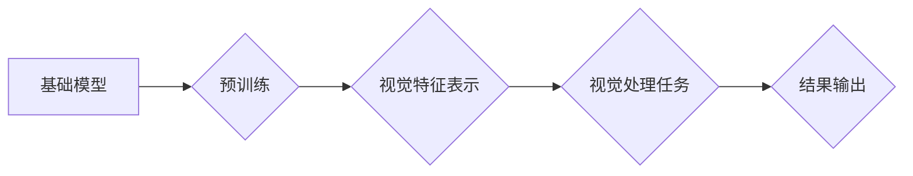

> 基础模型、视觉处理、图像识别、目标检测、语义分割、Transformer、视觉理解、深度学习

## 1. 背景介绍

近年来，深度学习在计算机视觉领域取得了显著进展，基础模型在视觉处理能力方面展现出强大的潜力。基础模型是指在海量数据上预训练的大规模神经网络模型，其强大的泛化能力和可迁移性使其能够应用于各种视觉任务，例如图像识别、目标检测、语义分割等。

传统的计算机视觉方法通常依赖于手工设计的特征提取器和分类器，而基础模型则通过学习数据本身的特征表示，从而实现更准确和高效的视觉处理。

## 2. 核心概念与联系

**2.1 核心概念**

* **基础模型:** 指在海量数据上预训练的大规模神经网络模型，具有强大的泛化能力和可迁移性。
* **视觉处理:** 指计算机对图像和视频进行理解、分析和处理的系列任务，包括图像识别、目标检测、语义分割、图像生成等。
* **Transformer:** 一种新型的神经网络架构，其自注意力机制能够有效捕捉图像中的长距离依赖关系，在视觉处理任务中取得了优异的性能。

**2.2 核心概念联系**

基础模型通过预训练学习到的视觉特征表示，可以为各种视觉处理任务提供强大的基础。Transformer架构的引入，进一步提升了基础模型在视觉处理中的性能。

**2.3 Mermaid 流程图**



## 3. 核心算法原理 & 具体操作步骤

**3.1 算法原理概述**

基础模型的视觉处理能力主要基于以下核心算法原理：

* **卷积神经网络 (CNN):** 用于提取图像特征，通过卷积操作学习图像的局部特征，并通过池化操作降低特征维度。
* **自注意力机制 (Self-Attention):** 用于捕捉图像中的长距离依赖关系，通过计算不同像素之间的注意力权重，学习图像的全局语义信息。
* **Transformer 架构:** 将自注意力机制应用于图像处理，构建了视觉Transformer模型，例如Vision Transformer (ViT)。

**3.2 算法步骤详解**

1. **数据预处理:** 将图像数据进行预处理，例如裁剪、缩放、归一化等操作。
2. **基础模型预训练:** 在海量图像数据上预训练基础模型，学习通用视觉特征表示。
3. **任务特定微调:** 将预训练好的基础模型用于特定视觉任务，例如图像识别、目标检测等，通过微调模型参数，使其适应特定任务的需求。
4. **结果输出:** 根据模型的输出结果，进行图像识别、目标检测、语义分割等操作。

**3.3 算法优缺点**

* **优点:**
    * 强大的泛化能力和可迁移性。
    * 能够学习到更丰富的视觉特征表示。
    * 在各种视觉任务中取得了优异的性能。
* **缺点:**
    * 需要大量的训练数据和计算资源。
    * 模型参数量较大，部署成本较高。

**3.4 算法应用领域**

* **图像识别:** 识别图像中的物体、场景、人物等。
* **目标检测:** 在图像中定位和识别目标物体。
* **语义分割:** 将图像分割成不同的语义区域。
* **图像生成:** 生成新的图像。
* **视频分析:** 分析视频内容，例如动作识别、事件检测等。

## 4. 数学模型和公式 & 详细讲解 & 举例说明

**4.1 数学模型构建**

基础模型的视觉处理能力可以抽象为一个数学模型，其中输入为图像数据，输出为视觉特征表示或任务结果。

**4.2 公式推导过程**

例如，在图像识别任务中，基础模型可以将图像数据映射到一个特征空间，然后使用分类器对特征进行分类。

假设图像数据为 $I \in R^{H \times W \times C}$，其中 $H$ 为图像高度，$W$ 为图像宽度，$C$ 为颜色通道数。基础模型可以将图像数据映射到一个特征空间 $F \in R^{D}$，其中 $D$ 为特征维度。

$$
F = \phi(I)
$$

其中 $\phi$ 为基础模型的网络结构，例如CNN或Transformer。

分类器可以将特征空间中的特征向量映射到类别概率分布：

$$
P(C|F) = softmax(W^T F + b)
$$

其中 $W$ 为分类器的权重矩阵，$b$ 为偏置项，$softmax$ 为softmax函数。

**4.3 案例分析与讲解**

例如，在ImageNet数据集上训练的ResNet模型，其网络结构包含多个卷积层和池化层，能够学习到丰富的图像特征表示。

## 5. 项目实践：代码实例和详细解释说明

**5.1 开发环境搭建**

使用Python语言和深度学习框架TensorFlow或PyTorch搭建开发环境。

**5.2 源代码详细实现**

```python
import tensorflow as tf

# 定义基础模型
model = tf.keras.applications.ResNet50(weights='imagenet')

# 定义分类器
classifier = tf.keras.layers.Dense(1000, activation='softmax')

# 构建模型
input_tensor = tf.keras.Input(shape=(224, 224, 3))
output_tensor = model(input_tensor)
output_tensor = classifier(output_tensor)
model = tf.keras.Model(inputs=input_tensor, outputs=output_tensor)

# 编译模型
model.compile(optimizer='adam',
              loss='categorical_crossentropy',
              metrics=['accuracy'])

# 训练模型
model.fit(train_data, train_labels, epochs=10)

# 评估模型
loss, accuracy = model.evaluate(test_data, test_labels)
print('Loss:', loss)
print('Accuracy:', accuracy)
```

**5.3 代码解读与分析**

* 使用预训练的ResNet50模型作为基础模型。
* 定义一个分类器层，用于将特征映射到类别概率分布。
* 构建模型，将基础模型和分类器层连接起来。
* 编译模型，设置优化器、损失函数和评价指标。
* 训练模型，使用训练数据进行模型训练。
* 评估模型，使用测试数据评估模型性能。

**5.4 运行结果展示**

训练完成后，可以将模型应用于新的图像数据进行预测，并展示预测结果。

## 6. 实际应用场景

**6.1 图像识别**

基础模型可以用于识别图像中的物体、场景、人物等，例如在自动驾驶、医疗诊断、安防监控等领域应用。

**6.2 目标检测**

基础模型可以用于在图像中定位和识别目标物体，例如在无人机航拍、自动驾驶、零售分析等领域应用。

**6.3 语义分割**

基础模型可以用于将图像分割成不同的语义区域，例如在医学图像分析、城市规划、自动驾驶等领域应用。

**6.4 未来应用展望**

随着基础模型的不断发展，其在视觉处理领域的应用场景将更加广泛，例如：

* **三维重建:** 基于图像数据重建三维场景。
* **视频理解:** 理解视频内容，例如动作识别、事件检测等。
* **生成式模型:** 生成新的图像、视频等内容。

## 7. 工具和资源推荐

**7.1 学习资源推荐**

* **书籍:**
    * Deep Learning by Ian Goodfellow, Yoshua Bengio, and Aaron Courville
    * Computer Vision: Algorithms and Applications by Richard Szeliski
* **课程:**
    * Stanford CS231n: Convolutional Neural Networks for Visual Recognition
    * MIT 6.S191: Introduction to Deep Learning

**7.2 开发工具推荐**

* **深度学习框架:** TensorFlow, PyTorch
* **图像处理库:** OpenCV, Pillow

**7.3 相关论文推荐**

* **Vision Transformer (ViT):** https://arxiv.org/abs/2010.11929
* **EfficientNet:** https://arxiv.org/abs/1905.11946
* **ResNet:** https://arxiv.org/abs/1512.03385

## 8. 总结：未来发展趋势与挑战

**8.1 研究成果总结**

基础模型在视觉处理领域取得了显著进展，其强大的泛化能力和可迁移性使其成为视觉任务的强大工具。

**8.2 未来发展趋势**

* **模型规模和效率:** 探索更大规模、更高效的基础模型，以进一步提升视觉处理能力。
* **多模态学习:** 将视觉信息与其他模态信息（例如文本、音频）进行融合，实现更全面的理解。
* **可解释性:** 研究基础模型的决策过程，提高模型的可解释性和可信度。

**8.3 面临的挑战**

* **数据获取和标注:** 训练高质量的基础模型需要大量的标注数据，数据获取和标注成本较高。
* **计算资源:** 训练大型基础模型需要大量的计算资源，成本较高。
* **模型安全性:** 基础模型可能存在安全风险，例如对抗攻击，需要加强模型安全性研究。

**8.4 研究展望**

未来，基础模型在视觉处理领域将继续发挥重要作用，并推动计算机视觉技术的进一步发展。


## 9. 附录：常见问题与解答

**9.1 如何选择合适的基础模型？**

选择合适的基础模型需要根据具体的视觉任务和数据特点进行选择。例如，对于图像识别任务，可以考虑使用ResNet、EfficientNet等模型；对于目标检测任务，可以考虑使用YOLO、Faster R-CNN等模型。

**9.2 如何进行基础模型的微调？**

基础模型的微调需要使用特定任务的数据进行训练，调整模型的最后一层参数，使其适应特定任务的需求。

**9.3 如何评估基础模型的性能？**

基础模型的性能可以通过各种指标进行评估，例如准确率、召回率、F1-score等。

作者：禅与计算机程序设计艺术 / Zen and the Art of Computer Programming


<end_of_turn>