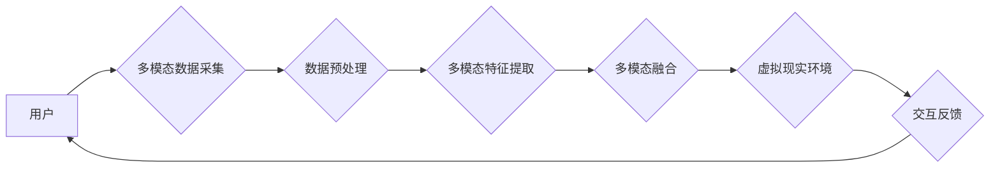

> 多模态AI, 虚拟现实,  交互体验,  沉浸式体验,  人工智能,  自然语言处理,  计算机视觉,  深度学习

## 1. 背景介绍

虚拟现实 (VR) 技术近年来发展迅速，为人们提供了沉浸式、交互式的虚拟体验。然而，传统的VR体验往往局限于视觉和听觉信息，缺乏多感官的交互，难以真正实现与虚拟世界的深度融合。多模态AI技术的出现为VR体验的升级提供了新的可能性。

多模态AI是指能够处理多种不同类型数据的智能系统，例如文本、图像、音频、视频等。通过融合多模态信息，多模态AI可以更全面地理解和交互于世界，为VR体验带来更丰富、更自然的交互方式。

## 2. 核心概念与联系

**2.1 多模态AI**

多模态AI的核心是融合不同模态数据，构建一个统一的表示空间，从而实现跨模态的理解和交互。

**2.2 虚拟现实 (VR)**

VR技术通过头戴式显示器、手柄等设备，模拟真实世界的环境，并提供沉浸式的交互体验。

**2.3 多模态AI在VR中的应用**

将多模态AI技术应用于VR，可以实现以下功能：

* **更丰富的交互方式:**  除了传统的键盘、鼠标等输入方式，还可以通过语音、手势、表情等多模态交互方式与虚拟世界进行交互。
* **更自然的体验:** 多模态信息融合可以使虚拟世界更加真实、更加生动，用户可以更自然地沉浸其中。
* **更个性化的体验:**  根据用户的不同喜好和需求，可以定制不同的多模态交互体验。

**2.4 架构图**



## 3. 核心算法原理 & 具体操作步骤

**3.1 算法原理概述**

多模态AI在VR中的应用主要依赖于以下核心算法：

* **多模态特征提取:**  从不同模态数据中提取特征，例如文本中的关键词、图像中的物体识别、音频中的情感识别等。
* **多模态融合:**  将不同模态的特征融合在一起，构建一个统一的表示空间，从而实现跨模态的理解和交互。
* **虚拟现实环境渲染:**  根据多模态信息，渲染虚拟现实环境，并提供相应的交互反馈。

**3.2 算法步骤详解**

1. **数据采集:**  收集用户的多模态数据，例如语音、手势、表情、眼动等。
2. **数据预处理:**  对收集到的数据进行预处理，例如文本清洗、图像增强、音频降噪等。
3. **特征提取:**  使用相应的算法从预处理后的数据中提取特征，例如文本中的关键词、图像中的物体识别、音频中的情感识别等。
4. **特征融合:**  将不同模态的特征融合在一起，构建一个统一的表示空间。常用的融合方法包括加权平均、最大池化、注意力机制等。
5. **虚拟现实环境渲染:**  根据融合后的多模态信息，渲染虚拟现实环境，并提供相应的交互反馈。

**3.3 算法优缺点**

* **优点:**  
    * 可以提供更丰富的交互方式，使虚拟体验更加自然、更加生动。
    * 可以根据用户的不同喜好和需求，定制不同的交互体验。
* **缺点:**  
    * 数据采集和处理成本较高。
    * 算法复杂度较高，需要强大的计算能力。

**3.4 算法应用领域**

* **游戏:**  提供更沉浸式的游戏体验，例如通过语音和手势控制游戏角色。
* **教育:**  提供更生动的教学内容，例如虚拟实验室、虚拟博物馆等。
* **医疗:**  用于医疗培训、手术模拟等。
* **设计:**  用于产品设计、建筑设计等。

## 4. 数学模型和公式 & 详细讲解 & 举例说明

**4.1 数学模型构建**

多模态融合的数学模型通常采用以下形式：

$$
\mathbf{h} = f(\mathbf{x_1}, \mathbf{x_2}, ..., \mathbf{x_n})
$$

其中：

* $\mathbf{h}$ 是融合后的多模态表示向量。
* $\mathbf{x_1}, \mathbf{x_2}, ..., \mathbf{x_n}$ 是不同模态的数据向量。
* $f$ 是多模态融合函数。

**4.2 公式推导过程**

具体的融合函数 $f$ 的设计取决于不同的应用场景和算法选择。常用的融合方法包括：

* **加权平均:**  

$$
\mathbf{h} = \sum_{i=1}^{n} w_i \mathbf{x_i}
$$

其中 $w_i$ 是每个模态的权重。

* **最大池化:**  

$$
\mathbf{h} = \max(\mathbf{x_1}, \mathbf{x_2}, ..., \mathbf{x_n})
$$

* **注意力机制:**  

$$
\mathbf{h} = \sum_{i=1}^{n} \alpha_i \mathbf{x_i}
$$

其中 $\alpha_i$ 是每个模态的注意力权重，可以通过学习得到。

**4.3 案例分析与讲解**

例如，在语音识别和图像识别联合应用中，我们可以使用注意力机制来融合语音和图像信息。

* 语音信息可以提取出说话者的情感、语调等特征。
* 图像信息可以提取出说话者的表情、肢体语言等特征。

通过注意力机制，可以学习到语音和图像信息之间的相关性，从而提高语音识别的准确率。

## 5. 项目实践：代码实例和详细解释说明

**5.1 开发环境搭建**

* 操作系统: Ubuntu 20.04
* Python 版本: 3.8
* 必要的库: TensorFlow, PyTorch, OpenCV, SpeechRecognition

**5.2 源代码详细实现**

```python
import tensorflow as tf
from tensorflow.keras.layers import Input, LSTM, Dense

# 定义多模态融合模型
def build_multimodal_model():
    # 文本输入层
    text_input = Input(shape=(max_length,))
    text_embedding = Embedding(vocab_size, embedding_dim)(text_input)
    text_lstm = LSTM(units)(text_embedding)

    # 图像输入层
    image_input = Input(shape=(image_height, image_width, channels))
    image_features = Conv2D(filters=64, kernel_size=(3, 3))(image_input)
    image_features = MaxPooling2D(pool_size=(2, 2))(image_features)
    image_features = Flatten()(image_features)

    # 多模态融合层
    merged_features = concatenate([text_lstm, image_features])
    output = Dense(units=1, activation='sigmoid')(merged_features)

    # 创建模型
    model = Model(inputs=[text_input, image_input], outputs=output)
    return model

# 训练模型
model = build_multimodal_model()
model.compile(optimizer='adam', loss='binary_crossentropy', metrics=['accuracy'])
model.fit(x_train, y_train, epochs=10)

# 预测结果
predictions = model.predict(x_test)
```

**5.3 代码解读与分析**

* 代码首先定义了多模态融合模型的结构，包括文本输入层、图像输入层和多模态融合层。
* 文本输入层使用嵌入层和LSTM层提取文本特征。
* 图像输入层使用卷积层和池化层提取图像特征。
* 多模态融合层使用concatenate层将文本和图像特征融合在一起。
* 最后，使用全连接层输出预测结果。

**5.4 运行结果展示**

运行代码后，可以得到模型的训练结果和预测结果。

## 6. 实际应用场景

**6.1 游戏**

* **沉浸式体验:**  通过语音和手势控制游戏角色，玩家可以更自然地与游戏世界交互，获得更沉浸式的体验。
* **个性化定制:**  根据玩家的喜好和游戏风格，可以定制不同的多模态交互方式，例如动作控制、语音指令等。

**6.2 教育**

* **虚拟实验室:**  学生可以在虚拟实验室中进行实验操作，例如模拟化学反应、生物细胞结构等，更加直观地理解科学知识。
* **虚拟博物馆:**  学生可以参观虚拟博物馆，欣赏文物、了解历史文化，获得更丰富的学习体验。

**6.3 医疗**

* **医疗培训:**  医生可以通过虚拟手术模拟器进行手术练习，提高手术技能和熟练度。
* **远程医疗:**  医生可以通过远程医疗平台与患者进行视频咨询，并根据患者的语音和图像信息进行诊断和治疗。

**6.4 未来应用展望**

* **更逼真的虚拟体验:**  随着多模态AI技术的不断发展，虚拟现实体验将更加逼真、更加自然。
* **更广泛的应用场景:**  多模态AI技术将应用于更多领域，例如教育、医疗、娱乐、商业等。
* **个性化定制体验:**  多模态AI技术将使虚拟体验更加个性化，满足不同用户的需求。

## 7. 工具和资源推荐

**7.1 学习资源推荐**

* **书籍:**
    * 《深度学习》
    * 《多模态学习》
* **在线课程:**
    * Coursera: 深度学习
    * Udacity: 多模态AI

**7.2 开发工具推荐**

* **TensorFlow:**  开源深度学习框架
* **PyTorch:**  开源深度学习框架
* **OpenCV:**  计算机视觉库

**7.3 相关论文推荐**

* **Multimodal Learning for Virtual Reality Applications**
* **A Survey of Multimodal Fusion Techniques for Virtual Reality**

## 8. 总结：未来发展趋势与挑战

**8.1 研究成果总结**

多模态AI在虚拟现实领域的应用取得了显著进展，为用户提供了更丰富、更自然的交互体验。

**8.2 未来发展趋势**

* **更强大的计算能力:**  随着计算能力的提升，多模态AI模型将更加复杂、更加智能。
* **更丰富的模态数据:**  随着传感器技术的进步，多模态数据将更加丰富、更加多样。
* **更个性化的体验:**  多模态AI将更加注重用户个性化需求，提供更加定制化的交互体验。

**8.3 面临的挑战**

* **数据标注成本高:**  多模态数据的标注成本较高，需要大量的标注数据才能训练出高质量的模型。
* **算法复杂度高:**  多模态融合算法复杂度较高，需要强大的计算能力才能进行训练和推理。
* **隐私安全问题:**  多模态数据包含了用户的个人信息，需要妥善处理隐私安全问题。

**8.4 研究展望**

未来，多模态AI在虚拟现实领域的应用将更加广泛、更加深入，为用户带来更加沉浸式、更加智能的体验。


## 9. 附录：常见问题与解答

**9.1 如何选择合适的多模态融合算法？**

选择合适的多模态融合算法取决于具体的应用场景和数据特点。

* 如果数据之间具有强相关性，可以使用加权平均或注意力机制。
* 如果数据之间具有弱相关性，可以使用最大池化或其他融合方法。

**9.2 如何解决多模态数据标注问题？**

* 可以利用自动标注技术，例如图像识别、语音识别等技术，自动标注部分数据。
* 可以利用众包平台，招募志愿者进行数据标注。
* 可以与数据标注公司合作，进行专业的数据标注。

**9.3 如何保证多模态数据隐私安全？