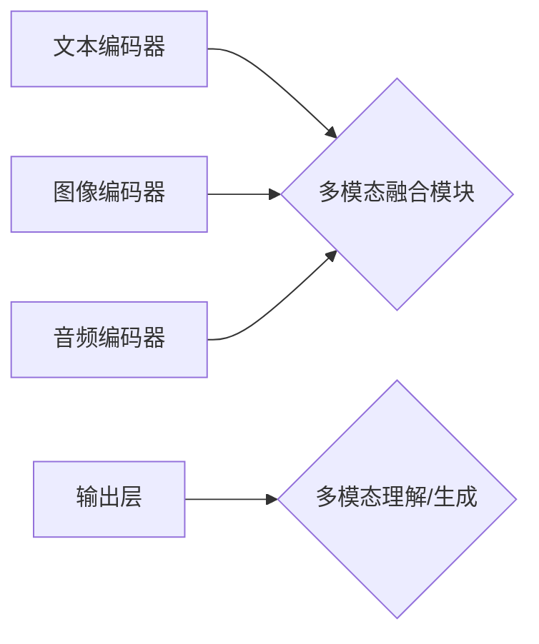

> 多模态大模型、自然语言处理、计算机视觉、音频处理、多模态融合、效果评估、应用场景

## 1. 背景介绍

近年来，人工智能（AI）技术取得了飞速发展，其中，大模型在自然语言处理（NLP）、计算机视觉（CV）等领域展现出强大的能力。然而，现实世界的信息往往是多模态的，例如文本、图像、音频、视频等多种形式的混合。单模态模型难以捕捉多模态信息之间的复杂关系，因此，多模态大模型应运而生。

多模态大模型是指能够处理多种模态数据并进行理解、生成和推理的强大AI模型。它通过融合不同模态的信息，可以获得更全面的知识表示，从而提升模型的理解能力和应用场景。

## 2. 核心概念与联系

多模态大模型的核心概念包括：

* **模态:** 指不同形式的信息表示，例如文本、图像、音频、视频等。
* **多模态融合:** 指将不同模态的信息进行有效地结合，以获得更丰富的语义理解。
* **跨模态学习:** 指模型能够在不同模态之间进行知识迁移，例如利用文本信息辅助图像理解。

**多模态大模型架构**



## 3. 核心算法原理 & 具体操作步骤

### 3.1  算法原理概述

多模态大模型的训练主要基于深度学习算法，常用的算法包括：

* **Transformer:**  Transformer是一种强大的序列建模网络，能够有效地捕捉文本中的长距离依赖关系。
* **CNN:**  CNN是一种卷积神经网络，擅长于提取图像中的特征。
* **RNN:**  RNN是一种循环神经网络，能够处理序列数据，例如音频信号。

多模态大模型通常采用以下策略进行训练：

* **共享表示:**  将不同模态的数据编码成统一的特征向量，以便进行融合。
* **注意力机制:**  通过注意力机制，模型可以学习不同模态之间的重要关系，并赋予不同模态不同的权重。
* **多任务学习:**  通过训练多个任务，例如文本分类、图像识别、语音识别等，可以提升模型的泛化能力。

### 3.2  算法步骤详解

1. **数据预处理:**  将不同模态的数据进行预处理，例如文本分词、图像裁剪、音频降噪等。
2. **模态编码:**  使用不同的编码器将不同模态的数据编码成特征向量。
3. **多模态融合:**  将不同模态的特征向量进行融合，可以使用注意力机制、拼接等方法。
4. **输出层:**  根据任务需求，设计相应的输出层，例如分类层、回归层等。
5. **模型训练:**  使用交叉熵损失函数等损失函数，对模型进行训练。

### 3.3  算法优缺点

**优点:**

* 能够处理多种模态数据，获得更全面的信息表示。
* 能够捕捉不同模态之间的复杂关系，提升模型的理解能力。
* 具有较强的泛化能力，可以应用于多种场景。

**缺点:**

* 训练数据量大，计算资源消耗高。
* 模型结构复杂，训练难度大。
* 跨模态知识迁移仍然是一个挑战。

### 3.4  算法应用领域

多模态大模型在以下领域具有广泛的应用前景：

* **人机交互:**  例如语音助手、聊天机器人等。
* **内容创作:**  例如自动生成文本、图像、视频等。
* **医疗诊断:**  例如辅助医生进行疾病诊断。
* **教育教学:**  例如个性化学习、智能辅导等。

## 4. 数学模型和公式 & 详细讲解 & 举例说明

### 4.1  数学模型构建

多模态大模型的数学模型通常基于深度学习框架，例如TensorFlow、PyTorch等。模型的结构可以根据具体任务进行设计，常用的结构包括：

* **编码器-解码器结构:**  编码器负责将输入数据编码成特征向量，解码器负责根据特征向量生成输出。
* **Transformer结构:**  Transformer是一种强大的序列建模网络，能够有效地捕捉文本中的长距离依赖关系。

### 4.2  公式推导过程

多模态大模型的训练过程通常基于反向传播算法，目标函数是交叉熵损失函数。

**交叉熵损失函数:**

$$
L = -\sum_{i=1}^{N} y_i \log(\hat{y}_i)
$$

其中：

* $N$ 是样本数量。
* $y_i$ 是真实标签。
* $\hat{y}_i$ 是模型预测的概率。

### 4.3  案例分析与讲解

例如，在图像字幕生成任务中，多模态大模型需要将图像信息和文本信息进行融合，生成相应的字幕。

**模型结构:**

* **图像编码器:**  使用CNN提取图像特征。
* **文本编码器:**  使用Transformer提取文本特征。
* **多模态融合模块:**  使用注意力机制融合图像和文本特征。
* **解码器:**  使用Transformer生成字幕。

**训练过程:**

1. 将图像和文本数据进行预处理。
2. 使用图像编码器和文本编码器分别提取图像和文本特征。
3. 使用多模态融合模块融合图像和文本特征。
4. 使用解码器生成字幕。
5. 使用交叉熵损失函数计算模型损失，并进行反向传播训练。

## 5. 项目实践：代码实例和详细解释说明

### 5.1  开发环境搭建

* **操作系统:**  Linux、macOS、Windows
* **编程语言:**  Python
* **深度学习框架:**  TensorFlow、PyTorch
* **其他工具:**  Git、Jupyter Notebook

### 5.2  源代码详细实现

```python
# 使用TensorFlow框架实现多模态大模型

import tensorflow as tf

# 定义图像编码器
image_encoder = tf.keras.Sequential([
    tf.keras.layers.Conv2D(32, (3, 3), activation='relu'),
    tf.keras.layers.MaxPooling2D((2, 2)),
    tf.keras.layers.Conv2D(64, (3, 3), activation='relu'),
    tf.keras.layers.MaxPooling2D((2, 2)),
    tf.keras.layers.Flatten(),
    tf.keras.layers.Dense(128, activation='relu')
])

# 定义文本编码器
text_encoder = tf.keras.Sequential([
    tf.keras.layers.Embedding(vocab_size, embedding_dim),
    tf.keras.layers.LSTM(128)
])

# 定义多模态融合模块
def multimodal_fusion(image_features, text_features):
    # 使用注意力机制融合图像和文本特征
    # ...

# 定义解码器
decoder = tf.keras.Sequential([
    tf.keras.layers.Dense(vocab_size, activation='softmax')
])

# 定义模型
model = tf.keras.Model(inputs=[image_input, text_input], outputs=decoder(multimodal_fusion(image_encoder(image_input), text_encoder(text_input))))

# 编译模型
model.compile(optimizer='adam', loss='sparse_categorical_crossentropy', metrics=['accuracy'])

# 训练模型
model.fit(train_data, epochs=10)
```

### 5.3  代码解读与分析

* 代码首先定义了图像编码器、文本编码器、多模态融合模块和解码器。
* 然后，将这些模块组合成一个完整的多模态大模型。
* 最后，使用交叉熵损失函数和Adam优化器对模型进行训练。

### 5.4  运行结果展示

训练完成后，可以将模型应用于实际场景，例如图像字幕生成、视频问答等。

## 6. 实际应用场景

### 6.1  多模态搜索

多模态搜索是指根据文本、图像、音频等多种模态信息进行搜索的系统。例如，用户可以输入一个描述图像的文本，系统可以返回与该图像相似的图像。

### 6.2  多模态问答

多模态问答是指根据文本、图像、音频等多种模态信息回答用户的问题。例如，用户可以上传一张图片并提问，系统可以根据图片内容和相关知识库回答问题。

### 6.3  多模态内容创作

多模态内容创作是指利用文本、图像、音频等多种模态信息生成新的内容。例如，可以根据文本描述自动生成图像或视频。

### 6.4  未来应用展望

随着多模态大模型技术的不断发展，其应用场景将更加广泛，例如：

* **虚拟现实（VR）和增强现实（AR）:**  多模态大模型可以增强VR和AR体验，例如，可以根据用户的语音指令控制虚拟环境。
* **自动驾驶:**  多模态大模型可以帮助自动驾驶汽车更好地理解周围环境，例如，可以识别行人、车辆和交通信号灯。
* **个性化教育:**  多模态大模型可以根据学生的学习风格和需求提供个性化的学习内容。

## 7. 工具和资源推荐

### 7.1  学习资源推荐

* **书籍:**
    * 《深度学习》
    * 《自然语言处理》
    * 《计算机视觉》
* **在线课程:**
    * Coursera
    * edX
    * Udacity

### 7.2  开发工具推荐

* **深度学习框架:**
    * TensorFlow
    * PyTorch
* **数据处理工具:**
    * Pandas
    * NumPy
* **可视化工具:**
    * Matplotlib
    * Seaborn

### 7.3  相关论文推荐

* **BERT:**  Bidirectional Encoder Representations from Transformers
* **GPT-3:**  Generative Pre-trained Transformer 3
* **DALL-E:**  Generative Pre-trained Transformer 3

## 8. 总结：未来发展趋势与挑战

### 8.1  研究成果总结

多模态大模型在图像识别、文本理解、语音识别等领域取得了显著的成果，展现出强大的应用潜力。

### 8.2  未来发展趋势

* **模型规模和能力提升:**  未来，多模态大模型的规模和能力将进一步提升，能够处理更复杂的任务。
* **跨模态知识迁移:**  研究者将致力于开发更有效的跨模态知识迁移方法，提升模型的泛化能力。
* **解释性和可解释性:**  提高多模态大模型的解释性和可解释性，使其更易于理解和信任。

### 8.3  面临的挑战

* **数据获取和标注:**  多模态数据的获取和标注成本高，是模型训练的瓶颈。
* **模型训练效率:**  多模态大模型的训练时间长，计算资源消耗大。
* **伦理和安全问题:**  多模态大模型的应用可能带来伦理和安全问题，需要引起重视。

### 8.4  研究展望

未来，多模态大模型的研究将更加深入，应用场景将更加广泛，为人类社会带来更多便利和福祉。

## 9. 附录：常见问题与解答

**Q1: 多模态大模型与单模态模型有什么区别？**

**A1:** 单模态模型只能处理一种模态数据，而多模态大模型可以处理多种模态数据，并进行融合，从而获得更全面的信息表示。

**Q2: 多模态大模型的训练难度大吗？**

**A2:** 是的，多模态大模型的训练难度较大，需要大量的计算资源和数据。

**Q3: 多模态大模型有哪些应用场景？**

**A3:** 多模态大模型的应用场景