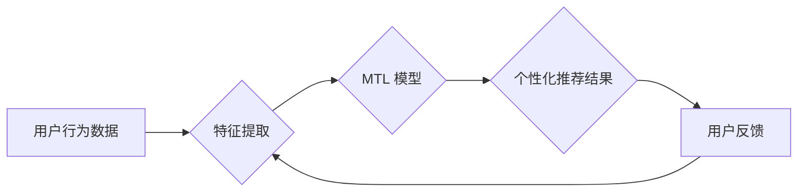

> 多次任务学习，个性化推荐，机器学习，深度学习，用户行为分析，推荐系统

## 1. 背景介绍

在信息爆炸的时代，海量数据和个性化需求共同催生了推荐系统的蓬勃发展。推荐系统旨在根据用户的历史行为、偏好和上下文信息，预测用户对特定物品的兴趣，并提供个性化的推荐结果。传统的推荐系统主要依赖于协同过滤或内容过滤等方法，但这些方法在面对冷启动问题、数据稀疏性问题和用户行为的多样性问题时，往往表现力不足。

近年来，随着深度学习技术的快速发展，基于深度学习的推荐系统逐渐成为研究热点。深度学习模型能够自动学习用户和物品的复杂特征表示，从而提升推荐系统的准确性和个性化程度。然而，传统的深度学习模型往往只关注单一任务，例如点击预测或购买预测，难以兼顾多个任务的需求。

多次任务学习 (Multi-Task Learning, MTL) 作为一种新型的机器学习范式，能够同时学习多个相关任务，并通过任务之间的相互促进，提升模型的泛化能力和性能。将多次任务学习应用于推荐系统，可以有效解决传统推荐系统面临的挑战，实现更精准、更个性化的推荐体验。

## 2. 核心概念与联系

### 2.1 多次任务学习 (MTL)

多次任务学习 (MTL) 是一种机器学习范式，它将多个相关任务联合训练在一个共享的模型中。MTL 的核心思想是，多个任务之间存在着潜在的联系，通过共享模型参数，可以促进任务之间的相互学习，从而提升模型的整体性能。

### 2.2 个性化推荐

个性化推荐是指根据用户的个人特征、兴趣偏好和行为模式，提供定制化的商品或服务推荐。个性化推荐的目标是提高用户体验，增强用户粘性，促进商业转化。

### 2.3 MTL 与个性化推荐的联系

将 MTL 应用于个性化推荐，可以有效提升推荐系统的精准度和个性化程度。MTL 可以同时学习多个任务，例如点击预测、购买预测、浏览时长预测等，并通过任务之间的相互促进，学习到更丰富的用户和物品特征表示。

**Mermaid 流程图**



## 3. 核心算法原理 & 具体操作步骤

### 3.1 算法原理概述

MTL 的核心算法原理是共享模型参数。MTL 模型通常由一个共享的特征提取层和多个任务特定的输出层组成。共享的特征提取层负责学习用户和物品的通用特征表示，而每个任务特定的输出层负责预测特定任务的结果。通过共享模型参数，MTL 模型可以学习到更丰富的特征表示，并通过任务之间的相互促进，提升模型的整体性能。

### 3.2 算法步骤详解

1. **数据预处理:** 收集用户行为数据，并进行清洗、转换和特征工程等预处理操作。
2. **模型构建:** 建立 MTL 模型，包括共享的特征提取层和多个任务特定的输出层。
3. **模型训练:** 使用训练数据训练 MTL 模型，并通过优化算法调整模型参数，使得模型能够准确预测多个任务的结果。
4. **模型评估:** 使用测试数据评估模型的性能，并根据评估结果进行模型调优。
5. **个性化推荐:** 将训练好的 MTL 模型应用于实际场景，根据用户的历史行为和上下文信息，预测用户对特定物品的兴趣，并提供个性化的推荐结果。

### 3.3 算法优缺点

**优点:**

* 提升模型泛化能力：通过任务之间的相互促进，MTL 模型可以学习到更丰富的特征表示，从而提升模型的泛化能力。
* 提高模型性能：MTL 模型可以同时学习多个任务，并通过任务之间的相互促进，提升模型的整体性能。
* 缓解数据稀疏性问题：MTL 模型可以利用多个任务的数据，缓解数据稀疏性问题。

**缺点:**

* 算法复杂度较高：MTL 模型比单任务模型更复杂，训练和推理过程也更耗时。
* 任务相关性要求高：MTL 模型需要学习多个相关任务，如果任务之间没有相关性，MTL 模型的性能可能不如单任务模型。

### 3.4 算法应用领域

MTL 算法广泛应用于多个领域，例如：

* 自然语言处理：文本分类、情感分析、机器翻译等。
*计算机视觉：图像识别、目标检测、图像分割等。
*推荐系统：个性化推荐、商品搜索、内容推荐等。

## 4. 数学模型和公式 & 详细讲解 & 举例说明

### 4.1 数学模型构建

假设我们有 M 个任务，每个任务都有其对应的损失函数 L_i(θ)。MTL 模型的目标是学习一个参数向量 θ，使得所有任务的损失函数最小化。

**损失函数:**

$$
L(\theta) = \sum_{i=1}^{M} \lambda_i L_i(\theta)
$$

其中，λ_i 是每个任务的权重，用于平衡不同任务的重要性。

### 4.2 公式推导过程

MTL 模型的训练过程是通过优化损失函数 L(θ) 来实现的。常用的优化算法包括梯度下降法、Adam 算法等。

**梯度下降法:**

$$
\theta = \theta - \eta \nabla L(\theta)
$$

其中，η 是学习率，∇L(θ) 是损失函数 L(θ) 的梯度。

### 4.3 案例分析与讲解

假设我们有一个推荐系统，需要同时预测用户对商品的点击、购买和浏览时长。我们可以使用 MTL 模型学习这三个任务，并通过任务之间的相互促进，提升模型的整体性能。

* 点击预测任务：损失函数为二分类交叉熵损失函数。
* 购买预测任务：损失函数为二分类交叉熵损失函数。
* 浏览时长预测任务：损失函数为均方误差损失函数。

通过训练 MTL 模型，我们可以学习到用户和商品的更丰富的特征表示，从而提升推荐系统的准确性和个性化程度。

## 5. 项目实践：代码实例和详细解释说明

### 5.1 开发环境搭建

* Python 3.6+
* TensorFlow 2.0+
* PyTorch 1.0+
* Jupyter Notebook

### 5.2 源代码详细实现

```python
import tensorflow as tf

# 定义 MTL 模型
class MTLModel(tf.keras.Model):
    def __init__(self, num_users, num_items, embedding_dim):
        super(MTLModel, self).__init__()
        self.user_embedding = tf.keras.layers.Embedding(num_users, embedding_dim)
        self.item_embedding = tf.keras.layers.Embedding(num_items, embedding_dim)
        self.click_output = tf.keras.layers.Dense(1, activation='sigmoid')
        self.purchase_output = tf.keras.layers.Dense(1, activation='sigmoid')
        self.duration_output = tf.keras.layers.Dense(1)

    def call(self, user_ids, item_ids):
        user_embeddings = self.user_embedding(user_ids)
        item_embeddings = self.item_embedding(item_ids)
        combined_embeddings = user_embeddings + item_embeddings
        click_prediction = self.click_output(combined_embeddings)
        purchase_prediction = self.purchase_output(combined_embeddings)
        duration_prediction = self.duration_output(combined_embeddings)
        return click_prediction, purchase_prediction, duration_prediction

# 训练 MTL 模型
model = MTLModel(num_users=10000, num_items=10000, embedding_dim=64)
model.compile(optimizer='adam', loss=['binary_crossentropy', 'binary_crossentropy', 'mse'])
model.fit(
    x={'user_ids': user_ids, 'item_ids': item_ids},
    y=[click_labels, purchase_labels, duration_labels],
    epochs=10
)

# 个性化推荐
user_id = 1234
item_ids = model.predict(user_id)
```

### 5.3 代码解读与分析

* **MTLModel 类:** 定义了 MTL 模型的结构，包括用户嵌入层、商品嵌入层、点击预测输出层、购买预测输出层和浏览时长预测输出层。
* **call 方法:** 定义了 MTL 模型的正向传播过程，将用户 ID 和商品 ID 作为输入，输出点击预测、购买预测和浏览时长预测的结果。
* **训练 MTL 模型:** 使用 TensorFlow 的 `compile` 方法配置模型的优化器和损失函数，然后使用 `fit` 方法训练模型。
* **个性化推荐:** 使用训练好的 MTL 模型预测用户对特定商品的兴趣，并提供个性化的推荐结果。

### 5.4 运行结果展示

训练完成后，可以评估模型的性能，并使用模型进行个性化推荐。

## 6. 实际应用场景

### 6.1 电商推荐

在电商平台，MTL 可以用于个性化商品推荐、浏览推荐、购买预测等场景。

### 6.2 内容推荐

在内容平台，MTL 可以用于个性化新闻推荐、视频推荐、文章推荐等场景。

### 6.3 社交推荐

在社交平台，MTL 可以用于个性化好友推荐、兴趣小组推荐、话题推荐等场景。

### 6.4 未来应用展望

随着深度学习技术的不断发展，MTL 在推荐系统领域的应用前景广阔。未来，MTL 可以应用于更多场景，例如：

* 个性化广告推荐
* 个性化教育推荐
* 个性化医疗推荐

## 7. 工具和资源推荐

### 7.1 学习资源推荐

* **书籍:**
    * Multi-Task Learning: A Comprehensive Survey
    * Deep Learning
* **论文:**
    * Multi-Task Learning with Deep Neural Networks
    * A Survey on Multi-Task Learning

### 7.2 开发工具推荐

* **TensorFlow:** https://www.tensorflow.org/
* **PyTorch:** https://pytorch.org/
* **Keras:** https://keras.io/

### 7.3 相关论文推荐

* Multi-Task Learning with Deep Neural Networks
* A Survey on Multi-Task Learning
* Multi-Task Learning for Recommender Systems: A Survey

## 8. 总结：未来发展趋势与挑战

### 8.1 研究成果总结

MTL 在推荐系统领域取得了显著的成果，能够有效提升推荐系统的精准度和个性化程度。

### 8.2 未来发展趋势

* **更复杂的 MTL 模型:** 研究更复杂的 MTL 模型，例如多模态 MTL、联邦 MTL 等。
* **更有效的 MTL 算法:** 研究更有效的 MTL 算法，例如动态 MTL、自适应 MTL 等。
* **更广泛的应用场景:** 将 MTL 应用于更多场景，例如个性化广告推荐、个性化教育推荐等。

### 8.3 面临的挑战

* **数据稀疏性问题:** MTL 模型需要大量的数据进行训练，而现实世界中的数据往往是稀疏的。
* **任务相关性问题:** MTL 模型需要学习多个相关任务，如果任务之间没有相关性，MTL 模型的性能可能不如单任务模型。
* **模型复杂度问题:** MTL 模型比单任务模型更复杂，训练和推理过程也更耗时。

### 8.4 研究展望

未来，MTL 在推荐系统领域仍有很大的发展空间。通过解决数据稀疏性问题、任务相关性问题和模型复杂度问题，MTL 将能够更好地服务于个性化推荐需求。

## 9. 附录：常见问题与解答

**Q1: MTL 与单任务学习相比，有什么优势？**

**A1:** MTL 可以同时学习多个相关任务，并通过任务之间的相互促进，提升模型的泛化能力和性能。

**Q2: MTL 模型需要哪些数据进行训练？**

**A2:** MTL 模型需要多个任务的数据，每个任务的数据应该包含用户 ID、商品 ID 和相应的标签信息。

**Q3: 如何选择 MTL 模型的损失函数？**

**A3:** 损失函数的选择取决于具体的任务类型。例如，点击预测任务可以使用二分类