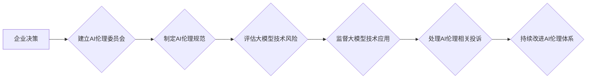

> 大模型、AI伦理、企业责任、道德规范、风险管理、透明度、可解释性、公平性、隐私保护

## 1. 背景介绍

近年来，大模型技术蓬勃发展，展现出强大的应用潜力，在各个领域引发广泛关注。然而，大模型的强大能力也带来了新的伦理挑战，例如数据偏差、算法偏见、信息操纵、隐私泄露等。为了确保大模型技术安全、可持续发展，企业需要建立健全的AI伦理委员会，制定并执行相应的伦理规范和风险管理机制。

## 2. 核心概念与联系

**2.1 AI伦理**

AI伦理是指在人工智能技术发展和应用过程中，遵循道德原则、社会规范和法律法规，确保人工智能技术安全、可控、可持续发展的伦理准则和实践。

**2.2 大模型**

大模型是指参数规模庞大、训练数据海量的人工智能模型，具备强大的泛化能力和学习能力，能够处理复杂的任务，例如自然语言处理、图像识别、代码生成等。

**2.3 企业责任**

企业作为大模型技术开发和应用的主体，负有维护社会公共利益、保障用户权益、促进技术可持续发展的责任。

**2.4 AI伦理委员会**

AI伦理委员会是企业内部专门负责研究、制定和监督人工智能技术伦理问题的机构，其职责包括：

* 制定和更新企业AI伦理规范
* 评估大模型技术风险
* 监督大模型技术应用
* 处理AI伦理相关投诉
* 推广AI伦理意识

**2.5 伦理规范**

伦理规范是企业在开发和应用大模型技术时遵循的道德准则和行为准则，例如：

* **公平性:** 避免算法偏见，确保所有用户获得公平的待遇。
* **透明度:** 明确大模型的决策过程，方便用户理解和监督。
* **可解释性:** 使大模型的决策结果可解释，避免“黑箱”问题。
* **隐私保护:** 保护用户个人信息，防止数据泄露。
* **责任追究:** 对大模型技术带来的负面影响承担责任。

**2.6 风险管理**

风险管理是指企业识别、评估和控制大模型技术带来的潜在风险，例如：

* **技术风险:** 大模型算法缺陷、数据安全漏洞等。
* **社会风险:** 算法偏见导致歧视、信息操纵导致社会动荡等。
* **法律风险:** 违反相关法律法规，导致法律诉讼等。

**2.7 流程图**



## 3. 核心算法原理 & 具体操作步骤

**3.1 算法原理概述**

大模型的训练主要基于深度学习算法，例如Transformer模型。这些算法通过多层神经网络结构，学习数据中的复杂模式和关系，从而实现强大的文本理解、生成和翻译能力。

**3.2 算法步骤详解**

1. **数据收集和预处理:** 收集大量文本数据，并进行清洗、分词、标记等预处理操作。
2. **模型构建:** 根据深度学习算法，构建多层神经网络模型。
3. **模型训练:** 使用训练数据，通过反向传播算法，调整模型参数，使模型输出与真实标签尽可能接近。
4. **模型评估:** 使用测试数据，评估模型的性能，例如准确率、召回率、F1-score等。
5. **模型部署:** 将训练好的模型部署到实际应用场景中。

**3.3 算法优缺点**

**优点:**

* 强大的泛化能力，能够处理复杂的任务。
* 学习能力强，能够从海量数据中提取有价值的信息。

**缺点:**

* 训练成本高，需要大量计算资源和时间。
* 容易受到数据偏差的影响，导致算法偏见。
* 模型解释性差，难以理解模型的决策过程。

**3.4 算法应用领域**

* 自然语言处理: 文本分类、情感分析、机器翻译、对话系统等。
* 图像识别: 图像分类、目标检测、图像生成等。
* 代码生成: 代码自动完成、代码错误修复等。

## 4. 数学模型和公式 & 详细讲解 & 举例说明

**4.1 数学模型构建**

大模型的训练过程可以看作是一个优化问题，目标是找到模型参数，使得模型输出与真实标签之间的误差最小。常用的损失函数包括交叉熵损失函数、均方误差损失函数等。

**4.2 公式推导过程**

例如，对于分类任务，可以使用交叉熵损失函数来衡量模型预测结果与真实标签之间的差异。交叉熵损失函数的公式如下：

$$
L = -\sum_{i=1}^{N} y_i \log(p_i)
$$

其中：

* $L$ 是损失函数值。
* $N$ 是样本数量。
* $y_i$ 是真实标签，取值为0或1。
* $p_i$ 是模型预测结果，取值为0到1之间的概率。

**4.3 案例分析与讲解**

假设我们有一个二分类任务，训练一个模型来判断邮件是否为垃圾邮件。训练数据包含1000封邮件，其中500封是垃圾邮件，500封不是垃圾邮件。模型预测结果如下：

* 邮件1: 预测概率为0.8，真实标签为垃圾邮件。
* 邮件2: 预测概率为0.2，真实标签为非垃圾邮件。

使用交叉熵损失函数计算损失值：

$$
L = - (0.8 \log(0.8) + 0.2 \log(0.2))
$$

通过反向传播算法，更新模型参数，降低损失值。

## 5. 项目实践：代码实例和详细解释说明

**5.1 开发环境搭建**

使用Python语言和深度学习框架TensorFlow或PyTorch搭建开发环境。

**5.2 源代码详细实现**

```python
import tensorflow as tf

# 定义模型结构
model = tf.keras.models.Sequential([
    tf.keras.layers.Embedding(input_dim=10000, output_dim=128),
    tf.keras.layers.LSTM(units=64),
    tf.keras.layers.Dense(units=1, activation='sigmoid')
])

# 编译模型
model.compile(optimizer='adam', loss='binary_crossentropy', metrics=['accuracy'])

# 训练模型
model.fit(x_train, y_train, epochs=10)

# 评估模型
loss, accuracy = model.evaluate(x_test, y_test)
print('Loss:', loss)
print('Accuracy:', accuracy)
```

**5.3 代码解读与分析**

* 代码首先定义了模型结构，包括嵌入层、LSTM层和全连接层。
* 然后编译模型，指定优化器、损失函数和评价指标。
* 接着训练模型，使用训练数据进行训练。
* 最后评估模型，使用测试数据计算模型的损失值和准确率。

**5.4 运行结果展示**

训练完成后，可以查看模型的损失值和准确率，评估模型的性能。

## 6. 实际应用场景

大模型技术在各个领域都有广泛的应用场景，例如：

* **医疗保健:** 辅助诊断、预测疾病风险、个性化治疗方案。
* **金融服务:** 风险评估、欺诈检测、客户服务自动化。
* **教育:** 个性化学习、智能辅导、自动批改作业。
* **制造业:** 预测性维护、质量控制、生产优化。

**6.4 未来应用展望**

随着大模型技术的不断发展，未来将有更多新的应用场景出现，例如：

* **科学研究:** 加速科学发现、模拟复杂系统。
* **艺术创作:** 生成音乐、绘画、文学作品。
* **人机交互:** 更自然、更智能的人机交互体验。

## 7. 工具和资源推荐

**7.1 学习资源推荐**

* **书籍:**
    * 《深度学习》
    * 《自然语言处理》
    * 《机器学习》
* **在线课程:**
    * Coursera
    * edX
    * Udacity

**7.2 开发工具推荐**

* **深度学习框架:** TensorFlow, PyTorch, Keras
* **编程语言:** Python
* **云计算平台:** AWS, Azure, Google Cloud

**7.3 相关论文推荐**

* **Transformer模型:** Attention Is All You Need
* **BERT模型:** BERT: Pre-training of Deep Bidirectional Transformers for Language Understanding
* **GPT模型:** Generative Pre-trained Transformer

## 8. 总结：未来发展趋势与挑战

**8.1 研究成果总结**

近年来，大模型技术取得了显著进展，在各个领域展现出强大的应用潜力。

**8.2 未来发展趋势**

* 模型规模进一步扩大，参数量达到万亿级甚至更高。
* 模型训练效率提升，降低训练成本和时间。
* 模型解释性增强，提高模型可理解性和可信任度。
* 多模态大模型发展，融合文本、图像、音频等多种数据类型。

**8.3 面临的挑战**

* 数据安全和隐私保护
* 算法偏见和公平性
* 模型可解释性和透明度
* 伦理规范和监管机制

**8.4 研究展望**

未来需要加强对大模型技术的伦理研究，制定完善的规范和制度，确保大模型技术安全、可控、可持续发展。

## 9. 附录：常见问题与解答

**9.1 如何避免大模型算法偏见？**

* 使用多样化的训练数据，减少数据偏差。
* 开发算法公平性评估指标，监测算法偏见。
* 采用反偏见算法技术，减轻算法偏见的影响。

**9.2 如何提高大模型的解释性？**

* 使用可解释性模型，例如线性模型、决策树等。
* 开发模型解释工具，帮助用户理解模型决策过程。
* 增强模型的可视化，展示模型内部结构和特征重要性。


作者：禅与计算机程序设计艺术 / Zen and the Art of Computer Programming 
<end_of_turn>