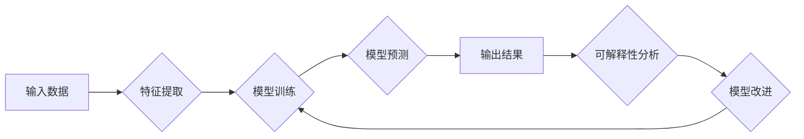

> 大模型，可解释性，机器学习，深度学习，透明度，信任，伦理

## 1. 背景介绍

近年来，深度学习模型在图像识别、自然语言处理、语音识别等领域取得了突破性的进展，其强大的性能吸引了广泛的关注。然而，随着模型规模的不断扩大，其内部工作机制变得越来越复杂，难以理解和解释。这导致了“黑箱”问题，即无法解释模型是如何做出决策的，这对于模型的信任度和应用场景的扩展带来了挑战。

可解释性是指能够理解和解释机器学习模型的决策过程的能力。对于大模型而言，可解释性研究尤为重要，因为它涉及到模型的可靠性、安全性、公平性等关键问题。

## 2. 核心概念与联系

**2.1 可解释性与机器学习**

可解释性是机器学习领域的一个重要研究方向，旨在提高模型的透明度和可理解性。可解释性研究的目标是：

* **理解模型的决策过程：** 能够解释模型是如何从输入数据到输出结果的。
* **识别模型的偏差和错误：** 能够发现模型潜在的偏见和错误，并进行修正。
* **提高模型的信任度：** 能够让人们对模型的决策结果更加信任。

**2.2 大模型与可解释性挑战**

大模型由于其规模庞大、参数数量众多，其内部结构和决策过程更加复杂，导致可解释性研究面临着更大的挑战：

* **复杂性：** 大模型的结构和参数数量庞大，难以进行直接的分析和解释。
* **非线性性：** 大模型的决策过程通常是非线性的，难以用简单的规则或模型进行描述。
* **数据依赖性：** 大模型的性能依赖于训练数据的质量和数量，数据偏差会影响模型的可解释性。

**2.3 可解释性方法**

目前，针对大模型的可解释性研究，主要采用以下几种方法：

* **局部解释方法：** 例如 LIME、SHAP 等，通过分析单个样本的输入特征对模型输出的影响，解释模型对单个样本的决策过程。
* **全局解释方法：** 例如特征重要性分析、模型压缩等，通过分析模型整体结构和参数，解释模型对不同特征的依赖关系和决策机制。
* **可解释模型：** 例如决策树、线性回归等，使用结构简单、易于理解的模型替代复杂的大模型，提高模型的可解释性。

**2.4 Mermaid 流程图**



## 3. 核心算法原理 & 具体操作步骤

### 3.1 算法原理概述

**3.1.1 LIME (Local Interpretable Model-agnostic Explanations)**

LIME 是一种局部解释方法，它通过在每个样本附近构建一个简单的可解释模型，来解释模型对该样本的决策过程。

**3.1.2 SHAP (SHapley Additive exPlanations)**

SHAP 是一种基于博弈论的解释方法，它通过分配每个特征对模型输出的贡献值，来解释模型对每个特征的依赖关系。

### 3.2 算法步骤详解

**3.2.1 LIME 算法步骤**

1. 选择一个样本。
2. 在该样本附近生成一系列扰动样本。
3. 对每个扰动样本，使用原始模型进行预测。
4. 使用线性回归等简单模型，拟合扰动样本的特征和模型预测之间的关系。
5. 使用拟合的模型，解释模型对该样本的决策过程。

**3.2.2 SHAP 算法步骤**

1. 计算每个特征对模型输出的贡献值。
2. 使用 Shapley 值公式，分配每个特征的贡献值。
3. 根据特征的贡献值，解释模型对每个特征的依赖关系。

### 3.3 算法优缺点

**3.3.1 LIME 算法**

* **优点：** 
    * 模型无关性：可以应用于各种类型的机器学习模型。
    * 局部解释性：可以解释模型对单个样本的决策过程。
* **缺点：** 
    * 局部性：只能解释单个样本的决策过程，无法解释模型的整体决策机制。
    * 拟合模型的假设：依赖于线性回归等简单模型的假设。

**3.3.2 SHAP 算法**

* **优点：** 
    * 全局解释性：可以解释模型对所有特征的依赖关系。
    * 基于博弈论：具有理论上的严谨性。
* **缺点：** 
    * 计算复杂度高：对于大型模型，计算 SHAP 值可能非常耗时。
    * 数据依赖性：SHAP 值的准确性依赖于训练数据的质量和数量。

### 3.4 算法应用领域

* **医疗诊断：** 解释模型对患者病症的诊断结果。
* **金融风险评估：** 解释模型对客户贷款风险的评估结果。
* **自动驾驶：** 解释模型对道路场景的感知和决策结果。

## 4. 数学模型和公式 & 详细讲解 & 举例说明

### 4.1 数学模型构建

**4.1.1 LIME 模型**

LIME 使用线性回归模型来近似原始模型在局部区域的决策过程。

**4.1.2 SHAP 模型**

SHAP 模型基于博弈论的 Shapley 值，用于分配每个特征对模型输出的贡献值。

### 4.2 公式推导过程

**4.2.1 LIME 模型公式**

$$
\hat{f}(x) = \arg\min_{\theta} \sum_{i=1}^{n} (y_i - \theta^T x_i)^2
$$

其中：

* $\hat{f}(x)$ 是 LIME 模型的预测结果。
* $x$ 是输入样本。
* $y_i$ 是原始模型对第 $i$ 个扰动样本的预测结果。
* $\theta$ 是线性回归模型的参数。

**4.2.2 SHAP 值公式**

$$
\text{SHAP}(X_i) = \sum_{S \subseteq N \setminus \{i\}} \frac{(|S|!) (|N \setminus S - \{i\}|!)}{|N|!} (f(S \cup \{i\}) - f(S))
$$

其中：

* $\text{SHAP}(X_i)$ 是特征 $X_i$ 的 Shapley 值。
* $N$ 是所有特征的集合。
* $S$ 是特征集合 $N$ 的子集，不包含特征 $X_i$。
* $f(S)$ 是模型对特征集合 $S$ 的预测结果。

### 4.3 案例分析与讲解

**4.3.1 LIME 案例分析**

假设我们有一个图像分类模型，需要解释模型对一张猫的图像的分类结果。我们可以使用 LIME 方法，在该图像附近生成一系列扰动图像，并使用线性回归模型拟合扰动图像的特征和模型预测之间的关系。通过分析线性回归模型的参数，我们可以了解哪些特征对模型对猫的图像分类结果有重要影响。

**4.3.2 SHAP 案例分析**

假设我们有一个信用评分模型，需要解释模型对客户信用评分的预测结果。我们可以使用 SHAP 方法，计算每个特征对模型输出的贡献值。通过分析特征的贡献值，我们可以了解哪些特征对客户信用评分的影响最大，哪些特征对模型的预测结果有较小的影响。

## 5. 项目实践：代码实例和详细解释说明

### 5.1 开发环境搭建

* Python 3.7+
* TensorFlow 2.0+
* scikit-learn 0.23+
* Jupyter Notebook

### 5.2 源代码详细实现

```python
# 使用 LIME 解释模型对样本的预测结果
from lime import lime_tabular
from sklearn.linear_model import LogisticRegression

# 加载模型和数据
model = LogisticRegression()
data = ...

# 使用 LIME 解释模型对样本的预测结果
explainer = lime_tabular.LimeTabularExplainer(data, feature_names=data.columns, class_names=['0', '1'])
explanation = explainer.explain_instance(data.iloc[0], model.predict_proba, top_labels=1)

# 可视化解释结果
explanation.as_list()
explanation.as_dataframe()

# 使用 SHAP 解释模型对样本的预测结果
import shap

# 计算 SHAP 值
shap_values = shap.TreeExplainer(model).shap_values(data)

# 可视化 SHAP 值
shap.summary_plot(shap_values, data)
```

### 5.3 代码解读与分析

* **LIME 代码解读：**
    * 使用 `lime_tabular.LimeTabularExplainer` 创建 LIME 解释器。
    * 使用 `explain_instance` 方法解释模型对样本的预测结果。
    * 使用 `as_list` 和 `as_dataframe` 方法可视化解释结果。
* **SHAP 代码解读：**
    * 使用 `shap.TreeExplainer` 创建 SHAP 解释器。
    * 使用 `shap_values` 方法计算 SHAP 值。
    * 使用 `shap.summary_plot` 方法可视化 SHAP 值。

### 5.4 运行结果展示

运行上述代码，可以得到 LIME 和 SHAP 的解释结果，包括特征重要性、贡献值等信息。

## 6. 实际应用场景

### 6.1 医疗诊断

可解释性模型可以帮助医生理解模型对患者病症的诊断结果，提高诊断的准确性和可靠性。

### 6.2 金融风险评估

可解释性模型可以帮助银行和金融机构理解模型对客户贷款风险的评估结果，降低贷款风险和提高贷款效率。

### 6.3 自动驾驶

可解释性模型可以帮助自动驾驶系统解释其对道路场景的感知和决策结果，提高自动驾驶系统的安全性。

### 6.4 未来应用展望

随着大模型的不断发展，可解释性研究将发挥越来越重要的作用。未来，可解释性技术将应用于更多领域，例如：

* **法律判决：** 解释机器学习模型对案件的判决结果。
* **教育领域：** 解释机器学习模型对学生的学习情况的评估结果。
* **科学研究：** 解释机器学习模型对实验数据的分析结果。

## 7. 工具和资源推荐

### 7.1 学习资源推荐

* **书籍：**
    * "Interpretable Machine Learning" by Christoph Molnar
    * "The Master Algorithm" by Pedro Domingos
* **在线课程：**
    * Coursera: "Machine Learning" by Andrew Ng
    * edX: "Artificial Intelligence" by Columbia University

### 7.2 开发工具推荐

* **LIME：** https://github.com/marcotcr/lime
* **SHAP：** https://github.com/slundberg/shap
* **TensorFlow：** https://www.tensorflow.org/
* **PyTorch：** https://pytorch.org/

### 7.3 相关论文推荐

* **"Local Interpretable Model-agnostic Explanations"** by Marco Tulio Ribeiro, Sameer Singh, and Carlos Guestrin
* **"SHAP: A Unified Approach to Interpreting Model Predictions"** by Scott Lundberg and Su-In Lee

## 8. 总结：未来发展趋势与挑战

### 8.1 研究成果总结

近年来，大模型的可解释性研究取得了显著进展，涌现出多种解释方法和工具。这些方法和工具为理解和解释大模型的决策过程提供了新的思路和手段。

### 8.2 未来发展趋势

* **模型内可解释性：** 将可解释性融入模型设计阶段，构建更易于理解和解释的模型。
* **多模态可解释性：** 解