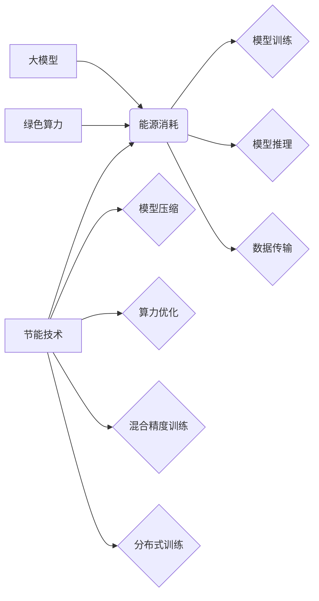

> 大模型，能源需求，节能技术，绿色算力，深度学习，模型压缩，算力优化，可持续发展

## 1. 背景介绍

近年来，深度学习模型规模不断扩大，涌现出许多具有强大能力的大模型，例如GPT-3、BERT、DALL-E等。这些大模型在自然语言处理、计算机视觉、语音识别等领域取得了突破性进展，深刻地改变了人们的生活方式。然而，大模型的训练和部署也带来了巨大的能源消耗问题。

随着大模型规模的不断增长，其训练所需的算力和能源消耗呈指数级增长。据估计，训练一个大型语言模型可能需要消耗数百万千瓦时的电能，相当于数百户家庭一年用电量。这种高昂的能源成本不仅对环境造成负担，也对经济发展构成挑战。

因此，如何有效降低大模型的能源需求，实现绿色算力发展，成为当前人工智能领域亟待解决的关键问题。

## 2. 核心概念与联系

**2.1 大模型的能源消耗**

大模型的能源消耗主要集中在以下几个方面：

* **模型训练:** 训练大模型需要大量的计算资源，包括CPU、GPU和TPU等。这些硬件设备在运行过程中会产生大量的热量，需要消耗大量的电能进行冷却。
* **模型推理:** 模型推理是指使用已经训练好的模型进行预测或生成结果的过程。虽然模型推理所需的算力比训练少，但仍然需要消耗一定的电能。
* **数据传输:** 大模型的训练和推理都需要大量的输入数据，数据传输也会消耗一定的电能。

**2.2 节能技术**

节能技术是指通过提高能源利用效率、减少能源消耗的技术。在人工智能领域，常用的节能技术包括：

* **模型压缩:** 通过减少模型参数量、降低模型复杂度，从而减少模型训练和推理所需的算力。
* **算力优化:** 通过优化算法、硬件架构和软件框架，提高算力利用效率，减少能源消耗。
* **混合精度训练:** 使用不同精度的数据类型进行训练，例如使用浮点精度和整数精度，从而减少计算量和内存消耗。
* **分布式训练:** 将模型训练任务分解到多个机器上进行并行训练，从而缩短训练时间和减少能源消耗。

**2.3 绿色算力**

绿色算力是指通过采用节能技术、清洁能源和可持续发展理念，实现计算资源高效利用、低碳环保的计算模式。

**2.4 核心概念关系图**



## 3. 核心算法原理 & 具体操作步骤

### 3.1  算法原理概述

模型压缩是降低大模型能源消耗的一种重要技术，其核心原理是通过减少模型参数量、降低模型复杂度，从而减少模型训练和推理所需的算力。常见的模型压缩方法包括：

* **权重剪枝:** 移除模型中不重要的权重参数，例如通过设置阈值去除绝对值较小的权重。
* **量化:** 将模型参数的精度降低，例如将32位浮点数转换为8位整数。
* **知识蒸馏:** 使用一个小的学生模型学习一个大的教师模型的知识，从而实现模型压缩。

### 3.2  算法步骤详解

以权重剪枝为例，其具体操作步骤如下：

1. **选择剪枝策略:** 常见的剪枝策略包括L1正则化、L2正则化、随机剪枝等。
2. **计算权重重要性:** 使用不同的指标评估每个权重的重要性，例如梯度大小、激活值等。
3. **设置剪枝阈值:** 根据选择的剪枝策略和权重重要性，设置一个剪枝阈值。
4. **移除不重要的权重:** 将所有权重绝对值小于剪枝阈值的权重移除。
5. **重新训练模型:** 使用剪枝后的模型进行重新训练，以恢复模型性能。

### 3.3  算法优缺点

**优点:**

* 能够有效降低模型参数量，减少模型存储和计算成本。
* 训练和推理速度可以得到提升。

**缺点:**

* 可能会导致模型性能下降。
* 需要重新训练模型，增加训练时间和成本。

### 3.4  算法应用领域

模型压缩技术广泛应用于各种人工智能领域，例如：

* **移动设备:** 将大模型压缩到移动设备上，实现高效的语音识别、图像识别等功能。
* **嵌入式系统:** 将大模型压缩到嵌入式系统上，实现资源有限环境下的智能应用。
* **云计算:** 压缩模型可以提高云计算平台的资源利用效率，降低成本。

## 4. 数学模型和公式 & 详细讲解 & 举例说明

### 4.1  数学模型构建

模型压缩的目标是找到一个更小的模型，其性能损失最小。我们可以使用以下数学模型来描述这个问题：

* **目标函数:**  $Loss(M_s, D)$，其中$M_s$是压缩后的模型，$D$是训练数据集。
* **约束条件:**  $|M_s| \leq k$，其中$|M_s|$是压缩后的模型参数量，$k$是预设的压缩比例。

### 4.2  公式推导过程

为了最小化目标函数，我们可以使用梯度下降算法进行优化。

* **梯度下降公式:**  $\theta_{t+1} = \theta_t - \eta \nabla Loss(M_s, D)$，其中$\theta$是模型参数，$\eta$是学习率。

### 4.3  案例分析与讲解

假设我们有一个包含1000个参数的模型，目标是将其压缩到500个参数。我们可以使用权重剪枝方法进行压缩。

1. 计算每个权重的重要性，例如使用梯度大小作为重要性指标。
2. 设置一个剪枝阈值，例如将梯度绝对值小于0.1的权重移除。
3. 移除不重要的权重，得到一个包含500个参数的压缩模型。
4. 使用梯度下降算法对压缩模型进行重新训练，以恢复模型性能。

## 5. 项目实践：代码实例和详细解释说明

### 5.1  开发环境搭建

* 操作系统: Ubuntu 20.04
* Python 版本: 3.8
* 深度学习框架: TensorFlow 2.x

### 5.2  源代码详细实现

```python
import tensorflow as tf

# 定义一个包含1000个参数的模型
model = tf.keras.Sequential([
    tf.keras.layers.Dense(100, activation='relu', input_shape=(10,)),
    tf.keras.layers.Dense(10, activation='softmax')
])

# 训练模型
model.compile(optimizer='adam',
              loss='sparse_categorical_crossentropy',
              metrics=['accuracy'])
model.fit(x_train, y_train, epochs=10)

# 使用权重剪枝进行模型压缩
# 设置剪枝阈值
threshold = 0.1

# 获取模型权重
weights = model.get_weights()

# 计算每个权重的绝对值
abs_weights = tf.abs(weights)

# 移除绝对值小于阈值的权重
new_weights = tf.where(abs_weights > threshold, weights, tf.zeros_like(weights))

# 更新模型权重
model.set_weights(new_weights)

# 重新训练压缩模型
model.compile(optimizer='adam',
              loss='sparse_categorical_crossentropy',
              metrics=['accuracy'])
model.fit(x_train, y_train, epochs=10)
```

### 5.3  代码解读与分析

* 代码首先定义了一个包含1000个参数的模型。
* 然后使用梯度下降算法对模型进行训练。
* 接下来使用权重剪枝方法进行模型压缩，设置一个剪枝阈值，移除绝对值小于阈值的权重。
* 最后重新训练压缩模型，以恢复模型性能。

### 5.4  运行结果展示

通过运行代码，可以观察到压缩后的模型参数量减少，同时模型性能也可能有所下降。

## 6. 实际应用场景

### 6.1  移动设备

将大模型压缩到移动设备上，可以实现高效的语音识别、图像识别等功能，例如：

* **语音助手:** 压缩后的语音识别模型可以运行在智能手机上，实现实时语音识别和自然语言理解。
* **图像识别:** 压缩后的图像识别模型可以运行在智能手机上，实现实时物体识别、场景识别等功能。

### 6.2  嵌入式系统

将大模型压缩到嵌入式系统上，可以实现资源有限环境下的智能应用，例如：

* **智能家居:** 压缩后的模型可以用于控制智能家居设备，实现语音控制、图像识别等功能。
* **工业自动化:** 压缩后的模型可以用于工业机器视觉，实现缺陷检测、质量控制等功能。

### 6.3  云计算

压缩模型可以提高云计算平台的资源利用效率，降低成本，例如：

* **模型部署:** 压缩后的模型可以更快速地部署到云服务器上，降低部署时间和成本。
* **模型服务:** 压缩后的模型可以提供更低成本的模型服务，提高云计算平台的盈利能力。

### 6.4  未来应用展望

随着人工智能技术的不断发展，大模型的能源消耗问题将更加突出。未来，节能技术和绿色算力将成为人工智能发展的重要方向。

## 7. 工具和资源推荐

### 7.1  学习资源推荐

* **书籍:**
    * 《深度学习》
    * 《机器学习》
* **在线课程:**
    * Coursera: 深度学习
    * edX: 机器学习
* **博客:**
    * TensorFlow Blog
    * PyTorch Blog

### 7.2  开发工具推荐

* **深度学习框架:** TensorFlow, PyTorch, MXNet
* **模型压缩工具:** TensorFlow Model Optimization Toolkit, PyTorch Quantization

### 7.3  相关论文推荐

* **模型压缩:**
    * "Deep Compression: Compressing Deep Neural Networks with Pruning, Trained Quantization and Huffman Coding"
    * "Lottery Ticket Hypothesis: Finding Sparse, Trainable Subnetworks"
* **绿色算力:**
    * "Green AI: Towards Sustainable Deep Learning"
    * "Energy-Efficient Deep Learning: A Survey"

## 8. 总结：未来发展趋势与挑战

### 8.1  研究成果总结

近年来，在模型压缩、算力优化、混合精度训练等方面取得了显著进展，有效降低了大模型的能源消耗。

### 8.2  未来发展趋势

* **更有效的模型压缩技术:** 研究更有效的模型压缩技术，例如基于神经网络的模型压缩、自适应模型压缩等。
* **绿色算力平台:** 建设绿色算力平台，利用清洁能源、高效硬件和软件框架，实现低碳环保的计算模式。
* **可持续发展理念:** 将可持续发展理念融入到人工智能的整个生命周期中，从模型设计、训练、部署到使用和回收，实现资源的有效利用和环境的保护。

### 8.3  面临的挑战

* **模型性能与能源效率之间的平衡:** 如何在保证模型性能的同时，进一步降低能源消耗是一个重要的挑战。
* **硬件和软件协同优化:** 需要硬件和软件的协同优化，才能充分发挥节能技术的潜力。
* **标准化和开源:** 需要建立统一的标准和开源平台，促进节能技术的推广和应用。

### 8.4  研究展望

未来，将继续关注大模型的能源消耗问题，探索更有效的节能技术和绿色算力解决方案，推动人工智能的可持续发展。

## 9. 附录：常见问题与