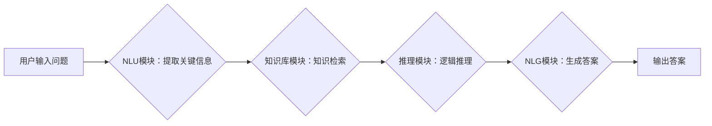

> 大模型、问答机器人、上下文理解、Transformer、BERT、GPT、知识图谱、自然语言处理

## 1. 背景介绍

近年来，深度学习技术取得了飞速发展，特别是Transformer模型的出现，为自然语言处理（NLP）领域带来了革命性的变革。大模型问答机器人作为一种新型的智能交互系统，在信息检索、客服服务、教育培训等领域展现出巨大的应用潜力。然而，问答机器人的核心挑战之一是理解用户提出的问题，并从海量知识库中准确地找到相关答案。上下文理解是解决这一问题的关键，它要求问答机器人能够捕捉用户问题中的语义关系、隐含信息和背景知识，从而提供更精准、更有针对性的回答。

## 2. 核心概念与联系

**2.1  大模型**

大模型是指参数量巨大、训练数据海量的人工智能模型。这些模型通常拥有数十亿甚至数千亿个参数，能够学习到复杂的语言模式和知识表示。大模型在自然语言理解、文本生成、机器翻译等任务上表现出优异的性能。

**2.2  问答机器人**

问答机器人是一种能够理解用户自然语言问题并提供相关答案的智能系统。它通常由以下几个模块组成：

* **自然语言理解（NLU）模块：**负责解析用户输入的自然语言，提取关键信息和意图。
* **知识库模块：**存储着大量结构化和非结构化知识，为问答机器人提供知识支持。
* **推理模块：**根据用户问题和知识库中的信息，进行逻辑推理，找到最合适的答案。
* **自然语言生成（NLG）模块：**将推理结果转化为自然语言，以满足用户需求。

**2.3  上下文理解**

上下文理解是指机器能够理解文本或对话中的语境信息，并根据语境进行推理和决策的能力。在问答机器人中，上下文理解是指机器人能够理解用户问题背后的语义关系、隐含信息和背景知识，从而提供更准确、更有针对性的答案。

**2.4  Transformer模型**

Transformer模型是一种基于注意力机制的深度学习模型，它能够有效地捕捉文本中的长距离依赖关系。Transformer模型在自然语言理解任务上取得了显著的成果，例如BERT、GPT等模型都是基于Transformer架构构建的。

**2.5  知识图谱**

知识图谱是一种结构化的知识表示形式，它将实体和关系以图的形式表示。知识图谱能够帮助问答机器人更好地理解用户问题中的实体和关系，从而进行更精准的知识检索和推理。

**2.6  流程图**



## 3. 核心算法原理 & 具体操作步骤

### 3.1  算法原理概述

大模型问答机器人的上下文理解主要依赖于深度学习模型，特别是Transformer模型。Transformer模型通过注意力机制能够有效地捕捉文本中的长距离依赖关系，从而更好地理解用户问题中的语义信息。

### 3.2  算法步骤详解

1. **预处理：**对用户输入的自然语言进行预处理，例如分词、词性标注、去除停用词等。
2. **编码：**使用Transformer模型对预处理后的文本进行编码，将文本表示为一个向量序列，每个向量代表一个词或短语。
3. **注意力机制：**利用注意力机制计算每个词向量与其他词向量的相关性，从而捕捉文本中的语义关系和依赖关系。
4. **解码：**使用另一个Transformer模型对编码后的向量序列进行解码，生成一个包含答案的文本序列。
5. **后处理：**对解码后的文本序列进行后处理，例如去重、规范化等。

### 3.3  算法优缺点

**优点：**

* 能够有效地捕捉文本中的长距离依赖关系。
* 在自然语言理解任务上表现出优异的性能。
* 可以通过微调预训练模型来适应不同的任务和领域。

**缺点：**

* 训练成本高，需要大量的计算资源和训练数据。
* 模型参数量大，部署成本较高。
* 对输入文本长度有一定的限制。

### 3.4  算法应用领域

大模型问答机器人的上下文理解技术在以下领域具有广泛的应用前景：

* **信息检索：**提供更精准、更相关的搜索结果。
* **客服服务：**自动回答用户常见问题，提高客服效率。
* **教育培训：**提供个性化的学习辅导和知识问答服务。
* **医疗诊断：**辅助医生进行疾病诊断和治疗方案制定。

## 4. 数学模型和公式 & 详细讲解 & 举例说明

### 4.1  数学模型构建

Transformer模型的核心是注意力机制，它通过计算每个词向量与其他词向量的相关性来捕捉文本中的语义关系。注意力机制的数学模型可以表示为：

$$
Attention(Q, K, V) = softmax(\frac{QK^T}{\sqrt{d_k}})V
$$

其中：

* $Q$：查询矩阵，表示当前词的向量表示。
* $K$：键矩阵，表示所有词的向量表示。
* $V$：值矩阵，表示所有词的向量表示。
* $d_k$：键向量的维度。
* $softmax$：softmax函数，用于将相关性分数归一化。

### 4.2  公式推导过程

注意力机制的公式推导过程如下：

1. 计算查询矩阵 $Q$ 与键矩阵 $K$ 的点积，得到一个相关性矩阵。
2. 对相关性矩阵进行归一化，使用softmax函数将相关性分数转换为概率分布。
3. 将概率分布与值矩阵 $V$ 进行加权求和，得到最终的注意力输出。

### 4.3  案例分析与讲解

例如，在翻译句子“The cat sat on the mat”时，注意力机制会将“cat”与“sat”和“on”等词语相关联，从而更好地理解句子中的语义关系。

## 5. 项目实践：代码实例和详细解释说明

### 5.1  开发环境搭建

* Python 3.7+
* TensorFlow 2.0+
* PyTorch 1.0+
* CUDA 10.0+

### 5.2  源代码详细实现

```python
import tensorflow as tf

# 定义Transformer模型
class Transformer(tf.keras.Model):
    def __init__(self, vocab_size, embedding_dim, num_heads, num_layers):
        super(Transformer, self).__init__()
        self.embedding = tf.keras.layers.Embedding(vocab_size, embedding_dim)
        self.transformer_layers = tf.keras.layers.StackedRNNCells([
            tf.keras.layers.MultiHeadAttention(num_heads=num_heads, key_dim=embedding_dim)
            for _ in range(num_layers)
        ])

    def call(self, inputs):
        embeddings = self.embedding(inputs)
        outputs = self.transformer_layers(embeddings)
        return outputs

# 实例化Transformer模型
model = Transformer(vocab_size=10000, embedding_dim=128, num_heads=8, num_layers=6)

# 训练模型
model.compile(optimizer='adam', loss='mse')
model.fit(x_train, y_train, epochs=10)
```

### 5.3  代码解读与分析

* `Transformer`类定义了Transformer模型的结构，包括嵌入层、多头注意力层和堆叠的RNN单元。
* `embedding`层将词语转换为向量表示。
* `transformer_layers`层包含多个多头注意力层，用于捕捉文本中的语义关系。
* `call`方法定义了模型的输入和输出。
* `compile`方法配置了模型的优化器和损失函数。
* `fit`方法训练了模型。

### 5.4  运行结果展示

训练完成后，可以使用模型对新的文本进行编码和解码，从而实现问答功能。

## 6. 实际应用场景

### 6.1  信息检索

大模型问答机器人可以用于搜索引擎、知识库等信息检索系统，提供更精准、更相关的搜索结果。例如，用户输入“中国古代文学”，问答机器人可以根据上下文理解，返回与中国古代文学相关的书籍、文章、人物等信息。

### 6.2  客服服务

大模型问答机器人可以用于客服系统，自动回答用户常见问题，例如订单查询、退换货流程等。这可以提高客服效率，减轻人工客服的负担。

### 6.3  教育培训

大模型问答机器人可以用于教育培训系统，提供个性化的学习辅导和知识问答服务。例如，学生可以向问答机器人提问课程内容，机器人可以根据学生的学习进度和知识水平提供相应的答案和解释。

### 6.4  未来应用展望

随着大模型技术的发展，大模型问答机器人的应用场景将会更加广泛，例如：

* **医疗诊断辅助：**帮助医生进行疾病诊断和治疗方案制定。
* **法律咨询：**提供法律咨询服务，解答用户关于法律法规的问题。
* **金融理财：**提供个性化的理财建议，帮助用户进行投资决策。

## 7. 工具和资源推荐

### 7.1  学习资源推荐

* **书籍：**
    * 《深度学习》
    * 《自然语言处理》
    * 《Transformer模型详解》
* **在线课程：**
    * Coursera：深度学习、自然语言处理
    * Udacity：机器学习工程师
    * fast.ai：深度学习

### 7.2  开发工具推荐

* **TensorFlow：**开源深度学习框架
* **PyTorch：**开源深度学习框架
* **HuggingFace：**预训练模型库和工具

### 7.3  相关论文推荐

* **BERT：** Devlin, J., Chang, M. W., Lee, K., & Toutanova, K. (2018). BERT: Pre-training of deep bidirectional transformers for language understanding. arXiv preprint arXiv:1810.04805.
* **GPT：** Radford, A., Wu, J., Child, R., Luan, D., Amodei, D., & Sutskever, I. (2019). Language models are few-shot learners. OpenAI blog.
* **Transformer：** Vaswani, A., Shazeer, N., Parmar, N., Uszkoreit, J., Jones, L., Gomez, A. N., ... & Polosukhin, I. (2017). Attention is all you need. In Advances in neural information processing systems (pp. 5998-6008).

## 8. 总结：未来发展趋势与挑战

### 8.1  研究成果总结

近年来，大模型问答机器人的上下文理解技术取得了显著的进展，特别是Transformer模型的出现，为自然语言理解任务带来了革命性的变革。大模型问答机器人能够理解用户问题背后的语义关系、隐含信息和背景知识，从而提供更精准、更有针对性的答案。

### 8.2  未来发展趋势

* **模型规模和能力的提升：**未来，大模型规模将会进一步扩大，模型能力将会得到进一步提升，能够理解更复杂的语言和知识。
* **多模态理解：**大模型问答机器人将能够理解多种模态信息，例如文本、图像、音频等，从而提供更全面的服务。
* **个性化定制：**大模型问答机器人将能够根据用户的个性化需求进行定制，提供更精准、更符合用户偏好的服务。

### 8.3  面临的挑战

* **数据获取和标注：**大模型训练需要海量的数据，而高质量的数据标注成本较高。
* **模型训练和部署成本：**大模型训练和部署需要大量的计算资源和存储空间。
* **模型解释性和可信度：**大模型的决策过程往往