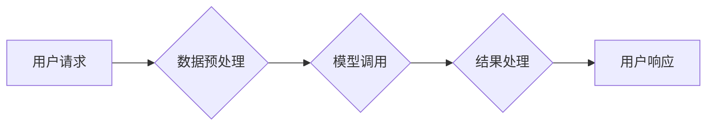

> 大模型、LLM接入、模块化设计、API接口、微服务架构、模型部署、性能优化、安全保障

## 1. 背景介绍

近年来，大语言模型（LLMs）在自然语言处理领域取得了突破性的进展，展现出强大的文本生成、理解、翻译等能力。这些模型的出现为各种应用场景带来了新的可能性，例如智能客服、内容创作、代码生成等。然而，直接将大型模型部署到生产环境中存在一些挑战，例如模型规模庞大、推理速度慢、资源消耗高、安全风险等。为了解决这些问题，我们需要设计高效、灵活、安全的LLM接入模块。

## 2. 核心概念与联系

LLM接入模块是一个将大型语言模型与应用程序或平台连接的中间层，它负责模型的调用、数据处理、结果返回等环节。其核心功能包括：

* **模型管理:**  管理多个模型的版本、配置和状态。
* **数据预处理:**  将用户请求转换为模型可理解的格式，并对数据进行清洗、格式化等处理。
* **模型调用:**  根据用户请求，调用相应的模型进行推理。
* **结果处理:**  将模型输出结果转换为用户可理解的格式，并进行必要的过滤、摘要等操作。
* **安全保障:**  确保模型调用过程的安全性和数据隐私。

**Mermaid 流程图**



## 3. 核心算法原理 & 具体操作步骤

### 3.1  算法原理概述

LLM接入模块的核心算法原理是基于**微服务架构**和**API接口**的设计。微服务架构将系统分解成多个独立的服务，每个服务负责特定的功能，并通过API接口进行通信。LLM接入模块可以将模型管理、数据预处理、模型调用、结果处理等功能拆分成不同的微服务，实现模块化设计。

### 3.2  算法步骤详解

1. **用户请求接收:**  接收到用户的请求，例如文本输入、语音输入等。
2. **数据预处理:**  将用户请求转换为模型可理解的格式，例如文本分词、词向量化等。
3. **模型选择:**  根据用户请求的类型和模型能力，选择合适的模型进行调用。
4. **模型调用:**  通过API接口调用模型进行推理，获取模型输出结果。
5. **结果处理:**  将模型输出结果转换为用户可理解的格式，例如文本生成、语音合成等。
6. **用户响应:**  将处理后的结果返回给用户。

### 3.3  算法优缺点

**优点:**

* **模块化设计:**  易于维护、扩展和升级。
* **高可扩展性:**  可以根据需要增加模型数量和服务实例。
* **高可用性:**  单个服务故障不会影响整个系统的运行。

**缺点:**

* **复杂性:**  需要设计和维护多个微服务和API接口。
* **性能优化:**  需要对各个服务进行性能优化，确保整体系统性能。

### 3.4  算法应用领域

LLM接入模块可以应用于各种领域，例如：

* **智能客服:**  提供智能问答、对话机器人等服务。
* **内容创作:**  生成文章、故事、诗歌等内容。
* **代码生成:**  根据自然语言描述生成代码。
* **翻译:**  实现文本和语音的翻译。

## 4. 数学模型和公式 & 详细讲解 & 举例说明

### 4.1  数学模型构建

LLM接入模块的数学模型主要基于**概率论**和**统计学**。模型的目标是学习输入文本和输出文本之间的概率关系，从而实现文本生成、理解等任务。

**举例说明:**

假设我们有一个简单的LLM模型，它学习生成英文单词。模型的输入是一个单词序列，输出是一个下一个单词的概率分布。我们可以使用**softmax函数**来计算每个单词的概率：

$$
P(w_t | w_{1:t-1}) = \frac{exp(s_t)}{\sum_{w \in V} exp(s_w)}
$$

其中：

* $P(w_t | w_{1:t-1})$ 是给定前 $t-1$ 个单词的情况下，第 $t$ 个单词的概率。
* $w_t$ 是第 $t$ 个单词。
* $w_{1:t-1}$ 是前 $t-1$ 个单词的序列。
* $V$ 是所有单词的集合。
* $s_t$ 是第 $t$ 个单词的得分，由模型计算得到。

### 4.2  公式推导过程

softmax函数的推导过程如下：

1. 首先，我们需要计算每个单词的得分。得分可以由模型的隐藏层输出计算得到。
2. 然后，我们将每个单词的得分进行指数变换，得到每个单词的概率。
3. 最后，我们将所有单词的概率进行归一化，使得它们的总和为1。

### 4.3  案例分析与讲解

在实际应用中，LLM模型的数学模型会更加复杂，例如使用**Transformer**架构、**BERT**模型等。这些模型的数学原理和公式更加复杂，需要深入学习和理解。

## 5. 项目实践：代码实例和详细解释说明

### 5.1  开发环境搭建

LLM接入模块的开发环境可以根据实际需求进行搭建。一般来说，需要准备以下环境：

* **操作系统:**  Linux、macOS 或 Windows。
* **编程语言:**  Python、Java 或其他支持微服务架构的语言。
* **框架:**  Flask、Django 或其他Web框架。
* **数据库:**  MySQL、PostgreSQL 或其他关系型数据库。
* **容器化工具:**  Docker 或 Kubernetes。

### 5.2  源代码详细实现

以下是一个使用Python和Flask框架实现LLM接入模块的简单示例代码：

```python
from flask import Flask, request, jsonify
import requests

app = Flask(__name__)

# 模型API接口地址
MODEL_API_URL = "http://your-model-api-url"

@app.route('/predict', methods=['POST'])
def predict():
    data = request.get_json()
    text = data['text']

    # 调用模型API进行推理
    response = requests.post(MODEL_API_URL, json={'text': text})
    result = response.json()

    # 返回结果
    return jsonify({'prediction': result['prediction']})

if __name__ == '__main__':
    app.run(debug=True)
```

### 5.3  代码解读与分析

* **模型API接口地址:**  `MODEL_API_URL` 变量存储了模型API接口地址。
* **predict() 函数:**  处理用户请求，调用模型API进行推理，并返回结果。
* **requests.post() 函数:**  发送POST请求到模型API接口，传递用户请求文本。
* **jsonify() 函数:**  将结果转换为JSON格式，返回给用户。

### 5.4  运行结果展示

当用户向LLM接入模块发送POST请求，例如：

```json
{
  "text": "Hello, world!"
}
```

LLM接入模块会调用模型API进行推理，并返回模型预测结果，例如：

```json
{
  "prediction": "Hello, world!"
}
```

## 6. 实际应用场景

### 6.1  智能客服

LLM接入模块可以用于构建智能客服系统，提供24/7的客户服务，解答常见问题，处理简单的请求。

### 6.2  内容创作

LLM接入模块可以用于生成各种类型的文本内容，例如文章、故事、诗歌、广告文案等，帮助内容创作者提高效率和创意。

### 6.3  代码生成

LLM接入模块可以根据自然语言描述生成代码，帮助程序员提高开发效率，减少代码编写错误。

### 6.4  未来应用展望

随着LLM技术的不断发展，LLM接入模块将在更多领域得到应用，例如：

* **个性化教育:**  根据学生的学习情况，提供个性化的学习内容和辅导。
* **医疗诊断:**  辅助医生进行疾病诊断，提高诊断准确率。
* **法律服务:**  帮助律师进行法律研究和案件分析。

## 7. 工具和资源推荐

### 7.1  学习资源推荐

* **论文:**  BERT: Pre-training of Deep Bidirectional Transformers for Language Understanding
* **博客:**  The Illustrated Transformer
* **在线课程:**  Deep Learning Specialization (Coursera)

### 7.2  开发工具推荐

* **框架:**  Flask、Django、FastAPI
* **容器化工具:**  Docker、Kubernetes
* **模型库:**  Hugging Face Transformers

### 7.3  相关论文推荐

* **BERT:**  Devlin, J., Chang, M. W., Lee, K., & Toutanova, K. (2018). Bert: Pre-training of deep bidirectional transformers for language understanding. arXiv preprint arXiv:1810.04805.
* **GPT-3:**  Brown, T. B., Mann, B., Ryder, N., Subbiah, M., Kaplan, J., Dhariwal, P., ... & Amodei, D. (2020). Language models are few-shot learners. arXiv preprint arXiv:2005.14165.

## 8. 总结：未来发展趋势与挑战

### 8.1  研究成果总结

LLM接入模块的发展取得了显著成果，为将大型语言模型应用于实际场景提供了有效解决方案。

### 8.2  未来发展趋势

未来LLM接入模块的发展趋势包括：

* **模型压缩与优化:**  开发更轻量级的模型，降低推理成本。
* **多模态融合:**  将文本、图像、音频等多模态数据融合到LLM接入模块中，实现更丰富的应用场景。
* **安全与隐私保护:**  加强模型安全性和数据隐私保护机制。

### 8.3  面临的挑战

LLM接入模块仍然面临一些挑战，例如：

* **模型性能:**  现有模型在某些任务上的性能仍然不足。
* **数据标注:**  高质量的数据标注是模型训练的关键，但标注成本较高。
* **可解释性:**  LLM模型的决策过程难以解释，这可能会影响用户信任度。

### 8.4  研究展望

未来，LLM接入模块的研究将继续深入，探索更有效的模型架构、训练方法和应用场景，推动人工智能技术向更广泛领域普及。

## 9. 附录：常见问题与解答

### 9.1  常见问题

* **如何选择合适的LLM模型？**

选择合适的LLM模型需要根据具体的应用场景和需求进行评估，例如模型大小、参数量、性能指标等。

* **如何部署LLM接入模块？**

LLM接入模块可以部署在云端、本地服务器或边缘设备上，具体部署方式取决于实际需求和资源条件。

* **如何保证LLM接入模块的安全性和数据隐私？**

需要采取相应的安全措施，例如数据加密、身份验证、权限控制等，确保模型和数据安全。

### 9.2  解答

* **如何选择合适的LLM模型？**

选择合适的LLM模型需要根据具体的应用场景和需求进行评估，例如模型大小、参数量、性能指标等。

* **如何部署LLM接入模块？**

LLM接入模块可以部署在云端、本地服务器或边缘设备上，具体部署方式取决于实际需求和资源条件。

* **如何保证LLM接入模块的安全性和数据隐私？**

需要采取相应的安全措施，例如数据加密、身份验证、权限控制等，确保模型和数据安全。


作者：禅与计算机程序设计艺术 / Zen and the Art of Computer Programming 
<end_of_turn>