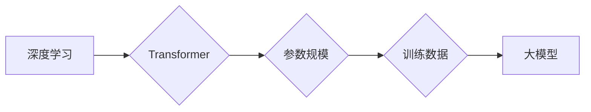

> 大模型、深度学习、Transformer、自然语言处理、计算机视觉、商业应用、模型训练、模型部署

## 1. 背景介绍

近年来，人工智能（AI）技术取得了飞速发展，其中大模型作为AI领域的重要突破口，展现出强大的学习和推理能力，在自然语言处理、计算机视觉、语音识别等领域取得了令人瞩目的成果。大模型是指参数规模庞大、训练数据海量的人工智能模型，其强大的能力源于海量数据的训练和复杂的模型架构。

大模型的出现，标志着人工智能进入了一个新的时代。它不仅推动了人工智能技术的进步，也为各行各业带来了新的机遇。从智能客服、自动翻译到药物研发、金融风险控制，大模型正在改变着我们的生活和工作方式。

## 2. 核心概念与联系

大模型的核心概念包括：

* **深度学习:** 大模型的训练基于深度学习算法，通过多层神经网络学习数据中的复杂模式和关系。
* **Transformer:** Transformer是一种新型的神经网络架构，其自注意力机制能够有效捕捉文本中的长距离依赖关系，成为大模型训练的基石。
* **参数规模:** 大模型的参数数量通常在数十亿甚至数千亿级别，庞大的参数量使得模型能够学习更复杂的知识和规律。
* **训练数据:** 大模型的训练需要海量的数据，数据质量和规模直接影响模型的性能。

**Mermaid 流程图:**



## 3. 核心算法原理 & 具体操作步骤

### 3.1  算法原理概述

大模型的训练主要基于深度学习算法，其中Transformer架构是目前主流的模型结构。Transformer通过自注意力机制和多头注意力机制，能够有效捕捉文本中的长距离依赖关系，提升模型的理解和生成能力。

### 3.2  算法步骤详解

大模型的训练过程可以概括为以下步骤：

1. **数据预处理:** 将原始数据进行清洗、格式化和编码，使其能够被模型理解。
2. **模型构建:** 根据预设的架构，搭建深度学习模型，例如Transformer模型。
3. **模型训练:** 使用训练数据，通过反向传播算法，调整模型参数，使其能够准确预测目标输出。
4. **模型评估:** 使用测试数据，评估模型的性能，例如准确率、召回率等指标。
5. **模型调优:** 根据评估结果，调整模型参数、训练策略等，进一步提升模型性能。

### 3.3  算法优缺点

**优点:**

* 强大的学习能力：大模型能够学习海量数据的复杂模式和关系，展现出强大的泛化能力。
* 灵活的应用场景：大模型可以应用于多种任务，例如自然语言处理、计算机视觉、语音识别等。
* 持续的进步：随着技术的进步和数据量的增加，大模型的性能将不断提升。

**缺点:**

* 训练成本高昂：大模型的训练需要大量的计算资源和时间，成本较高。
* 数据依赖性强：大模型的性能直接取决于训练数据的质量和规模。
* 可解释性差：大模型的决策过程复杂，难以解释其背后的逻辑。

### 3.4  算法应用领域

大模型在以下领域具有广泛的应用前景：

* **自然语言处理:** 机器翻译、文本摘要、问答系统、对话系统等。
* **计算机视觉:** 图像识别、物体检测、图像生成等。
* **语音识别:** 语音转文本、语音合成等。
* **药物研发:** 药物发现、药物设计等。
* **金融风险控制:** 欺诈检测、风险评估等。

## 4. 数学模型和公式 & 详细讲解 & 举例说明

### 4.1  数学模型构建

大模型的训练基于深度学习算法，其核心是神经网络模型。神经网络模型由多个层组成，每层包含多个神经元。神经元之间通过权重连接，传递信息。

**公式:**

$$
y = f(W x + b)
$$

其中：

* $y$ 是输出值
* $x$ 是输入值
* $W$ 是权重矩阵
* $b$ 是偏置向量
* $f$ 是激活函数

### 4.2  公式推导过程

深度学习模型的训练过程是通过反向传播算法来调整模型参数的。反向传播算法的核心思想是：

1. 计算模型输出与真实值的误差。
2. 根据误差，反向传播梯度，更新模型参数。

**梯度下降算法:**

$$
\theta = \theta - \alpha \nabla J(\theta)
$$

其中：

* $\theta$ 是模型参数
* $\alpha$ 是学习率
* $\nabla J(\theta)$ 是损失函数 $J(\theta)$ 的梯度

### 4.3  案例分析与讲解

例如，在机器翻译任务中，大模型可以将源语言文本翻译成目标语言文本。模型的输入是源语言文本，输出是目标语言文本。模型的训练目标是将源语言文本与目标语言文本之间的误差最小化。

## 5. 项目实践：代码实例和详细解释说明

### 5.1  开发环境搭建

大模型的开发环境通常需要强大的计算资源，例如GPU。常用的开发框架包括TensorFlow、PyTorch等。

### 5.2  源代码详细实现

以下是一个使用PyTorch框架训练BERT模型的简单代码示例：

```python
import torch
from transformers import BertModel, BertTokenizer

# 加载预训练模型和词典
model = BertModel.from_pretrained('bert-base-uncased')
tokenizer = BertTokenizer.from_pretrained('bert-base-uncased')

# 定义输入数据
input_ids = torch.tensor([[101, 20, 30, 40, 102]])

# 将输入数据转换为模型可识别的格式
outputs = model(input_ids)

# 打印模型输出
print(outputs)
```

### 5.3  代码解读与分析

这段代码首先加载了预训练的BERT模型和词典。然后，定义了一个输入数据，并将其转换为模型可识别的格式。最后，调用模型进行推理，并打印模型输出。

### 5.4  运行结果展示

运行这段代码后，会输出模型的输出结果，例如隐藏层表示、句子嵌入等。

## 6. 实际应用场景

### 6.1  智能客服

大模型可以用于构建智能客服系统，自动回答用户的问题，提供24小时不间断服务。

### 6.2  自动翻译

大模型可以用于机器翻译，将文本从一种语言翻译成另一种语言。

### 6.3  文本摘要

大模型可以用于自动生成文本摘要，提取文本的关键信息。

### 6.4  未来应用展望

大模型的应用场景还在不断扩展，未来将应用于更多领域，例如：

* **个性化推荐:** 根据用户的兴趣和行为，推荐个性化的商品、服务和内容。
* **医疗诊断:** 辅助医生进行疾病诊断，提高诊断准确率。
* **教育教学:** 提供个性化的学习辅导，提高学习效率。

## 7. 工具和资源推荐

### 7.1  学习资源推荐

* **书籍:**
    * 《深度学习》
    * 《自然语言处理》
    * 《Transformer模型》
* **在线课程:**
    * Coursera
    * edX
    * fast.ai

### 7.2  开发工具推荐

* **TensorFlow:** 开源深度学习框架
* **PyTorch:** 开源深度学习框架
* **HuggingFace:** 提供预训练模型和工具

### 7.3  相关论文推荐

* **Attention Is All You Need:** https://arxiv.org/abs/1706.03762
* **BERT: Pre-training of Deep Bidirectional Transformers for Language Understanding:** https://arxiv.org/abs/1810.04805

## 8. 总结：未来发展趋势与挑战

### 8.1  研究成果总结

大模型在人工智能领域取得了显著的成果，展现出强大的学习和推理能力，为各行各业带来了新的机遇。

### 8.2  未来发展趋势

大模型的发展趋势包括：

* **模型规模的进一步扩大:** 随着计算资源的提升，大模型的规模将继续扩大，学习能力将进一步提升。
* **模型架构的创新:** 研究人员将继续探索新的模型架构，提升模型的效率和性能。
* **多模态学习:** 大模型将融合多模态数据，例如文本、图像、音频等，实现更全面的理解和生成。

### 8.3  面临的挑战

大模型的发展也面临着一些挑战：

* **训练成本高昂:** 大模型的训练需要大量的计算资源和时间，成本较高。
* **数据依赖性强:** 大模型的性能直接取决于训练数据的质量和规模。
* **可解释性差:** 大模型的决策过程复杂，难以解释其背后的逻辑。

### 8.4  研究展望

未来，研究人员将继续探索大模型的潜力，解决其面临的挑战，推动大模型技术的发展和应用。

## 9. 附录：常见问题与解答

**常见问题:**

* **什么是大模型？**

大模型是指参数规模庞大、训练数据海量的人工智能模型。

* **大模型的应用场景有哪些？**

大模型可以应用于自然语言处理、计算机视觉、语音识别等多种领域。

* **大模型的训练成本高昂吗？**

是的，大模型的训练需要大量的计算资源和时间，成本较高。

* **如何评估大模型的性能？**

大模型的性能可以通过准确率、召回率等指标进行评估。

**解答:**

* **什么是大模型？**

大模型是指参数规模庞大、训练数据海量的人工智能模型。

* **大模型的应用场景有哪些？**

大模型可以应用于自然语言处理、计算机视觉、语音识别等多种领域。

* **大模型的训练成本高昂吗？**

是的，大模型的训练需要大量的计算资源和时间，成本较高。

* **如何评估大模型的性能？**

大模型的性能可以通过准确率、召回率等指标进行评估。


作者：禅与计算机程序设计艺术 / Zen and the Art of Computer Programming 
<end_of_turn>