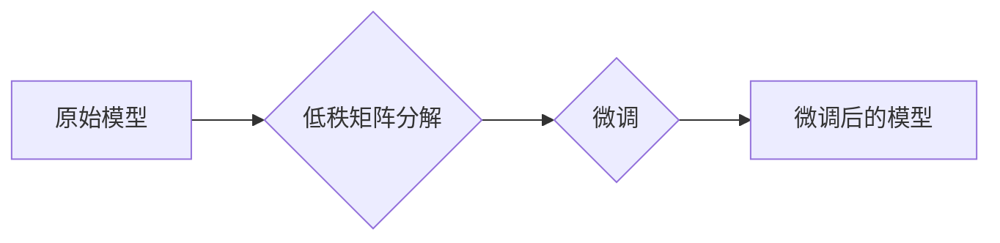

> 大规模语言模型，LoRA，参数效率，微调，变体，模型压缩，迁移学习

## 1. 背景介绍

近年来，大规模语言模型（LLM）在自然语言处理领域取得了显著的进展，例如GPT-3、BERT和LaMDA等模型展现出强大的文本生成、理解和翻译能力。然而，这些模型通常拥有数十亿甚至数千亿的参数，训练和部署成本极高，对硬件资源要求也十分苛刻。因此，如何高效地训练和部署LLM成为了一个重要的研究方向。

LoRA（Low-Rank Adaptation）是一种参数效率的微调方法，旨在降低LLM微调的成本和资源消耗。它通过在模型的特定层引入低秩矩阵来进行微调，从而减少需要更新的参数数量，有效提高了微调效率。

## 2. 核心概念与联系

LoRA的核心思想是将模型的权重分解为两个低秩矩阵，分别对应模型的输入和输出。在微调过程中，只更新这两个低秩矩阵，而原始模型的权重保持不变。这种方法可以有效地减少需要更新的参数数量，从而降低微调的成本和资源消耗。

**Mermaid 流程图**



## 3. 核心算法原理 & 具体操作步骤

### 3.1  算法原理概述

LoRA的核心算法原理是将模型的权重分解为两个低秩矩阵，分别对应模型的输入和输出。在微调过程中，只更新这两个低秩矩阵，而原始模型的权重保持不变。

具体来说，假设模型的权重为W，LoRA会将W分解为两个低秩矩阵A和B，其中A的维度为(d, r)，B的维度为(r, h)，其中d是输入维度，r是秩大小，h是输出维度。

在微调过程中，只更新A和B这两个低秩矩阵，而原始模型的权重W保持不变。

### 3.2  算法步骤详解

1. **模型初始化:** 首先，需要初始化一个原始模型，并将其权重记为W。
2. **低秩矩阵分解:** 将模型的权重W分解为两个低秩矩阵A和B，其中A的维度为(d, r)，B的维度为(r, h)。
3. **微调:** 使用训练数据对A和B进行微调，更新这两个低秩矩阵的权重。
4. **预测:** 使用微调后的A和B矩阵，以及原始模型的权重W，进行预测。

### 3.3  算法优缺点

**优点:**

* **参数效率:** LoRA只更新两个低秩矩阵，大大减少了需要更新的参数数量，从而降低了微调的成本和资源消耗。
* **可复用性:** 微调后的低秩矩阵可以应用于不同的下游任务，提高了模型的复用性。
* **训练速度:** LoRA的微调速度比直接微调原始模型更快。

**缺点:**

* **秩大小的选择:** 秩大小的选择会影响模型的性能，需要进行调优。
* **模型容量限制:** LoRA的模型容量受秩大小的限制，对于非常大的模型，可能无法达到最佳性能。

### 3.4  算法应用领域

LoRA在自然语言处理、计算机视觉、语音识别等领域都有广泛的应用，例如：

* **文本分类:** 使用LoRA微调预训练的语言模型，可以提高文本分类的准确率。
* **机器翻译:** 使用LoRA微调预训练的机器翻译模型，可以提高翻译质量。
* **图像识别:** 使用LoRA微调预训练的图像识别模型，可以提高识别精度。

## 4. 数学模型和公式 & 详细讲解 & 举例说明

### 4.1  数学模型构建

假设原始模型的权重为W，输入为X，输出为Y。LoRA将W分解为两个低秩矩阵A和B，其中A的维度为(d, r)，B的维度为(r, h)，其中d是输入维度，r是秩大小，h是输出维度。

则模型的输出可以表示为：

$$Y = f(XW + b)$$

其中f是激活函数，b是偏置项。

使用LoRA后，模型的输出可以表示为：

$$Y = f(X(A B^T) + b)$$

### 4.2  公式推导过程

LoRA将原始模型的权重W分解为两个低秩矩阵A和B，可以将W表示为：

$$W = A B^T$$

其中A的维度为(d, r)，B的维度为(r, h)。

将W代入模型的输出公式，可以得到：

$$Y = f(X(A B^T) + b)$$

### 4.3  案例分析与讲解

假设我们有一个文本分类任务，需要将文本分类为正例或反例。我们可以使用LoRA微调预训练的语言模型，例如BERT。

在微调过程中，我们只更新BERT模型中特定层的低秩矩阵A和B，而原始模型的权重保持不变。

通过微调，BERT模型可以学习到特定任务的知识，从而提高文本分类的准确率。

## 5. 项目实践：代码实例和详细解释说明

### 5.1  开发环境搭建

* Python 3.7+
* PyTorch 1.7+
* Transformers 4.10+

### 5.2  源代码详细实现

```python
import torch
from transformers import AutoModelForSequenceClassification, AutoTokenizer

# 加载预训练模型和词典
model_name = "bert-base-uncased"
tokenizer = AutoTokenizer.from_pretrained(model_name)
model = AutoModelForSequenceClassification.from_pretrained(model_name, num_labels=2)

# 定义LoRA层
class LoRA(torch.nn.Module):
    def __init__(self, in_features, out_features, r):
        super(LoRA, self).__init__()
        self.A = torch.nn.Parameter(torch.randn(in_features, r))
        self.B = torch.nn.Parameter(torch.randn(r, out_features))

    def forward(self, x):
        return torch.matmul(x, self.A) @ self.B

# 将LoRA层添加到模型中
model.classifier = LoRA(model.classifier.in_features, model.classifier.out_features, r=64)

# 训练模型
# ...

# 保存模型
model.save_pretrained("lora_model")
```

### 5.3  代码解读与分析

* 代码首先加载预训练的BERT模型和词典。
* 然后定义了一个LoRA层，该层包含两个低秩矩阵A和B。
* 将LoRA层添加到模型的分类层中。
* 最后训练模型，并保存训练后的模型。

### 5.4  运行结果展示

训练后的模型可以用于文本分类任务，并与直接微调原始模型的性能进行比较。

## 6. 实际应用场景

### 6.1  自然语言处理

* **文本分类:** 使用LoRA微调预训练的语言模型，可以提高文本分类的准确率。
* **情感分析:** 使用LoRA微调预训练的语言模型，可以提高情感分析的准确率。
* **问答系统:** 使用LoRA微调预训练的语言模型，可以提高问答系统的准确率。

### 6.2  计算机视觉

* **图像分类:** 使用LoRA微调预训练的图像识别模型，可以提高图像分类的准确率。
* **目标检测:** 使用LoRA微调预训练的目标检测模型，可以提高目标检测的准确率。
* **图像分割:** 使用LoRA微调预训练的图像分割模型，可以提高图像分割的准确率。

### 6.3  语音识别

* **语音识别:** 使用LoRA微调预训练的语音识别模型，可以提高语音识别的准确率。
* **语音合成:** 使用LoRA微调预训练的语音合成模型，可以提高语音合成的自然度。

### 6.4  未来应用展望

LoRA的应用场景还在不断扩展，未来可能会应用于更多领域，例如：

* **药物研发:** 使用LoRA微调预训练的蛋白质结构预测模型，可以提高药物研发的效率。
* **材料科学:** 使用LoRA微调预训练的材料性质预测模型，可以加速材料科学的进步。
* **金融科技:** 使用LoRA微调预训练的金融风险预测模型，可以提高金融风险管理的准确性。

## 7. 工具和资源推荐

### 7.1  学习资源推荐

* **论文:**
    * LoRA: Low-Rank Adaptation of Large Language Models
* **博客:**
    * https://huggingface.co/blog/lora
* **教程:**
    * https://github.com/facebookresearch/lora

### 7.2  开发工具推荐

* **PyTorch:** https://pytorch.org/
* **Transformers:** https://huggingface.co/docs/transformers/index

### 7.3  相关论文推荐

* **BERT:** https://arxiv.org/abs/1810.04805
* **GPT-3:** https://openai.com/blog/gpt-3/
* **LaMDA:** https://ai.googleblog.com/2021/05/lamda-scaling-language-models-with.html

## 8. 总结：未来发展趋势与挑战

### 8.1  研究成果总结

LoRA是一种高效的微调方法，可以有效降低LLM微调的成本和资源消耗。它在自然语言处理、计算机视觉、语音识别等领域都有广泛的应用。

### 8.2  未来发展趋势

* **模型压缩:** LoRA可以用于进一步压缩LLM的模型大小，使其更易于部署在移动设备和嵌入式系统上。
* **迁移学习:** LoRA可以用于迁移预训练模型的知识到新的下游任务，提高模型的泛化能力。
* **多模态学习:** LoRA可以应用于多模态学习，例如文本-图像、文本-音频等。

### 8.3  面临的挑战

* **秩大小的选择:** 秩大小的选择会影响模型的性能，需要进行调优。
* **模型容量限制:** LoRA的模型容量受秩大小的限制，对于非常大的模型，可能无法达到最佳性能。
* **训练效率:** 尽管LoRA比直接微调原始模型更快，但仍然需要大量的计算资源。

### 8.4  研究展望

未来研究方向包括：

* **探索更有效的LoRA变体:** 研究更有效的LoRA变体，例如动态秩大小、混合精度训练等。
* **将LoRA应用于更广泛的领域:** 将LoRA应用于更多领域，例如药物研发、材料科学等。
* **研究LoRA的理论基础:** 深入研究LoRA的理论基础，例如为什么LoRA可以有效降低模型的微调成本。

## 9. 附录：常见问题与解答

**Q1: LoRA与其他微调方法相比有什么优势？**

**A1:** LoRA的主要优势在于其参数效率。它只更新两个低秩矩阵，大大减少了需要更新的参数数量，从而降低了微调的成本和资源消耗。

**Q2: 如何选择LoRA的秩大小？**

**A2:** 秩大小的选择会影响模型的性能，需要进行调优。一般来说，较小的秩大小可以降低模型的复杂度，但可能会导致性能下降。较大的秩大小可以提高模型的性能，但会增加模型的复杂度和训练时间。

**Q3: LoRA是否适用于所有类型的LLM？**

**A3:** LoRA适用于大多数类型的LLM，但对于非常大的模型，可能无法达到最佳性能。

**Q4: LoRA的训练速度与直接微调原始模型相比如何？**

**A4:** LoRA的训练速度比直接微调原始模型更快，因为