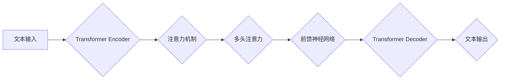

> 大语言模型、Transformer、深度学习、自然语言处理、文本生成、机器学习、BERT、GPT

## 1. 背景介绍

近年来，深度学习技术取得了飞速发展，特别是Transformer模型的出现，为自然语言处理（NLP）领域带来了革命性的变革。大语言模型（LLM）作为深度学习在NLP领域的顶尖成果，展现出强大的文本理解和生成能力，在文本分类、机器翻译、问答系统、代码生成等领域取得了令人瞩目的成就。

LLM的出现，标志着人工智能迈向更智能、更人性化的方向。它不仅能够理解和生成人类语言，还能进行复杂的逻辑推理、创意写作、代码编写等任务，为我们带来了无限的可能性。

然而，LLM的训练和应用也面临着诸多挑战，例如：

* **海量数据需求:** LLM的训练需要大量的文本数据，这对于数据获取、存储和处理提出了巨大的挑战。
* **高计算资源消耗:** LLM的训练过程需要大量的计算资源，这对于硬件设施和能源消耗提出了高要求。
* **模型可解释性问题:** LLM的决策过程往往是复杂的，难以理解其背后的逻辑，这对于模型的信任度和安全性提出了挑战。
* **伦理和社会影响:** LLM的应用可能带来一些伦理和社会问题，例如信息操纵、隐私泄露、工作岗位替代等，需要我们认真思考和应对。

## 2. 核心概念与联系

大语言模型的核心概念包括：

* **Transformer:** Transformer是一种新型的神经网络架构，它利用注意力机制来捕捉文本序列中的长距离依赖关系，为LLM的训练提供了强大的能力。
* **深度学习:** 深度学习是一种机器学习方法，它利用多层神经网络来学习数据的复杂特征，为LLM的文本理解和生成能力提供了基础。
* **自然语言处理 (NLP):** NLP是计算机科学的一个分支，它致力于使计算机能够理解和处理人类语言，为LLM的应用提供了理论基础和应用场景。

**Mermaid 流程图:**



## 3. 核心算法原理 & 具体操作步骤

### 3.1  算法原理概述

Transformer模型的核心是注意力机制，它能够捕捉文本序列中不同词语之间的关系，并赋予它们不同的权重。通过多头注意力机制，Transformer模型可以学习到更丰富的文本语义信息。

### 3.2  算法步骤详解

1. **词嵌入:** 将输入的文本序列中的每个词语映射到一个低维向量空间中，每个词语都对应一个唯一的向量表示。
2. **位置编码:** 为每个词语添加位置信息，因为Transformer模型没有循环结构，无法直接捕捉词语的顺序信息。
3. **编码器:** 将词嵌入和位置编码输入到编码器中，编码器由多个Transformer层组成，每个层包含多头注意力机制和前馈神经网络。
4. **解码器:** 将编码器的输出作为输入，解码器也由多个Transformer层组成，每个层包含多头注意力机制和前馈神经网络。
5. **输出层:** 将解码器的输出输入到输出层，输出层是一个线性层，用于将向量表示映射到词汇表中的每个词语的概率分布。

### 3.3  算法优缺点

**优点:**

* 能够捕捉长距离依赖关系，提升文本理解能力。
* 并行训练效率高，训练速度快。
* 可迁移性强，可以应用于多种NLP任务。

**缺点:**

* 参数量大，训练成本高。
* 对训练数据质量要求高。
* 模型可解释性较差。

### 3.4  算法应用领域

* 文本分类
* 机器翻译
* 问答系统
* 代码生成
* 文本摘要
* 情感分析
* 对话系统

## 4. 数学模型和公式 & 详细讲解 & 举例说明

### 4.1  数学模型构建

Transformer模型的数学模型主要包括以下几个部分：

* **词嵌入:** 使用词向量表示每个词语，例如Word2Vec或GloVe。
* **注意力机制:** 使用注意力权重来计算每个词语与其他词语之间的相关性。
* **多头注意力:** 使用多个注意力头来学习不同类型的语义信息。
* **前馈神经网络:** 使用全连接神经网络来处理每个词语的特征表示。

### 4.2  公式推导过程

**注意力机制公式:**

$$
\text{Attention}(Q, K, V) = \text{softmax}\left(\frac{Q K^T}{\sqrt{d_k}}\right) V
$$

其中：

* $Q$：查询矩阵
* $K$：键矩阵
* $V$：值矩阵
* $d_k$：键向量的维度
* $\text{softmax}$：softmax函数

**多头注意力公式:**

$$
\text{MultiHeadAttention}(Q, K, V) = \text{Concat}(head_1, head_2, ..., head_h) W_o
$$

其中：

* $head_i$：第 $i$ 个注意力头的输出
* $h$：注意力头的数量
* $W_o$：最终输出层的权重矩阵

### 4.3  案例分析与讲解

例如，在机器翻译任务中，Transformer模型可以将源语言的句子编码成一个向量表示，然后使用解码器将这个向量表示翻译成目标语言的句子。

## 5. 项目实践：代码实例和详细解释说明

### 5.1  开发环境搭建

* Python 3.7+
* PyTorch 1.7+
* CUDA 10.2+

### 5.2  源代码详细实现

```python
import torch
import torch.nn as nn

class Transformer(nn.Module):
    def __init__(self, vocab_size, embedding_dim, num_heads, num_layers):
        super(Transformer, self).__init__()
        self.embedding = nn.Embedding(vocab_size, embedding_dim)
        self.encoder = nn.TransformerEncoder(nn.TransformerEncoderLayer(embedding_dim, num_heads), num_layers)
        self.decoder = nn.TransformerDecoder(nn.TransformerDecoderLayer(embedding_dim, num_heads), num_layers)
        self.linear = nn.Linear(embedding_dim, vocab_size)

    def forward(self, src, tgt):
        src = self.embedding(src)
        tgt = self.embedding(tgt)
        src = self.encoder(src)
        tgt = self.decoder(tgt, src)
        output = self.linear(tgt)
        return output
```

### 5.3  代码解读与分析

* `__init__`方法：初始化模型参数，包括词嵌入层、编码器、解码器和输出层。
* `forward`方法：定义模型的正向传播过程，将输入的源语言和目标语言序列分别嵌入到向量空间中，然后通过编码器和解码器进行处理，最后输出目标语言的预测概率分布。

### 5.4  运行结果展示

通过训练和测试，可以评估模型的性能，例如准确率、BLEU分数等。

## 6. 实际应用场景

LLM在各个领域都有着广泛的应用场景：

* **聊天机器人:** 构建更智能、更自然的对话系统。
* **文本生成:** 自动生成新闻报道、小说、诗歌等文本内容。
* **机器翻译:** 实现更高效、更准确的语言翻译。
* **代码生成:** 自动生成代码，提高开发效率。
* **问答系统:** 构建更智能的问答系统，能够理解复杂的问题并给出准确的答案。

### 6.4  未来应用展望

随着LLM技术的不断发展，未来将有更多新的应用场景出现，例如：

* **个性化教育:** 根据学生的学习情况，提供个性化的学习内容和辅导。
* **医疗诊断:** 辅助医生进行疾病诊断，提高诊断准确率。
* **法律服务:** 自动分析法律文件，提供法律建议。

## 7. 工具和资源推荐

### 7.1  学习资源推荐

* **书籍:**
    * 《深度学习》
    * 《自然语言处理》
    * 《Transformer模型详解》
* **在线课程:**
    * Coursera: 深度学习
    * Udacity: 自然语言处理
    * fast.ai: 深度学习

### 7.2  开发工具推荐

* **PyTorch:** 深度学习框架
* **TensorFlow:** 深度学习框架
* **HuggingFace:** 预训练模型库

### 7.3  相关论文推荐

* 《Attention Is All You Need》
* 《BERT: Pre-training of Deep Bidirectional Transformers for Language Understanding》
* 《GPT-3: Language Models are Few-Shot Learners》

## 8. 总结：未来发展趋势与挑战

### 8.1  研究成果总结

LLM取得了显著的成果，在文本理解和生成方面展现出强大的能力，为人工智能的发展做出了重要贡献。

### 8.2  未来发展趋势

* **模型规模更大:** 训练更大规模的LLM，提升模型的性能和能力。
* **模型效率更高:** 探索更有效的训练方法和模型架构，降低训练成本和时间。
* **模型可解释性更强:** 研究更有效的模型解释方法，提高模型的透明度和可信度。
* **多模态LLM:** 将文本与其他模态（例如图像、音频）融合，构建更全面的智能系统。

### 8.3  面临的挑战

* **数据获取和隐私问题:** 训练LLM需要海量数据，如何获取高质量数据并保护用户隐私是一个挑战。
* **计算资源消耗:** 训练LLM需要大量的计算资源，如何降低训练成本是一个重要问题。
* **模型安全性和可靠性:** LLM可能存在安全漏洞和偏差问题，需要加强模型的安全性和可靠性。
* **伦理和社会影响:** LLM的应用可能带来一些伦理和社会问题，需要我们认真思考和应对。

### 8.4  研究展望

未来，LLM研究将继续朝着更智能、更安全、更可解释的方向发展，为人类社会带来更多福祉。

## 9. 附录：常见问题与解答

* **什么是LLM？**

LLM是指大规模语言模型，它是一种能够理解和生成人类语言的深度学习模型。

* **LLM的训练数据是什么？**

LLM的训练数据通常是大量的文本数据，例如书籍、文章、网站内容等。

* **LLM的应用场景有哪些？**

LLM的应用场景非常广泛，例如聊天机器人、文本生成、机器翻译、代码生成等。

* **如何训练一个LLM？**

训练一个LLM需要大量的计算资源和时间，通常需要使用GPU进行训练。

* **LLM的未来发展趋势是什么？**

LLM的未来发展趋势是模型规模更大、效率更高、可解释性更强、多模态化。


作者：禅与计算机程序设计艺术 / Zen and the Art of Computer Programming 
<end_of_turn>