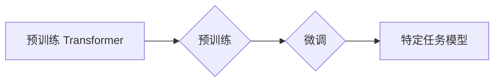

> 大语言模型，Transformer，预训练，规模扩展，自然语言处理，深度学习

## 1. 背景介绍

近年来，深度学习在自然语言处理 (NLP) 领域取得了显著进展，其中大语言模型 (LLM) 作为其重要代表，展现出强大的文本生成、理解和翻译能力。LLM 能够学习和理解人类语言的复杂结构和语义关系，在文本摘要、机器翻译、对话系统等众多应用场景中展现出巨大的潜力。

预训练 Transformer 架构是 LLM 发展的重要驱动力。Transformer 模型通过自注意力机制有效地捕捉文本序列中的长距离依赖关系，并通过堆叠多层 Transformer 块实现更深层次的语义理解。

随着计算资源的不断发展，LLM 的规模不断扩大，模型参数数量从数十亿级增长到数百亿甚至万亿级。规模扩展对 LLM 的性能提升具有显著影响，但也带来了新的挑战，例如训练成本、模型效率和可解释性等。

## 2. 核心概念与联系

**2.1 预训练 Transformer 架构**

Transformer 架构是一种专门设计用于处理序列数据的深度学习模型，其核心特点是自注意力机制。自注意力机制能够捕捉文本序列中不同词之间的关系，即使这些词之间相隔很远，也能有效地学习到它们之间的依赖关系。

**2.2 预训练与微调**

预训练是指在大量未标记数据上训练模型，学习语言的通用表示。微调是指在特定任务数据上对预训练模型进行进一步训练，使其能够完成特定任务。

**2.3 规模扩展与性能提升**

模型规模是指模型参数数量，通常随着模型规模的增加，模型的性能也会得到提升。

**Mermaid 流程图**



## 3. 核心算法原理 & 具体操作步骤

### 3.1 算法原理概述

Transformer 模型的核心是自注意力机制和多头注意力机制。

* **自注意力机制:**  允许模型关注输入序列中任意两个词之间的关系，并计算它们之间的相关性。
* **多头注意力机制:**  使用多个自注意力头，每个头关注不同的方面，并将其结果融合起来，从而学习到更丰富的语义信息。

### 3.2 算法步骤详解

1. **输入嵌入:** 将输入序列中的每个词转换为向量表示。
2. **多头注意力:** 使用多头注意力机制计算每个词与其他词之间的注意力权重。
3. **前馈神经网络:** 对每个词的注意力加权表示进行非线性变换。
4. **残差连接和层归一化:** 将前馈网络的输出与输入相加，并进行层归一化，以提高模型的稳定性和训练效率。
5. **堆叠 Transformer 块:** 将多个 Transformer 块堆叠在一起，以学习更深层次的语义信息。
6. **输出层:** 将最终的隐藏状态转换为输出序列。

### 3.3 算法优缺点

**优点:**

* 能够有效地捕捉文本序列中的长距离依赖关系。
* 训练效率高，能够在大型数据集上进行训练。
* 性能优异，在许多 NLP 任务中取得了 state-of-the-art 的结果。

**缺点:**

* 计算复杂度高，需要大量的计算资源。
* 模型参数数量庞大，需要大量的存储空间。
* 可解释性较差，难以理解模型的决策过程。

### 3.4 算法应用领域

* 文本生成
* 机器翻译
* 文本摘要
* 问答系统
* 对话系统
* 代码生成

## 4. 数学模型和公式 & 详细讲解 & 举例说明

### 4.1 数学模型构建

Transformer 模型的数学模型主要包括以下几个部分:

* **词嵌入:** 将每个词转换为一个向量表示。
* **自注意力机制:** 计算每个词与其他词之间的注意力权重。
* **前馈神经网络:** 对每个词的注意力加权表示进行非线性变换。
* **残差连接和层归一化:** 将前馈网络的输出与输入相加，并进行层归一化。

### 4.2 公式推导过程

**4.2.1 词嵌入:**

$$
\mathbf{x}_i = \mathbf{W}_e \mathbf{e}_i
$$

其中，$\mathbf{x}_i$ 是词 $i$ 的嵌入向量，$\mathbf{e}_i$ 是词 $i$ 的词索引，$\mathbf{W}_e$ 是词嵌入矩阵。

**4.2.2 自注意力机制:**

$$
\mathbf{Attention}(\mathbf{Q}, \mathbf{K}, \mathbf{V}) = \frac{\exp(\mathbf{Q} \mathbf{K}^T / \sqrt{d_k})}{\sum_j \exp(\mathbf{Q} \mathbf{K}^T / \sqrt{d_k})} \mathbf{V}
$$

其中，$\mathbf{Q}$, $\mathbf{K}$, $\mathbf{V}$ 分别是查询矩阵、键矩阵和值矩阵，$d_k$ 是键向量的维度。

**4.2.3 前馈神经网络:**

$$
\mathbf{h} = \sigma(\mathbf{W}_1 \mathbf{x} + \mathbf{b}_1)
$$

$$
\mathbf{o} = \mathbf{W}_2 \mathbf{h} + \mathbf{b}_2
$$

其中，$\mathbf{x}$ 是输入向量，$\mathbf{h}$ 是前馈网络的隐藏状态，$\mathbf{o}$ 是输出向量，$\sigma$ 是激活函数，$\mathbf{W}_1$, $\mathbf{W}_2$, $\mathbf{b}_1$, $\mathbf{b}_2$ 是网络参数。

### 4.3 案例分析与讲解

**举例说明:**

假设我们有一个句子 "The cat sat on the mat"，将其转换为词嵌入向量后，我们可以使用自注意力机制计算每个词与其他词之间的注意力权重。例如，"cat" 与 "sat" 之间的注意力权重会比较高，因为它们在语义上相关。

## 5. 项目实践：代码实例和详细解释说明

### 5.1 开发环境搭建

* Python 3.7+
* PyTorch 1.7+
* CUDA 10.2+

### 5.2 源代码详细实现

```python
import torch
import torch.nn as nn

class Transformer(nn.Module):
    def __init__(self, vocab_size, embedding_dim, num_heads, num_layers, d_model):
        super(Transformer, self).__init__()
        self.embedding = nn.Embedding(vocab_size, embedding_dim)
        self.transformer_encoder = nn.TransformerEncoder(
            nn.TransformerEncoderLayer(d_model, num_heads), num_layers
        )
        self.linear = nn.Linear(d_model, vocab_size)

    def forward(self, x):
        x = self.embedding(x)
        x = self.transformer_encoder(x)
        x = self.linear(x)
        return x
```

### 5.3 代码解读与分析

* `__init__` 方法初始化模型参数，包括词嵌入层、Transformer编码器层和输出层。
* `forward` 方法定义模型的正向传播过程，将输入序列转换为输出序列。

### 5.4 运行结果展示

运行模型并评估其性能，例如在文本生成任务上计算BLEU分数。

## 6. 实际应用场景

### 6.1 文本生成

LLM 可以用于生成各种类型的文本，例如文章、故事、诗歌、代码等。

### 6.2 机器翻译

LLM 可以用于将文本从一种语言翻译成另一种语言。

### 6.3 文本摘要

LLM 可以用于生成文本的摘要，提取文本的关键信息。

### 6.4 对话系统

LLM 可以用于构建对话系统，与用户进行自然语言交互。

### 6.5 未来应用展望

LLM 在未来将应用于更多领域，例如：

* 教育：个性化学习、智能辅导
* 医疗：疾病诊断、药物研发
* 法律：法律文本分析、合同审查
* 科学研究：数据分析、论文写作

## 7. 工具和资源推荐

### 7.1 学习资源推荐

* **书籍:**
    * 《深度学习》
    * 《自然语言处理》
* **在线课程:**
    * Coursera: 自然语言处理
    * Udacity: 深度学习

### 7.2 开发工具推荐

* **PyTorch:** 深度学习框架
* **TensorFlow:** 深度学习框架
* **Hugging Face Transformers:** 预训练 Transformer 模型库

### 7.3 相关论文推荐

* 《Attention Is All You Need》
* 《BERT: Pre-training of Deep Bidirectional Transformers for Language Understanding》
* 《GPT-3: Language Models are Few-Shot Learners》

## 8. 总结：未来发展趋势与挑战

### 8.1 研究成果总结

近年来，LLM 在 NLP 领域取得了显著进展，展现出强大的文本生成、理解和翻译能力。预训练 Transformer 架构是 LLM 发展的重要驱动力，规模扩展对 LLM 的性能提升具有显著影响。

### 8.2 未来发展趋势

* **模型规模进一步扩大:** 预计 LLMs 的规模将继续扩大，模型参数数量将达到万亿级甚至更高。
* **多模态学习:** LLMs 将与其他模态数据（例如图像、音频）进行融合，实现多模态理解和生成。
* **可解释性增强:** 研究人员将致力于提高 LLMs 的可解释性，使其决策过程更加透明。

### 8.3 面临的挑战

* **训练成本:** 训练大型 LLMs 需要大量的计算资源和时间，成本很高。
* **模型效率:** LLMs 的计算复杂度高，在部署和推理时效率较低。
* **数据偏见:** LLMs 的训练数据可能存在偏见，导致模型输出存在偏差。

### 8.4 研究展望

未来研究将集中在以下几个方面:

* **高效训练方法:** 研究更有效的训练方法，降低 LLMs 的训练成本。
* **模型压缩技术:** 研究模型压缩技术，提高 LLMs 的效率。
* **数据增强技术:** 研究数据增强技术，缓解 LLMs 数据偏见问题。


## 9. 附录：常见问题与解答

**Q1: 如何选择合适的 Transformer 模型架构？**

**A1:** 选择 Transformer 模型架构需要考虑任务类型、数据规模和计算资源等因素。

**Q2: 如何评估 LLMs 的性能？**

**A2:** LLMs 的性能可以评估指标包括 BLEU、ROUGE、Perplexity 等。

**Q3: 如何解决 LLMs 的数据偏见问题？**

**A3:** 可以通过数据清洗、数据增强和模型调优等方法来解决 LLMs 的数据偏见问题。


作者：禅与计算机程序设计艺术 / Zen and the Art of Computer Programming 
<end_of_turn>