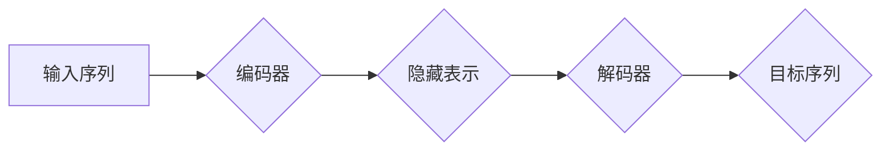

> Transformer, 大语言模型, 编码器-解码器, 自注意力机制, 多头注意力, 位置编码, 序列到序列, 自然语言处理

## 1. 背景介绍

近年来，深度学习在自然语言处理 (NLP) 领域取得了显著进展，其中大语言模型 (LLM) 作为一种强大的工具，在文本生成、翻译、问答等任务中展现出令人惊叹的性能。Transformer 作为 LLM 的核心架构，凭借其强大的序列建模能力和并行计算效率，彻底改变了 NLP 的发展方向。

传统的循环神经网络 (RNN) 在处理长序列数据时存在梯度消失和计算效率低的问题。Transformer 则通过引入自注意力机制和多头注意力机制，有效解决了这些问题，能够捕捉长距离依赖关系，并实现高效的并行计算。

## 2. 核心概念与联系

Transformer 的核心架构由编码器-解码器结构组成，其工作原理可以概括为以下步骤：

1. **编码器:** 将输入序列转换为固定长度的隐藏表示，捕捉序列中的语义信息。
2. **解码器:** 基于编码器的输出，生成目标序列。

**Mermaid 流程图:**



**核心概念:**

* **自注意力机制:** 允许模型关注输入序列中的不同位置，捕捉词语之间的关系。
* **多头注意力机制:** 使用多个注意力头，从不同的角度捕捉词语之间的关系，提高模型的表达能力。
* **位置编码:** 由于 Transformer 无法像 RNN 一样利用时间信息，因此需要使用位置编码来为每个词语添加位置信息。
* **前馈神经网络:** 在每个 Transformer 块中，使用前馈神经网络对隐藏表示进行进一步的变换。

## 3. 核心算法原理 & 具体操作步骤

### 3.1  算法原理概述

Transformer 的核心算法是自注意力机制和多头注意力机制。

**自注意力机制:**

自注意力机制计算每个词语与所有其他词语之间的相关性，并生成一个加权表示，其中每个词语的权重代表其与其他词语的相关程度。

**公式:**

$$
Attention(Q, K, V) = softmax(\frac{QK^T}{\sqrt{d_k}})V
$$

其中：

* Q: 查询矩阵
* K: 键矩阵
* V: 值矩阵
* $d_k$: 键向量的维度

**多头注意力机制:**

多头注意力机制使用多个注意力头，每个注意力头学习不同的词语关系。

**步骤:**

1. 将输入序列分成多个子序列。
2. 对每个子序列应用自注意力机制，得到多个注意力输出。
3. 将多个注意力输出拼接起来，得到最终的注意力输出。

### 3.2  算法步骤详解

**Transformer 的具体操作步骤如下:**

1. **输入嵌入:** 将输入序列中的每个词语转换为词向量。
2. **位置编码:** 为每个词向量添加位置信息。
3. **编码器:** 将嵌入后的词向量输入编码器，编码器由多个 Transformer 块组成，每个 Transformer 块包含自注意力层、前馈神经网络层和残差连接。
4. **解码器:** 将编码器的输出作为输入，解码器也由多个 Transformer 块组成，每个 Transformer 块包含自注意力层、跨注意力层、前馈神经网络层和残差连接。
5. **输出层:** 将解码器的输出输入输出层，生成目标序列。

### 3.3  算法优缺点

**优点:**

* 能够捕捉长距离依赖关系。
* 并行计算效率高。
* 表现能力强。

**缺点:**

* 计算量大。
* 训练成本高。
* 对训练数据要求高。

### 3.4  算法应用领域

Transformer 算法在 NLP 领域有着广泛的应用，例如：

* 文本生成
* 机器翻译
* 问答系统
* 文本摘要
* 代码生成

## 4. 数学模型和公式 & 详细讲解 & 举例说明

### 4.1  数学模型构建

Transformer 的数学模型主要包括以下几个部分：

* **词嵌入:** 将每个词语映射到一个低维向量空间。
* **自注意力机制:** 计算每个词语与所有其他词语之间的相关性。
* **多头注意力机制:** 使用多个注意力头，从不同的角度捕捉词语之间的关系。
* **前馈神经网络:** 对隐藏表示进行进一步的变换。

### 4.2  公式推导过程

**自注意力机制的公式推导过程:**

1. 将输入序列中的每个词语转换为查询向量 (Q)、键向量 (K) 和值向量 (V)。
2. 计算每个词语与所有其他词语之间的相关性，即 Q 与 K 的点积。
3. 对相关性进行归一化，得到注意力权重。
4. 将注意力权重与值向量相乘，得到加权表示。

**公式:**

$$
Attention(Q, K, V) = softmax(\frac{QK^T}{\sqrt{d_k}})V
$$

其中：

* Q: 查询矩阵
* K: 键矩阵
* V: 值矩阵
* $d_k$: 键向量的维度

**多头注意力机制的公式推导过程:**

1. 将输入序列分成多个子序列。
2. 对每个子序列应用自注意力机制，得到多个注意力输出。
3. 将多个注意力输出拼接起来，得到最终的注意力输出。

### 4.3  案例分析与讲解

**案例:**

假设我们有一个句子 "The cat sat on the mat"，我们使用 Transformer 来进行文本生成任务。

**分析:**

Transformer 会将每个词语转换为词向量，并使用自注意力机制和多头注意力机制来捕捉词语之间的关系。例如，"cat" 和 "sat" 之间存在语义关系，Transformer 会将它们之间的注意力权重设置为较高值。

**讲解:**

通过学习这些词语之间的关系，Transformer 可以生成更流畅、更自然的文本。例如，如果我们要求 Transformer 生成下一个词语，它可能会生成 "the"，因为 "the" 是 "mat" 的前一个词语，并且它们之间存在语义关系。

## 5. 项目实践：代码实例和详细解释说明

### 5.1  开发环境搭建

* Python 3.6+
* PyTorch 或 TensorFlow
* CUDA (可选)

### 5.2  源代码详细实现

```python
import torch
import torch.nn as nn

class Transformer(nn.Module):
    def __init__(self, vocab_size, embedding_dim, num_heads, num_layers):
        super(Transformer, self).__init__()
        self.embedding = nn.Embedding(vocab_size, embedding_dim)
        self.encoder = nn.TransformerEncoder(nn.TransformerEncoderLayer(embedding_dim, num_heads), num_layers)
        self.decoder = nn.TransformerDecoder(nn.TransformerDecoderLayer(embedding_dim, num_heads), num_layers)
        self.linear = nn.Linear(embedding_dim, vocab_size)

    def forward(self, src, tgt, src_mask, tgt_mask):
        src = self.embedding(src)
        tgt = self.embedding(tgt)
        encoder_output = self.encoder(src, src_mask)
        decoder_output = self.decoder(tgt, encoder_output, tgt_mask)
        output = self.linear(decoder_output)
        return output
```

### 5.3  代码解读与分析

* **`__init__` 方法:** 初始化 Transformer 模型的各个组件，包括词嵌入层、编码器、解码器和输出层。
* **`forward` 方法:** 定义 Transformer 模型的正向传播过程。
* **词嵌入层:** 将每个词语转换为词向量。
* **编码器:** 将输入序列编码为隐藏表示。
* **解码器:** 基于编码器的输出，生成目标序列。
* **输出层:** 将解码器的输出转换为目标词语的概率分布。

### 5.4  运行结果展示

运行 Transformer 模型后，可以得到目标序列的概率分布，并根据概率分布选择最可能的词语作为输出。

## 6. 实际应用场景

Transformer 算法在 NLP 领域有着广泛的应用场景，例如：

* **机器翻译:** Transformer 可以将一种语言翻译成另一种语言，例如将英文翻译成中文。
* **文本摘要:** Transformer 可以将长篇文本总结成短篇摘要。
* **问答系统:** Transformer 可以理解用户的问题，并从知识库中找到答案。
* **对话系统:** Transformer 可以进行自然语言对话，例如聊天机器人。

### 6.4  未来应用展望

Transformer 算法在未来将有更广泛的应用，例如：

* **代码生成:** Transformer 可以根据自然语言描述生成代码。
* **药物研发:** Transformer 可以帮助科学家发现新的药物。
* **个性化教育:** Transformer 可以根据学生的学习情况提供个性化的学习内容。

## 7. 工具和资源推荐

### 7.1  学习资源推荐

* **论文:** "Attention Is All You Need"
* **博客:** Jay Alammar's Blog
* **课程:** Stanford CS224N

### 7.2  开发工具推荐

* **PyTorch:** 深度学习框架
* **TensorFlow:** 深度学习框架
* **Hugging Face Transformers:** 预训练 Transformer 模型库

### 7.3  相关论文推荐

* "BERT: Pre-training of Deep Bidirectional Transformers for Language Understanding"
* "GPT-3: Language Models are Few-Shot Learners"
* "T5: Text-to-Text Transfer Transformer"

## 8. 总结：未来发展趋势与挑战

### 8.1  研究成果总结

Transformer 算法取得了显著的成果，在 NLP 领域取得了突破性的进展。

### 8.2  未来发展趋势

Transformer 算法的未来发展趋势包括：

* **模型规模的扩大:** 训练更大的 Transformer 模型，提高模型的性能。
* **效率的提升:** 降低 Transformer 模型的计算成本，使其能够在更低端设备上运行。
* **新架构的探索:** 研究新的 Transformer 架构，提高模型的表达能力和泛化能力。

### 8.3  面临的挑战

Transformer 算法也面临着一些挑战，例如：

* **训练成本高:** 训练大型 Transformer 模型需要大量的计算资源和时间。
* **数据依赖性强:** Transformer 模型的性能依赖于训练数据的质量和数量。
* **可解释性差:** Transformer 模型的决策过程难以理解，这限制了其在一些应用场景中的应用。

### 8.4  研究展望

未来，Transformer 算法的研究将继续深入，探索其更广泛的应用场景，并解决其面临的挑战。

## 9. 附录：常见问题与解答

**常见问题:**

* Transformer 模型的计算量很大，如何降低计算成本？
* Transformer 模型的数据依赖性强，如何提高模型的泛化能力？
* Transformer 模型的决策过程难以理解，如何提高模型的可解释性？

**解答:**

* 可以使用量化技术、模型剪枝等方法降低 Transformer 模型的计算成本。
* 可以使用数据增强、迁移学习等方法提高 Transformer 模型的泛化能力。
* 可以使用注意力机制的可视化工具、集成解释性模型等方法提高 Transformer 模型的可解释性。


作者：禅与计算机程序设计艺术 / Zen and the Art of Computer Programming 
<end_of_turn>