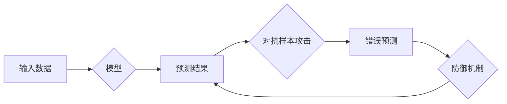

> 大语言模型，对抗样本，攻击方法，防御机制，安全评估，机器学习，深度学习

## 1. 背景介绍

大语言模型（LLM）近年来取得了令人瞩目的进展，在自然语言处理、文本生成、机器翻译等领域展现出强大的能力。然而，随着LLM应用的广泛普及，其安全性也日益受到关注。对抗样本作为一种针对机器学习模型的攻击手段，能够以微小的扰动导致模型产生错误预测，对LLM的可靠性和安全性构成潜在威胁。

对抗样本的生成和攻击方法多种多样，包括基于梯度的方法、基于进化算法的方法以及基于黑盒攻击的方法等。这些攻击方法能够有效地绕过LLM的防御机制，导致模型产生意想不到的输出，甚至引发安全漏洞。

## 2. 核心概念与联系

### 2.1  大语言模型

大语言模型（LLM）是一种基于深度学习的强大人工智能模型，能够理解和生成人类语言。它们通常由数十亿甚至数千亿个参数组成，通过训练大量的文本数据，学习语言的语法、语义和上下文关系。

### 2.2  对抗样本

对抗样本是指对输入数据进行微小扰动，使得模型预测结果发生错误的样本。这些扰动通常是不可察觉的，对人类来说难以识别，但对模型的预测却有显著影响。

### 2.3  攻击方法

对抗样本的攻击方法主要包括以下几种：

* **基于梯度的方法:** 利用模型的梯度信息，计算出能够最大化模型输出误差的扰动。
* **基于进化算法的方法:** 使用进化算法，例如遗传算法，搜索能够有效攻击模型的对抗样本。
* **基于黑盒攻击的方法:** 不需要了解模型的内部结构，通过多次尝试和反馈，逐步生成能够攻击模型的对抗样本。

### 2.4  防御机制

为了应对对抗样本的威胁，研究人员提出了多种防御机制，例如：

* **对抗训练:** 在训练过程中，加入对抗样本，增强模型对对抗样本的鲁棒性。
* **数据增强:** 对训练数据进行增强，例如添加噪声或随机扰动，提高模型对噪声和扰动的鲁棒性。
* **模型剪枝:** 移除模型中不重要的参数，减少模型的复杂度，提高模型的鲁棒性。

**Mermaid 流程图**



## 3. 核心算法原理 & 具体操作步骤

### 3.1  算法原理概述

对抗样本生成算法通常基于优化问题，目标是找到能够最大化模型预测误差的输入扰动。常用的算法包括Fast Gradient Sign Method (FGSM)、Projected Gradient Descent (PGD)和Carlini & Wagner (C&W)攻击等。

### 3.2  算法步骤详解

**以FGSM为例，其具体步骤如下：**

1. **获取模型预测结果:** 将原始输入数据输入到模型中，获取模型的预测结果。
2. **计算梯度:** 计算模型输出对输入数据的梯度。
3. **生成对抗样本:** 将梯度方向放大一个预设的常数，并将其添加到原始输入数据中，得到对抗样本。

### 3.3  算法优缺点

**FGSM算法的优点:**

* 计算简单，效率高。
* 能够生成有效的对抗样本。

**FGSM算法的缺点:**

* 容易被防御机制所抵御。
* 对模型的鲁棒性要求较高。

### 3.4  算法应用领域

对抗样本生成算法广泛应用于以下领域:

* **安全评估:** 评估机器学习模型的安全性，识别模型的弱点。
* **模型防御:** 研究和开发对抗样本防御机制。
* **人工智能伦理:** 探讨人工智能的安全性、可靠性和可解释性问题。

## 4. 数学模型和公式 & 详细讲解 & 举例说明

### 4.1  数学模型构建

假设模型的输出为$f(x)$，其中$x$为输入数据。对抗样本的目标是找到一个微小的扰动$\epsilon$，使得模型的预测结果发生错误，即$f(x + \epsilon) \neq f(x)$。

### 4.2  公式推导过程

FGSM算法的目标函数为：

$$
\min_{\epsilon} ||\epsilon||_2 \quad s.t. \quad f(x + \epsilon) \neq f(x)
$$

其中，$||\epsilon||_2$表示扰动$\epsilon$的L2范数。

通过梯度下降法，可以迭代地更新扰动$\epsilon$，直到满足目标函数的条件。

### 4.3  案例分析与讲解

假设我们有一个图像分类模型，输入图像为$x$，模型输出类别为$y$。我们希望生成一个对抗样本，使得模型预测类别为$y'$，其中$y' \neq y$。

我们可以使用FGSM算法，计算模型输出对图像的梯度，并将其放大一个预设的常数，添加到原始图像中，得到对抗样本。

## 5. 项目实践：代码实例和详细解释说明

### 5.1  开发环境搭建

* Python 3.7+
* TensorFlow 2.0+
* PyTorch 1.0+

### 5.2  源代码详细实现

```python
import tensorflow as tf

# 定义模型
model = tf.keras.models.Sequential([
    tf.keras.layers.Conv2D(32, (3, 3), activation='relu', input_shape=(28, 28, 1)),
    tf.keras.layers.MaxPooling2D((2, 2)),
    tf.keras.layers.Flatten(),
    tf.keras.layers.Dense(10, activation='softmax')
])

# 加载数据集
(x_train, y_train), (x_test, y_test) = tf.keras.datasets.mnist.load_data()

# 预处理数据
x_train = x_train.astype('float32') / 255.0
x_test = x_test.astype('float32') / 255.0
x_train = x_train.reshape((x_train.shape[0], 28, 28, 1))
x_test = x_test.reshape((x_test.shape[0], 28, 28, 1))

# 训练模型
model.compile(optimizer='adam',
              loss='sparse_categorical_crossentropy',
              metrics=['accuracy'])
model.fit(x_train, y_train, epochs=5)

# 生成对抗样本
def generate_adversarial_example(image, label):
    # 计算梯度
    with tf.GradientTape() as tape:
        tape.watch(image)
        prediction = model(image)
    gradients = tape.gradient(prediction[0, label], image)

    # 生成对抗样本
    epsilon = 0.01
    adversarial_image = image + epsilon * gradients

    return adversarial_image

# 选择一个图像进行攻击
index = 0
image = x_test[index]
label = y_test[index]

# 生成对抗样本
adversarial_image = generate_adversarial_example(image, label)

# 预测对抗样本的类别
prediction = model(adversarial_image)
predicted_label = tf.argmax(prediction).numpy()

# 打印结果
print(f'原始图像类别: {label}')
print(f'对抗样本类别: {predicted_label}')
```

### 5.3  代码解读与分析

该代码首先定义了一个简单的图像分类模型，并使用MNIST数据集进行训练。然后，定义了一个`generate_adversarial_example`函数，使用FGSM算法生成对抗样本。

该函数首先计算模型输出对输入图像的梯度，然后将梯度方向放大一个预设的常数，添加到原始图像中，得到对抗样本。最后，使用生成的对抗样本进行预测，并打印原始图像和对抗样本的类别。

### 5.4  运行结果展示

运行该代码后，会输出原始图像的类别和对抗样本的类别。由于对抗样本的生成，模型的预测结果可能会发生错误。

## 6. 实际应用场景

### 6.1  安全评估

对抗样本可以用于评估机器学习模型的安全性，识别模型的弱点。例如，可以生成针对特定模型的对抗样本，测试模型在面对这些样本时的性能，从而发现模型的漏洞。

### 6.2  模型防御

对抗样本也可以用于研究和开发对抗样本防御机制。通过分析对抗样本的生成机制，可以开发出能够抵御对抗样本攻击的防御机制。

### 6.3  人工智能伦理

对抗样本的出现引发了人工智能伦理方面的讨论。例如，如何确保人工智能模型的可靠性和安全性？如何防止对抗样本被恶意利用？这些问题都需要进一步研究和探讨。

### 6.4  未来应用展望

随着大语言模型的不断发展，对抗样本的攻击手段也会更加复杂和隐蔽。未来，对抗样本研究将更加注重以下几个方面：

* **更有效的对抗样本生成算法:** 研究能够生成更隐蔽、更有效的对抗样本的算法。
* **更鲁棒的模型防御机制:** 开发能够抵御各种对抗样本攻击的更鲁棒的模型防御机制。
* **对抗样本检测技术:** 研究能够检测对抗样本的技术，提高模型的安全性。

## 7. 工具和资源推荐

### 7.1  学习资源推荐

* **论文:**
    * Goodfellow, I., Shlens, J., & Szegedy, C. (2014). Explaining and harnessing adversarial examples.
    * Carlini, N., & Wagner, D. (2017). Towards evaluating the robustness of neural networks.
* **书籍:**
    * "Deep Learning" by Ian Goodfellow, Yoshua Bengio, and Aaron Courville
* **在线课程:**
    * Coursera: "Deep Learning Specialization" by Andrew Ng

### 7.2  开发工具推荐

* **TensorFlow:** https://www.tensorflow.org/
* **PyTorch:** https://pytorch.org/
* **Keras:** https://keras.io/

### 7.3  相关论文推荐

* **Adversarial Examples in the Physical World**
* **Generating Adversarial Examples for Semantic Segmentation**
* **Robustness of Deep Learning Models to Adversarial Attacks**

## 8. 总结：未来发展趋势与挑战

### 8.1  研究成果总结

近年来，对抗样本研究取得了显著进展，提出了多种对抗样本生成算法和防御机制。这些研究成果对提高机器学习模型的安全性、可靠性和鲁棒性具有重要意义。

### 8.2  未来发展趋势

未来，对抗样本研究将朝着以下几个方向发展：

* **更有效的对抗样本生成算法:** 研究能够生成更隐蔽、更有效的对抗样本的算法。
* **更鲁棒的模型防御机制:** 开发能够抵御各种对抗样本攻击的更鲁棒的模型防御机制。
* **对抗样本检测技术:** 研究能够检测对抗样本的技术，提高模型的安全性。

### 8.3  面临的挑战

对抗样本研究还面临着一些挑战：

* **对抗样本的生成和检测技术**仍然处于发展阶段，需要进一步研究和完善。
* **对抗样本的攻击手段**不断发展，需要不断更新防御机制。
* **对抗样本的伦理问题**需要得到进一步探讨。

### 8.4  研究展望

对抗样本研究是一个充满挑战和机遇的领域。随着人工智能技术的不断发展，对抗样本研究将变得更加重要，对人工智能的安全性、可靠性和可信度具有重要意义。


## 9. 附录：常见问题与解答

### 9.1  什么是对抗样本？

对抗样本是指对输入数据进行微小扰动，使得模型预测结果发生错误的样本。这些扰动通常是不可察觉的，对人类来说难以识别，但对模型的预测却有显著影响。

### 9