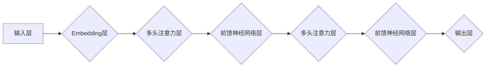

> 大语言模型、Transformer、自然语言处理、深度学习、文本生成、机器翻译、对话系统

## 1. 背景介绍

近年来，人工智能（AI）领域取得了令人瞩目的进展，其中大语言模型（Large Language Models，LLMs）作为一种重要的突破，展现出强大的文本理解和生成能力，引发了广泛的关注和研究。

大语言模型是指在海量文本数据上训练的深度学习模型，能够理解和生成人类语言。它们拥有庞大的参数量，能够捕捉语言的复杂结构和语义关系，从而实现各种自然语言处理（NLP）任务，例如文本分类、机器翻译、问答系统、文本摘要等。

大语言模型的出现，标志着人工智能进入了一个新的时代。它们不仅能够完成传统的NLP任务，还能进行更复杂的任务，例如代码生成、诗歌创作、故事写作等，展现出强大的创造力和应用潜力。

## 2. 核心概念与联系

### 2.1  Transformer 架构

Transformer 是一种专门为处理序列数据设计的深度学习架构，它在自然语言处理领域取得了革命性的进展。

Transformer 的核心创新在于使用“注意力机制”（Attention Mechanism），能够捕捉文本中单词之间的长距离依赖关系，克服了传统RNN模型在处理长文本时容易出现梯度消失或爆炸的问题。

**Mermaid 流程图**



### 2.2  深度学习与大语言模型

深度学习是机器学习的一个分支，它利用多层神经网络来学习数据中的复杂模式。

大语言模型正是基于深度学习原理，通过训练大量的文本数据，学习语言的语法、语义和上下文关系，从而实现强大的文本理解和生成能力。

## 3. 核心算法原理 & 具体操作步骤

### 3.1  算法原理概述

大语言模型的训练主要基于自监督学习（Self-Supervised Learning）方法。

自监督学习是指利用无标签数据，通过设计特定的预训练任务，让模型学习语言的潜在表示。

常见的预训练任务包括：

* **语言建模（Language Modeling）：** 预测下一个单词，训练模型理解上下文关系。
* **掩码语言模型（Masked Language Modeling）：** 随机掩盖部分单词，训练模型预测被掩盖的单词。
* **句子排序（Sentence Order Prediction）：** 训练模型判断两个句子之间的顺序关系。

### 3.2  算法步骤详解

1. **数据预处理：** 将文本数据清洗、分词、标记等预处理，使其适合模型训练。
2. **模型构建：** 选择合适的深度学习架构，例如Transformer，并定义模型参数。
3. **预训练：** 使用大量的无标签文本数据，进行预训练任务，让模型学习语言的表示。
4. **微调：** 使用少量有标签数据，对预训练模型进行微调，使其能够完成特定任务。
5. **评估：** 使用测试数据评估模型的性能，并进行调参优化。

### 3.3  算法优缺点

**优点：**

* 能够学习语言的复杂结构和语义关系。
* 训练数据量大，泛化能力强。
* 可迁移学习，在不同任务上进行微调。

**缺点：**

* 训练成本高，需要大量的计算资源和时间。
* 模型参数量大，部署成本高。
* 容易受到训练数据偏差的影响。

### 3.4  算法应用领域

大语言模型在多个领域都有广泛的应用，例如：

* **自然语言理解：** 文本分类、情感分析、问答系统、文本摘要等。
* **自然语言生成：** 机器翻译、文本生成、对话系统、代码生成等。
* **其他领域：** 搜索引擎优化、广告推荐、医疗诊断等。

## 4. 数学模型和公式 & 详细讲解 & 举例说明

### 4.1  数学模型构建

大语言模型通常使用 Transformer 架构，其核心是多头注意力机制。

注意力机制可以理解为一种加权机制，它根据单词之间的相关性，赋予不同的权重，从而捕捉长距离依赖关系。

### 4.2  公式推导过程

**注意力机制公式：**

$$
Attention(Q, K, V) = softmax(\frac{QK^T}{\sqrt{d_k}})V
$$

其中：

* $Q$：查询矩阵
* $K$：键矩阵
* $V$：值矩阵
* $d_k$：键向量的维度
* $softmax$：softmax 函数

**解释：**

1. 计算查询矩阵 $Q$ 和键矩阵 $K$ 的点积，并进行归一化。
2. 使用 softmax 函数将点积结果转换为概率分布。
3. 将概率分布与值矩阵 $V$ 进行加权求和，得到最终的注意力输出。

### 4.3  案例分析与讲解

假设我们有一个句子 "The cat sat on the mat"，我们想要计算 "cat" 和 "mat" 之间的注意力权重。

1. 将句子中的每个单词转换为向量表示。
2. 计算 "cat" 的查询向量 $Q$ 和 "mat" 的键向量 $K$ 的点积。
3. 将点积结果进行归一化，并使用 softmax 函数得到注意力权重。
4. 将注意力权重与 "mat" 的值向量 $V$ 进行加权求和，得到 "cat" 对 "mat" 的注意力输出。

## 5. 项目实践：代码实例和详细解释说明

### 5.1  开发环境搭建

* Python 3.7+
* PyTorch 或 TensorFlow
* CUDA 和 cuDNN

### 5.2  源代码详细实现

```python
import torch
import torch.nn as nn

class Attention(nn.Module):
    def __init__(self, d_model, num_heads):
        super(Attention, self).__init__()
        self.d_model = d_model
        self.num_heads = num_heads
        self.head_dim = d_model // num_heads

        self.query = nn.Linear(d_model, d_model)
        self.key = nn.Linear(d_model, d_model)
        self.value = nn.Linear(d_model, d_model)
        self.fc_out = nn.Linear(d_model, d_model)

    def forward(self, query, key, value, mask=None):
        batch_size = query.size(0)

        # Linear projections
        Q = self.query(query).view(batch_size, -1, self.num_heads, self.head_dim).transpose(1, 2)
        K = self.key(key).view(batch_size, -1, self.num_heads, self.head_dim).transpose(1, 2)
        V = self.value(value).view(batch_size, -1, self.num_heads, self.head_dim).transpose(1, 2)

        # Scaled dot-product attention
        scores = torch.matmul(Q, K.transpose(-2, -1)) / torch.sqrt(torch.tensor(self.head_dim, dtype=torch.float))

        if mask is not None:
            scores = scores.masked_fill(mask == 0, -1e9)

        attention_weights = torch.softmax(scores, dim=-1)

        # Weighted sum of values
        context = torch.matmul(attention_weights, V)

        # Concatenate heads and project
        context = context.transpose(1, 2).contiguous().view(batch_size, -1, self.d_model)
        output = self.fc_out(context)

        return output, attention_weights
```

### 5.3  代码解读与分析

* `Attention` 类定义了多头注意力机制。
* `forward` 方法实现注意力计算过程，包括线性投影、缩放点积注意力、加权求和等步骤。
* `mask` 参数用于屏蔽无效的注意力连接，例如在文本生成任务中，屏蔽已经生成的单词。

### 5.4  运行结果展示

运行代码后，可以得到注意力权重矩阵，展示每个单词对其他单词的关注程度。

## 6. 实际应用场景

### 6.1  文本生成

大语言模型可以用于生成各种文本，例如：

* **故事写作：** 根据给定的主题或情节，生成一篇故事。
* **诗歌创作：** 根据给定的韵律或主题，生成一首诗。
* **代码生成：** 根据给定的功能描述，生成相应的代码。

### 6.2  机器翻译

大语言模型可以用于将文本从一种语言翻译成另一种语言，例如：

* **英语-中文翻译：** 将英文文本翻译成中文。
* **法语-西班牙语翻译：** 将法语文本翻译成西班牙语。

### 6.3  对话系统

大语言模型可以用于构建对话系统，例如：

* **聊天机器人：** 与用户进行自然语言对话。
* **虚拟助手：** 帮助用户完成各种任务，例如设置提醒、查询天气等。

### 6.4  未来应用展望

大语言模型在未来将有更广泛的应用，例如：

* **个性化教育：** 根据学生的学习进度和需求，提供个性化的学习内容。
* **医疗诊断：** 辅助医生进行疾病诊断和治疗方案制定。
* **法律服务：** 帮助律师进行法律研究和文件撰写。

## 7. 工具和资源推荐

### 7.1  学习资源推荐

* **书籍：**
    * 《深度学习》
    * 《自然语言处理》
* **在线课程：**
    * Coursera: 自然语言处理
    * Udacity: 深度学习

### 7.2  开发工具推荐

* **PyTorch:** 深度学习框架
* **TensorFlow:** 深度学习框架
* **Hugging Face Transformers:** 预训练模型库

### 7.3  相关论文推荐

* **Attention Is All You Need:** https://arxiv.org/abs/1706.03762
* **BERT: Pre-training of Deep Bidirectional Transformers for Language Understanding:** https://arxiv.org/abs/1810.04805

## 8. 总结：未来发展趋势与挑战

### 8.1  研究成果总结

大语言模型在自然语言处理领域取得了显著的进展，展现出强大的文本理解和生成能力。

### 8.2  未来发展趋势

* **模型规模更大：** 随着计算资源的不断提升，模型规模将继续扩大，从而提升模型性能。
* **多模态学习：** 将文本与其他模态数据（例如图像、音频）进行融合，实现更全面的理解和生成。
* **可解释性增强：** 研究如何提高大语言模型的透明度和可解释性，使其更易于理解和信任。

### 8.3  面临的挑战

* **数据偏见：** 训练数据可能存在偏见，导致模型输出结果存在偏差。
* **计算成本高：** 训练大型语言模型需要大量的计算资源，成本较高。
* **安全风险：** 大语言模型可能被用于生成虚假信息或进行恶意攻击。

### 8.4  研究展望

未来研究将重点关注解决上述挑战，并探索大语言模型在更多领域的新应用。

## 9. 附录：常见问题与解答

**Q1：大语言模型的训练数据来源？**

**A1：** 大语言模型的训练数据通常来自公开的文本数据集，例如维基百科、书籍、新闻文章等。

**Q2：大语言模型的应用场景有哪些？**

**A2：** 大语言模型的应用场景非常广泛，例如文本生成、机器翻译、对话系统、代码生成等。

**Q3：如何评估大语言模型的性能？**

**A3：** 大语言模型的性能通常通过各种指标进行评估，例如准确率、