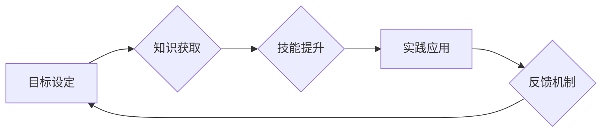

> 学习体系，进化动力，知识获取，技能提升，实践应用，反馈机制，持续学习，人工智能，深度学习，机器学习

## 1. 背景介绍

在当今瞬息万变的科技时代，学习已不再是单纯的知识获取，而是一种持续的进化过程。 为了在激烈的竞争中保持领先地位，个人和组织都需要建立高效的学习体系，不断提升自身的能力和适应性。 

传统的学习模式往往局限于被动接受信息，缺乏实践应用和反馈机制，难以真正激发学习动力。而现代学习体系则强调主动探索、实践应用和持续反馈，以促进知识的深度理解和技能的提升。

## 2. 核心概念与联系

**2.1 学习体系的构成**

学习体系是一个有机整体，由以下几个核心要素构成：

* **目标设定:** 明确学习的目标和方向，为学习提供动力和指引。
* **知识获取:** 通过多种途径获取知识，包括阅读、学习、实践等。
* **技能提升:** 将知识转化为实际技能，并不断进行练习和精进。
* **实践应用:** 将所学知识和技能应用于实际场景，检验学习成果并获得反馈。
* **反馈机制:** 通过反馈机制，及时了解学习效果，并调整学习策略。

**2.2 进化动力的来源**

学习体系的核心动力源于“进化”。 

* **知识的更新:** 科技发展日新月异，知识更新速度加快，需要不断学习新知识以保持竞争力。
* **技能的提升:** 随着工作和生活的复杂性增加，需要不断提升技能以应对挑战。
* **个体成长的渴望:** 人们天生有探索和成长的渴望，学习是实现自我价值的重要途径。

**2.3 学习体系与人工智能**

人工智能技术的快速发展为学习体系带来了新的机遇和挑战。

* **个性化学习:** 人工智能可以根据个人的学习风格和需求，提供个性化的学习方案。
* **智能辅助:** 人工智能可以辅助学习者进行知识获取、技能提升和实践应用。
* **数据驱动:** 人工智能可以利用大数据分析学习者的学习行为，提供更精准的反馈和建议。

**2.4 Mermaid 流程图**



## 3. 核心算法原理 & 具体操作步骤

**3.1 算法原理概述**

深度学习算法是人工智能领域的核心技术之一，其原理是通过多层神经网络模拟人类大脑的学习过程。

**3.2 算法步骤详解**

1. **数据预处理:** 将原始数据进行清洗、转换和特征提取，以便于模型训练。
2. **网络结构设计:** 根据任务需求设计神经网络的层数、节点数和激活函数等参数。
3. **模型训练:** 使用训练数据训练神经网络，通过调整网络参数使模型的预测结果与真实值尽可能接近。
4. **模型评估:** 使用测试数据评估模型的性能，并根据评估结果进行模型调优。
5. **模型部署:** 将训练好的模型部署到实际应用场景中，用于预测或决策。

**3.3 算法优缺点**

* **优点:** 深度学习算法能够自动学习数据中的特征，具有强大的学习能力和泛化能力。
* **缺点:** 深度学习算法需要大量的训练数据和计算资源，训练过程也比较复杂。

**3.4 算法应用领域**

深度学习算法广泛应用于图像识别、自然语言处理、语音识别、机器翻译等领域。

## 4. 数学模型和公式 & 详细讲解 & 举例说明

**4.1 数学模型构建**

深度学习模型可以看作是一个复杂的数学函数，其输入是数据特征，输出是预测结果。

**4.2 公式推导过程**

深度学习模型的训练过程本质上是一个优化问题，目标是找到最优的网络参数，使得模型的预测结果与真实值之间的误差最小。

常用的优化算法包括梯度下降法、动量法、Adam算法等。

**4.3 案例分析与讲解**

以图像识别为例，深度学习模型可以学习图像特征，并将其映射到类别标签。

假设输入图像为x，输出类别为y，则模型的预测结果为：

$$
y = f(W * x + b)
$$

其中，W为权重矩阵，b为偏置向量，f为激活函数。

训练过程中，通过反向传播算法计算模型预测结果与真实值之间的误差，并根据误差反向更新权重和偏置，最终使模型的预测结果与真实值尽可能接近。

## 5. 项目实践：代码实例和详细解释说明

**5.1 开发环境搭建**

使用Python语言和深度学习框架TensorFlow或PyTorch搭建开发环境。

**5.2 源代码详细实现**

```python
import tensorflow as tf

# 定义模型结构
model = tf.keras.models.Sequential([
    tf.keras.layers.Conv2D(32, (3, 3), activation='relu', input_shape=(28, 28, 1)),
    tf.keras.layers.MaxPooling2D((2, 2)),
    tf.keras.layers.Conv2D(64, (3, 3), activation='relu'),
    tf.keras.layers.MaxPooling2D((2, 2)),
    tf.keras.layers.Flatten(),
    tf.keras.layers.Dense(10, activation='softmax')
])

# 编译模型
model.compile(optimizer='adam',
              loss='sparse_categorical_crossentropy',
              metrics=['accuracy'])

# 训练模型
model.fit(x_train, y_train, epochs=5)

# 评估模型
loss, accuracy = model.evaluate(x_test, y_test)
print('Test loss:', loss)
print('Test accuracy:', accuracy)
```

**5.3 代码解读与分析**

代码定义了一个简单的卷积神经网络模型，用于手写数字识别任务。

模型结构包括两个卷积层、两个最大池化层、一个全连接层和一个输出层。

模型使用Adam优化器、交叉熵损失函数和准确率指标进行训练。

**5.4 运行结果展示**

训练完成后，模型可以用于预测新的手写数字图像。

## 6. 实际应用场景

**6.1 教育领域**

* 个性化学习推荐
* 智能辅导系统
* 自动批改作业

**6.2 企业领域**

* 客户关系管理
* 市场营销分析
* 欺诈检测

**6.3 医疗领域**

* 疾病诊断
* 药物研发
* 医疗影像分析

**6.4 未来应用展望**

随着人工智能技术的不断发展，学习体系将更加智能化、个性化和高效化。

## 7. 工具和资源推荐

**7.1 学习资源推荐**

* 在线课程平台：Coursera、edX、Udacity
* 书籍：深度学习、机器学习
* 博客和论坛：机器之心、AI研究

**7.2 开发工具推荐**

* 深度学习框架：TensorFlow、PyTorch
* 数据处理工具：Pandas、NumPy
* 可视化工具：Matplotlib、Seaborn

**7.3 相关论文推荐**

* ImageNet Classification with Deep Convolutional Neural Networks
* Deep Learning
* A Survey of Deep Learning

## 8. 总结：未来发展趋势与挑战

**8.1 研究成果总结**

深度学习算法取得了显著的成果，在图像识别、自然语言处理等领域取得了突破性进展。

**8.2 未来发展趋势**

* 模型更加高效、鲁棒和可解释
* 跨模态学习和多任务学习
* 人机协同学习

**8.3 面临的挑战**

* 数据获取和隐私保护
* 计算资源和能源消耗
* 算法的公平性和可信度

**8.4 研究展望**

未来研究将重点关注解决上述挑战，并探索深度学习算法在更多领域的新应用。

## 9. 附录：常见问题与解答

**9.1 如何选择合适的深度学习框架？**

选择深度学习框架需要根据具体项目需求和个人经验进行选择。

**9.2 如何处理不平衡的数据集？**

可以使用数据增强、权重调整等方法处理不平衡的数据集。

**9.3 如何评估深度学习模型的性能？**

可以使用准确率、召回率、F1-score等指标评估深度学习模型的性能。


作者：禅与计算机程序设计艺术 / Zen and the Art of Computer Programming 
<end_of_turn>