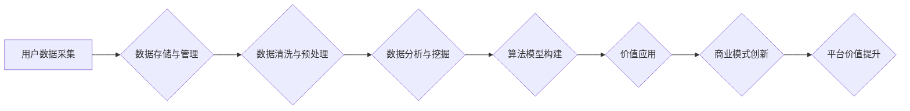

> 平台经济，数据价值，价值创造机制，数据驱动，算法模型，用户行为，商业模式

## 1. 背景介绍

平台经济作为一种新型的经济模式，以其连接用户和提供商，促进交易和资源共享的特点，迅速崛起并成为全球经济的重要组成部分。从电商平台到社交平台，从出行平台到金融平台，平台经济的应用场景日益广泛。然而，平台经济的成功离不开数据的支撑。数据作为平台经济的核心资产，蕴藏着巨大的价值，能够为平台提供用户洞察、个性化服务、精准营销等方面的支持。

然而，如何有效地挖掘和利用数据价值，建立可持续的价值创造机制，是平台经济面临的重大挑战。传统的商业模式往往依赖于产品或服务的直接交易，而平台经济则需要构建一个更加复杂的价值网络，通过数据驱动的方式，实现用户、平台和提供商之间的协同共赢。

## 2. 核心概念与联系

**2.1 平台经济的核心概念**

平台经济是指通过搭建线上平台，连接用户和提供商，促进交易和资源共享的经济模式。平台经济的核心特征包括：

* **双边市场:** 平台连接两类主体，例如用户和商家，通过提供平台服务，促进双方之间的交易和互动。
* **网络效应:** 平台的用户数量和提供商数量越多，平台的价值就越高，形成正向的网络效应。
* **数据驱动:** 平台通过收集和分析用户数据，洞察用户需求，提供个性化服务，优化平台运营。

**2.2 数据价值的创造机制**

数据价值的创造机制是指通过数据分析、算法模型和商业模式创新，将数据转化为有价值的资产，并将其应用于平台运营、用户服务和商业发展。

**2.3 平台经济数据价值创造机制的架构**



**2.4 核心概念联系**

平台经济的核心概念与数据价值的创造机制相互关联，数据驱动着平台经济的发展，而平台经济的成功则为数据价值的创造提供了基础和条件。

## 3. 核心算法原理 & 具体操作步骤

**3.1 算法原理概述**

数据价值的创造机制的核心是利用算法模型对用户数据进行分析和挖掘，从而发现隐藏的价值。常见的算法模型包括：

* **推荐算法:** 基于用户历史行为和偏好，推荐相关商品、服务或内容。
* **分类算法:** 将用户数据进行分类，例如用户画像、风险评估等。
* **聚类算法:** 将用户数据进行聚类，发现用户群体的特征和差异。
* **预测算法:** 基于历史数据预测未来的趋势，例如用户行为预测、市场需求预测等。

**3.2 算法步骤详解**

1. **数据收集:** 从平台的各种数据源收集用户数据，例如用户行为数据、用户画像数据、商品数据等。
2. **数据预处理:** 对收集到的数据进行清洗、转换和格式化，去除噪声和异常值，以便于算法模型的训练和应用。
3. **特征工程:** 从原始数据中提取特征，例如用户年龄、性别、购买历史、浏览记录等，这些特征将作为算法模型的输入。
4. **模型训练:** 选择合适的算法模型，并利用训练数据对模型进行训练，调整模型参数，使其能够准确地预测或分类用户数据。
5. **模型评估:** 使用测试数据对模型进行评估，评估模型的准确率、召回率、F1-score等指标，并根据评估结果进行模型优化。
6. **模型部署:** 将训练好的模型部署到平台系统中，用于实时处理用户数据，提供个性化服务和商业决策支持。

**3.3 算法优缺点**

* **优点:** 能够有效地挖掘用户数据中的价值，提供个性化服务、精准营销等方面的支持。
* **缺点:** 需要大量的训练数据，算法模型的训练和部署需要一定的技术难度，存在数据隐私和安全方面的风险。

**3.4 算法应用领域**

* **推荐系统:** 为用户推荐相关商品、服务或内容。
* **用户画像:** 建立用户画像，了解用户的兴趣、需求和行为特征。
* **风险控制:** 对用户进行风险评估，识别潜在的欺诈行为。
* **市场预测:** 对市场需求进行预测，帮助企业制定营销策略。

## 4. 数学模型和公式 & 详细讲解 & 举例说明

**4.1 数学模型构建**

数据价值的创造机制可以抽象为一个数学模型，其中用户数据作为输入，算法模型作为处理单元，价值应用作为输出。

**4.2 公式推导过程**

假设用户数据可以表示为一个向量 $X = (x_1, x_2, ..., x_n)$, 算法模型可以表示为一个函数 $f(X)$, 价值应用可以表示为一个指标 $V(f(X))$. 则数据价值的创造机制可以表示为以下公式:

$$V = V(f(X))$$

其中，$V$ 表示数据价值，$f(X)$ 表示算法模型对用户数据 $X$ 的处理结果，$V(f(X))$ 表示价值应用对 $f(X)$ 的评估指标。

**4.3 案例分析与讲解**

例如，在推荐系统中，用户数据可以表示为用户的历史购买记录、浏览记录、评分等信息，算法模型可以是一个协同过滤算法，价值应用可以是推荐准确率。

$$V = \text{推荐准确率}(f(X))$$

其中，$f(X)$ 是协同过滤算法对用户数据 $X$ 的处理结果，推荐准确率是评估推荐系统的指标。

## 5. 项目实践：代码实例和详细解释说明

**5.1 开发环境搭建**

* 操作系统: Ubuntu 20.04
* Python 版本: 3.8
* 必要的库: pandas, numpy, scikit-learn, matplotlib

**5.2 源代码详细实现**

```python
import pandas as pd
from sklearn.model_selection import train_test_split
from sklearn.linear_model import LogisticRegression

# 加载用户数据
data = pd.read_csv('user_data.csv')

# 选择特征和目标变量
features = ['age', 'gender', 'purchase_history']
target = 'purchase_probability'

# 将数据划分为训练集和测试集
X_train, X_test, y_train, y_test = train_test_split(data[features], data[target], test_size=0.2)

# 创建逻辑回归模型
model = LogisticRegression()

# 训练模型
model.fit(X_train, y_train)

# 评估模型性能
accuracy = model.score(X_test, y_test)
print(f'模型准确率: {accuracy}')

# 使用模型预测新用户的购买概率
new_user_data = pd.DataFrame({'age': [25], 'gender': ['male'], 'purchase_history': [10]})
prediction = model.predict(new_user_data)
print(f'新用户的购买概率: {prediction}')
```

**5.3 代码解读与分析**

这段代码演示了如何使用逻辑回归模型预测用户的购买概率。

* 首先，加载用户数据并选择特征和目标变量。
* 然后，将数据划分为训练集和测试集。
* 接着，创建逻辑回归模型并训练模型。
* 最后，评估模型性能并使用模型预测新用户的购买概率。

**5.4 运行结果展示**

运行代码后，会输出模型的准确率和新用户的购买概率。

## 6. 实际应用场景

**6.1 个性化推荐**

平台可以利用用户数据和算法模型，为用户推荐个性化的商品、服务或内容，提高用户体验和转化率。

**6.2 精准营销**

平台可以根据用户的兴趣和行为特征，进行精准的营销推广，提高广告投放的效率和效果。

**6.3 用户画像分析**

平台可以利用用户数据构建用户画像，了解用户的兴趣、需求和行为特征，为平台运营和产品开发提供参考。

**6.4 风险控制**

平台可以利用用户数据和算法模型，识别潜在的欺诈行为和风险用户，降低平台的运营风险。

**6.5 市场预测**

平台可以利用用户数据和算法模型，预测市场需求和趋势，帮助企业制定营销策略和产品开发计划。

**6.4 未来应用展望**

随着人工智能技术的不断发展，数据价值的创造机制将更加智能化、自动化和个性化。未来，平台经济将更加依赖数据驱动，数据将成为平台竞争的核心要素。

## 7. 工具和资源推荐

**7.1 学习资源推荐**

* **书籍:**
    * 《数据科学实战》
    * 《机器学习》
    * 《深度学习》
* **在线课程:**
    * Coursera
    * edX
    * Udacity

**7.2 开发工具推荐**

* **Python:** 
    * pandas
    * numpy
    * scikit-learn
    * TensorFlow
    * PyTorch
* **云平台:**
    * AWS
    * Azure
    * Google Cloud

**7.3 相关论文推荐**

* 《Collaborative Filtering for Recommender Systems》
* 《Deep Learning for Recommender Systems》
* 《A Survey on User Profiling in Recommender Systems》

## 8. 总结：未来发展趋势与挑战

**8.1 研究成果总结**

平台经济数据价值创造机制的研究取得了显著进展，算法模型的不断发展，数据分析技术的不断进步，为平台经济的发展提供了强大的技术支撑。

**8.2 未来发展趋势**

* **更智能化的算法模型:** 利用深度学习等先进算法，构建更智能化的算法模型，能够更好地理解用户需求和行为特征。
* **更个性化的价值创造:** 基于用户画像和行为分析，为每个用户提供更个性化的价值服务。
* **更安全的隐私保护:** 利用联邦学习等技术，保障用户数据隐私安全，构建可信赖的平台生态。

**8.3 面临的挑战**

* **数据质量问题:** 平台数据往往存在不完整、不准确、不一致等问题，需要进行有效的数据清洗和预处理。
* **算法模型的解释性:** 一些深度学习模型的决策过程难以解释，需要研究更可解释的算法模型。
* **数据隐私和安全问题:** 平台需要采取有效的措施，保障用户数据的隐私和安全。

**8.4 研究展望**

未来，平台经济数据价值创造机制的研究将更加注重算法模型的智能化、个性化和可解释性，同时也将更加关注数据隐私和安全问题，构建更加可持续和可信赖的平台生态。

## 9. 附录：常见问题与解答

**9.1 如何提高算法模型的准确率？**

* 提高数据质量：清洗、预处理和丰富数据，提高数据的准确性和完整性。
* 选择合适的算法模型：根据数据特点和业务需求，选择合适的算法模型。
* 优化模型参数：通过调参和交叉验证，优化模型参数，提高模型的性能。

**9.2 如何保障用户数据的隐私安全？**

* 数据加密：对用户数据进行加密，防止未经授权的访问。
* 数据匿名化：对用户数据进行匿名化处理，保护用户的个人信息。
* 隐私保护技术：利用联邦学习等隐私保护技术，保障用户数据的隐私安全。


作者：禅与计算机程序设计艺术 / Zen and the Art of Computer Programming 
<end_of_turn>