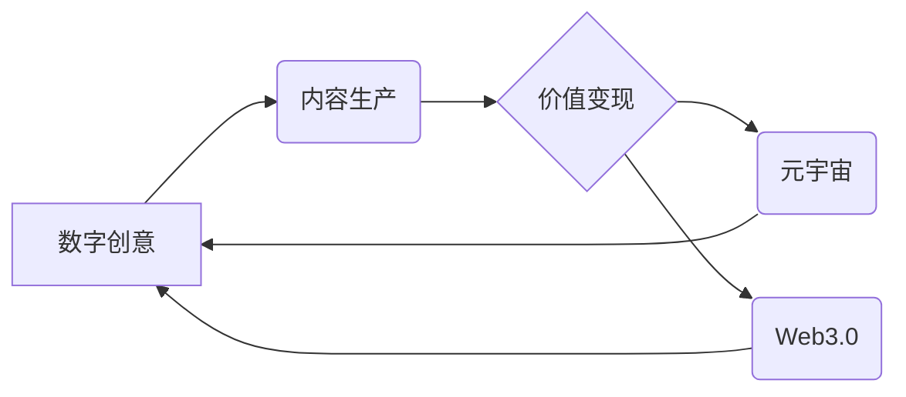

> 数字创意，内容生产，价值变现，人工智能，元宇宙，Web3.0，区块链，NFT

## 1. 背景介绍

21世纪，数字技术飞速发展，深刻地改变了人类生活方式和生产方式。内容生产和消费已成为社会不可或缺的一部分，而数字创意作为内容生产的核心驱动力，也日益受到重视。

从传统媒体到互联网时代，内容生产模式经历了从单向传播到互动交流的转变。如今，随着人工智能、元宇宙、Web3.0等新技术的涌现，数字创意产业正迎来一场前所未有的变革。

2050年，数字创意将不再局限于传统的文本、图像、音频等形式，而是将以更加沉浸式、交互式、个性化的方式呈现。人工智能将成为数字创意的核心引擎，赋予内容生产和消费以全新的智能体验。

## 2. 核心概念与联系

**2.1 数字创意**

数字创意是指利用数字技术，以创新思维和艺术表达，创造出具有价值和意义的数字内容。它涵盖了各种形式的数字作品，例如：

* **虚拟现实 (VR) 和增强现实 (AR) 内容：** 沉浸式体验、互动式游戏、虚拟旅游等。
* **人工智能 (AI) 生成的内容：** 智能写作、音乐创作、图像生成等。
* **区块链 (Blockchain) 驱动的数字资产：** NFT 艺术品、数字收藏品、虚拟地产等。

**2.2 内容生产与价值变现**

传统的内容生产模式主要依靠平台和广告收入来实现价值变现。而数字创意时代，内容生产者将拥有更多自主权和变现方式，例如：

* **直接销售数字作品：** 通过 NFT 等技术，将数字作品变为可交易的资产。
* **订阅服务：** 提供独家内容和服务，获取用户付费订阅。
* **数据化运营：** 收集用户数据，进行精准营销和个性化服务。

**2.3 元宇宙与 Web3.0**

元宇宙和 Web3.0 是数字创意产业的重要发展方向。元宇宙是一个虚拟世界，用户可以在其中进行社交、娱乐、购物等活动。Web3.0 是基于区块链技术的互联网，强调去中心化、用户拥有数据和资产的控制权。

**2.4 核心概念关系图**



## 3. 核心算法原理 & 具体操作步骤

**3.1 算法原理概述**

数字创意产业的核心算法原理主要包括：

* **生成式对抗网络 (GAN)：** 用于生成逼真的图像、音频、视频等内容。
* **自然语言处理 (NLP)：** 用于理解和生成人类语言，例如智能写作、机器翻译等。
* **推荐算法：** 用于根据用户喜好推荐个性化的内容。

**3.2 算法步骤详解**

以 GAN 为例，其核心算法步骤如下：

1. **生成器 (Generator)：** 从随机噪声中生成虚假数据。
2. **鉴别器 (Discriminator)：** 区分真实数据和虚假数据。
3. **训练过程：** 生成器和鉴别器相互对抗训练，生成器不断改进生成数据的质量，鉴别器不断提高识别能力。

**3.3 算法优缺点**

* **优点：** 可以生成逼真的、高质量的数字内容。
* **缺点：** 训练过程复杂，需要大量的数据和计算资源。

**3.4 算法应用领域**

* **图像生成：** 生成艺术作品、照片、视频等。
* **文本生成：** 生成小说、诗歌、新闻报道等。
* **语音合成：** 生成逼真的语音，用于语音助手、虚拟主播等。

## 4. 数学模型和公式 & 详细讲解 & 举例说明

**4.1 数学模型构建**

GAN 的训练过程可以看作是一个博弈过程，生成器和鉴别器之间的对抗关系可以用数学模型来描述。

**4.2 公式推导过程**

* **生成器损失函数：**

$$
L_G = -E_{z \sim p_z(z)}[log(D(G(z)))]
$$

* **鉴别器损失函数：**

$$
L_D = -E_{x \sim p_{data}(x)}[log(D(x))] - E_{z \sim p_z(z)}[log(1 - D(G(z)))]
$$

其中：

* $G(z)$ 是生成器生成的虚假数据。
* $D(x)$ 是鉴别器对真实数据 $x$ 的判断概率。
* $p_{data}(x)$ 是真实数据的分布。
* $p_z(z)$ 是随机噪声 $z$ 的分布。

**4.3 案例分析与讲解**

通过不断调整生成器和鉴别器的参数，使得生成器生成的虚假数据越来越逼真，鉴别器越来越难区分真实数据和虚假数据。

## 5. 项目实践：代码实例和详细解释说明

**5.1 开发环境搭建**

* Python 3.x
* TensorFlow 或 PyTorch 深度学习框架
* CUDA 和 cuDNN (可选，用于 GPU 加速)

**5.2 源代码详细实现**

```python
# 生成器代码示例
import tensorflow as tf

def generator(z):
  # ... 生成器网络结构 ...
  return output

# 鉴别器代码示例
import tensorflow as tf

def discriminator(x):
  # ... 鉴别器网络结构 ...
  return output
```

**5.3 代码解读与分析**

* 生成器网络结构负责将随机噪声转换为逼真的数据。
* 鉴别器网络结构负责区分真实数据和虚假数据。
* 训练过程通过优化生成器和鉴别器的参数，使得生成器生成的虚假数据越来越逼真。

**5.4 运行结果展示**

训练完成后，可以利用生成器生成逼真的图像、音频、视频等内容。

## 6. 实际应用场景

**6.1 数字艺术创作**

* 使用 GAN 生成独特的艺术作品，突破传统艺术创作的边界。
* 通过 NFT 技术将数字艺术作品变为可交易的资产，赋予艺术家新的创作和收益模式。

**6.2 内容营销和广告**

* 使用 AI 生成的内容，例如个性化广告、视频剪辑等，提高营销效果。
* 利用虚拟形象和场景，打造沉浸式的品牌体验。

**6.3 教育和培训**

* 使用 VR/AR 技术，构建沉浸式的学习环境，提高学习效率。
* 利用 AI 辅助教学，提供个性化的学习方案。

**6.4 未来应用展望**

* 数字创意将更加个性化、交互式、沉浸式。
* 元宇宙和 Web3.0 将为数字创意提供新的平台和模式。
* AI 将成为数字创意的核心引擎，赋予内容生产和消费以全新的智能体验。

## 7. 工具和资源推荐

**7.1 学习资源推荐**

* **书籍：**
    * 《深度学习》
    * 《生成对抗网络》
* **在线课程：**
    * Coursera
    * edX
    * Udacity

**7.2 开发工具推荐**

* **TensorFlow:** 开源深度学习框架
* **PyTorch:** 开源深度学习框架
* **Unity:** 游戏引擎，支持 VR/AR 开发
* **Unreal Engine:** 游戏引擎，支持 VR/AR 开发

**7.3 相关论文推荐**

* 《Generative Adversarial Networks》
* 《Deep Convolutional Generative Adversarial Networks》

## 8. 总结：未来发展趋势与挑战

**8.1 研究成果总结**

数字创意产业正处于快速发展阶段，人工智能、元宇宙、Web3.0 等新技术为其提供了强大的技术支撑。

**8.2 未来发展趋势**

* 数字创意将更加个性化、交互式、沉浸式。
* 元宇宙和 Web3.0 将为数字创意提供新的平台和模式。
* AI 将成为数字创意的核心引擎，赋予内容生产和消费以全新的智能体验。

**8.3 面临的挑战**

* 算法伦理和安全问题
* 数据隐私和版权问题
* 技术人才短缺

**8.4 研究展望**

未来，我们需要继续探索数字创意的边界，开发更先进的算法和技术，解决伦理和安全问题，推动数字创意产业的健康发展。

## 9. 附录：常见问题与解答

**9.1 如何使用 GAN 生成图像？**

可以使用开源的 GAN 模型，例如 StyleGAN2-ADA，并根据自己的需求进行参数调整。

**9.2 如何保护数字创意作品的版权？**

可以使用区块链技术，例如 NFT，将数字创意作品变为可交易的资产，并记录其所有权信息。

**9.3 数字创意产业对未来社会有什么影响？**

数字创意产业将深刻地改变人们的生活方式和工作方式，创造新的就业机会，推动经济发展。


作者：禅与计算机程序设计艺术 / Zen and the Art of Computer Programming 
<end_of_turn>