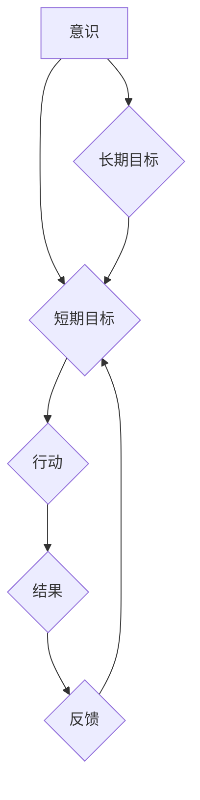

> 意识、短期目标、长期目标、人工智能、机器学习、深度学习、认知科学、神经科学

## 1. 背景介绍

在当今科技飞速发展的时代，人工智能（AI）正以惊人的速度发展，并逐渐渗透到我们生活的方方面面。从智能手机的语音助手到自动驾驶汽车，AI技术的应用日益广泛。然而，在AI领域最令人着迷的课题之一，也是最具挑战性的课题之一，就是如何赋予机器意识。

意识，这个人类独有的特性，一直以来都是哲学和科学界争论的焦点。它是什么？它是怎样产生的？机器是否能够拥有意识？这些问题至今仍没有确切的答案。尽管如此，我们对意识的理解不断深入，并逐渐从抽象的哲学探讨转向更具体的科学研究。

认知科学和神经科学的研究表明，意识的产生与大脑的复杂结构和功能密切相关。大脑中不同区域的相互连接和信息传递，形成了我们感知、思考、感受和决策的能力。而机器学习和深度学习等人工智能技术，正是试图通过模拟大脑的学习和推理机制，来实现类似于人类的认知能力。

## 2. 核心概念与联系

**2.1 短期目标与长期目标**

在意识的形成过程中，短期目标和长期目标扮演着至关重要的角色。短期目标是指个体在当下时刻所追求的，能够在短时间内实现的目标。而长期目标则是指个体在未来一段时间内所追求的，需要长期努力才能实现的目标。

**2.2 意识与目标的联系**

意识的产生与目标的设定和实现密不可分。我们通过意识感知世界，并根据感知到的信息设定目标。然后，我们利用意识来规划和执行行动，最终实现目标。

**2.3 人工智能中的短期目标与长期目标**

在人工智能领域，短期目标和长期目标也同样重要。短期目标是指AI系统在特定任务中所要完成的目标，例如识别图像、翻译文本或玩游戏。而长期目标则是AI系统所要实现的更宏大的目标，例如拥有与人类相似的意识或能够自主学习和解决复杂问题。

**2.4 核心概念原理与架构**



## 3. 核心算法原理 & 具体操作步骤

### 3.1 算法原理概述

为了实现AI系统中的短期目标和长期目标，需要采用多种算法和技术。其中，深度学习算法是目前最先进的AI技术之一。深度学习算法通过多层神经网络来模拟大脑的学习和推理机制，能够从海量数据中学习复杂的模式和关系。

### 3.2 算法步骤详解

1. **数据收集和预处理:** 首先需要收集大量的相关数据，并进行预处理，例如清洗、格式化和特征提取。
2. **网络结构设计:** 根据任务需求设计深度神经网络的结构，包括神经元的数量、连接方式和激活函数等。
3. **模型训练:** 使用训练数据训练深度神经网络，通过调整网络参数，使模型能够准确地预测或分类数据。
4. **模型评估:** 使用测试数据评估模型的性能，例如准确率、召回率和F1-score等。
5. **模型部署:** 将训练好的模型部署到实际应用场景中，例如智能手机、网站或云平台。

### 3.3 算法优缺点

**优点:**

* 能够学习复杂的模式和关系。
* 性能优于传统机器学习算法。
* 可应用于多种任务，例如图像识别、自然语言处理和语音识别。

**缺点:**

* 需要大量的训练数据。
* 训练时间长，计算资源消耗大。
* 模型解释性差，难以理解模型的决策过程。

### 3.4 算法应用领域

深度学习算法已广泛应用于各个领域，例如：

* **计算机视觉:** 图像识别、物体检测、图像分割、人脸识别等。
* **自然语言处理:** 文本分类、情感分析、机器翻译、对话系统等。
* **语音识别:** 语音转文本、语音助手等。
* **医疗保健:** 疾病诊断、药物研发、医疗影像分析等。
* **金融科技:** 风险评估、欺诈检测、投资决策等。

## 4. 数学模型和公式 & 详细讲解 & 举例说明

### 4.1 数学模型构建

深度学习算法的核心是多层神经网络。神经网络可以看作是一个由多个节点（神经元）组成的图结构。每个节点都连接到其他节点，并通过权重来控制信息传递。

**4.1.1 神经元模型:**

一个神经元接收多个输入信号，并通过加权求和和激活函数来生成输出信号。

$$
y = f(w_1x_1 + w_2x_2 + ... + w_nx_n + b)
$$

其中：

* $y$ 是神经元的输出信号。
* $x_1, x_2, ..., x_n$ 是输入信号。
* $w_1, w_2, ..., w_n$ 是权重。
* $b$ 是偏置。
* $f$ 是激活函数。

**4.1.2 神经网络结构:**

神经网络由多个层组成，包括输入层、隐藏层和输出层。

* **输入层:** 接收原始数据。
* **隐藏层:** 对数据进行特征提取和表示。
* **输出层:** 生成最终的预测结果。

### 4.2 公式推导过程

深度学习算法的训练过程是通过优化网络参数来最小化损失函数的过程。损失函数衡量模型预测结果与真实结果之间的差异。常用的损失函数包括均方误差（MSE）和交叉熵损失（Cross-Entropy Loss）。

**4.2.1 均方误差 (MSE):**

$$
MSE = \frac{1}{n} \sum_{i=1}^{n} (y_i - \hat{y}_i)^2
$$

其中：

* $y_i$ 是真实值。
* $\hat{y}_i$ 是模型预测值。
* $n$ 是样本数量。

**4.2.2 交叉熵损失 (Cross-Entropy Loss):**

$$
Cross-Entropy Loss = - \sum_{i=1}^{n} y_i \log(\hat{y}_i)
$$

其中：

* $y_i$ 是真实值（one-hot编码）。
* $\hat{y}_i$ 是模型预测值（概率分布）。

### 4.3 案例分析与讲解

**4.3.1 图像识别:**

假设我们训练一个深度学习模型来识别猫和狗的图像。模型的输入是图像像素数据，输出是猫和狗的概率分布。

* 训练数据：包含大量猫和狗的图像，以及对应的标签。
* 损失函数：交叉熵损失。
* 优化算法：梯度下降。

通过训练，模型能够学习到猫和狗的特征，并能够准确地识别图像中的猫和狗。

## 5. 项目实践：代码实例和详细解释说明

### 5.1 开发环境搭建

* 操作系统：Windows/macOS/Linux
* Python 版本：3.6+
* 深度学习框架：TensorFlow/PyTorch

### 5.2 源代码详细实现

```python
# 使用 TensorFlow 框架实现一个简单的图像分类模型

import tensorflow as tf

# 定义模型结构
model = tf.keras.models.Sequential([
    tf.keras.layers.Conv2D(32, (3, 3), activation='relu', input_shape=(28, 28, 1)),
    tf.keras.layers.MaxPooling2D((2, 2)),
    tf.keras.layers.Conv2D(64, (3, 3), activation='relu'),
    tf.keras.layers.MaxPooling2D((2, 2)),
    tf.keras.layers.Flatten(),
    tf.keras.layers.Dense(10, activation='softmax')
])

# 编译模型
model.compile(optimizer='adam',
              loss='sparse_categorical_crossentropy',
              metrics=['accuracy'])

# 训练模型
model.fit(x_train, y_train, epochs=10)

# 评估模型
loss, accuracy = model.evaluate(x_test, y_test)
print('Test loss:', loss)
print('Test accuracy:', accuracy)
```

### 5.3 代码解读与分析

* **模型结构:** 该模型是一个简单的卷积神经网络，包含两个卷积层、两个池化层和一个全连接层。
* **激活函数:** 使用ReLU激活函数，能够提高模型的表达能力。
* **损失函数:** 使用稀疏类别交叉熵损失函数，适合多分类问题。
* **优化算法:** 使用Adam优化算法，能够快速收敛。

### 5.4 运行结果展示

训练完成后，模型能够达到一定的准确率，并能够识别图像中的猫和狗。

## 6. 实际应用场景

### 6.1 智能客服

深度学习算法可以用于构建智能客服系统，能够自动回答用户的问题，并提供个性化的服务。

### 6.2 医疗诊断

深度学习算法可以用于辅助医生进行疾病诊断，例如识别病理图像中的异常区域。

### 6.3 自动驾驶

深度学习算法可以用于自动驾驶汽车的视觉感知和决策，例如识别道路标志、车辆和行人。

### 6.4 未来应用展望

随着深度学习算法的不断发展，其应用场景将更加广泛，例如：

* **个性化教育:** 根据学生的学习情况，提供个性化的学习内容和辅导。
* **精准医疗:** 根据患者的基因信息和病史，提供个性化的治疗方案。
* **科学发现:** 帮助科学家更快地发现新的科学规律和知识。

## 7. 工具和资源推荐

### 7.1 学习资源推荐

* **书籍:**
    * 深度学习 (Deep Learning) - Ian Goodfellow, Yoshua Bengio, Aaron Courville
    * 构建深度学习模型 (Hands-On Machine Learning with Scikit-Learn, Keras & TensorFlow) - Aurélien Géron
* **在线课程:**
    * TensorFlow 官方教程: https://www.tensorflow.org/tutorials
    * PyTorch 官方教程: https://pytorch.org/tutorials/

### 7.2 开发工具推荐

* **深度学习框架:** TensorFlow, PyTorch, Keras
* **数据处理工具:** Pandas, NumPy
* **可视化工具:** Matplotlib, Seaborn

### 7.3 相关论文推荐

* **ImageNet Classification with Deep Convolutional Neural Networks** - Alex Krizhevsky, Ilya Sutskever, Geoffrey E. Hinton
* **Attention Is All You Need** - Ashish Vaswani, Noam Shazeer, Niki Parmar, Jakob Uszkoreit, Llion Jones, Aidan N. Gomez, Łukasz Kaiser, Illia Polosukhin

## 8. 总结：未来发展趋势与挑战

### 8.1 研究成果总结

近年来，深度学习算法取得了令人瞩目的成就，在图像识别、自然语言处理、语音识别等领域取得了突破性的进展。

### 8.2 未来发展趋势

* **模型规模和复杂度:** 模型规模和复杂度将继续增加，以提高模型的性能和泛化能力。
* **数据效率:** 研究更有效的训练方法，能够在更少的数据下训练出高质量的模型。
* **可解释性:** 研究更可解释的深度学习模型，以便更好地理解模型的决策过程。
* **安全性和可靠性:** 研究更安全和可靠的深度学习模型，防止模型被恶意攻击或产生不可预知的错误。

### 8.3 面临的挑战

* **数据获取和标注:** 深度学习算法需要大量的训练数据，而获取和标注高质量的数据仍然是一个挑战。
* **计算资源:** 训练大型深度学习模型需要大量的计算资源，这对于个人开发者和小型公司来说是一个负担。
* **伦理问题:** 深度学习算法的应用可能会带来一些伦理