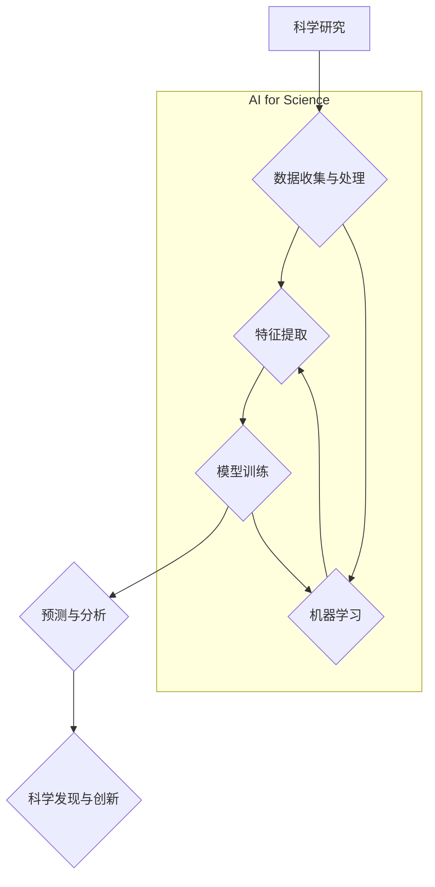

> AI for Science, 机器学习, 深度学习, 科学计算, 数据分析, 跨学科研究

## 1. 背景介绍

科学研究的本质是探索未知，揭示规律，推动人类文明进步。传统科学研究依靠人类的智慧和经验，往往耗时费力，难以突破瓶颈。而人工智能（AI）的兴起，为科学研究带来了前所未有的机遇。AI for Science，即人工智能助力科学研究，是指利用人工智能技术加速科学发现、推动科学创新。

近年来，AI for Science 取得了显著进展，在多个领域展现出巨大的潜力。例如：

* **药物研发：** AI 可以加速药物发现和开发，降低研发成本，提高药物疗效。
* **材料科学：** AI 可以预测新材料的性能，加速材料设计和开发。
* **天文学：** AI 可以分析天文数据，发现新的天体和宇宙现象。
* **气候科学：** AI 可以模拟气候变化，预测未来气候趋势。

AI for Science 的发展，离不开以下几个关键因素：

* **大数据时代：** 科学研究产生了海量数据，AI 可以有效地分析和挖掘这些数据，发现隐藏的规律。
* **计算能力提升：** 随着计算能力的不断提升，AI 算法可以处理更复杂的数据，进行更深入的分析。
* **算法创新：** 研究人员不断开发新的 AI 算法，提高 AI 的性能和应用范围。

## 2. 核心概念与联系

AI for Science 的核心概念包括：

* **机器学习：** 算法从数据中学习，发现模式和规律。
* **深度学习：** 基于多层神经网络的机器学习方法，能够处理更复杂的数据。
* **自然语言处理：** 算法能够理解和处理自然语言文本，例如科学文献。
* **计算机视觉：** 算法能够理解和分析图像和视频数据，例如显微镜图像。

AI for Science 的应用场景广泛，涉及多个学科领域。



## 3. 核心算法原理 & 具体操作步骤

### 3.1  算法原理概述

机器学习算法的核心是通过学习数据中的模式和规律，来预测未来结果或做出决策。常见的机器学习算法包括：

* **监督学习：** 利用标记数据训练模型，例如分类和回归问题。
* **无监督学习：** 利用未标记数据发现数据中的隐藏结构，例如聚类和降维。
* **强化学习：** 通过试错学习，在环境中获得最大奖励。

### 3.2  算法步骤详解

以监督学习为例，其基本步骤如下：

1. **数据收集和预处理：** 收集相关数据，并进行清洗、转换、特征工程等预处理操作。
2. **模型选择：** 根据具体问题选择合适的机器学习模型，例如线性回归、逻辑回归、决策树、支持向量机等。
3. **模型训练：** 利用标记数据训练模型，调整模型参数，使模型能够准确预测结果。
4. **模型评估：** 利用测试数据评估模型的性能，例如准确率、召回率、F1-score等。
5. **模型部署：** 将训练好的模型部署到实际应用场景中，用于预测和决策。

### 3.3  算法优缺点

不同的机器学习算法具有不同的优缺点，需要根据具体问题选择合适的算法。

* **线性回归：** 优点：简单易懂，计算速度快。缺点：对数据线性关系要求高，难以处理复杂关系。
* **逻辑回归：** 优点：适用于分类问题，输出结果易于解释。缺点：对数据线性关系要求高，难以处理复杂关系。
* **决策树：** 优点：易于理解和解释，可以处理非线性关系。缺点：容易过拟合，性能不如其他算法。
* **支持向量机：** 优点：可以处理高维数据，具有较好的泛化能力。缺点：训练时间长，参数设置复杂。

### 3.4  算法应用领域

机器学习算法广泛应用于各个领域，例如：

* **图像识别：** 人脸识别、物体检测、图像分类。
* **自然语言处理：** 文本分类、情感分析、机器翻译。
* **推荐系统：** 商品推荐、音乐推荐、电影推荐。
* **金融预测：** 股票预测、信用风险评估。

## 4. 数学模型和公式 & 详细讲解 & 举例说明

### 4.1  数学模型构建

机器学习算法通常基于数学模型，例如线性回归模型、逻辑回归模型、神经网络模型等。这些模型通过数学公式来描述数据之间的关系，并利用这些关系进行预测或决策。

### 4.2  公式推导过程

例如，线性回归模型的数学公式如下：

$$
y = \theta_0 + \theta_1 x_1 + \theta_2 x_2 + ... + \theta_n x_n + \epsilon
$$

其中：

* $y$ 是预测结果。
* $\theta_0, \theta_1, ..., \theta_n$ 是模型参数。
* $x_1, x_2, ..., x_n$ 是输入特征。
* $\epsilon$ 是误差项。

通过最小化误差函数，可以求解模型参数，从而得到最佳的线性回归模型。

### 4.3  案例分析与讲解

例如，假设我们想要预测房屋价格，输入特征包括房屋面积、房间数量、地理位置等。我们可以使用线性回归模型来建立房屋价格预测模型。通过训练模型，我们可以得到房屋价格与输入特征之间的关系，并利用这个关系预测新房子的价格。

## 5. 项目实践：代码实例和详细解释说明

### 5.1  开发环境搭建

为了实现 AI for Science 的项目实践，我们需要搭建相应的开发环境。常用的开发环境包括：

* **Python 环境：** Python 是机器学习和深度学习的常用编程语言，拥有丰富的库和工具。
* **深度学习框架：** TensorFlow、PyTorch 等深度学习框架提供了高效的深度学习算法和工具。
* **数据存储和处理工具：** Hadoop、Spark 等大数据处理工具可以处理海量数据。

### 5.2  源代码详细实现

以下是一个使用 Python 和 scikit-learn 库实现线性回归模型的代码示例：

```python
from sklearn.linear_model import LinearRegression
from sklearn.model_selection import train_test_split
from sklearn.metrics import mean_squared_error

# 加载数据
data = ...

# 将数据分为训练集和测试集
X_train, X_test, y_train, y_test = train_test_split(data.drop('price', axis=1), data['price'], test_size=0.2)

# 创建线性回归模型
model = LinearRegression()

# 训练模型
model.fit(X_train, y_train)

# 预测测试集结果
y_pred = model.predict(X_test)

# 计算模型性能
mse = mean_squared_error(y_test, y_pred)
print(f'Mean Squared Error: {mse}')
```

### 5.3  代码解读与分析

这段代码首先加载数据，然后将数据分为训练集和测试集。接着，创建线性回归模型并训练模型。最后，使用训练好的模型预测测试集结果，并计算模型性能。

### 5.4  运行结果展示

运行代码后，会输出模型的性能指标，例如均方误差 (MSE)。MSE 越小，模型性能越好。

## 6. 实际应用场景

### 6.1  药物研发

AI for Science 在药物研发领域具有巨大的潜力。例如，AI 可以用于：

* **药物靶点发现：** 识别疾病相关的基因和蛋白质，作为药物靶点。
* **药物分子设计：** 设计具有特定生物活性的药物分子。
* **药物筛选：** 从大量的化合物库中筛选出潜在的药物候选物。

### 6.2  材料科学

AI for Science 可以加速材料科学的进步，例如：

* **新材料设计：** 预测新材料的性能，例如强度、导电性、耐热性等。
* **材料缺陷检测：** 利用图像识别技术检测材料中的缺陷。
* **材料性能优化：** 通过调整材料成分和结构，优化材料性能。

### 6.3  天文学

AI for Science 可以帮助天文学家探索宇宙的奥秘，例如：

* **天体分类：** 自动识别不同类型的星系、恒星和星云。
* **天体运动预测：** 预测天体的运动轨迹。
* **宇宙演化研究：** 分析宇宙大爆炸后的演化过程。

### 6.4  未来应用展望

AI for Science 的应用前景广阔，未来将有更多新的应用场景出现，例如：

* **精准医疗：** 根据患者的基因信息和生活习惯，提供个性化的医疗方案。
* **可持续发展：** 利用 AI 优化能源利用、减少环境污染。
* **人工智能安全：** 开发安全可靠的人工智能系统，避免 AI 造成负面影响。

## 7. 工具和资源推荐

### 7.1  学习资源推荐

* **在线课程：** Coursera、edX、Udacity 等平台提供丰富的机器学习和深度学习课程。
* **书籍：** 《深入理解深度学习》、《机器学习实战》等书籍是机器学习和深度学习的经典教材。
* **开源项目：** TensorFlow、PyTorch 等开源项目提供了丰富的代码示例和学习资源。

### 7.2  开发工具推荐

* **Python：** 机器学习和深度学习的常用编程语言。
* **Jupyter Notebook：** 用于编写和运行 Python 代码的交互式笔记本环境。
* **TensorFlow、PyTorch：** 深度学习框架，提供高效的深度学习算法和工具。

### 7.3  相关论文推荐

* **《ImageNet Classification with Deep Convolutional Neural Networks》**
* **《Attention Is All You Need》**
* **《BERT: Pre-training of Deep Bidirectional Transformers for Language Understanding》**

## 8. 总结：未来发展趋势与挑战

### 8.1  研究成果总结

AI for Science 取得了显著进展，在多个领域展现出巨大的潜力。

### 8.2  未来发展趋势

未来，AI for Science 将朝着以下方向发展：

* **更强大的算法：** 研究人员将继续开发更强大的 AI 算法，提高 AI 的性能和应用范围。
* **更丰富的应用场景：** AI for Science 将应用于更多领域，例如精准医疗、可持续发展等。
* **更紧密的跨学科合作：** AI for Science 需要跨学科合作，将 AI 技术与科学研究相结合。

### 8.3  面临的挑战

AI for Science 也面临一些挑战：

* **数据获取和质量：** 科学研究数据往往分散、不完整，需要开发新的方法来获取和处理这些数据。
* **算法解释性和可信度：** AI 算法的决策过程往往难以解释，需要提高 AI 算法的解释性和可信度。
* **伦理和社会影响：** AI for Science 的应用可能带来伦理和社会影响，需要认真考虑这些问题。

### 8.4  研究展望

尽管面临挑战，但 AI for Science 的未来充满希望。随着 AI 技术的不断发展，AI for Science 将为科学研究带来革命性的变革，推动人类文明进步。

## 9. 附录：常见问题与解答

### 9.1  Q1：AI for Science 与传统科学研究有什么区别？

**A1：** AI for Science 利用人工智能技术辅助科学研究，可以加速科学发现、提高研究效率，而传统科学研究主要依靠人类的智慧和经验。

### 9.2  Q2：AI for Science 需要哪些技术基础？

**A2：** AI for Science 需要掌握机器学习