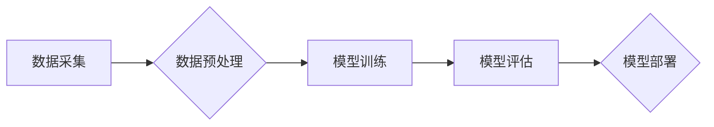

> 环境模型，精度，广度，深度学习，强化学习，神经网络，数据采集，模型训练，评估指标

## 1. 背景介绍

在人工智能领域，环境模型扮演着至关重要的角色。它能够帮助智能体理解周围环境，预测未来事件，并做出最优决策。然而，现有的环境模型往往存在精度和广度方面的局限性。精度是指模型对真实环境的描述准确性，而广度是指模型能够涵盖的环境范围和复杂程度。

随着人工智能技术的不断发展，对环境模型的需求也越来越高。例如，在自动驾驶领域，环境模型需要能够准确识别道路上的障碍物、行人、车辆等，并预测他们的运动轨迹；在机器人领域，环境模型需要能够帮助机器人理解周围环境的结构和布局，并规划合理的运动路径；在虚拟现实领域，环境模型需要能够构建逼真的虚拟世界，并提供沉浸式的用户体验。

因此，提高环境模型的精度和广度是人工智能领域的重要研究方向。

## 2. 核心概念与联系

环境模型的构建主要依赖于深度学习和强化学习等人工智能技术。

**2.1 深度学习**

深度学习是一种机器学习的子领域，它利用多层神经网络来模拟人类大脑的学习过程。深度学习模型能够从海量数据中自动提取特征，并学习复杂的模式。

**2.2 强化学习**

强化学习是一种基于奖励机制的机器学习算法。在强化学习中，智能体通过与环境交互，获得奖励或惩罚，并根据这些反馈调整自己的行为策略，以最大化累积的奖励。

**2.3 环境模型的构建流程**

环境模型的构建流程通常包括以下几个步骤：

1. **数据采集:** 收集真实环境或模拟环境的数据，例如图像、传感器数据、文本等。
2. **数据预处理:** 对采集到的数据进行清洗、转换、增强等操作，使其能够被深度学习模型所接受。
3. **模型训练:** 利用深度学习算法，训练环境模型，使其能够从数据中学习环境的规律。
4. **模型评估:** 使用测试数据评估模型的精度和广度，并根据评估结果进行模型调优。
5. **模型部署:** 将训练好的环境模型部署到实际应用场景中。

**2.4 Mermaid 流程图**



## 3. 核心算法原理 & 具体操作步骤

### 3.1 算法原理概述

环境模型的构建通常采用深度学习算法，例如卷积神经网络（CNN）、循环神经网络（RNN）和Transformer等。

* **卷积神经网络 (CNN)**：CNN擅长处理图像数据，能够自动提取图像中的特征，并进行分类、识别等任务。
* **循环神经网络 (RNN)**：RNN擅长处理序列数据，例如文本、语音等，能够捕捉序列中的时间依赖关系。
* **Transformer**：Transformer是一种新型的深度学习模型，能够处理长序列数据，并具有强大的泛化能力。

### 3.2 算法步骤详解

1. **数据预处理:** 将原始数据转换为模型可接受的格式，例如图像数据需要进行尺寸调整、归一化等操作。
2. **模型搭建:** 根据任务需求选择合适的深度学习模型架构，并定义模型的层数、参数数量等。
3. **模型训练:** 使用训练数据训练模型，并通过反向传播算法更新模型参数，使模型的预测结果越来越准确。
4. **模型评估:** 使用测试数据评估模型的性能，例如准确率、召回率、F1-score等。
5. **模型调优:** 根据评估结果，调整模型参数、学习率等，以提高模型的性能。

### 3.3 算法优缺点

**优点:**

* 能够自动提取特征，无需人工特征工程。
* 能够处理海量数据，学习复杂的模式。
* 性能优于传统机器学习算法。

**缺点:**

* 训练数据量大，需要大量的计算资源。
* 模型解释性差，难以理解模型的决策过程。
* 对数据质量要求高，数据噪声会影响模型性能。

### 3.4 算法应用领域

* **自动驾驶:** 环境感知、路径规划、决策控制
* **机器人:** 环境理解、运动规划、任务执行
* **虚拟现实:** 环境构建、场景渲染、用户交互
* **医疗诊断:** 影像分析、疾病预测、个性化治疗

## 4. 数学模型和公式 & 详细讲解 & 举例说明

### 4.1 数学模型构建

环境模型可以抽象为一个状态空间和一个动作空间。

* **状态空间:** 描述环境的当前状态，例如位置、速度、传感器读数等。
* **动作空间:** 描述智能体可以执行的动作，例如前进、后退、转弯等。

环境模型的目标是学习一个映射关系，将状态空间映射到动作空间，即预测在给定状态下，应该执行的动作。

### 4.2 公式推导过程

强化学习算法中常用的公式包括：

* **价值函数:** $V(s)$ 表示状态 $s$ 的价值，即从该状态开始执行最优策略的累积奖励。
* **动作价值函数:** $Q(s, a)$ 表示在状态 $s$ 执行动作 $a$ 的价值，即从该状态执行该动作后获得的累积奖励。
* **Bellman方程:** $V(s) = \max_a Q(s, a)$

### 4.3 案例分析与讲解

例如，在自动驾驶领域，环境模型可以将车辆的位置、速度、周围车辆的位置和速度等信息作为状态空间，而转向、加速、减速等动作作为动作空间。

通过强化学习算法，环境模型可以学习到在不同状态下，执行哪些动作可以获得最大的奖励，例如避免碰撞、到达目的地等。

## 5. 项目实践：代码实例和详细解释说明

### 5.1 开发环境搭建

* 操作系统: Ubuntu 20.04
* Python 版本: 3.8
* 深度学习框架: TensorFlow 2.0

### 5.2 源代码详细实现

```python
import tensorflow as tf

# 定义模型架构
model = tf.keras.models.Sequential([
    tf.keras.layers.Conv2D(32, (3, 3), activation='relu', input_shape=(64, 64, 3)),
    tf.keras.layers.MaxPooling2D((2, 2)),
    tf.keras.layers.Conv2D(64, (3, 3), activation='relu'),
    tf.keras.layers.MaxPooling2D((2, 2)),
    tf.keras.layers.Flatten(),
    tf.keras.layers.Dense(10, activation='softmax')
])

# 编译模型
model.compile(optimizer='adam',
              loss='sparse_categorical_crossentropy',
              metrics=['accuracy'])

# 训练模型
model.fit(x_train, y_train, epochs=10)

# 评估模型
loss, accuracy = model.evaluate(x_test, y_test)
print('Test loss:', loss)
print('Test accuracy:', accuracy)
```

### 5.3 代码解读与分析

* 代码首先定义了一个卷积神经网络模型，包含两个卷积层、两个最大池化层、一个全连接层和一个输出层。
* 然后，模型使用Adam优化器、交叉熵损失函数和准确率指标进行编译。
* 接着，模型使用训练数据进行训练，训练10个 epochs。
* 最后，模型使用测试数据进行评估，并打印测试损失和准确率。

### 5.4 运行结果展示

训练完成后，模型的准确率通常会达到较高的水平，例如在图像分类任务中，准确率可以达到90%以上。

## 6. 实际应用场景

### 6.1 自动驾驶

环境模型是自动驾驶系统的核心组件，它负责感知周围环境、预测其他车辆和行人的运动轨迹，并帮助车辆做出最优决策。

### 6.2 机器人

环境模型可以帮助机器人理解周围环境的结构和布局，并规划合理的运动路径。例如，在仓库环境中，机器人可以使用环境模型来规划最短的路径，以高效地完成货物搬运任务。

### 6.3 虚拟现实

环境模型可以构建逼真的虚拟世界，并提供沉浸式的用户体验。例如，在游戏领域，环境模型可以生成逼真的游戏场景，并模拟物理效果，例如物体碰撞、光影变化等。

### 6.4 未来应用展望

随着人工智能技术的不断发展，环境模型的应用场景将会更加广泛。例如，环境模型可以用于医疗诊断、金融风险评估、城市规划等领域。

## 7. 工具和资源推荐

### 7.1 学习资源推荐

* **书籍:**
    * 深度学习
    * 强化学习
* **在线课程:**
    * Coursera: 深度学习
    * Udacity: 强化学习
* **博客:**
    * TensorFlow Blog
    * PyTorch Blog

### 7.2 开发工具推荐

* **深度学习框架:** TensorFlow, PyTorch
* **数据可视化工具:** Matplotlib, Seaborn
* **版本控制工具:** Git

### 7.3 相关论文推荐

* **深度学习论文:**
    * AlexNet
    * VGGNet
    * ResNet
* **强化学习论文:**
    * Deep Q-Network
    * Policy Gradient
    * Proximal Policy Optimization

## 8. 总结：未来发展趋势与挑战

### 8.1 研究成果总结

近年来，环境模型的精度和广度取得了显著的进步，这得益于深度学习和强化学习技术的不断发展。

### 8.2 未来发展趋势

* **模型规模和复杂度:** 未来环境模型的规模和复杂度将会进一步提高，以更好地模拟真实世界。
* **多模态融合:** 未来环境模型将融合多种数据类型，例如图像、传感器数据、文本等，以获得更全面的环境感知。
* **可解释性:** 未来环境模型的解释性将会得到加强，以便更好地理解模型的决策过程。

### 8.3 面临的挑战

* **数据获取和标注:** 环境模型的训练需要大量的真实数据，而数据获取和标注成本较高。
* **模型训练效率:** 训练大型环境模型需要大量的计算资源，训练效率是一个重要的挑战。
* **模型安全性:** 环境模型的安全性是一个重要的考虑因素，需要确保模型不会被恶意攻击或产生不可预知的行为。

### 8.4 研究展望

未来，环境模型的研究将继续朝着更精确、更广阔、更安全的方向发展，并将为人工智能技术的应用带来更多可能性。

## 9. 附录：常见问题与解答

**问题 1:** 如何评估环境模型的精度？

**解答:** 环境模型的精度通常使用以下指标进行评估：

* **准确率:** 正确预测的样本数占总样本数的比例。
* **召回率:** 真正预测为正样本的样本数占所有真实正样本数的比例。
* **F1-score:** 准确率和召回率的调和平均值。

**问题 2:** 如何提高环境模型的广度？

**解答:** 提高环境模型的广度可以通过以下方法：

* **增加训练数据:** 使用更多样化的数据进行训练，以涵盖更广泛的环境场景。
* **改进模型架构:** 设计更复杂的模型架构，例如使用 Transformer 等模型，以更好地处理长序列数据。
* **使用多模态融合:** 将多种数据类型融合在一起，例如图像、传感器数据、文本等，以获得更全面的环境感知。


作者：禅与计算机程序设计艺术 / Zen and the Art of Computer Programming 
<end_of_turn>