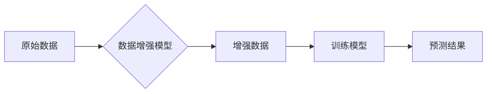

> 数据增强, 迁移学习, 深度学习, 计算机视觉, 自然语言处理, 生成对抗网络

## 1. 背景介绍

数据是深度学习的基石，高质量的数据能够显著提升模型的性能。然而，获取高质量标注数据往往成本高昂且耗时费力。数据增强技术应运而生，通过对现有数据进行各种变换，生成新的训练数据，从而有效缓解数据稀缺问题。

传统的经验驱动数据增强方法主要依赖于对数据本身的分析和理解，例如图像的旋转、缩放、翻转、裁剪等操作。这些方法简单易行，但往往难以生成多样化、高质量的增强数据，并且容易陷入“过拟合”的陷阱。

随着深度学习技术的不断发展，数据增强技术也迎来了新的突破。想象力驱动数据增强方法，利用生成对抗网络 (GAN) 等生成模型，能够生成更加逼真、多样化的增强数据，甚至可以生成与原始数据分布相似的“虚假”数据。

## 2. 核心概念与联系

数据增强擦边球的核心概念在于利用生成模型的强大能力，突破传统经验驱动数据增强的局限性，生成更加逼真、多样化的增强数据。

**数据增强流程:**



**核心概念:**

* **数据增强模型:**  利用生成对抗网络 (GAN) 等生成模型，学习原始数据的分布，并生成新的数据样本。
* **增强数据:** 由数据增强模型生成的，与原始数据分布相似的新的数据样本。
* **训练模型:** 利用原始数据和增强数据进行训练，提升模型的泛化能力。

## 3. 核心算法原理 & 具体操作步骤

### 3.1  算法原理概述

想象力驱动数据增强主要基于生成对抗网络 (GAN) 的原理。GAN 由两个网络组成：生成器 (Generator) 和判别器 (Discriminator)。

* **生成器:** 负责生成新的数据样本，试图欺骗判别器。
* **判别器:** 负责判断数据样本是真实数据还是生成数据。

生成器和判别器之间进行对抗训练，生成器不断改进生成的数据质量，判别器不断提高识别真实数据的能力。最终，生成器能够生成与真实数据分布相似的增强数据。

### 3.2  算法步骤详解

1. **初始化:** 初始化生成器和判别器网络参数。
2. **训练判别器:** 使用真实数据和生成器生成的假数据训练判别器，使其能够区分真实数据和假数据。
3. **训练生成器:** 使用判别器反馈的判别结果，训练生成器，使其生成更加逼真的假数据。
4. **重复步骤2和3:**  反复训练判别器和生成器，直到生成器能够生成与真实数据分布相似的增强数据。

### 3.3  算法优缺点

**优点:**

* 可以生成更加逼真、多样化的增强数据。
* 不需要人工标注数据，降低了数据标注成本。
* 可以应用于各种数据类型，例如图像、文本、音频等。

**缺点:**

* 训练复杂度高，需要大量的计算资源。
* 生成的数据可能存在一些不可控的偏差。
* 难以评估生成数据的质量。

### 3.4  算法应用领域

* **计算机视觉:** 图像分类、目标检测、图像分割等任务。
* **自然语言处理:** 文本分类、情感分析、机器翻译等任务。
* **语音识别:** 语音识别、语音合成等任务。
* **医疗影像分析:** 病灶检测、疾病诊断等任务。

## 4. 数学模型和公式 & 详细讲解 & 举例说明

### 4.1  数学模型构建

GAN 的核心数学模型是生成器 (G) 和判别器 (D) 的损失函数。

* **判别器损失函数:**

$$
L_D(D, X, G(Z)) = E_{x \sim p_{data}(x)}[log D(x)] + E_{z \sim p_z(z)}[log(1 - D(G(z)))]
$$

* **生成器损失函数:**

$$
L_G(G, D, Z) = E_{z \sim p_z(z)}[log D(G(z))]
$$

其中:

* $X$ 是真实数据样本。
* $Z$ 是随机噪声向量。
* $G(Z)$ 是生成器生成的假数据样本。
* $p_{data}(x)$ 是真实数据分布。
* $p_z(z)$ 是随机噪声分布。

### 4.2  公式推导过程

判别器损失函数旨在最大化判别器对真实数据和假数据的正确分类概率。生成器损失函数旨在最小化判别器对生成数据的判别概率。

通过最小化生成器损失函数和最大化判别器损失函数，生成器和判别器之间进行对抗训练，最终使得生成器能够生成与真实数据分布相似的增强数据。

### 4.3  案例分析与讲解

例如，在图像数据增强领域，可以使用 GAN 生成更加逼真的图像增强数据，例如：

* 将低分辨率图像增强到高分辨率。
* 将黑白图像转换为彩色图像。
* 将图像进行风格迁移。

## 5. 项目实践：代码实例和详细解释说明

### 5.1  开发环境搭建

* Python 3.7+
* TensorFlow/PyTorch
* CUDA/cuDNN

### 5.2  源代码详细实现

```python
# 生成器网络结构
class Generator(nn.Module):
    def __init__(self):
        super(Generator, self).__init__()
        # ...

    def forward(self, z):
        # ...

# 判别器网络结构
class Discriminator(nn.Module):
    def __init__(self):
        super(Discriminator, self).__init__()
        # ...

    def forward(self, x):
        # ...

# 训练循环
for epoch in range(num_epochs):
    for batch_idx, (real_data, _) in enumerate(train_loader):
        # ...
```

### 5.3  代码解读与分析

* 生成器网络结构负责从随机噪声向量生成新的数据样本。
* 判别器网络结构负责判断数据样本是真实数据还是生成数据。
* 训练循环中，首先使用真实数据训练判别器，然后使用生成器生成的假数据训练判别器，最后使用判别器反馈的判别结果训练生成器。

### 5.4  运行结果展示

训练完成后，可以利用生成器生成新的增强数据，并将其与原始数据进行对比，观察增强数据的质量。

## 6. 实际应用场景

### 6.1  图像数据增强

* **医学影像分析:** 增强病灶图像的质量，提高疾病诊断的准确率。
* **自动驾驶:** 增强驾驶场景图像的多样性，提高自动驾驶系统的鲁棒性。
* **人脸识别:** 增强人脸图像的旋转、缩放、光照变化等方面的鲁棒性。

### 6.2  文本数据增强

* **机器翻译:** 增强训练数据的多样性，提高机器翻译的准确率。
* **文本分类:** 增强训练数据的语义丰富度，提高文本分类的准确率。
* **情感分析:** 增强训练数据的负面情感表达，提高情感分析的准确率。

### 6.3  语音数据增强

* **语音识别:** 增强训练数据的噪声鲁棒性，提高语音识别的准确率。
* **语音合成:** 增强训练数据的语调和情感表达，提高语音合成的自然度。

### 6.4  未来应用展望

* **多模态数据增强:** 将图像、文本、音频等多种模态数据进行融合增强，提高模型的泛化能力。
* **个性化数据增强:** 根据用户的特定需求，生成个性化的增强数据。
* **联邦学习数据增强:** 在不泄露原始数据的情况下，利用联邦学习的机制进行数据增强。

## 7. 工具和资源推荐

### 7.1  学习资源推荐

* **论文:**
    * Goodfellow, I., Pouget-Abadie, J., Mirza, M., Xu, B., Warde-Farley, D., Ozair, S., ... & Bengio, Y. (2014). Generative adversarial nets. In Advances in neural information processing systems (pp. 2672-2680).
* **博客:**
    * https://blog.openai.com/generative-adversarial-nets/
    * https://towardsdatascience.com/generative-adversarial-networks-gans-explained-with-code-examples-a39819b2999b

### 7.2  开发工具推荐

* **TensorFlow:** https://www.tensorflow.org/
* **PyTorch:** https://pytorch.org/

### 7.3  相关论文推荐

* Radford, A., Metz, L., & Chintala, S. (2015). Unsupervised representation learning with deep convolutional generative adversarial networks. arXiv preprint arXiv:1511.06434.
* Isola, P., Zhu, J. Y., Zhou, T., & Efros, A. A. (2017). Image-to-image translation with conditional adversarial networks. In Proceedings of the IEEE conference on computer vision and pattern recognition (pp. 1125-1134).

## 8. 总结：未来发展趋势与挑战

### 8.1  研究成果总结

数据增强擦边球技术取得了显著的进展，能够生成更加逼真、多样化的增强数据，有效缓解了数据稀缺问题，提升了深度学习模型的性能。

### 8.2  未来发展趋势

* **更强大的生成模型:** 研究更强大的生成模型，例如 Transformer-based GAN，能够生成更加高质量、多样化的增强数据。
* **自适应数据增强:** 研究能够根据特定任务和数据分布自适应调整增强策略的数据增强方法。
* **多模态数据增强:** 研究将图像、文本、音频等多种模态数据进行融合增强，提高模型的泛化能力。

### 8.3  面临的挑战

* **生成数据质量评估:** 难以准确评估生成数据的质量，需要开发更加有效的评估指标。
* **数据偏差问题:** 生成的数据可能存在一些不可控的偏差，需要研究如何减轻数据偏差的影响。
* **计算资源需求:** 训练强大的生成模型需要大量的计算资源，需要研究如何降低训练成本。

### 8.4  研究展望

数据增强擦边球技术仍处于发展初期，未来还有很多值得探索的方向。随着深度学习技术的不断发展，数据增强技术将会更加成熟，并在更多领域得到应用。

## 9. 附录：常见问题与解答

* **Q: 数据增强擦边球和传统数据增强有什么区别？**

* **A:** 数据增强擦边球利用生成模型生成新的数据样本，而传统数据增强方法主要依赖于对现有数据进行各种变换。

* **Q: 数据增强擦边球的应用场景有哪些？**

* **A:** 数据增强擦边球可以应用于各种数据类型，例如图像、文本、音频等，在计算机视觉、自然语言处理、语音识别等领域都有广泛的应用。

* **Q: 数据增强擦边球的优势和劣势是什么？**

* **A:** 数据增强擦边球的优势在于可以生成更加逼真、多样化的增强数据，而劣势在于训练复杂度高，需要大量的计算资源。


作者：禅与计算机程序设计艺术 / Zen and the Art of Computer Programming 
<end_of_turn>