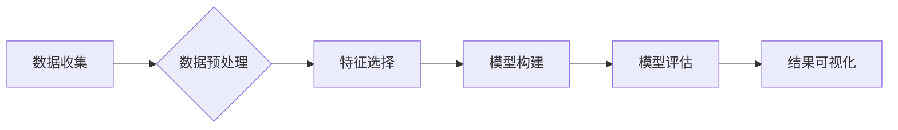

> 数据挖掘, 算法原理, 机器学习, 数据分析, 预测建模, Python, scikit-learn, 案例分析

## 1. 背景介绍

在信息爆炸的时代，海量数据无处不在，蕴藏着丰富的价值。如何从海量数据中提取有价值的信息，洞察隐藏的规律，已成为各行各业亟需解决的关键问题。数据挖掘作为一种从数据中发现模式和知识的科学方法，应运而生。它利用统计学、机器学习、数据库技术等多种学科的交叉融合，从大量数据中挖掘出有价值的知识和信息，为决策提供支持。

数据挖掘技术在各个领域都有广泛的应用，例如：

* **商业领域:** 客户关系管理、市场营销预测、产品推荐、欺诈检测等。
* **金融领域:** 风险评估、信用评分、投资决策、欺诈识别等。
* **医疗领域:** 疾病诊断、药物研发、患者风险预测等。
* **科学研究:** 数据分析、模式识别、知识发现等。

## 2. 核心概念与联系

数据挖掘的核心是通过一系列算法和技术，从海量数据中发现隐藏的模式、规律和知识。

**数据挖掘流程:**



**数据挖掘的主要步骤:**

1. **数据收集:** 从各种来源收集相关数据，例如数据库、文本文件、传感器数据等。
2. **数据预处理:** 对收集到的数据进行清洗、转换、整合等操作，使其符合数据挖掘算法的输入要求。
3. **特征选择:** 从原始数据中选择最具代表性的特征，用于构建模型。
4. **模型构建:** 选择合适的算法，根据特征数据构建数据挖掘模型。
5. **模型评估:** 对构建的模型进行评估，验证其准确性和有效性。
6. **结果可视化:** 将挖掘出的结果以图表、报告等形式呈现，方便理解和分析。

## 3. 核心算法原理 & 具体操作步骤

### 3.1  算法原理概述

数据挖掘算法种类繁多，常见的算法包括：

* **分类算法:** 用于将数据划分为不同的类别，例如决策树、支持向量机、朴素贝叶斯等。
* **回归算法:** 用于预测连续数值，例如线性回归、逻辑回归、支持向量回归等。
* **聚类算法:** 用于将数据划分为若干个簇，例如K-means聚类、层次聚类等。
* **关联规则挖掘算法:** 用于发现数据中存在的关联关系，例如Apriori算法、FP-Growth算法等。

### 3.2  算法步骤详解

以决策树算法为例，详细介绍其步骤：

1. **选择特征:** 根据特征的重要性，选择最优特征作为根节点。
2. **划分数据集:** 根据选择的特征，将数据集划分为若干个子集。
3. **递归构建树:** 对每个子集重复步骤1和2，直到满足停止条件。
4. **生成决策规则:** 根据决策树的结构，生成决策规则。

### 3.3  算法优缺点

**决策树算法的优点:**

* 易于理解和解释。
* 可以处理不同类型的数据。
* 训练速度快。

**决策树算法的缺点:**

* 容易过拟合。
* 对数据噪声敏感。
* 对于连续特征，需要进行离散化处理。

### 3.4  算法应用领域

决策树算法广泛应用于：

* **分类问题:** 邮件过滤、文本分类、图像识别等。
* **回归问题:** 房价预测、股票价格预测等。
* **决策支持:** 医疗诊断、金融风险评估等。

## 4. 数学模型和公式 & 详细讲解 & 举例说明

### 4.1  数学模型构建

决策树算法的构建过程可以看作是一个递归的决策过程，每个节点代表一个决策规则，每个分支代表一个可能的决策结果。

### 4.2  公式推导过程

决策树算法常用的评估指标是信息增益，用于衡量特征对数据的分类能力。信息增益的公式如下：

$$
Gain(S, A) = Entropy(S) - \sum_{v \in Values(A)} \frac{|S_v|}{|S|} Entropy(S_v)
$$

其中：

* $S$ 是数据集。
* $A$ 是特征。
* $Values(A)$ 是特征 $A$ 的所有取值。
* $S_v$ 是特征 $A$ 取值为 $v$ 的子集。
* $Entropy(S)$ 是数据集 $S$ 的熵。
* $Entropy(S_v)$ 是子集 $S_v$ 的熵。

### 4.3  案例分析与讲解

假设我们有一个数据集，用于预测客户是否会购买商品。特征包括年龄、收入、性别等。

我们可以使用信息增益来选择最优特征作为根节点。例如，如果年龄特征的信息增益最大，则选择年龄特征作为根节点。

## 5. 项目实践：代码实例和详细解释说明

### 5.1  开发环境搭建

本项目使用 Python 语言和 scikit-learn 库进行开发。

需要安装 Python 和 scikit-learn 库。

### 5.2  源代码详细实现

```python
from sklearn.tree import DecisionTreeClassifier
from sklearn.model_selection import train_test_split
from sklearn.metrics import accuracy_score

# 加载数据
data = ...

# 将数据分为特征和标签
X = data.drop('target', axis=1)
y = data['target']

# 将数据分为训练集和测试集
X_train, X_test, y_train, y_test = train_test_split(X, y, test_size=0.2, random_state=42)

# 创建决策树模型
model = DecisionTreeClassifier()

# 训练模型
model.fit(X_train, y_train)

# 对测试集进行预测
y_pred = model.predict(X_test)

# 计算模型准确率
accuracy = accuracy_score(y_test, y_pred)
print(f'模型准确率: {accuracy}')
```

### 5.3  代码解读与分析

* 首先，加载数据并将其分为特征和标签。
* 然后，将数据分为训练集和测试集。
* 创建决策树模型，并使用训练集训练模型。
* 对测试集进行预测，并计算模型准确率。

### 5.4  运行结果展示

运行代码后，会输出模型的准确率。

## 6. 实际应用场景

数据挖掘技术在各个领域都有广泛的应用，例如：

* **商业领域:** 客户关系管理、市场营销预测、产品推荐、欺诈检测等。
* **金融领域:** 风险评估、信用评分、投资决策、欺诈识别等。
* **医疗领域:** 疾病诊断、药物研发、患者风险预测等。
* **科学研究:** 数据分析、模式识别、知识发现等。

## 7. 工具和资源推荐

### 7.1  学习资源推荐

* **书籍:**
    * 《数据挖掘：概念与技术》
    * 《数据挖掘实战》
    * 《机器学习》
* **在线课程:**
    * Coursera 上的《数据科学》课程
    * edX 上的《机器学习》课程

### 7.2  开发工具推荐

* **Python:** 数据挖掘的常用编程语言。
* **scikit-learn:** Python 的机器学习库。
* **pandas:** Python 的数据分析库。
* **matplotlib:** Python 的数据可视化库。

### 7.3  相关论文推荐

* 《The Elements of Statistical Learning》
* 《Introduction to Machine Learning》
* 《Data Mining: Concepts and Techniques》

## 8. 总结：未来发展趋势与挑战

### 8.1  研究成果总结

数据挖掘技术近年来取得了长足的进步，在各个领域都有广泛的应用。

### 8.2  未来发展趋势

* **深度学习:** 深度学习算法在数据挖掘领域展现出强大的潜力，未来将成为主流算法之一。
* **云计算:** 云计算平台为数据挖掘提供了强大的计算资源和存储空间，将推动数据挖掘技术的快速发展。
* **大数据:** 大数据的涌现为数据挖掘提供了更丰富的素材，也将带来新的挑战和机遇。

### 8.3  面临的挑战

* **数据质量:** 数据挖掘的准确性依赖于数据质量，如何有效处理脏数据和缺失数据是一个重要的挑战。
* **算法解释性:** 一些数据挖掘算法的内部机制难以理解，如何提高算法的解释性是一个重要的研究方向。
* **隐私保护:** 数据挖掘过程中需要处理大量敏感数据，如何保护用户隐私是一个重要的伦理问题。

### 8.4  研究展望

未来，数据挖掘技术将继续朝着更智能、更自动化、更安全的方向发展。

## 9. 附录：常见问题与解答

* **什么是数据挖掘？**

数据挖掘是一种从数据中发现模式和知识的科学方法。

* **数据挖掘有哪些应用场景？**

数据挖掘在各个领域都有广泛的应用，例如商业、金融、医疗、科学研究等。

* **数据挖掘有哪些常用算法？**

常见的算法包括分类算法、回归算法、聚类算法、关联规则挖掘算法等。

* **如何评估数据挖掘模型的性能？**

常用的评估指标包括准确率、召回率、F1-score等。

* **如何保护用户隐私？**

在数据挖掘过程中，需要采取措施保护用户隐私，例如数据匿名化、差分隐私等。


作者：禅与计算机程序设计艺术 / Zen and the Art of Computer Programming 
<end_of_turn>