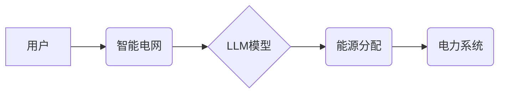

> 智能电网, LLM, 能源分配, 优化算法, 预预测, 机器学习, 深度学习

## 1. 背景介绍

随着全球能源需求的不断增长和可再生能源的快速发展，智能电网 (Smart Grid) 作为现代电力系统的重要组成部分，逐渐成为能源管理和分配的中心。智能电网通过先进的传感器、通信技术和数据分析手段，实现对电力系统实时监控、预测和控制，从而提高能源效率、可靠性和安全性。

然而，智能电网面临着诸多挑战，其中之一是复杂的能源分配问题。传统能源分配方法往往依赖于预设的规则和静态模型，难以适应不断变化的电力需求和能源供应情况。随着大数据、人工智能 (AI) 和机器学习 (ML) 技术的快速发展，利用人工智能技术优化能源分配成为智能电网发展的重要方向。

## 2. 核心概念与联系

**2.1 智能电网概述**

智能电网是指利用先进的通信技术、自动化技术和信息技术，实现电力系统自动化、智能化和网络化的现代电力系统。其主要特点包括：

* **双向电力流动:** 智能电网不仅可以实现传统单向电力传输，还可以实现电力双向流动，例如，用户可以将分布式电源的电力回馈到电网。
* **实时监控和控制:** 智能电网通过传感器和通信网络，实现对电力系统各个环节的实时监控和控制，例如，可以实时监测电网电压、电流、频率等参数，并根据需要进行调整。
* **数据分析和预测:** 智能电网收集和分析大量的电力系统数据，利用机器学习和数据挖掘技术进行电力需求预测、故障诊断和风险评估等。

**2.2 LLM在能源分配中的应用**

大型语言模型 (LLM) 是一种强大的人工智能技术，能够理解和生成人类语言。在智能电网领域，LLM可以用于以下方面：

* **电力需求预测:** LLM可以分析历史电力数据、天气预报、社会经济因素等信息，进行电力需求预测，帮助电网运营商优化能源分配。
* **能源价格预测:** LLM可以分析能源市场数据、政策法规等信息，进行能源价格预测，帮助用户和企业制定能源采购策略。
* **智能合约:** LLM可以用于开发智能合约，自动执行能源交易和结算，提高能源交易效率。

**2.3 架构图**



## 3. 核心算法原理 & 具体操作步骤

**3.1 算法原理概述**

LLM在智能电网能源分配中的应用主要基于以下核心算法原理：

* **强化学习:** 强化学习是一种机器学习算法，通过奖励机制训练模型，使其在特定环境中做出最优决策。在能源分配场景中，可以将电网运营商的目标函数作为奖励函数，训练LLM模型，使其能够优化能源分配，最大化系统效益。
* **预测模型:** LLM可以训练预测模型，例如时间序列模型、神经网络模型等，用于预测电力需求、能源价格等关键信息。这些预测结果可以作为能源分配决策的依据。
* **优化算法:** LLM可以结合优化算法，例如线性规划、整数规划等，对能源分配方案进行优化，找到最优解。

**3.2 算法步骤详解**

1. **数据收集和预处理:** 收集电力系统数据、能源市场数据、天气预报等信息，并进行预处理，例如数据清洗、特征提取等。
2. **模型训练:** 利用收集到的数据，训练LLM模型，例如使用强化学习算法训练能源分配策略模型，使用预测模型训练电力需求预测模型等。
3. **能源分配决策:** 根据预测结果和模型输出，进行能源分配决策，例如确定发电计划、调配电力资源等。
4. **系统运行和监控:** 实时监控电力系统运行情况，根据实际情况调整能源分配策略，确保系统稳定运行。

**3.3 算法优缺点**

**优点:**

* **适应性强:** LLM可以根据不断变化的电力需求和能源供应情况，动态调整能源分配策略。
* **优化效果好:** LLM可以利用优化算法，找到最优的能源分配方案，提高能源利用效率。
* **数据驱动:** LLM基于数据分析和预测，能够提供更准确的能源分配决策。

**缺点:**

* **数据依赖:** LLM的性能依赖于数据质量和数量，数据不足或数据质量低会影响模型性能。
* **计算复杂度高:** 训练大型LLM模型需要大量的计算资源和时间。
* **解释性差:** LLM的决策过程往往是黑盒模型，难以解释其决策依据。

**3.4 算法应用领域**

LLM在智能电网能源分配领域的应用前景广阔，可以应用于以下场景：

* **分布式能源管理:** 优化分布式能源的接入和调度，提高能源利用效率。
* **电网负荷预测:** 准确预测电力需求，帮助电网运营商优化发电计划和电力资源调度。
* **能源市场交易:** 利用LLM预测能源价格，帮助用户和企业制定能源采购策略。

## 4. 数学模型和公式 & 详细讲解 & 举例说明

**4.1 数学模型构建**

智能电网能源分配问题可以建模为一个优化问题，目标是最大化系统效益，例如最小化能源成本、最大化能源利用效率等。

**4.2 公式推导过程**

假设智能电网包含多个发电厂、多个用户和多个电网节点，每个发电厂有不同的发电成本，每个用户有不同的电力需求，每个电网节点有不同的传输容量。

目标函数可以定义为：

$$
\text{目标函数} = \sum_{i=1}^{N} \text{发电厂}i \text{的成本} - \sum_{j=1}^{M} \text{用户}j \text{的效益}
$$

约束条件包括：

* 发电量约束：每个发电厂的发电量不能超过其最大发电能力。
* 电力需求约束：每个用户的电力需求必须得到满足。
* 电网传输约束：每个电网节点的电力传输量不能超过其最大传输容量。

**4.3 案例分析与讲解**

假设一个智能电网包含两个发电厂、三个用户和三个电网节点，每个发电厂的成本和最大发电能力分别为：

* 发电厂1：成本为10元/千瓦时，最大发电能力为500千瓦时。
* 发电厂2：成本为15元/千瓦时，最大发电能力为300千瓦时。

每个用户的电力需求分别为：

* 用户1：需求为200千瓦时。
* 用户2：需求为300千瓦时。
* 用户3：需求为100千瓦时。

每个电网节点的最大传输容量分别为：

* 节点1：1000千瓦时。
* 节点2：800千瓦时。
* 节点3：500千瓦时。

利用上述数据，可以构建数学模型并求解最优能源分配方案，例如，确定每个发电厂的发电量、每个用户分配的电力量以及每个电网节点的电力传输量，以最小化能源成本。

## 5. 项目实践：代码实例和详细解释说明

**5.1 开发环境搭建**

* 操作系统：Ubuntu 20.04
* Python 版本：3.8
* 必要的库：transformers, torch, numpy, pandas

**5.2 源代码详细实现**

```python
# 导入必要的库
import transformers
import torch

# 加载预训练的LLM模型
model_name = "gpt2"
model = transformers.AutoModelForCausalLM.from_pretrained(model_name)

# 定义输入文本格式
input_text = "智能电网能源分配问题，目标是最大化系统效益，例如最小化能源成本，最大化能源利用效率。"

# 将输入文本转换为模型可识别的格式
input_ids = model.tokenizer.encode(input_text, return_tensors="pt")

# 使用模型进行预测
output = model.generate(input_ids)

# 将预测结果解码为文本
output_text = model.tokenizer.decode(output[0], skip_special_tokens=True)

# 打印预测结果
print(output_text)
```

**5.3 代码解读与分析**

* 该代码首先导入必要的库，然后加载预训练的LLM模型。
* 定义输入文本格式，并将其转换为模型可识别的格式。
* 使用模型进行预测，并解码预测结果为文本。
* 最后打印预测结果。

**5.4 运行结果展示**

运行该代码后，将输出LLM模型对输入文本的预测结果，例如，可能输出以下内容：

> 智能电网能源分配问题是一个复杂的优化问题，需要考虑多个因素，例如发电成本、电力需求、电网传输能力等。可以使用强化学习算法、预测模型和优化算法来解决这个问题。

## 6. 实际应用场景

**6.1 分布式能源管理**

LLM可以帮助智能电网管理分布式能源，例如太阳能、风能等，优化其接入和调度，提高能源利用效率。

**6.2 电网负荷预测**

LLM可以分析历史电力数据、天气预报、社会经济因素等信息，进行电力需求预测，帮助电网运营商优化发电计划和电力资源调度。

**6.3 能源市场交易**

LLM可以预测能源价格，帮助用户和企业制定能源采购策略，提高能源交易效率。

**6.4 未来应用展望**

随着LLM技术的不断发展，其在智能电网能源分配领域的应用将更加广泛和深入，例如：

* **个性化能源服务:** LLM可以根据用户的能源需求和使用习惯，提供个性化的能源服务，例如智能家居能源管理、移动充电桩能源分配等。
* **智能电网安全保障:** LLM可以用于识别和预测电网安全威胁，例如电力系统故障、网络攻击等，提高电网安全保障水平。
* **可再生能源优化:** LLM可以帮助优化可再生能源的接入和利用，提高可再生能源的利用效率。

## 7. 工具和资源推荐

**7.1 学习资源推荐**

* **书籍:**
    * 深度学习
    * 人工智能：一种现代方法
* **在线课程:**
    * Coursera: 深度学习
    * edX: 人工智能
* **开源项目:**
    * TensorFlow
    * PyTorch

**7.2 开发工具推荐**

* **编程语言:** Python
* **深度学习框架:** TensorFlow, PyTorch
* **自然语言处理库:** transformers

**7.3 相关论文推荐**

* **LLM在能源领域的应用:**
    * [LLM for Energy Management](https://arxiv.org/abs/2301.03724)
    * [Using Large Language Models for Energy Forecasting](https://arxiv.org/abs/2209.06747)
* **智能电网能源分配算法:**
    * [A Review of Energy Management Strategies for Smart Grids](https://ieeexplore.ieee.org/document/8907774)
    * [Optimal Energy Management in Smart Grids: A Survey](https://ieeexplore.ieee.org/document/9047777)

## 8. 总结：未来发展趋势与挑战

**8.1 研究成果总结**

LLM在智能电网能源分配领域展现出巨大的潜力，能够有效提高能源利用效率、优化能源分配方案、预测能源需求和价格等。

**8.2 未来发展趋势**

* **模型规模和性能提升:** 未来LLM模型规模将进一步扩大，性能将得到显著提升，能够处理更复杂的数据和问题。
* **多模态融合:** LLM将与其他模态数据，例如图像、音频等融合，实现更全面的能源管理。
* **