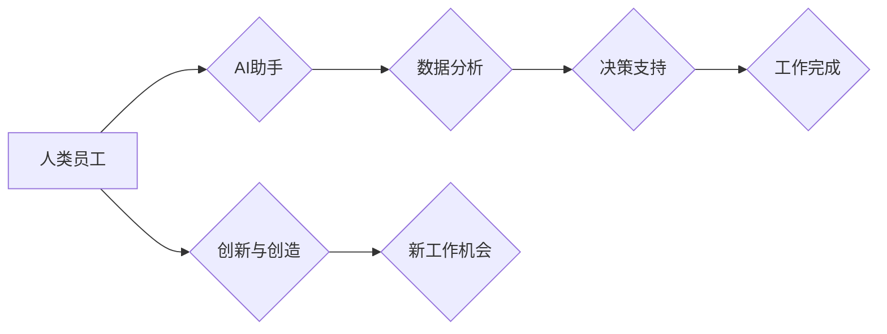

> 人工智能，未来工作，自动化，协作，职业转型，数字技能，伦理

## 1. 背景介绍

随着人工智能（AI）技术的飞速发展，其在各个领域的应用日益广泛，深刻地改变着人类的生活方式和工作模式。从自动驾驶汽车到智能客服系统，从个性化推荐算法到医疗诊断辅助，AI正在无处不在地改变着我们的世界。

然而，AI的发展也引发了人们对未来工作形态的担忧和思考。一些人担心AI将取代人类工作，导致大量失业。而另一些人则认为AI将创造新的工作机会，并提高人类工作效率。

## 2. 核心概念与联系

**2.1 人工智能 (AI)**

人工智能是指模拟人类智能行为的计算机系统。这些系统能够学习、推理、解决问题和做出决策，就像人类一样。AI技术涵盖了多个领域，包括机器学习、深度学习、自然语言处理和计算机视觉等。

**2.2 未来工作形态**

未来工作形态是指在AI技术发展和社会变革的影响下，人类工作方式和组织结构的演变趋势。未来工作形态将更加注重协作、创新和灵活性，并更加依赖于AI技术的辅助。

**2.3 AI与未来工作形态的关系**

AI技术将深刻地影响未来工作形态，主要体现在以下几个方面：

* **自动化:** AI可以自动化许多重复性、规则性工作，释放人类员工的时间和精力，让他们专注于更具创造性和战略性的工作。
* **协作:** AI可以作为人类员工的助手，提供信息、分析数据、提供建议，帮助人类员工更高效地完成工作。
* **个性化:** AI可以根据个人的需求和喜好，提供个性化的工作体验和学习机会。
* **远程工作:** AI可以支持远程工作模式，打破地域限制，让员工可以随时随地工作。

**2.4  AI与未来工作形态的交互流程图**



## 3. 核心算法原理 & 具体操作步骤

**3.1 算法原理概述**

深度学习是人工智能领域的重要分支，其核心算法是多层神经网络。深度学习算法能够从海量数据中学习复杂的模式和特征，从而实现对图像、语音、文本等数据的识别、分类和生成。

**3.2 算法步骤详解**

1. **数据预处理:** 将原始数据进行清洗、转换和格式化，使其适合深度学习算法的训练。
2. **网络结构设计:** 根据任务需求设计多层神经网络的结构，包括神经元数量、连接方式和激活函数等。
3. **参数初始化:** 为神经网络中的参数进行随机初始化。
4. **前向传播:** 将输入数据通过神经网络层层传递，最终得到输出结果。
5. **反向传播:** 计算输出结果与真实值的误差，并根据误差反向调整神经网络的参数，使模型的预测结果更加准确。
6. **训练迭代:** 重复前向传播和反向传播的过程，直到模型的性能达到预期的水平。

**3.3 算法优缺点**

**优点:**

* 能够学习复杂的模式和特征。
* 性能优于传统机器学习算法。
* 应用范围广泛。

**缺点:**

* 需要海量数据进行训练。
* 计算资源消耗大。
* 模型解释性差。

**3.4 算法应用领域**

* **图像识别:** 人脸识别、物体检测、图像分类。
* **语音识别:** 语音转文本、语音助手。
* **自然语言处理:** 机器翻译、文本摘要、情感分析。
* **医疗诊断:** 疾病预测、影像分析。

## 4. 数学模型和公式 & 详细讲解 & 举例说明

**4.1 数学模型构建**

深度学习模型通常采用多层感知机（MLP）或卷积神经网络（CNN）等结构。

**4.2 公式推导过程**

深度学习模型的训练过程基于梯度下降算法。目标函数通常是均方误差（MSE），其公式如下：

$$
MSE = \frac{1}{n} \sum_{i=1}^{n} (y_i - \hat{y}_i)^2
$$

其中：

* $n$ 是样本数量。
* $y_i$ 是第 $i$ 个样本的真实值。
* $\hat{y}_i$ 是第 $i$ 个样本的预测值。

梯度下降算法通过迭代更新模型参数，使目标函数值最小化。

**4.3 案例分析与讲解**

假设我们训练一个图像分类模型，目标是将图像分类为猫或狗。

* **输入数据:** 图像像素值。
* **输出结果:** 猫或狗的类别标签。
* **模型结构:** 多层感知机，包含多个隐藏层。
* **训练过程:** 使用梯度下降算法，通过调整模型参数，使模型能够将图像准确分类。

## 5. 项目实践：代码实例和详细解释说明

**5.1 开发环境搭建**

* Python 3.x
* TensorFlow 或 PyTorch 深度学习框架
* Jupyter Notebook 或 VS Code 代码编辑器

**5.2 源代码详细实现**

```python
import tensorflow as tf

# 定义模型结构
model = tf.keras.models.Sequential([
    tf.keras.layers.Conv2D(32, (3, 3), activation='relu', input_shape=(28, 28, 1)),
    tf.keras.layers.MaxPooling2D((2, 2)),
    tf.keras.layers.Conv2D(64, (3, 3), activation='relu'),
    tf.keras.layers.MaxPooling2D((2, 2)),
    tf.keras.layers.Flatten(),
    tf.keras.layers.Dense(10, activation='softmax')
])

# 编译模型
model.compile(optimizer='adam',
              loss='sparse_categorical_crossentropy',
              metrics=['accuracy'])

# 训练模型
model.fit(x_train, y_train, epochs=10)

# 评估模型
loss, accuracy = model.evaluate(x_test, y_test)
print('Test loss:', loss)
print('Test accuracy:', accuracy)
```

**5.3 代码解读与分析**

* 代码定义了一个简单的卷积神经网络模型，用于图像分类任务。
* 模型包含两个卷积层、两个最大池化层、一个全连接层和一个输出层。
* 模型使用 Adam 优化器、交叉熵损失函数和准确率指标进行训练。
* 训练过程使用训练数据进行迭代训练，直到模型性能达到预期水平。

**5.4 运行结果展示**

训练完成后，模型可以用于对新的图像进行分类。

## 6. 实际应用场景

**6.1 自动化客服系统**

AI驱动的聊天机器人可以自动回答客户常见问题，提供24/7服务，提高客户满意度。

**6.2 个性化推荐系统**

AI算法可以分析用户的行为数据，推荐个性化的商品、服务或内容，提升用户体验。

**6.3 医疗诊断辅助系统**

AI可以辅助医生进行疾病诊断，提高诊断准确率，并帮助医生更快地做出治疗决策。

**6.4 未来应用展望**

* **更智能的自动化:** AI将进一步自动化更多工作流程，释放人类员工的创造力和创新力。
* **更个性化的体验:** AI将提供更加个性化的产品、服务和学习体验。
* **更深入的洞察:** AI将帮助我们更好地理解数据，并从中获得更深入的洞察。

## 7. 工具和资源推荐

**7.1 学习资源推荐**

* **在线课程:** Coursera、edX、Udacity 等平台提供丰富的AI课程。
* **书籍:** 《深度学习》、《机器学习实战》等书籍是学习AI的基础教材。
* **开源项目:** TensorFlow、PyTorch 等开源项目可以帮助你实践AI算法。

**7.2 开发工具推荐**

* **Python:** 作为AI开发的主要语言，Python拥有丰富的库和工具。
* **Jupyter Notebook:** 用于编写和运行Python代码，并可视化数据。
* **VS Code:** 代码编辑器，支持Python开发和调试。

**7.3 相关论文推荐**

* **《ImageNet Classification with Deep Convolutional Neural Networks》**
* **《Attention Is All You Need》**
* **《BERT: Pre-training of Deep Bidirectional Transformers for Language Understanding》**

## 8. 总结：未来发展趋势与挑战

**8.1 研究成果总结**

近年来，AI技术取得了长足的进步，在各个领域都取得了显著的应用成果。

**8.2 未来发展趋势**

* **更强大的计算能力:** 随着硬件技术的进步，AI模型将变得更加强大，能够处理更复杂的任务。
* **更广泛的应用场景:** AI将应用于更多领域，例如教育、金融、医疗等。
* **更注重伦理和可解释性:** 人们将更加关注AI的伦理问题和可解释性，确保AI技术安全、公平、透明。

**8.3 面临的挑战**

* **数据获取和隐私保护:** AI模型需要海量数据进行训练，如何获取高质量数据并保护用户隐私是一个挑战。
* **算法偏见:** AI算法可能存在偏见，导致不公平的结果。
* **就业市场变化:** AI自动化将导致一些工作岗位消失，需要进行职业转型和技能升级。

**8.4 研究展望**

未来，AI研究将更加注重以下几个方面:

* **通用人工智能:** 开发能够像人类一样学习和解决各种问题的通用人工智能。
* **可解释性AI:** 使AI模型的决策过程更加透明和可解释。
* **安全可靠的AI:** 开发安全可靠的AI系统，防止AI被恶意利用。

## 9. 附录：常见问题与解答

**9.1  AI会取代人类工作吗？**

AI将自动化一些重复性工作，但不会完全取代人类工作。AI更像是人类的助手，可以帮助人类提高效率和创造力。

**9.2  如何应对AI带来的职业转型挑战？**

需要不断学习新的技能，适应未来工作环境的变化。关注AI技术发展趋势，学习与AI相关的知识和技能。

**9.3  如何确保AI技术安全和伦理？**

需要制定相关的法律法规和伦理规范，引导AI技术健康发展。加强对AI算法的审核和监管，防止AI被恶意利用。


作者：禅与计算机程序设计艺术 / Zen and the Art of Computer Programming 
<end_of_turn>