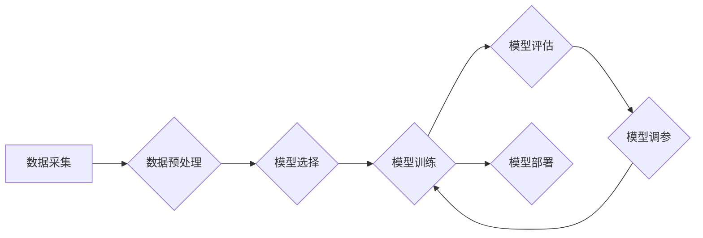

> 机器学习、算法原理、代码实现、深度学习、数据分析、预测模型、Python

## 1. 背景介绍

机器学习作为人工智能领域的核心技术之一，近年来发展迅速，并在各个领域取得了令人瞩目的成就。从语音识别、图像识别到自然语言处理、推荐系统，机器学习的应用无处不在。

随着海量数据的涌现，机器学习算法能够从数据中自动学习规律，并根据学习到的知识进行预测、分类、聚类等任务。这使得机器学习成为解决复杂问题、提高效率、创造价值的重要工具。

然而，对于初学者来说，机器学习的原理和实现往往显得复杂和抽象。本篇文章将从基础概念开始，逐步深入到算法原理、代码实现和实际应用场景，帮助读者全面理解机器学习的本质，并掌握基本的机器学习技能。

## 2. 核心概念与联系

机器学习的核心概念包括：

* **训练数据:** 机器学习算法学习的基础，包含输入特征和对应的输出标签。
* **模型:**  用于学习数据规律的数学模型，例如线性回归模型、决策树模型、神经网络模型等。
* **参数:** 模型中的可学习变量，通过训练数据调整参数，使模型的预测结果更加准确。
* **损失函数:** 用于衡量模型预测结果与真实值的差距，训练目标是找到最优参数，使损失函数最小化。
* **优化算法:** 用于更新模型参数的算法，例如梯度下降算法、随机梯度下降算法等。

**机器学习流程图:**



## 3. 核心算法原理 & 具体操作步骤

### 3.1  算法原理概述

线性回归算法是一种监督学习算法，用于预测连续值。其核心思想是找到一条直线或超平面，使得输入特征与输出标签之间的误差最小化。

### 3.2  算法步骤详解

1. **数据预处理:** 将原始数据进行清洗、转换、标准化等操作，使其适合模型训练。
2. **特征选择:** 选择与目标变量相关的特征作为模型输入。
3. **模型构建:** 使用线性回归模型，将输入特征和输出标签建立线性关系。
4. **模型训练:** 使用训练数据，通过最小化损失函数，调整模型参数，使模型预测结果更加准确。
5. **模型评估:** 使用测试数据，评估模型的预测性能，例如均方误差、R-squared等指标。
6. **模型调参:** 根据模型评估结果，调整模型参数，例如学习率、正则化参数等，进一步提高模型性能。

### 3.3  算法优缺点

**优点:**

* 算法简单易懂，易于实现。
* 计算效率高，适合处理大规模数据。
* 可解释性强，可以直观地理解模型的预测结果。

**缺点:**

* 只能处理线性关系，对于非线性关系的预测效果较差。
* 对异常值敏感，容易受到异常值的影响。

### 3.4  算法应用领域

线性回归算法广泛应用于以下领域:

* **预测分析:** 预测销售额、股票价格、房价等。
* **风险评估:** 评估贷款风险、信用风险等。
* **广告投放:** 预测广告点击率、转化率等。

## 4. 数学模型和公式 & 详细讲解 & 举例说明

### 4.1  数学模型构建

线性回归模型的数学表达式为:

$$y = w_0 + w_1x_1 + w_2x_2 + ... + w_nx_n + \epsilon$$

其中:

* $y$ 是目标变量
* $w_0, w_1, w_2, ..., w_n$ 是模型参数
* $x_1, x_2, ..., x_n$ 是输入特征
* $\epsilon$ 是误差项

### 4.2  公式推导过程

模型训练的目标是找到最优参数 $w_0, w_1, w_2, ..., w_n$，使模型预测结果与真实值之间的误差最小化。常用的损失函数是均方误差 (MSE):

$$MSE = \frac{1}{n}\sum_{i=1}^{n}(y_i - \hat{y}_i)^2$$

其中:

* $n$ 是样本数量
* $y_i$ 是第 $i$ 个样本的真实值
* $\hat{y}_i$ 是第 $i$ 个样本的预测值

通过最小化 MSE，可以得到最优参数。常用的优化算法是梯度下降算法，其核心思想是迭代更新参数，使损失函数不断减小。

### 4.3  案例分析与讲解

假设我们想要预测房屋价格，输入特征包括房屋面积、房间数量、地理位置等，目标变量是房屋价格。

我们可以使用线性回归模型，将这些特征与房屋价格建立线性关系。通过训练数据，找到最优参数，使得模型能够准确预测房屋价格。

## 5. 项目实践：代码实例和详细解释说明

### 5.1  开发环境搭建

本项目使用 Python 语言进行开发，需要安装以下库:

* NumPy: 用于数值计算
* Pandas: 用于数据处理
* Scikit-learn: 用于机器学习算法

可以使用 pip 命令安装这些库:

```bash
pip install numpy pandas scikit-learn
```

### 5.2  源代码详细实现

```python
import numpy as np
from sklearn.linear_model import LinearRegression
from sklearn.model_selection import train_test_split
from sklearn.metrics import mean_squared_error

# 准备数据
data = np.array([[100, 2, '市中心'],
                 [150, 3, '市郊'],
                 [200, 4, '郊区'],
                 [250, 5, '郊区']])

# 将数据转换为特征矩阵和标签向量
X = data[:, :2]  # 特征矩阵
y = data[:, 2]  # 标签向量

# 将数据划分为训练集和测试集
X_train, X_test, y_train, y_test = train_test_split(X, y, test_size=0.2, random_state=42)

# 创建线性回归模型
model = LinearRegression()

# 训练模型
model.fit(X_train, y_train)

# 预测测试集结果
y_pred = model.predict(X_test)

# 计算均方误差
mse = mean_squared_error(y_test, y_pred)

# 打印结果
print(f"均方误差: {mse}")
```

### 5.3  代码解读与分析

1. 准备数据: 首先，我们准备一个包含房屋面积、房间数量和地理位置的示例数据集。
2. 数据预处理: 将数据转换为特征矩阵和标签向量，方便模型训练。
3. 数据划分: 将数据划分为训练集和测试集，用于模型训练和评估。
4. 模型创建: 创建一个线性回归模型实例。
5. 模型训练: 使用训练数据训练模型，找到最优参数。
6. 模型预测: 使用训练好的模型预测测试集结果。
7. 模型评估: 计算均方误差，评估模型的预测性能。

### 5.4  运行结果展示

运行代码后，会输出模型的均方误差值，该值越小，模型的预测性能越好。

## 6. 实际应用场景

### 6.1  电商推荐系统

线性回归算法可以用于构建电商推荐系统，根据用户的历史购买记录、浏览记录等特征，预测用户对商品的兴趣程度，并推荐相关商品。

### 6.2  金融风险评估

线性回归算法可以用于金融风险评估，根据借款人的信用评分、收入水平等特征，预测借款人违约风险，帮助金融机构做出更合理的贷款决策。

### 6.3  医疗诊断辅助

线性回归算法可以用于医疗诊断辅助，根据患者的症状、病史等特征，预测患者患某种疾病的概率，帮助医生做出更准确的诊断。

### 6.4  未来应用展望

随着机器学习技术的不断发展，线性回归算法将在更多领域得到应用，例如智能交通、智能制造、智能家居等。

## 7. 工具和资源推荐

### 7.1  学习资源推荐

* **书籍:**
    * 《机器学习》 - 周志华
    * 《Python机器学习实战》 - 塞缪尔·阿布拉姆斯
* **在线课程:**
    * Coursera: 机器学习
    * edX: 机器学习
* **博客:**
    * 机器学习 Mastery
    * Analytics Vidhya

### 7.2  开发工具推荐

* **Python:** 
    * Jupyter Notebook: 用于代码编写和可视化
    * Spyder: 用于科学计算和数据分析
* **机器学习库:**
    * Scikit-learn: 用于机器学习算法
    * TensorFlow: 用于深度学习
    * PyTorch: 用于深度学习

### 7.3  相关论文推荐

* **The Elements of Statistical Learning** - Trevor Hastie, Robert Tibshirani, Jerome Friedman
* **Pattern Recognition and Machine Learning** - Christopher Bishop

## 8. 总结：未来发展趋势与挑战

### 8.1  研究成果总结

机器学习算法取得了显著的成果，在各个领域都取得了广泛应用。

### 8.2  未来发展趋势

* **深度学习:** 深度学习算法在图像识别、自然语言处理等领域取得了突破性进展，未来将继续发展和完善。
* **强化学习:** 强化学习算法能够学习复杂的决策策略，未来将应用于机器人控制、游戏人工智能等领域。
* **联邦学习:** 联邦学习能够在不共享原始数据的情况下进行模型训练，未来将应用于隐私保护敏感数据场景。

### 8.3  面临的挑战

* **数据质量:** 机器学习算法对数据质量要求很高，数据不完整、不准确、不平衡等问题会影响模型性能。
* **算法解释性:** 许多机器学习算法的决策过程难以解释，这限制了其在一些领域应用的推广。
* **伦理问题:** 机器学习算法可能存在偏见和歧视问题，需要关注其伦理和社会影响。

### 8.4  研究展望

未来机器学习研究将继续探索更有效的算法、更强大的计算能力和更广泛的应用场景，为人类社会带来更多福祉。

## 9. 附录：常见问题与解答

### 9.1  Q1: 线性回归算法适合哪些问题？

**A1:** 线性回归算法适合预测连续值，并且数据之间存在线性关系的问题。

### 9.2  Q2: 如何选择合适的特征？

**A2:** 特征选择是一个重要的步骤，可以使用特征选择算法或专业知识选择与目标变量相关的特征。

### 9.3  Q3: 如何评估模型性能？

**A3:** 可以使用均方误差、R-squared等指标评估模型性能。

### 9.4  Q4: 如何处理异常值？

**A4:** 可以使用异常值处理方法，例如删除异常值、替换异常值等。


作者：禅与计算机程序设计艺术 / Zen and the Art of Computer Programming 
<end_of_turn>