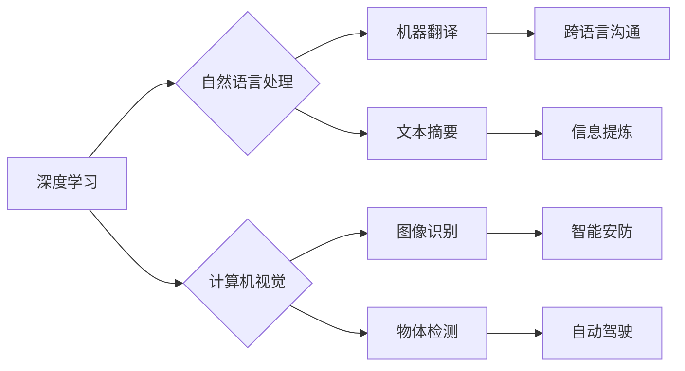

> AI 2.0, 
> 深度学习, 
> 自然语言处理, 
> 计算机视觉, 
> 机器学习, 
> 市场前景, 
> 创新应用

## 1. 背景介绍

人工智能（AI）技术近年来发展迅速，从最初的局限性应用，逐渐发展到如今广泛应用于各个领域。李开复先生在《AI 2.0 时代的市场前景》一文中，对AI 2.0时代的发展趋势和市场前景进行了深入的分析和展望。

AI 1.0时代主要依靠规则和符号逻辑，应用场景相对单一，例如棋类游戏、语音识别等。而AI 2.0时代则以深度学习为核心，能够处理海量数据，学习复杂的模式和关系，从而实现更智能、更灵活的应用。

## 2. 核心概念与联系

**2.1 深度学习**

深度学习是机器学习的一种重要分支，它利用多层神经网络来模拟人类大脑的学习过程。通过不断训练，深度学习模型能够从海量数据中提取特征，并进行复杂的推理和决策。

**2.2 自然语言处理 (NLP)**

自然语言处理是让计算机能够理解和处理人类语言的技术。在AI 2.0时代，NLP技术取得了长足进步，例如机器翻译、文本摘要、对话系统等应用都得到了显著提升。

**2.3 计算机视觉**

计算机视觉是让计算机能够“看”和理解图像的技术。在AI 2.0时代，计算机视觉技术在图像识别、物体检测、场景理解等方面取得了突破性进展，广泛应用于自动驾驶、医疗诊断、安防监控等领域。

**2.4 机器学习**

机器学习是人工智能的核心技术之一，它使计算机能够从数据中学习，并根据学习到的知识进行预测和决策。机器学习算法可以分为监督学习、无监督学习和强化学习等类型。

**2.5  AI 2.0 时代市场前景**

AI 2.0时代，深度学习、NLP、计算机视觉等技术的快速发展，将推动人工智能技术在各个领域的广泛应用，创造巨大的市场价值。

**Mermaid 流程图**



## 3. 核心算法原理 & 具体操作步骤

### 3.1  算法原理概述

深度学习算法的核心是多层神经网络。神经网络由多个层组成，每层包含多个神经元。每个神经元接收来自上一层的输入信号，并对其进行处理，然后将处理后的信号传递给下一层。通过不断训练，神经网络能够学习到数据的特征和模式。

### 3.2  算法步骤详解

1. **数据预处理:** 将原始数据进行清洗、转换和格式化，使其适合深度学习模型的训练。
2. **模型构建:** 根据任务需求选择合适的深度学习模型架构，例如卷积神经网络（CNN）、循环神经网络（RNN）等。
3. **模型训练:** 使用训练数据训练深度学习模型，调整模型参数，使其能够准确地预测或分类数据。
4. **模型评估:** 使用测试数据评估模型的性能，例如准确率、召回率、F1-score等指标。
5. **模型部署:** 将训练好的模型部署到实际应用场景中，用于进行预测或分类任务。

### 3.3  算法优缺点

**优点:**

* 能够处理海量数据，学习复杂的模式和关系。
* 性能优于传统机器学习算法。
* 应用范围广泛，可应用于图像识别、自然语言处理、语音识别等多个领域。

**缺点:**

* 训练数据量大，需要大量的计算资源和时间。
* 模型解释性差，难以理解模型的决策过程。
* 对数据质量要求高，数据噪声会影响模型性能。

### 3.4  算法应用领域

* **图像识别:** 人脸识别、物体检测、图像分类等。
* **自然语言处理:** 机器翻译、文本摘要、情感分析等。
* **语音识别:** 语音转文本、语音助手等。
* **自动驾驶:** 路况识别、目标跟踪、路径规划等。
* **医疗诊断:** 病灶检测、疾病预测等。

## 4. 数学模型和公式 & 详细讲解 & 举例说明

### 4.1  数学模型构建

深度学习模型的数学基础是神经网络。神经网络由多个层组成，每层包含多个神经元。每个神经元接收来自上一层的输入信号，并对其进行处理，然后将处理后的信号传递给下一层。

**神经元模型:**

$$
y = f(w^T x + b)
$$

其中：

* $y$ 是神经元的输出值。
* $x$ 是神经元的输入向量。
* $w$ 是神经元的权重向量。
* $b$ 是神经元的偏置值。
* $f$ 是激活函数。

**激活函数:**

激活函数的作用是将神经元的输入信号转换为输出信号。常用的激活函数包括 sigmoid 函数、ReLU 函数、tanh 函数等。

### 4.2  公式推导过程

深度学习模型的训练过程是通过反向传播算法来进行的。反向传播算法的核心思想是通过计算误差信号，反向传播到各层神经元，并更新神经元的权重和偏置值。

**损失函数:**

损失函数用于衡量模型的预测结果与真实值的差距。常用的损失函数包括均方误差（MSE）、交叉熵损失等。

**梯度下降算法:**

梯度下降算法是一种优化算法，用于更新神经元的权重和偏置值。梯度下降算法的基本思想是沿着梯度的负方向更新参数，从而最小化损失函数的值。

### 4.3  案例分析与讲解

**图像分类案例:**

假设我们有一个图像分类任务，目标是将图像分类为不同的类别，例如猫、狗、鸟等。我们可以使用卷积神经网络（CNN）来解决这个问题。

CNN模型的结构包括卷积层、池化层和全连接层。卷积层用于提取图像特征，池化层用于降低特征维度，全连接层用于分类。

在训练过程中，我们使用大量的图像数据来训练CNN模型。模型会学习到图像特征，并根据这些特征对图像进行分类。

## 5. 项目实践：代码实例和详细解释说明

### 5.1  开发环境搭建

* Python 3.x
* TensorFlow 或 PyTorch 深度学习框架
* Jupyter Notebook 或 VS Code 代码编辑器

### 5.2  源代码详细实现

```python
import tensorflow as tf

# 定义模型结构
model = tf.keras.models.Sequential([
    tf.keras.layers.Conv2D(32, (3, 3), activation='relu', input_shape=(28, 28, 1)),
    tf.keras.layers.MaxPooling2D((2, 2)),
    tf.keras.layers.Conv2D(64, (3, 3), activation='relu'),
    tf.keras.layers.MaxPooling2D((2, 2)),
    tf.keras.layers.Flatten(),
    tf.keras.layers.Dense(10, activation='softmax')
])

# 编译模型
model.compile(optimizer='adam',
              loss='sparse_categorical_crossentropy',
              metrics=['accuracy'])

# 训练模型
model.fit(x_train, y_train, epochs=5)

# 评估模型
loss, accuracy = model.evaluate(x_test, y_test)
print('Test loss:', loss)
print('Test accuracy:', accuracy)
```

### 5.3  代码解读与分析

* **模型结构:** 代码定义了一个简单的卷积神经网络模型，包含两层卷积层、两层池化层和一层全连接层。
* **激活函数:** 使用ReLU函数作为激活函数，可以提高模型的训练效率。
* **损失函数:** 使用交叉熵损失函数，适合多分类任务。
* **优化器:** 使用Adam优化器，可以加速模型训练。
* **训练过程:** 使用训练数据训练模型，并设置训练轮数（epochs）。
* **评估过程:** 使用测试数据评估模型的性能，并打印测试损失和准确率。

### 5.4  运行结果展示

训练完成后，可以将模型保存下来，并在需要时进行部署。

## 6. 实际应用场景

### 6.1  医疗诊断

* **病灶检测:** 使用深度学习模型分析医学影像，例如X光片、CT扫描、MRI等，自动检测病灶，辅助医生诊断。
* **疾病预测:** 根据患者的病史、生活习惯、基因信息等数据，使用深度学习模型预测疾病风险，帮助医生进行预防和治疗。

### 6.2  金融服务

* **欺诈检测:** 使用深度学习模型分析交易数据，识别异常交易行为，防止金融欺诈。
* **风险评估:** 根据客户的信用记录、财务状况等数据，使用深度学习模型评估客户的信用风险，帮助银行和金融机构进行贷款审批。

### 6.3  智能制造

* **缺陷检测:** 使用深度学习模型分析生产过程中的图像数据，自动检测产品缺陷，提高产品质量。
* **预测性维护:** 使用深度学习模型分析设备运行数据，预测设备故障，及时进行维护，降低设备停机时间。

### 6.4  未来应用展望

AI 2.0时代，深度学习技术将应用于更多领域，例如自动驾驶、机器人、教育、娱乐等。

## 7. 工具和资源推荐

### 7.1  学习资源推荐

* **在线课程:** Coursera、edX、Udacity等平台提供深度学习相关的在线课程。
* **书籍:** 《深度学习》、《动手学深度学习》等书籍对深度学习原理和应用进行了详细介绍。
* **开源代码库:** TensorFlow、PyTorch等开源深度学习框架提供了丰富的代码示例和工具。

### 7.2  开发工具推荐

* **Jupyter Notebook:** 用于编写和运行深度学习代码，并可视化模型训练过程。
* **VS Code:** 代码编辑器，支持深度学习框架的插件，方便代码编写和调试。

### 7.3  相关论文推荐

* **《ImageNet Classification with Deep Convolutional Neural Networks》:** 介绍了AlexNet模型，标志着深度学习在图像分类领域的突破。
* **《Attention Is All You Need》:** 介绍了Transformer模型，在自然语言处理领域取得了突破性进展。

## 8. 总结：未来发展趋势与挑战

### 8.1  研究成果总结

AI 2.0时代，深度学习技术取得了长足进步，在图像识别、自然语言处理、语音识别等领域取得了突破性进展。

### 8.2  未来发展趋势

* **模型规模和复杂度提升:** 未来深度学习模型将更加庞大，包含更多层和参数，从而学习到更复杂的模式和关系。
* **数据驱动和自动化:** 数据将成为深度学习发展的关键要素，同时自动化机器学习技术也将更加普及。
* **跨模态学习:** 深度学习模型将能够处理多种模态数据，例如文本、图像、音频等，实现跨模态理解和交互。

### 8.3  面临的挑战

* **数据隐私和安全:** 深度学习模型需要大量数据进行训练，如何保护数据隐私和安全是一个重要的挑战。
* **模型解释性和可信度:** 深度学习模型的决策过程难以解释，如何提高模型的解释性和可信度是一个重要的研究方向。
* **算法效率和可扩展性:** 训练大型深度学习模型需要大量的计算资源，如何提高算法效率和可扩展性是一个重要的技术挑战。

### 8.4  研究展望

未来，深度学习技术将继续发展，并在更多领域发挥重要作用。研究者们将继续探索新的算法、模型和应用场景，推动人工智能技术向更智能