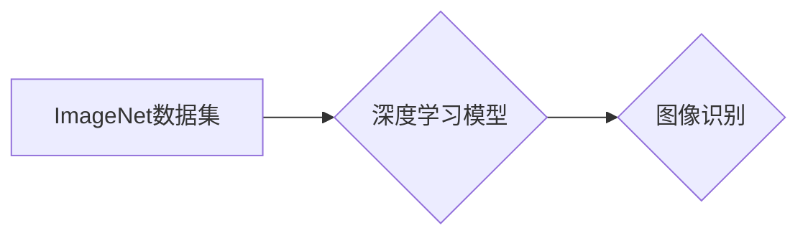

> ImageNet, 计算机视觉, 深度学习, CNN, 图像识别, AI

## 1. 背景介绍

在人工智能领域，图像识别一直是研究的热点之一。从传统的基于规则的图像识别方法到如今的深度学习时代，图像识别技术取得了飞速发展。其中，ImageNet数据集和深度学习模型的结合，是推动图像识别技术革命的重要力量。

ImageNet是一个由斯坦福大学教授李飞飞领导的团队创建的大规模图像识别数据集。它包含超过1400万张图像，涵盖超过2万个类别。ImageNet的建立为图像识别领域的研究和发展提供了宝贵的资源。

2012年，AlexNet模型在ImageNet图像识别挑战赛中取得了突破性的成绩，其准确率比第二名高出10个百分点。AlexNet的成功标志着深度学习在图像识别领域的应用取得了重大突破。

## 2. 核心概念与联系

**2.1 核心概念**

* **ImageNet:** 一个包含大量图像和标签的大型图像识别数据集。
* **深度学习:** 一种机器学习方法，利用多层神经网络来学习数据特征。
* **卷积神经网络 (CNN):** 一种专门用于处理图像数据的深度学习模型。

**2.2 联系**

ImageNet数据集为深度学习模型提供了大量的训练数据，而深度学习模型，特别是CNN，能够有效地学习图像特征，从而提高图像识别的准确率。

**2.3 Mermaid 流程图**



## 3. 核心算法原理 & 具体操作步骤

**3.1 算法原理概述**

CNN是一种专门用于处理图像数据的深度学习模型。它由多个卷积层、池化层和全连接层组成。

* **卷积层:** 使用卷积核对图像进行卷积运算，提取图像特征。
* **池化层:** 对卷积层的输出进行降维，减少计算量并提高模型的鲁棒性。
* **全连接层:** 将池化层的输出连接到全连接层，进行分类或回归。

**3.2 算法步骤详解**

1. **数据预处理:** 将图像数据预处理，例如调整大小、归一化等。
2. **卷积层:** 使用卷积核对图像进行卷积运算，提取图像特征。
3. **池化层:** 对卷积层的输出进行池化操作，例如最大池化或平均池化。
4. **全连接层:** 将池化层的输出连接到全连接层，进行分类或回归。
5. **损失函数:** 使用损失函数评估模型的性能。
6. **反向传播:** 使用反向传播算法更新模型参数。
7. **训练:** 迭代训练模型，直到达到预设的性能指标。

**3.3 算法优缺点**

* **优点:**
    * 能够有效地学习图像特征。
    * 对图像的旋转、缩放、平移等变换具有鲁棒性。
    * 在图像识别、物体检测、图像分割等任务中取得了优异的性能。
* **缺点:**
    * 训练数据量大，计算量大。
    * 对小样本数据训练效果较差。

**3.4 算法应用领域**

* **图像识别:** 识别图像中的物体、场景、人物等。
* **物体检测:** 在图像中定位和识别物体。
* **图像分割:** 将图像分割成不同的区域。
* **图像分类:** 将图像分类到不同的类别。
* **人脸识别:** 识别图像中的人脸。

## 4. 数学模型和公式 & 详细讲解 & 举例说明

**4.1 数学模型构建**

CNN的数学模型可以概括为以下几个方面：

* **卷积运算:** 使用卷积核对图像进行卷积运算，提取图像特征。卷积运算的数学公式如下：

$$
y(i,j) = \sum_{m=0}^{M-1} \sum_{n=0}^{N-1} x(i+m,j+n) * w(m,n)
$$

其中：

* $y(i,j)$ 是卷积核输出的像素值。
* $x(i+m,j+n)$ 是输入图像的像素值。
* $w(m,n)$ 是卷积核的权值。
* $M$ 和 $N$ 是卷积核的大小。

* **池化运算:** 对卷积层的输出进行池化操作，例如最大池化或平均池化。池化运算的数学公式如下：

$$
y(i,j) = \max_{m=0}^{k-1} \max_{n=0}^{l-1} x(i*s+m,j*s+n)
$$

其中：

* $y(i,j)$ 是池化层的输出像素值。
* $x(i*s+m,j*s+n)$ 是卷积层的输入像素值。
* $s$ 是池化窗口的大小。
* $k$ 和 $l$ 是池化窗口的大小。

* **全连接层:** 将池化层的输出连接到全连接层，进行分类或回归。全连接层的数学公式如下：

$$
y = f(W*x + b)
$$

其中：

* $y$ 是全连接层的输出。
* $W$ 是全连接层的权值矩阵。
* $x$ 是池化层的输出。
* $b$ 是全连接层的偏置向量。
* $f$ 是激活函数，例如ReLU函数。

**4.2 公式推导过程**

卷积运算、池化运算和全连接层的数学公式的推导过程比较复杂，需要涉及到线性代数、微积分等数学知识。

**4.3 案例分析与讲解**

以AlexNet模型为例，它包含五个卷积层、三个池化层和三个全连接层。AlexNet模型在ImageNet图像识别挑战赛中取得了突破性的成绩，其准确率比第二名高出10个百分点。

## 5. 项目实践：代码实例和详细解释说明

**5.1 开发环境搭建**

* Python 3.x
* TensorFlow 或 PyTorch
* CUDA 和 cuDNN

**5.2 源代码详细实现**

```python
# 使用 TensorFlow 实现一个简单的 CNN 模型

import tensorflow as tf

# 定义模型结构
model = tf.keras.models.Sequential([
    tf.keras.layers.Conv2D(32, (3, 3), activation='relu', input_shape=(28, 28, 1)),
    tf.keras.layers.MaxPooling2D((2, 2)),
    tf.keras.layers.Conv2D(64, (3, 3), activation='relu'),
    tf.keras.layers.MaxPooling2D((2, 2)),
    tf.keras.layers.Flatten(),
    tf.keras.layers.Dense(10, activation='softmax')
])

# 编译模型
model.compile(optimizer='adam',
              loss='sparse_categorical_crossentropy',
              metrics=['accuracy'])

# 训练模型
model.fit(x_train, y_train, epochs=10)

# 评估模型
loss, accuracy = model.evaluate(x_test, y_test)
print('Test loss:', loss)
print('Test accuracy:', accuracy)
```

**5.3 代码解读与分析**

* `tf.keras.models.Sequential`: 创建一个顺序模型，层级结构清晰。
* `tf.keras.layers.Conv2D`: 卷积层，提取图像特征。
* `tf.keras.layers.MaxPooling2D`: 池化层，降维并提高鲁棒性。
* `tf.keras.layers.Flatten`: 将多维数据转换为一维数据。
* `tf.keras.layers.Dense`: 全连接层，进行分类或回归。
* `model.compile`: 编译模型，指定优化器、损失函数和评价指标。
* `model.fit`: 训练模型。
* `model.evaluate`: 评估模型性能。

**5.4 运行结果展示**

训练完成后，可以将模型应用于新的图像数据进行识别。

## 6. 实际应用场景

**6.1 图像识别**

* **自动驾驶:** 识别道路标志、车辆、行人等。
* **医疗诊断:** 识别病灶、肿瘤等。
* **安防监控:** 识别嫌疑人、违规行为等。

**6.2 物体检测**

* **无人零售:** 自动识别商品，实现自助结账。
* **智能制造:** 自动识别缺陷产品。
* **机器人导航:** 识别障碍物，规划路径。

**6.3 图像分割**

* **医学图像分析:** 分割器官、组织等。
* **遥感图像分析:** 分割土地利用类型、植被覆盖等。
* **自动驾驶:** 分割道路、车道等。

**6.4 未来应用展望**

* **更精准的图像识别:** 能够识别更细粒度的物体和场景。
* **更鲁棒的图像识别:** 能够应对更复杂的图像场景，例如遮挡、模糊等。
* **更智能的图像识别:** 能够理解图像的语义，例如人物关系、场景描述等。

## 7. 工具和资源推荐

**7.1 学习资源推荐**

* **书籍:**
    * 深度学习
    * 计算机视觉
* **在线课程:**
    * Coursera: 深度学习
    * Udacity: 计算机视觉
* **博客:**
    * 李飞飞的博客
    * TensorFlow 官方博客

**7.2 开发工具推荐**

* **TensorFlow:** 开源深度学习框架。
* **PyTorch:** 开源深度学习框架。
* **Keras:** 高级深度学习API。

**7.3 相关论文推荐**

* AlexNet: ImageNet Classification with Deep Convolutional Neural Networks
* VGGNet: Very Deep Convolutional Networks for Large-Scale Image Recognition
* ResNet: Deep Residual Learning for Image Recognition

## 8. 总结：未来发展趋势与挑战

**8.1 研究成果总结**

ImageNet数据集和深度学习模型的结合，推动了图像识别技术取得了重大突破。CNN模型在图像识别、物体检测、图像分割等任务中取得了优异的性能。

**8.2 未来发展趋势**

* **更深更广的网络结构:** 探索更深、更广的网络结构，提高模型的表达能力。
* **自监督学习:** 利用无标签数据进行训练，降低对标注数据的依赖。
* **迁移学习:** 将预训练模型应用于新的任务，提高模型的泛化能力。

**8.3 面临的挑战**

* **数据标注:** 图像数据标注成本高，难以获取高质量的标注数据。
* **计算资源:** 训练深度学习模型需要大量的计算资源。
* **模型解释性:** 深度学习模型的决策过程难以解释，缺乏透明度。

**8.4 研究展望**

未来，图像识别技术将朝着更精准、更鲁棒、更智能的方向发展。


## 9. 附录：常见问题与解答

**9.1 如何选择合适的 CNN 模型？**

选择合适的 CNN 模型需要根据具体的应用场景和数据特点进行选择。

**9.2 如何训练 CNN 模型？**

训练 CNN 模型需要准备训练数据、选择模型结构、设置训练参数、训练模型、评估模型性能等步骤。

**9.3 如何提高 CNN 模型的性能？**

提高 CNN 模型的性能可以通过以下方法：

* 增加训练数据量
* 调整模型结构
* 优化训练参数
* 使用数据增强技术

作者：禅与计算机程序设计艺术 / Zen and the Art of Computer Programming


<end_of_turn>