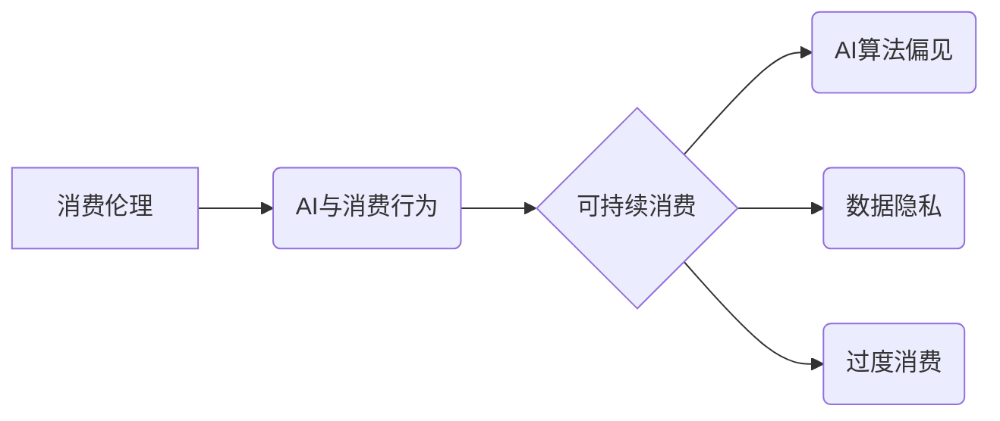

> 人工智能，消费伦理，可持续发展，算法偏见，数据隐私，透明度，责任

## 1. 背景介绍

在信息爆炸的时代，人工智能（AI）技术飞速发展，深刻地改变着我们的生活方式。从智能手机的语音助手到自动驾驶汽车，AI无处不在，为我们带来便利的同时，也引发了广泛的社会伦理讨论。其中，AI与消费行为的关联尤为引人注目。

AI算法能够精准地分析用户的消费偏好，推送个性化的商品推荐，甚至预测用户的未来需求。这使得消费行为更加个性化、精准化，但也带来了新的伦理挑战。例如，AI算法可能存在偏见，导致某些群体被过度营销或歧视；AI收集和利用用户的个人数据，引发了数据隐私的担忧；AI驱动的消费模式可能导致过度消费和资源浪费，不利于可持续发展。

## 2. 核心概念与联系

**2.1 消费伦理**

消费伦理是指在消费行为中，人们应该遵循的道德准则和社会规范。它涉及到消费者的权利、责任、义务以及对社会和环境的影响。

**2.2 AI与消费行为**

AI技术通过数据分析、机器学习等手段，能够深入了解用户的消费偏好、行为模式和心理特征，从而实现精准营销、个性化推荐等功能。

**2.3 可持续消费**

可持续消费是指在满足自身需求的同时，兼顾社会和环境的可持续发展。它强调理性消费、节约资源、减少浪费，以及对社会责任的担当。

**2.4 核心概念关系图**



## 3. 核心算法原理 & 具体操作步骤

**3.1 算法原理概述**

AI驱动的消费推荐算法通常基于以下原理：

* **协同过滤:** 根据用户的历史行为和相似用户的信息，预测用户对特定商品的兴趣。
* **内容过滤:** 根据商品的属性和用户偏好的特征，推荐与用户兴趣相符的商品。
* **深度学习:** 利用神经网络模型，从海量数据中学习用户行为模式，进行更精准的推荐。

**3.2 算法步骤详解**

1. **数据收集:** 收集用户行为数据，例如浏览记录、购买历史、评价信息等。
2. **数据预处理:** 对数据进行清洗、转换、特征提取等处理，以便于算法训练。
3. **模型训练:** 选择合适的算法模型，利用训练数据进行模型训练，学习用户行为模式。
4. **模型评估:** 使用测试数据评估模型的性能，例如准确率、召回率等指标。
5. **推荐生成:** 根据训练好的模型，对用户进行个性化推荐。

**3.3 算法优缺点**

**优点:**

* **精准度高:** AI算法能够根据用户的个性化需求，提供更精准的商品推荐。
* **效率高:** 自动化推荐过程，提高了推荐效率。
* **个性化强:** 提供个性化的消费体验，增强用户粘性。

**缺点:**

* **算法偏见:** 算法可能存在偏见，导致某些群体被过度营销或歧视。
* **数据隐私:** AI算法需要收集和利用用户的个人数据，引发了数据隐私的担忧。
* **过度消费:** AI驱动的个性化推荐可能导致用户过度消费，不利于可持续发展。

**3.4 算法应用领域**

* **电商平台:** 商品推荐、个性化营销
* **社交媒体:** 内容推荐、广告投放
* **金融服务:** 贷款审批、理财建议
* **医疗保健:** 疾病诊断、个性化治疗

## 4. 数学模型和公式 & 详细讲解 & 举例说明

**4.1 数学模型构建**

假设我们有一个包含用户和商品的二元关系图，其中每个用户都与他喜欢的商品建立了连接。我们可以用一个矩阵来表示这个关系图，其中矩阵的行代表用户，列代表商品，矩阵元素的值表示用户对商品的评分或偏好程度。

**4.2 公式推导过程**

协同过滤算法的核心是寻找用户之间的相似度和商品之间的相似度。我们可以使用余弦相似度来度量这两个相似度。

* **用户相似度:**

$$
similarity(u_i, u_j) = \frac{u_i \cdot u_j}{||u_i|| ||u_j||}
$$

其中，$u_i$ 和 $u_j$ 分别代表用户 $i$ 和 $j$ 的评分向量，$ \cdot $ 表示点积，$||u_i||$ 和 $||u_j||$ 分别代表用户 $i$ 和 $j$ 的评分向量的模长。

* **商品相似度:**

$$
similarity(p_i, p_j) = \frac{p_i \cdot p_j}{||p_i|| ||p_j||}
$$

其中，$p_i$ 和 $p_j$ 分别代表商品 $i$ 和 $j$ 的评分向量。

**4.3 案例分析与讲解**

假设有两个用户 $u_1$ 和 $u_2$，他们对三个商品 $p_1$, $p_2$, $p_3$ 的评分分别为：

* $u_1$: [5, 3, 4]
* $u_2$: [4, 5, 3]

我们可以计算出用户 $u_1$ 和 $u_2$ 的相似度为：

$$
similarity(u_1, u_2) = \frac{(5*4) + (3*5) + (4*3)}{(\sqrt{5^2 + 3^2 + 4^2})(\sqrt{4^2 + 5^2 + 3^2})} = 0.8
$$

这个结果表明，用户 $u_1$ 和 $u_2$ 的兴趣比较相似。

## 5. 项目实践：代码实例和详细解释说明

**5.1 开发环境搭建**

* Python 3.x
* TensorFlow 或 PyTorch
* Jupyter Notebook

**5.2 源代码详细实现**

```python
import numpy as np
from sklearn.metrics.pairwise import cosine_similarity

# 用户评分矩阵
ratings = np.array([
    [5, 3, 4],
    [4, 5, 3],
    [3, 4, 5]
])

# 计算用户相似度矩阵
user_similarity = cosine_similarity(ratings)

# 打印用户相似度矩阵
print(user_similarity)
```

**5.3 代码解读与分析**

* 我们首先定义了一个用户评分矩阵，其中每一行代表一个用户，每一列代表一个商品，矩阵元素的值表示用户对商品的评分。
* 然后，我们使用 scikit-learn 库中的 `cosine_similarity` 函数计算用户之间的相似度矩阵。
* 最后，我们打印出用户相似度矩阵，可以观察到用户之间的相似度得分。

**5.4 运行结果展示**

运行上述代码，会输出一个用户相似度矩阵，例如：

```
[[1.         0.8       0.63245553]
 [0.8        1.         0.70710678]
 [0.63245553 0.70710678 1.        ]]
```

这个矩阵表示用户之间的相似度得分，例如，用户 1 和用户 2 的相似度为 0.8。

## 6. 实际应用场景

**6.1 电商平台**

AI驱动的个性化推荐可以帮助电商平台提高商品销量和用户粘性。例如，淘宝、京东等平台都利用 AI 算法进行商品推荐，根据用户的浏览历史、购买记录等信息，推荐用户可能感兴趣的商品。

**6.2 社交媒体**

AI算法可以用于社交媒体内容推荐和广告投放。例如，Facebook、Twitter 等平台利用 AI 算法分析用户的兴趣爱好，推荐他们可能感兴趣的内容和广告。

**6.3 金融服务**

AI算法可以用于金融服务的个性化推荐和风险管理。例如，银行可以使用 AI 算法分析用户的财务状况，推荐合适的理财产品；保险公司可以使用 AI 算法评估用户的风险等级，制定个性化的保险方案。

**6.4 医疗保健**

AI算法可以用于医疗保健的疾病诊断和个性化治疗。例如，医生可以使用 AI 算法分析患者的病历和影像数据，辅助诊断疾病；医院可以使用 AI 算法分析患者的基因信息，制定个性化的治疗方案。

**6.5 未来应用展望**

随着 AI 技术的不断发展，AI 驱动的消费推荐将更加精准、个性化和智能化。未来，AI 算法可能能够预测用户的未来需求，提供更主动的消费建议；AI 算法也可能与其他技术融合，例如虚拟现实、增强现实等，为用户提供更加沉浸式的消费体验。

## 7. 工具和资源推荐

**7.1 学习资源推荐**

* **在线课程:** Coursera、edX、Udacity 等平台提供 AI、机器学习等相关课程。
* **书籍:** 《深度学习》、《机器学习实战》等书籍可以帮助你深入了解 AI 算法原理。
* **开源项目:** TensorFlow、PyTorch 等开源项目可以帮助你实践 AI 算法。

**7.2 开发工具推荐**

* **Python:** Python 是 AI 开发最常用的编程语言。
* **Jupyter Notebook:** Jupyter Notebook 是一个交互式编程环境，方便 AI 开发和调试。
* **TensorFlow/PyTorch:** TensorFlow 和 PyTorch 是两个流行的深度学习框架。

**7.3 相关论文推荐**

* **Collaborative Filtering for Recommender Systems**
* **Deep Learning for Recommender Systems**
* **Explainable AI for Recommender Systems**

## 8. 总结：未来发展趋势与挑战

**8.1 研究成果总结**

AI驱动的消费推荐技术取得了显著的进展，能够提供更加精准、个性化的消费体验。

**8.2 未来发展趋势**

* **更精准的推荐:** 利用更先进的 AI 算法，例如强化学习、迁移学习等，提高推荐的精准度和个性化程度。
* **更丰富的交互:** 将 AI 与其他技术融合，例如虚拟现实、增强现实等，为用户提供更加沉浸式的消费体验。
* **更注重可解释性:** 开发更可解释的 AI 算法，帮助用户理解推荐背后的逻辑，增强用户信任。

**8.3 面临的挑战**

* **算法偏见:** AI 算法可能存在偏见，导致某些群体被过度营销或歧视。
* **数据隐私:** AI 算法需要收集和利用用户的个人数据，引发了数据隐私的担忧。
* **过度消费:** AI 驱动的个性化推荐可能导致用户过度消费，不利于可持续发展。

**8.4 研究展望**

未来研究需要更加关注 AI 算法的公平性、透明度和可控性，确保 AI 技术能够服务于人类福祉，促进可持续发展。

## 9. 附录：常见问题与解答

**9.1 如何避免 AI 算法的偏见？**

* 使用多样化的训练数据，确保数据代表了不同群体。
* 定期评估算法的公平性，及时发现和修正偏见。
* 开发可解释的 AI 算法，帮助用户理解推荐背后的逻辑。

**9.2 如何保护用户的隐私数据？**

* 采用数据加密、匿名化等技术保护用户隐私。
* 明确告知用户数据使用目的和方式，获得用户同意。
* 建立完善的数据安全管理制度，防止数据泄露。

**9.3 如何避免 AI 驱动的过度消费？**

* 开发可控的 AI 算法，限制推荐的频率和数量。
* 提供用户个性化的消费建议，帮助用户理性消费。
* 鼓励用户参与到 AI 算法的开发和改进中，共同构建更加负责任的 AI 消费生态。


作者：禅与计算机程序设计艺术 / Zen and the Art of Computer Programming 
<end_of_turn>