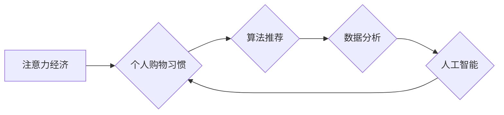

>  注意力经济, 个人购物习惯, 算法推荐, 人工智能, 数据分析, 消费行为, 认知心理学, 互联网营销

## 1. 背景介绍

在当今信息爆炸的时代，人们面临着来自各方信息的冲击，注意力成为了稀缺的资源。这种“注意力经济”的兴起深刻地改变了人们的生活方式，也对个人购物习惯产生了巨大影响。

传统的购物模式主要依赖于消费者主动搜索和选择商品。然而，随着互联网和移动互联网的普及，电商平台和社交媒体等新兴平台涌现，消费者面临着海量商品和信息的选择，注意力被分散，购物决策变得更加复杂。

在这种背景下，算法推荐、数据分析和人工智能技术成为了推动个人购物习惯变化的关键力量。通过对消费者的行为数据进行分析和挖掘，算法推荐系统能够精准地推送符合消费者兴趣和需求的商品，引导消费者进行购买决策。

## 2. 核心概念与联系

### 2.1 注意力经济

注意力经济是指在信息过载的时代，注意力成为了最宝贵的资源，而能够有效获取和利用注意力的人或组织将拥有巨大的竞争优势。

### 2.2 个人购物习惯

个人购物习惯是指消费者在购物过程中形成的特定行为模式，包括购物频率、购物方式、购物偏好、购物决策等方面。

### 2.3 算法推荐

算法推荐是指利用机器学习、数据挖掘等技术，根据用户的历史行为数据、兴趣偏好等信息，推荐用户可能感兴趣的商品或服务。

**核心概念与联系流程图:**



## 3. 核心算法原理 & 具体操作步骤

### 3.1 算法原理概述

常见的算法推荐方法包括：

* **基于内容的推荐:** 根据商品的属性和描述信息，推荐与用户过去浏览或购买的商品相似的商品。
* **基于协同过滤的推荐:** 根据用户的历史行为数据，找到与用户兴趣相似的其他用户，并推荐这些用户喜欢的商品。
* **基于深度学习的推荐:** 利用深度神经网络模型，学习用户和商品之间的复杂关系，进行更精准的推荐。

### 3.2 算法步骤详解

以基于协同过滤的推荐为例，其具体操作步骤如下：

1. **数据收集:** 收集用户的历史行为数据，例如浏览记录、购买记录、评分等。
2. **用户-商品矩阵构建:** 将用户和商品映射到二维矩阵中，其中每个元素表示用户对商品的评分或交互行为。
3. **相似度计算:** 计算用户之间的相似度，例如使用余弦相似度或皮尔逊相关系数。
4. **推荐生成:** 根据用户与其他用户的相似度，推荐其他用户喜欢的商品。

### 3.3 算法优缺点

**优点:**

* 可以推荐用户可能感兴趣但未曾接触过的商品。
* 能够发现用户潜在的兴趣和需求。

**缺点:**

* 数据稀疏性问题: 当用户行为数据较少时，算法难以准确计算相似度。
* 冷启动问题: 新用户和新商品难以获得推荐。

### 3.4 算法应用领域

算法推荐广泛应用于电商平台、社交媒体、音乐流媒体、视频网站等领域，帮助用户发现感兴趣的内容和商品，提升用户体验。

## 4. 数学模型和公式 & 详细讲解 & 举例说明

### 4.1 数学模型构建

基于协同过滤的推荐算法可以构建如下数学模型:

* **用户相似度:**

$$
Sim(u_i, u_j) = \frac{\sum_{m=1}^{M} r_{i,m} * r_{j,m}}{\sqrt{\sum_{m=1}^{M} r_{i,m}^2} * \sqrt{\sum_{m=1}^{M} r_{j,m}^2}}
$$

其中:

* $u_i$ 和 $u_j$ 表示两个用户。
* $r_{i,m}$ 和 $r_{j,m}$ 表示用户 $u_i$ 和 $u_j$ 对商品 $m$ 的评分或交互行为。
* $M$ 表示商品总数。

* **推荐评分:**

$$
\hat{r}_{u_i, m} = \frac{\sum_{j=1}^{N} Sim(u_i, u_j) * r_{j,m}}{\sum_{j=1}^{N} Sim(u_i, u_j)}
$$

其中:

* $\hat{r}_{u_i, m}$ 表示对用户 $u_i$ 推荐的商品 $m$ 的评分。
* $N$ 表示与用户 $u_i$ 相似的用户数量。

### 4.2 公式推导过程

用户相似度公式基于余弦相似度，计算两个用户在商品评分上的相似程度。推荐评分公式则利用用户相似度和其他用户的评分，预测用户对特定商品的评分。

### 4.3 案例分析与讲解

假设有两个用户 A 和 B，他们对三个商品的评分如下:

| 商品 | 用户 A | 用户 B |
|---|---|---|
| 商品 1 | 5 | 4 |
| 商品 2 | 3 | 5 |
| 商品 3 | 4 | 3 |

根据上述数据，我们可以计算用户 A 和 B 的相似度为 0.6，然后根据其他用户的评分，预测用户 A 对商品 4 的评分。

## 5. 项目实践：代码实例和详细解释说明

### 5.1 开发环境搭建

* Python 3.x
* Pandas
* Scikit-learn
* Matplotlib

### 5.2 源代码详细实现

```python
import pandas as pd
from sklearn.metrics.pairwise import cosine_similarity

# 加载用户-商品评分数据
data = pd.read_csv('ratings.csv')

# 构建用户-商品矩阵
user_item_matrix = data.pivot_table(index='user_id', columns='item_id', values='rating')

# 计算用户相似度
user_similarity = cosine_similarity(user_item_matrix)

# 获取用户 A 的相似用户
user_a_id = 1
similar_users = user_similarity[user_a_id].argsort()[:-6:-1]  # 获取前 5 个相似用户

# 预测用户 A 对商品 4 的评分
item_id = 4
predicted_rating = sum([user_item_matrix.loc[similar_users[i], item_id] * user_similarity[user_a_id][similar_users[i]] for i in range(len(similar_users))]) / sum([user_similarity[user_a_id][similar_users[i]] for i in range(len(similar_users))])

print(f'预测用户 A 对商品 {item_id} 的评分: {predicted_rating}')
```

### 5.3 代码解读与分析

* 代码首先加载用户-商品评分数据，并构建用户-商品矩阵。
* 然后使用余弦相似度计算用户之间的相似度。
* 根据用户相似度，预测用户 A 对商品 4 的评分。

### 5.4 运行结果展示

运行上述代码后，将输出用户 A 对商品 4 的预测评分。

## 6. 实际应用场景

### 6.1 电商平台

电商平台利用算法推荐，根据用户的浏览历史、购买记录等数据，推荐个性化的商品，提升用户购物体验和转化率。

### 6.2 社交媒体

社交媒体平台利用算法推荐，根据用户的兴趣爱好、好友关系等数据，推荐相关内容和用户，增强用户粘性和互动性。

### 6.3 音乐流媒体

音乐流媒体平台利用算法推荐，根据用户的听歌历史、播放偏好等数据，推荐个性化的音乐，提升用户音乐发现和享受体验。

### 6.4 未来应用展望

随着人工智能技术的不断发展，算法推荐将更加精准、个性化，并应用于更多领域，例如教育、医疗、金融等。

## 7. 工具和资源推荐

### 7.1 学习资源推荐

* **书籍:**
    * 《推荐系统实践》
    * 《机器学习》
* **在线课程:**
    * Coursera: Recommender Systems
    * Udacity: Machine Learning Engineer Nanodegree

### 7.2 开发工具推荐

* **Python:** 
    * Pandas
    * Scikit-learn
    * TensorFlow
    * PyTorch

### 7.3 相关论文推荐

* **Collaborative Filtering for Implicit Feedback Datasets**
* **Deep Learning for Recommender Systems**

## 8. 总结：未来发展趋势与挑战

### 8.1 研究成果总结

注意力经济与个人购物习惯的变化，推动了算法推荐技术的快速发展。基于协同过滤、内容过滤和深度学习的推荐算法，能够精准地推荐用户感兴趣的商品，提升用户体验和商业价值。

### 8.2 未来发展趋势

* **更精准的个性化推荐:** 利用更丰富的用户数据和更先进的机器学习算法，实现更精准的个性化推荐。
* **跨平台推荐:** 打破平台壁垒，实现跨平台的推荐服务，提供更全面的用户体验。
* **解释性推荐:** 解释推荐结果背后的逻辑，增强用户对推荐的信任和理解。

### 8.3 面临的挑战

* **数据隐私保护:** 算法推荐需要大量用户数据，如何保护用户隐私成为一个重要挑战。
* **算法公平性:** 算法推荐可能存在偏见，导致某些用户获得不公平的推荐结果。
* **用户信任:** 用户对算法推荐的信任度需要不断提升，才能实现长期的发展。

### 8.4 研究展望

未来，算法推荐技术将继续朝着更精准、个性化、解释性、公平的方向发展，为用户提供更优质的购物体验和服务。

## 9. 附录：常见问题与解答

### 9.1 如何解决数据稀疏性问题?

可以使用矩阵分解、隐语义模型等技术，从稀疏的用户-商品矩阵中挖掘潜在的模式和关系。

### 9.2 如何解决冷启动问题?

可以使用基于内容的推荐、基于用户的协同过滤等方法，为新用户和新商品提供初始的推荐。

### 9.3 如何评估算法推荐效果?

可以使用准确率、召回率、F1-score等指标，评估算法推荐的准确性和有效性。


作者：禅与计算机程序设计艺术 / Zen and the Art of Computer Programming 
<end_of_turn>