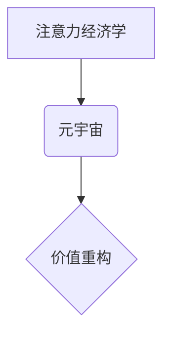

> 元宇宙、注意力经济学、价值重构、用户体验、数据驱动、AI算法、虚拟现实、增强现实

## 1. 背景介绍

元宇宙概念的兴起，标志着人类社会进入了一个新的数字时代。它将虚拟现实、增强现实、区块链、人工智能等前沿技术融合在一起，构建一个沉浸式、交互式、共享的虚拟世界。在这个虚拟世界中，人们可以自由地创造、探索、社交和工作，体验全新的生活方式。

然而，元宇宙的价值重构也带来了新的挑战。注意力资源在元宇宙中变得更加稀缺和宝贵。用户在虚拟世界中面临着来自各种平台、内容和应用的竞争性吸引，如何有效地获取和利用注意力，成为了元宇宙发展中的关键问题。

注意力经济学研究了人们如何分配和使用注意力，以及注意力如何被商业和技术力量所影响。它为理解元宇宙中的价值重构提供了重要的理论框架和实践指导。

## 2. 核心概念与联系

**2.1 注意力经济学**

注意力经济学认为，注意力是人类最宝贵的资源之一，它决定了我们能够获取和处理信息的能力。在信息爆炸的时代，注意力资源变得更加稀缺，而那些能够有效地获取和利用注意力的平台和内容，则能够获得更大的价值。

**2.2 元宇宙**

元宇宙是一个沉浸式、交互式、共享的虚拟世界，它将虚拟现实、增强现实、区块链、人工智能等技术融合在一起，构建一个全新的数字空间。

**2.3 价值重构**

在元宇宙中，传统的价值体系正在被重构。注意力资源成为新的货币，而能够有效地获取和利用注意力的平台和内容，则能够获得更大的价值。

**2.4 核心概念关系图**



## 3. 核心算法原理 & 具体操作步骤

**3.1 算法原理概述**

元宇宙中的注意力经济学算法主要基于以下几个核心原理：

* **用户行为分析:** 通过收集和分析用户的行为数据，例如浏览记录、点击行为、停留时间等，来了解用户的兴趣和偏好。
* **个性化推荐:** 基于用户行为分析，为用户提供个性化的内容推荐，提高用户参与度和留存率。
* **注意力机制:** 利用注意力机制，引导用户关注重要的信息和内容，提高用户体验和信息获取效率。
* **激励机制:** 通过积分、奖励等机制，鼓励用户参与元宇宙活动，并有效地分配注意力资源。

**3.2 算法步骤详解**

1. **数据收集:** 收集用户的行为数据，例如浏览记录、点击行为、停留时间、评论点赞等。
2. **数据预处理:** 对收集到的数据进行清洗、转换和格式化，以便于后续分析和处理。
3. **用户画像构建:** 基于用户行为数据，构建用户画像，包括用户的兴趣爱好、消费习惯、社交关系等。
4. **内容推荐:** 利用推荐算法，根据用户的兴趣和偏好，推荐相关的虚拟内容、活动和服务。
5. **注意力引导:** 利用注意力机制，引导用户关注重要的信息和内容，例如突出重点内容、使用动画效果等。
6. **激励机制:** 通过积分、奖励等机制，鼓励用户参与元宇宙活动，并有效地分配注意力资源。

**3.3 算法优缺点**

* **优点:**
    * 可以有效地提高用户参与度和留存率。
    * 可以个性化推荐内容，提升用户体验。
    * 可以引导用户关注重要的信息和内容。
* **缺点:**
    * 需要大量的用户行为数据进行训练和优化。
    * 可能存在算法偏差和公平性问题。
    * 需要不断更新和迭代算法，以适应用户的变化需求。

**3.4 算法应用领域**

* **元宇宙平台:** 用于推荐虚拟内容、活动和服务，提高用户参与度和留存率。
* **虚拟社交平台:** 用于推荐虚拟好友和社交活动，促进用户之间的互动和交流。
* **虚拟教育平台:** 用于推荐学习资源和课程，提高用户学习效率和兴趣。
* **虚拟游戏平台:** 用于推荐游戏内容和活动，提高用户游戏体验和参与度。

## 4. 数学模型和公式 & 详细讲解 & 举例说明

**4.1 数学模型构建**

元宇宙中的注意力经济学模型可以抽象为一个用户-内容交互系统，其中用户和内容之间存在着注意力分配关系。

* **用户:**  表示元宇宙中的用户，每个用户拥有有限的注意力资源。
* **内容:** 表示元宇宙中的虚拟内容，例如虚拟物品、活动、服务等，每个内容都具有吸引用户的注意力能力。
* **注意力分配:** 用户将注意力分配给不同的内容，注意力分配的比例取决于用户的兴趣、偏好和内容的吸引力。

**4.2 公式推导过程**

假设用户 $u$ 的注意力资源为 $A_u$，内容 $c$ 的吸引力为 $S_c$，则用户 $u$ 对内容 $c$ 的注意力分配比例为：

$$
\alpha_{uc} = \frac{S_c}{\sum_{c'} S_{c'}}
$$

其中，$\sum_{c'} S_{c'}$ 表示所有内容的吸引力总和。

**4.3 案例分析与讲解**

例如，假设用户 $u$ 的注意力资源为 100，有两个内容 $c_1$ 和 $c_2$，$c_1$ 的吸引力为 60，$c_2$ 的吸引力为 40。则用户 $u$ 对 $c_1$ 和 $c_2$ 的注意力分配比例分别为：

$$
\alpha_{u c_1} = \frac{60}{60+40} = 0.6
$$

$$
\alpha_{u c_2} = \frac{40}{60+40} = 0.4
$$

因此，用户 $u$ 将 60 点注意力分配给 $c_1$，40 点注意力分配给 $c_2$。

## 5. 项目实践：代码实例和详细解释说明

**5.1 开发环境搭建**

* 操作系统: Ubuntu 20.04
* Python 版本: 3.8
* 虚拟环境: venv
* 依赖库: numpy, pandas, scikit-learn

**5.2 源代码详细实现**

```python
import numpy as np
from sklearn.metrics.pairwise import cosine_similarity

# 用户行为数据
user_data = {
    'user1': {'item1': 5, 'item2': 3, 'item3': 8},
    'user2': {'item1': 2, 'item2': 7, 'item3': 4},
    'user3': {'item1': 9, 'item2': 1, 'item3': 6},
}

# 计算用户-物品交互矩阵
user_item_matrix = np.zeros((len(user_data), len(user_data[list(user_data.keys())[0]])))
for user_id, items in user_data.items():
    for item_id, rating in items.items():
        user_item_matrix[list(user_data.keys()).index(user_id)][item_id] = rating

# 计算用户-用户相似度矩阵
user_similarity = cosine_similarity(user_item_matrix)

# 获取用户1的相似用户
similar_users = np.argsort(user_similarity[0])[::-1][1:5]  # 排序后取前4个相似用户

# 推荐物品
recommended_items = []
for similar_user_id in similar_users:
    for item_id in range(user_item_matrix.shape[1]):
        if user_item_matrix[similar_user_id, item_id] > 0 and user_item_matrix[0, item_id] == 0:
            recommended_items.append(item_id)

print(f"用户1的推荐物品: {recommended_items}")
```

**5.3 代码解读与分析**

* 代码首先定义了用户行为数据，并构建了用户-物品交互矩阵。
* 然后，使用余弦相似度计算用户之间的相似度，并获取用户1的相似用户。
* 最后，根据相似用户的评分信息，推荐用户1尚未体验过的物品。

**5.4 运行结果展示**

运行代码后，会输出用户1的推荐物品列表。

## 6. 实际应用场景

**6.1 元宇宙游戏平台**

元宇宙游戏平台可以利用注意力经济学算法，推荐个性化的游戏内容和活动，提高玩家的参与度和留存率。例如，可以根据玩家的游戏行为数据，推荐他们感兴趣的游戏类型、角色和任务。

**6.2 元宇宙社交平台**

元宇宙社交平台可以利用注意力经济学算法，推荐虚拟好友和社交活动，促进用户之间的互动和交流。例如，可以根据用户的兴趣爱好和社交关系，推荐他们可能感兴趣的虚拟好友和社交活动。

**6.3 元宇宙教育平台**

元宇宙教育平台可以利用注意力经济学算法，推荐个性化的学习资源和课程，提高学生的学习效率和兴趣。例如，可以根据学生的学习进度和知识掌握情况，推荐他们需要学习的内容和课程。

**6.4 未来应用展望**

随着元宇宙技术的不断发展，注意力经济学算法将在元宇宙中发挥越来越重要的作用。未来，我们可以期待看到更多基于注意力经济学算法的创新应用，例如：

* **元宇宙广告投放:** 利用注意力经济学算法，精准地投放广告，提高广告效果。
* **元宇宙内容创作:** 利用注意力经济学算法，帮助内容创作者创作更吸引用户的虚拟内容。
* **元宇宙用户体验优化:** 利用注意力经济学算法，优化元宇宙的用户体验，提高用户满意度。

## 7. 工具和资源推荐

**7.1 学习资源推荐**

* **书籍:**
    * 《注意力经济学》
    * 《元宇宙：下一个互联网》
* **在线课程:**
    * Coursera: 人工智能
    * edX: 数据科学
* **博客:**
    * Attention Economy Blog
    * Metaverse Insider

**7.2 开发工具推荐**

* **Unity:** 游戏开发引擎
* **Unreal Engine:** 游戏开发引擎
* **Blender:** 3D建模软件

**7.3 相关论文推荐**

* **Attention Is All You Need**
* **BERT: Pre-training of Deep Bidirectional Transformers for Language Understanding**
* **Generative Adversarial Networks**

## 8. 总结：未来发展趋势与挑战

**8.1 研究成果总结**

注意力经济学为元宇宙中的价值重构提供了重要的理论框架和实践指导。通过分析用户行为数据，构建用户-内容交互模型，并利用注意力机制和激励机制，可以有效地提高用户参与度和留存率，并为元宇宙平台提供新的商业模式和价值创造机会。

**8.2 未来发展趋势**

* **更精准的个性化推荐:** 利用深度学习和机器学习算法，实现更精准的个性化推荐，满足用户多样化的需求。
* **更丰富的交互体验:** 利用增强现实和虚拟现实技术，构建更丰富的交互体验，增强用户沉浸感和参与度。
* **更安全的隐私保护:** 利用区块链技术，保障用户隐私安全，构建更加信任的元宇宙生态系统。

**8.3 面临的挑战**

* **数据隐私和安全:** 元宇宙平台需要收集大量的用户行为数据，如何保障用户隐私安全，是需要认真考虑的挑战。
* **算法公平性和可解释性:** 元宇宙中的算法需要保证公平性和可解释性，避免算法偏差和歧视。
* **元宇宙生态系统的构建:** 元宇宙是一个复杂的生态系统，需要多方合作，共同构建一个开放、共享、可持续的元宇宙生态系统。

**8.4 研究展望**

未来，注意力经济学在元宇宙领域的应用将更加广泛和深入。我们需要继续探索新的算法和技术，解决元宇宙发展中的挑战，并为构建一个更加美好的数字未来贡献力量。

## 9. 附录：