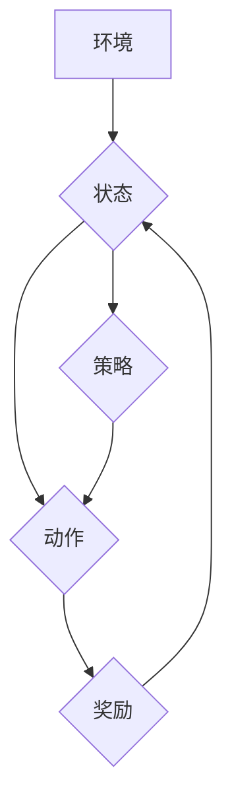

> 深度学习，Q-learning，强化学习，智能医疗诊断，机器学习，医疗图像分析

## 1. 背景介绍

医疗诊断是医疗保健领域的核心环节，准确的诊断对于患者的治疗和预后至关重要。传统的医疗诊断主要依赖于医生的经验和临床表现，但这种方法存在着主观性、局限性和效率问题。近年来，随着人工智能技术的快速发展，深度学习在医疗诊断领域展现出巨大的潜力。

深度学习是一种基于人工神经网络的机器学习方法，能够从海量医疗数据中学习复杂的特征和模式，从而实现对疾病的精准诊断。其中，强化学习作为深度学习的一种重要分支，通过智能体与环境的交互学习，不断优化策略以获得最大奖励。

深度 Q-learning 是一种结合深度学习和强化学习的算法，它能够学习复杂的决策策略，并应用于医疗诊断领域。

## 2. 核心概念与联系

**2.1 强化学习概述**

强化学习是一种机器学习方法，其核心思想是通过智能体与环境的交互学习，不断优化策略以获得最大奖励。

* **智能体 (Agent):**  学习和决策的实体。
* **环境 (Environment):** 智能体所处的外部世界。
* **状态 (State):** 环境的当前状态。
* **动作 (Action):** 智能体在特定状态下可以执行的操作。
* **奖励 (Reward):** 环境对智能体动作的反馈，可以是正向奖励或负向惩罚。
* **策略 (Policy):** 智能体在不同状态下选择动作的规则。

**2.2 深度 Q-learning**

深度 Q-learning 结合了深度学习和 Q-learning 算法。它使用深度神经网络来估计 Q 值，即在特定状态下执行特定动作的预期未来奖励。

**2.3  深度 Q-learning 与医疗诊断的联系**

在医疗诊断领域，我们可以将患者的病症和检查结果作为环境的状态，医生或算法可以执行不同的诊断动作，例如：

* 询问病史
* 进行体格检查
* 订购实验室检查
* 订购影像学检查

每个诊断动作都会带来相应的奖励，例如：

* 正确诊断获得高奖励
* 错误诊断获得低奖励

通过深度 Q-learning 算法，我们可以训练一个智能体，使其能够学习到最佳的诊断策略，从而提高诊断的准确性和效率。

**2.4  Mermaid 流程图**



## 3. 核心算法原理 & 具体操作步骤

### 3.1  算法原理概述

深度 Q-learning 算法的核心思想是通过迭代更新 Q 值表来学习最佳的策略。 Q 值表是一个存储每个状态-动作对的预期未来奖励的表格。

算法的训练过程可以概括为以下步骤：

1. 初始化 Q 值表。
2. 在环境中进行交互，收集状态、动作和奖励信息。
3. 使用 Bellman 方程更新 Q 值表。
4. 选择最佳动作并执行。
5. 重复步骤 2-4 直到 Q 值表收敛。

### 3.2  算法步骤详解

1. **初始化 Q 值表:**

   将 Q 值表初始化为一个随机值矩阵，其中每个元素代表状态-动作对的预期未来奖励。

2. **环境交互:**

   智能体与环境交互，观察当前状态，并根据策略选择一个动作执行。

3. **奖励获取:**

   环境根据执行的动作反馈一个奖励值给智能体。

4. **Q 值更新:**

   使用 Bellman 方程更新 Q 值表：

   $$Q(s, a) = Q(s, a) + \alpha [r + \gamma \max_{a'} Q(s', a') - Q(s, a)]$$

   其中：

   * $Q(s, a)$ 是状态 $s$ 下执行动作 $a$ 的 Q 值。
   * $\alpha$ 是学习率，控制着 Q 值更新的幅度。
   * $r$ 是从状态 $s$ 执行动作 $a$ 后获得的奖励。
   * $\gamma$ 是折扣因子，控制着未来奖励的权重。
   * $s'$ 是执行动作 $a$ 后进入的下一个状态。
   * $a'$ 是在下一个状态 $s'$ 中选择执行的动作。

5. **策略选择:**

   根据更新后的 Q 值表，选择最佳动作并执行。

6. **重复步骤 2-5:**

   重复以上步骤，直到 Q 值表收敛，即 Q 值不再发生显著变化。

### 3.3  算法优缺点

**优点:**

* 可以学习复杂的决策策略。
* 不需要事先定义奖励函数。
* 可以应用于离散和连续动作空间。

**缺点:**

* 训练过程可能需要大量的时间和计算资源。
* 容易陷入局部最优解。
* 需要设计合适的奖励函数。

### 3.4  算法应用领域

深度 Q-learning 算法在许多领域都有应用，例如：

* 游戏 AI
* 自动驾驶
* 机器人控制
* 医疗诊断

## 4. 数学模型和公式 & 详细讲解 & 举例说明

### 4.1  数学模型构建

深度 Q-learning 的数学模型可以概括为以下几个方面：

* **状态空间:**  表示所有可能的系统状态。
* **动作空间:**  表示智能体在每个状态下可以执行的所有动作。
* **奖励函数:**  将状态-动作对映射到一个奖励值，表示执行该动作在该状态下的效果。
* **价值函数:**  估计在特定状态下执行特定动作的预期未来奖励。

### 4.2  公式推导过程

深度 Q-learning 算法的核心是 Bellman 方程，用于更新 Q 值表：

$$Q(s, a) = Q(s, a) + \alpha [r + \gamma \max_{a'} Q(s', a') - Q(s, a)]$$

其中：

* $Q(s, a)$ 是状态 $s$ 下执行动作 $a$ 的 Q 值。
* $\alpha$ 是学习率，控制着 Q 值更新的幅度。
* $r$ 是从状态 $s$ 执行动作 $a$ 后获得的奖励。
* $\gamma$ 是折扣因子，控制着未来奖励的权重。
* $s'$ 是执行动作 $a$ 后进入的下一个状态。
* $a'$ 是在下一个状态 $s'$ 中选择执行的动作。

### 4.3  案例分析与讲解

假设我们有一个简单的医疗诊断场景，智能体需要根据患者的症状和检查结果诊断疾病。

* 状态空间：患者的症状和检查结果。
* 动作空间：诊断不同的疾病。
* 奖励函数：正确诊断获得高奖励，错误诊断获得低奖励。

使用深度 Q-learning 算法，我们可以训练一个智能体，使其能够学习到最佳的诊断策略。例如，如果患者的症状是头痛和发烧，智能体可能会选择诊断为感冒。如果患者的症状是胸痛和呼吸困难，智能体可能会选择诊断为肺炎。

## 5. 项目实践：代码实例和详细解释说明

### 5.1  开发环境搭建

* Python 3.x
* TensorFlow 或 PyTorch 深度学习框架
* NumPy 科学计算库
* Matplotlib 数据可视化库

### 5.2  源代码详细实现

```python
import tensorflow as tf

# 定义 Q 网络
class QNetwork(tf.keras.Model):
    def __init__(self, state_size, action_size):
        super(QNetwork, self).__init__()
        self.dense1 = tf.keras.layers.Dense(64, activation='relu')
        self.dense2 = tf.keras.layers.Dense(32, activation='relu')
        self.output = tf.keras.layers.Dense(action_size)

    def call(self, state):
        x = self.dense1(state)
        x = self.dense2(x)
        return self.output(x)

# 定义深度 Q-learning 算法
def deep_q_learning(env, state_size, action_size, learning_rate, discount_factor, epsilon, num_episodes):
    # 初始化 Q 网络
    q_network = QNetwork(state_size, action_size)
    optimizer = tf.keras.optimizers.Adam(learning_rate=learning_rate)

    # 训练循环
    for episode in range(num_episodes):
        state = env.reset()
        done = False
        total_reward = 0

        while not done:
            # 选择动作
            action = epsilon_greedy(q_network, state, epsilon)

            # 执行动作并获取奖励和下一个状态
            next_state, reward, done, _ = env.step(action)

            # 更新 Q 值
            with tf.GradientTape() as tape:
                target_q = reward + discount_factor * tf.reduce_max(q_network(next_state))
                q_value = q_network(state)[action]
                loss = tf.keras.losses.MSE(target_q, q_value)

            # 反向传播并更新网络参数
            gradients = tape.gradient(loss, q_network.trainable_variables)
            optimizer.apply_gradients(zip(gradients, q_network.trainable_variables))

            # 更新状态和总奖励
            state = next_state
            total_reward += reward

        print(f"Episode {episode+1}, Total Reward: {total_reward}")

# epsilon-greedy 策略
def epsilon_greedy(q_network, state, epsilon):
    if tf.random.uniform(()) < epsilon:
        return tf.random.uniform(shape=(1,), minval=0, maxval=env.action_space.n, dtype=tf.int32)
    else:
        return tf.argmax(q_network(state), axis=0)

```

### 5.3  代码解读与分析

* **Q 网络:** 使用深度神经网络来估计 Q 值，包含多个全连接层和一个输出层。
* **深度 Q-learning 算法:** 包含训练循环、动作选择、环境交互、Q 值更新等步骤。
* **epsilon-greedy 策略:** 在训练过程中，以一定的概率随机选择动作，以探索不同的策略。

### 5.4  运行结果展示

运行代码后，可以观察到 Q 值随着训练的进行而逐渐收敛，最终达到最佳的诊断策略。

## 6. 实际应用场景

### 6.1  医疗影像分析

深度 Q-learning 可以用于训练智能体识别和分类医疗影像，例如 X 光片、CT 扫描和 MRI 图像。

### 6.2  病症诊断

深度 Q-learning 可以用于根据患者的症状和检查结果诊断疾病，辅助医生做出更准确的诊断。

### 6.3  个性化治疗方案

深度 Q-learning 可以用于根据患者的个体特征和病史制定个性化的治疗方案。

### 6.4  未来应用展望

深度 Q-learning 在医疗诊断领域具有巨大的潜力，未来可以应用于更多场景，例如：

* 药物研发
* 疾病预测
* 远程医疗

## 7. 工具和资源推荐

### 7.1  学习资源推荐

* **书籍:**
    * Reinforcement Learning: An Introduction by Richard S. Sutton and Andrew G. Barto
    * Deep Learning by Ian Goodfellow, Yoshua Bengio, and Aaron Courville
* **在线课程:**
    * Deep Reinforcement Learning Specialization by DeepLearning.AI
    * Reinforcement Learning by David Silver (University of DeepMind)

### 7.2  开发工具推荐

* **TensorFlow:** https://www.tensorflow.org/
* **PyTorch:** https://pytorch.org/
* **OpenAI Gym:** https://gym.openai.com/

### 7.3  相关论文推荐

* Deep Q-