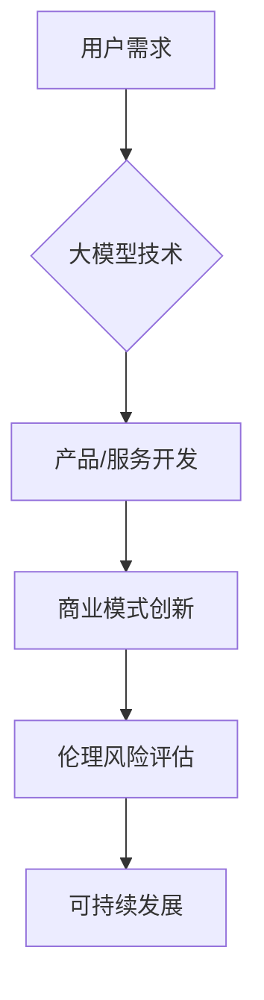

> 大模型、用户需求、创业、技术趋势、商业模式、应用场景、伦理风险

## 1. 背景介绍

近年来，大模型技术蓬勃发展，其强大的泛化能力和应用潜力引发了广泛关注。从文本生成、图像识别到代码编写，大模型已在多个领域展现出令人惊叹的成果。与此同时，大模型也为创业者带来了前所未有的机遇。

然而，大模型创业并非一帆风顺。如何准确把握用户需求，构建可持续的商业模式，并应对潜在的伦理风险，是创业者需要认真思考的问题。本文将从用户需求出发，探讨大模型创业的航标，为创业者提供一些有价值的思考和建议。

## 2. 核心概念与联系

**2.1 大模型概述**

大模型是指参数规模庞大、训练数据海量的人工智能模型。其强大的学习能力使其能够处理复杂的任务，并生成高质量的输出。常见的代表性大模型包括GPT-3、BERT、DALL-E等。

**2.2 用户需求分析**

用户需求是创业成功的关键因素。大模型创业需要深入了解用户的痛点、需求和期望，才能开发出真正有价值的产品和服务。

**2.3 商业模式创新**

大模型技术为商业模式创新提供了新的可能性。创业者可以利用大模型的优势，开发新的产品和服务，并探索新的商业模式。

**2.4 伦理风险评估**

大模型的应用也存在潜在的伦理风险，例如数据隐私、算法偏见、信息操纵等。创业者需要认真评估这些风险，并采取相应的措施进行规避。

**Mermaid 流程图**

## 3. 核心算法原理 & 具体操作步骤

**3.1 算法原理概述**

大模型的训练主要基于深度学习算法，例如Transformer网络。Transformer网络通过自注意力机制，能够捕捉文本序列中的长距离依赖关系，从而实现更准确的文本理解和生成。

**3.2 算法步骤详解**

1. **数据预处理:** 将原始数据进行清洗、格式化和编码，使其能够被模型理解。
2. **模型构建:** 根据具体的任务需求，选择合适的深度学习模型架构，并设置模型参数。
3. **模型训练:** 使用训练数据，通过反向传播算法，调整模型参数，使其能够准确地完成任务。
4. **模型评估:** 使用测试数据，评估模型的性能，并根据评估结果进行模型调优。
5. **模型部署:** 将训练好的模型部署到生产环境中，提供服务给用户。

**3.3 算法优缺点**

**优点:**

* 强大的泛化能力
* 高质量的输出结果
* 可处理复杂的任务

**缺点:**

* 训练成本高
* 训练时间长
* 容易出现过拟合问题

**3.4 算法应用领域**

* 文本生成
* 机器翻译
* 语音识别
* 图像识别
* 代码生成

## 4. 数学模型和公式 & 详细讲解 & 举例说明

**4.1 数学模型构建**

大模型的训练过程可以看作是一个优化问题，目标是找到一个能够最小化损失函数的参数集。损失函数通常是模型预测结果与真实结果之间的差异。

**4.2 公式推导过程**

损失函数的计算公式如下：

$$
L = \sum_{i=1}^{N} \mathcal{L}(y_i, \hat{y}_i)
$$

其中：

* $L$ 是损失函数
* $N$ 是样本数量
* $\mathcal{L}$ 是单个样本的损失函数
* $y_i$ 是真实标签
* $\hat{y}_i$ 是模型预测结果

**4.3 案例分析与讲解**

例如，在文本生成任务中，可以使用交叉熵损失函数来衡量模型预测结果与真实文本之间的差异。

$$
\mathcal{L}(y, \hat{y}) = - \sum_{i=1}^{M} y_i \log(\hat{y}_i)
$$

其中：

* $y$ 是真实文本的词向量表示
* $\hat{y}$ 是模型预测的词向量表示
* $M$ 是文本长度

## 5. 项目实践：代码实例和详细解释说明

**5.1 开发环境搭建**

大模型开发通常需要强大的计算资源和专业的开发环境。可以使用云计算平台，例如AWS、Google Cloud、Azure等，搭建开发环境。

**5.2 源代码详细实现**

可以使用深度学习框架，例如TensorFlow、PyTorch等，实现大模型的训练和部署。

**5.3 代码解读与分析**

代码需要清晰、简洁、易于理解。注释可以帮助解释代码的功能和逻辑。

**5.4 运行结果展示**

需要对模型的训练结果进行评估，并展示模型的性能指标，例如准确率、召回率、F1-score等。

## 6. 实际应用场景

**6.1 文本生成**

大模型可以用于生成各种类型的文本，例如文章、故事、诗歌、代码等。

**6.2 机器翻译**

大模型可以实现高质量的机器翻译，跨越语言障碍，促进信息交流。

**6.3 语音识别**

大模型可以用于语音识别，将语音转换为文本，方便用户进行搜索、查询和控制。

**6.4 图像识别**

大模型可以用于图像识别，识别图像中的物体、场景和人物，应用于图像搜索、医疗诊断等领域。

**6.5 代码生成**

大模型可以根据自然语言描述生成代码，提高开发效率，降低开发成本。

**6.6 未来应用展望**

大模型的应用场景还在不断扩展，未来将应用于更多领域，例如个性化教育、精准医疗、智能客服等。

## 7. 工具和资源推荐

**7.1 学习资源推荐**

* 深度学习书籍：
    * 《深度学习》
    * 《动手学深度学习》
* 在线课程：
    * Coursera
    * edX
    * fast.ai

**7.2 开发工具推荐**

* 深度学习框架：
    * TensorFlow
    * PyTorch
* 云计算平台：
    * AWS
    * Google Cloud
    * Azure

**7.3 相关论文推荐**

* 《Attention Is All You Need》
* 《BERT: Pre-training of Deep Bidirectional Transformers for Language Understanding》
* 《GPT-3: Language Models are Few-Shot Learners》

## 8. 总结：未来发展趋势与挑战

**8.1 研究成果总结**

近年来，大模型技术取得了显著进展，模型规模不断扩大，性能不断提升。大模型已在多个领域展现出强大的应用潜力。

**8.2 未来发展趋势**

* 模型规模进一步扩大
* 模型训练效率提升
* 模型应用场景更加广泛
* 模型安全性与可靠性增强

**8.3 面临的挑战**

* 计算资源需求高
* 训练数据获取困难
* 算法偏见问题
* 伦理风险问题

**8.4 研究展望**

未来，大模型研究将继续朝着更强大、更安全、更可持续的方向发展。

## 9. 附录：常见问题与解答

**9.1 如何选择合适的模型架构？**

选择合适的模型架构需要根据具体的任务需求和数据特点进行考虑。

**9.2 如何解决模型过拟合问题？**

可以使用正则化技术、数据增强、Dropout等方法来解决模型过拟合问题。

**9.3 如何评估模型性能？**

可以使用准确率、召回率、F1-score等指标来评估模型性能。

**9.4 如何应对模型算法偏见问题？**

需要使用更加公平、公正的数据集进行训练，并对模型进行公平性评估。

**9.5 如何规避模型伦理风险？**

需要制定相应的伦理规范，并对模型应用进行监督和管理。

作者：禅与计算机程序设计艺术 / Zen and the Art of Computer Programming 
<end_of_turn>