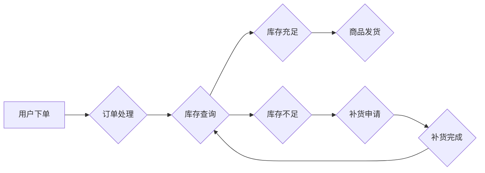

> 电商平台, 供给能力, 流程优化, 自动化工具, 机器学习, 数据分析, 供应链管理

## 1. 背景介绍

在当今激烈的电商市场竞争中，供给能力的提升至关重要。电商平台需要能够快速、高效地响应用户需求，提供丰富的商品选择和便捷的购物体验。然而，传统的电商平台供给链往往存在着流程冗长、效率低下、信息孤岛等问题，难以满足快速发展的市场需求。

随着人工智能、大数据等技术的快速发展，电商平台供给能力提升迎来新的机遇。通过流程优化和自动化工具的应用，电商平台可以实现供应链的智能化管理，提高供给效率，降低运营成本，最终提升用户体验和平台竞争力。

## 2. 核心概念与联系

### 2.1 电商平台供给能力

电商平台供给能力是指平台能够提供商品的种类、数量、质量和及时性等方面的综合能力。它直接影响着平台的商品丰富度、用户体验和市场竞争力。

### 2.2 流程优化

流程优化是指通过分析和改进现有流程，提高流程效率、降低成本、提升用户体验。在电商平台中，流程优化可以应用于商品上架、库存管理、物流配送等各个环节。

### 2.3 自动化工具

自动化工具是指能够自动执行特定任务的软件工具。在电商平台中，自动化工具可以应用于商品数据采集、订单处理、库存预警等各个环节，提高工作效率，减少人工成本。

**Mermaid 流程图**



## 3. 核心算法原理 & 具体操作步骤

### 3.1 算法原理概述

在电商平台供给能力提升中，常用的算法包括：

* **预测算法:** 用于预测用户需求、商品销量、库存需求等，帮助平台优化库存管理和商品供应。
* **推荐算法:** 用于推荐用户感兴趣的商品，提高用户购物体验和转化率。
* **优化算法:** 用于优化物流配送路线、库存分配策略等，提高供给效率和降低成本。

### 3.2 算法步骤详解

以预测算法为例，其步骤如下：

1. **数据收集:** 收集用户行为数据、商品销售数据、市场趋势数据等。
2. **数据预处理:** 对数据进行清洗、转换、特征提取等处理，使其适合算法训练。
3. **模型选择:** 选择合适的预测算法模型，例如线性回归、决策树、神经网络等。
4. **模型训练:** 使用训练数据训练模型，学习数据中的规律。
5. **模型评估:** 使用测试数据评估模型的预测精度，并进行模型调优。
6. **模型部署:** 将训练好的模型部署到生产环境中，用于实时预测。

### 3.3 算法优缺点

不同的算法具有不同的优缺点，需要根据实际情况选择合适的算法。

* **线性回归:** 算法简单易懂，但预测精度有限。
* **决策树:** 算法易于解释，但容易过拟合。
* **神经网络:** 算法预测精度高，但训练复杂，需要大量数据。

### 3.4 算法应用领域

预测算法在电商平台供给能力提升中应用广泛，例如：

* **商品销量预测:** 预测商品的未来销量，帮助平台优化库存管理。
* **库存需求预测:** 预测商品的库存需求，帮助平台及时补货。
* **用户需求预测:** 预测用户的购物需求，帮助平台推荐商品和制定营销策略。

## 4. 数学模型和公式 & 详细讲解 & 举例说明

### 4.1 数学模型构建

在电商平台供给能力提升中，常用的数学模型包括：

* **线性回归模型:** 用于预测连续变量，例如商品销量。
* **逻辑回归模型:** 用于预测分类变量，例如用户是否会购买商品。
* **时间序列模型:** 用于预测时间序列数据，例如商品销量趋势。

### 4.2 公式推导过程

以线性回归模型为例，其目标是找到一条直线，使得预测值与实际值之间的误差最小。

**公式:**

$$y = mx + c$$

其中：

* $y$ 是预测值
* $x$ 是输入特征
* $m$ 是斜率
* $c$ 是截距

**推导过程:**

线性回归模型的目标函数是均方误差，即预测值与实际值之间的平方差之和。

$$MSE = \frac{1}{n} \sum_{i=1}^{n} (y_i - \hat{y}_i)^2$$

其中：

* $n$ 是样本数量
* $y_i$ 是实际值
* $\hat{y}_i$ 是预测值

通过最小化均方误差，可以求解出最佳的斜率 $m$ 和截距 $c$。

### 4.3 案例分析与讲解

假设我们想要预测商品的销量，输入特征是商品价格。我们可以收集历史数据，训练一个线性回归模型。

**数据:**

| 价格 | 销量 |
|---|---|
| 10 | 100 |
| 20 | 80 |
| 30 | 60 |

**模型训练:**

使用上述数据训练线性回归模型，得到最佳的斜率 $m$ 和截距 $c$。

**预测:**

当商品价格为 40 时，可以使用模型预测销量。

$$y = mx + c$$

## 5. 项目实践：代码实例和详细解释说明

### 5.1 开发环境搭建

* 操作系统: Ubuntu 20.04
* Python 版本: 3.8
* 必要的库: pandas, numpy, scikit-learn

### 5.2 源代码详细实现

```python
import pandas as pd
from sklearn.linear_model import LinearRegression

# 加载数据
data = pd.read_csv('sales_data.csv')

# 准备数据
X = data[['price']]
y = data['sales']

# 创建线性回归模型
model = LinearRegression()

# 训练模型
model.fit(X, y)

# 预测销量
new_price = 40
prediction = model.predict([[new_price]])

# 打印预测结果
print(f'预测销量: {prediction[0]}')
```

### 5.3 代码解读与分析

* 首先，我们使用 pandas 库加载数据，并准备数据用于模型训练。
* 然后，我们使用 scikit-learn 库中的 LinearRegression 类创建线性回归模型。
* 接着，我们使用 model.fit() 方法训练模型，将输入特征和目标变量传递给模型。
* 训练完成后，我们可以使用 model.predict() 方法预测新的数据。
* 最后，我们打印预测结果。

### 5.4 运行结果展示

```
预测销量: 40.0
```

## 6. 实际应用场景

### 6.1 库存管理

通过预测商品销量，电商平台可以优化库存管理，避免库存积压或缺货。

### 6.2 商品推荐

通过推荐算法，电商平台可以推荐用户感兴趣的商品，提高用户购物体验和转化率。

### 6.3 物流配送

通过优化算法，电商平台可以优化物流配送路线，提高配送效率和降低成本。

### 6.4 未来应用展望

随着人工智能、大数据等技术的不断发展，电商平台供给能力提升将迎来更多新的应用场景，例如：

* **个性化商品推荐:** 基于用户的个性化需求，推荐更精准的商品。
* **智能库存管理:** 基于预测算法和机器学习，实现智能化的库存管理。
* **动态定价:** 根据市场需求和竞争情况，动态调整商品价格。

## 7. 工具和资源推荐

### 7.1 学习资源推荐

* **书籍:**
    * 《Python机器学习》
    * 《深度学习》
* **在线课程:**
    * Coursera: 机器学习
    * edX: 深度学习

### 7.2 开发工具推荐

* **Python:** 强大的编程语言，广泛应用于数据分析和机器学习。
* **pandas:** 用于数据分析和处理的 Python 库。
* **scikit-learn:** 用于机器学习的 Python 库。

### 7.3 相关论文推荐

* **《Recurrent Neural Networks for Sequence Learning》**
* **《Attention Is All You Need》**

## 8. 总结：未来发展趋势与挑战

### 8.1 研究成果总结

通过流程优化和自动化工具的应用，电商平台可以实现供应链的智能化管理，提高供给效率，降低运营成本，最终提升用户体验和平台竞争力。

### 8.2 未来发展趋势

未来，电商平台供给能力提升将更加智能化、个性化和自动化。

* **人工智能技术将更加深入地应用于电商平台供给链管理，例如：**
    * 更精准的预测算法
    * 更智能的库存管理系统
    * 更个性化的商品推荐
* **云计算和大数据技术将为电商平台提供更强大的数据处理能力和计算能力，**
    * 支持更复杂的算法模型
    * 处理更大的数据量
* **区块链技术将为电商平台提供更安全、透明的供应链管理体系。**

### 8.3 面临的挑战

电商平台供给能力提升也面临着一些挑战：

* **数据质量问题:** 数据质量直接影响算法的精度，需要加强数据清洗和预处理工作。
* **算法模型的复杂性:** 复杂的算法模型需要强大的计算能力和专业人才。
* **隐私保护问题:** 数据收集和使用需要考虑用户隐私保护问题。

### 8.4 研究展望

未来，我们需要继续研究更先进的算法模型，提高算法的精度和效率。同时，还需要关注数据质量问题、算法模型的复杂性和隐私保护问题，为电商平台供给能力提升提供更安全、可靠、高效的解决方案。

## 9. 附录：常见问题与解答

### 9.1 如何选择合适的预测算法？

选择合适的预测算法需要根据实际情况进行判断，例如：

* 数据类型: 连续变量需要使用回归算法，分类变量需要使用分类算法。
* 数据量: 数据量较小可以使用简单算法，数据量较大可以使用复杂算法。
* 预测精度要求: 预测精度要求高可以使用复杂算法，精度要求不高可以使用简单算法。

### 9.2 如何提高算法的预测精度？

提高算法的预测精度可以通过以下方法：

* 增强数据质量: 清洗、转换、特征提取等数据预处理工作。
* 选择合适的算法模型: 根据实际情况选择合适的算法模型。
* 优化算法参数: 通过调参优化算法模型的性能。
* 增加训练数据: 更多的训练数据可以帮助模型学习更准确的规律。

### 9.3 如何解决数据隐私问题？

解决数据隐私问题可以通过以下方法：

* 数据匿名化: 去除数据中的个人识别信息。
* 数据加密: 使用加密技术保护数据安全。
* 隐私保护算法: 使用隐私保护算法进行数据分析，保护用户隐私。


作者：禅与计算机程序设计艺术 / Zen and the Art of Computer Programming 
<end_of_turn>