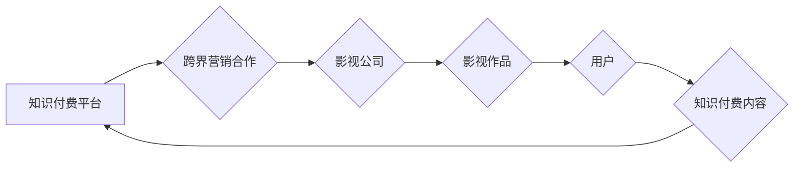

> 知识付费、跨界营销、影视合作、内容生态、IP价值、用户体验、数据驱动

## 1. 背景介绍

知识付费作为一种新型的商业模式，近年来发展迅速，其核心在于将知识、技能、经验等价值转化为可交易的商品或服务。而影视行业作为内容创作和传播的重要领域，拥有庞大的用户群体和丰富的资源。两者结合，可以实现资源互补、优势互生，共同打造新的商业模式和内容生态。

当前，知识付费市场呈现出以下特点：

* **用户需求多元化:** 用户对知识的需求不再局限于传统教育领域，而是涵盖了生活技能、专业技能、兴趣爱好等多个方面。
* **内容形式多样化:** 除了文字、音频、视频等传统形式，知识付费内容还包括直播、互动课程、在线社区等新兴形式。
* **平台竞争激烈:** 众多互联网平台纷纷入局知识付费市场，竞争日益激烈。

影视行业也面临着新的挑战：

* **内容创新乏力:** 观众对传统影视内容的接受度逐渐下降，对新颖、高质量的内容需求不断提升。
* **盈利模式单一:** 广告收入和版权授权收入难以满足影视行业的持续发展需求。

## 2. 核心概念与联系

**2.1 知识付费**

知识付费是指将知识、技能、经验等价值转化为可交易的商品或服务，通过线上或线下平台向用户提供付费获取知识的模式。

**2.2 跨界营销**

跨界营销是指企业将自身产品或服务与其他行业或领域的品牌、产品或服务进行合作，共同推广，以扩大品牌影响力和市场份额。

**2.3 影视合作**

影视合作是指影视公司与其他企业或机构进行合作，共同制作、发行、推广影视作品，以实现资源共享、利益互利。

**2.4 内容生态**

内容生态是指围绕内容创作、传播、消费形成的复杂网络系统，包括内容生产者、平台、用户、广告商等参与主体。

**2.5 IP价值**

IP（知识产权）价值是指知识产权所具有的经济价值和社会价值。

**2.6 用户体验**

用户体验是指用户在使用产品或服务时所感受到的整体感受，包括易用性、可用性、愉悦度等方面。

**2.7 数据驱动**

数据驱动是指利用数据分析和挖掘技术，为决策提供依据，优化运营策略。

**2.8 Mermaid 流程图**



## 3. 核心算法原理 & 具体操作步骤

### 3.1  算法原理概述

知识付费与影视合作的跨界营销本质上是一种内容生态构建和用户价值挖掘的过程。通过算法分析用户行为数据，精准匹配用户需求和影视作品内容，实现知识付费内容的推荐和推广，从而提升用户体验和商业价值。

### 3.2  算法步骤详解

1. **用户画像构建:** 收集用户行为数据，包括观看历史、点赞评论、购买记录等，构建用户画像，分析用户兴趣爱好、消费习惯等特征。
2. **内容标签化:** 对影视作品进行标签化，包括题材、类型、演员、导演等信息，并对知识付费内容进行分类和标签化，例如课程类型、知识领域、难度等级等。
3. **关联分析:** 利用机器学习算法，分析用户画像和内容标签之间的关联关系，识别用户潜在的知识付费需求。
4. **推荐算法:** 基于关联分析结果，推荐符合用户需求的知识付费内容，并根据用户反馈进行算法优化。
5. **跨界营销策略:** 根据用户画像和推荐结果，制定跨界营销策略，例如在影视作品中植入知识付费内容的广告，或在知识付费平台上推广相关影视作品。

### 3.3  算法优缺点

**优点:**

* **精准推荐:** 算法可以根据用户需求精准推荐知识付费内容，提升用户体验。
* **数据驱动:** 算法基于数据分析，能够不断优化推荐策略，提高推荐效果。
* **跨界营销:** 算法可以帮助知识付费平台和影视公司实现跨界营销，扩大用户群体和市场份额。

**缺点:**

* **数据依赖:** 算法需要大量用户行为数据才能有效运行，数据质量直接影响算法效果。
* **算法偏差:** 算法可能会存在偏差，导致推荐结果不准确或不公平。
* **用户隐私:** 数据收集和分析可能会涉及用户隐私问题，需要妥善处理。

### 3.4  算法应用领域

* **在线教育:** 推荐个性化学习课程，提升学习效率。
* **娱乐产业:** 推荐相关知识付费内容，增强用户粘性。
* **电商平台:** 推荐个性化商品，提升转化率。
* **金融服务:** 推荐理财产品，满足用户需求。

## 4. 数学模型和公式 & 详细讲解 & 举例说明

### 4.1  数学模型构建

知识付费与影视合作的跨界营销可以构建一个用户-内容-平台的数学模型，其中用户、内容和平台之间存在着相互影响的关系。

**用户:**

* $U_i$: 第 $i$ 个用户
* $P_{ij}$: 用户 $U_i$ 对内容 $C_j$ 的兴趣度

**内容:**

* $C_j$: 第 $j$ 个内容
* $T_j$: 内容 $C_j$ 的类型
* $L_j$: 内容 $C_j$ 的标签

**平台:**

* $P$: 平台
* $R_{ij}$: 平台 $P$ 将内容 $C_j$ 推荐给用户 $U_i$ 的概率

### 4.2  公式推导过程

**用户兴趣度预测:**

$$P_{ij} = f(U_i, C_j, T_j, L_j)$$

其中，$f$ 为一个机器学习模型，例如线性回归、逻辑回归或深度神经网络。

**推荐概率计算:**

$$R_{ij} = g(P_{ij}, U_i, C_j)$$

其中，$g$ 为一个推荐算法，例如基于内容的推荐、基于协同过滤的推荐或基于深度学习的推荐。

### 4.3  案例分析与讲解

假设一个知识付费平台想要与影视公司合作，推广相关知识付费课程。

1. **用户画像构建:** 平台收集用户观看历史、点赞评论、购买记录等数据，构建用户画像，分析用户对不同类型影视作品的偏好。
2. **内容标签化:** 平台对影视作品进行标签化，例如类型、题材、演员等信息，并对知识付费课程进行分类和标签化，例如课程类型、知识领域、难度等级等。
3. **关联分析:** 平台利用机器学习算法，分析用户画像和内容标签之间的关联关系，识别用户潜在的知识付费需求。例如，如果用户经常观看历史题材的影视作品，平台可能会推荐相关的历史知识付费课程。
4. **推荐算法:** 平台根据关联分析结果，推荐符合用户需求的知识付费课程，并根据用户反馈进行算法优化。
5. **跨界营销策略:** 平台在影视作品中植入知识付费课程的广告，或在知识付费平台上推广相关影视作品，吸引用户关注和购买。

## 5. 项目实践：代码实例和详细解释说明

### 5.1  开发环境搭建

* 操作系统: Ubuntu 20.04
* Python 版本: 3.8
* 虚拟环境: venv
* 依赖库: numpy, pandas, scikit-learn, tensorflow

### 5.2  源代码详细实现

```python
# 用户兴趣度预测模型
from sklearn.linear_model import LogisticRegression

# 数据加载
data = pd.read_csv('user_content_data.csv')

# 特征工程
X = data[['user_id', 'content_id', 'content_type', 'content_label']]
y = data['interest_score']

# 模型训练
model = LogisticRegression()
model.fit(X, y)

# 推荐概率计算
def predict_recommendation_probability(user_id, content_id, content_type, content_label):
    features = [[user_id, content_id, content_type, content_label]]
    probability = model.predict_proba(features)[0][1]
    return probability

# 跨界营销策略
def cross_marketing_strategy(user_id, content_id, content_type, content_label):
    probability = predict_recommendation_probability(user_id, content_id, content_type, content_label)
    if probability > 0.8:
        # 在影视作品中植入知识付费课程的广告
        print(f'推荐知识付费课程给用户 {user_id}')
```

### 5.3  代码解读与分析

* 用户兴趣度预测模型使用逻辑回归算法，根据用户特征和内容特征预测用户对内容的兴趣度。
* 推荐概率计算函数根据用户特征和内容特征，预测平台将内容推荐给用户的概率。
* 跨界营销策略函数根据推荐概率，决定是否在影视作品中植入知识付费课程的广告。

### 5.4  运行结果展示

运行代码后，可以得到用户对不同内容的兴趣度预测结果和推荐概率，并根据策略进行跨界营销。

## 6. 实际应用场景

### 6.1  案例分析

* **爱奇艺与网易云课堂合作:** 爱奇艺推出“云课堂”栏目，与网易云课堂合作，将影视作品与相关知识付费课程进行捆绑销售，提升用户粘性和收入。
* **腾讯视频与腾讯课堂合作:** 腾讯视频在播放影视作品时，会推荐相关腾讯课堂课程，例如学习影视制作、表演技巧等知识。

### 6.2  未来应用展望

* **个性化推荐:** 利用人工智能技术，实现更精准的个性化推荐，满足用户多样化的需求。
* **沉浸式体验:** 将知识付费内容与影视作品深度融合，打造沉浸式体验，提升用户参与度。
* **跨平台合作:** 跨界营销将不再局限于影视平台和知识付费平台，而是会扩展到更多领域，例如游戏、音乐、旅游等。

## 7. 工具和资源推荐

### 7.1  学习资源推荐

* **机器学习:** Andrew Ng 的机器学习课程
* **深度学习:** 深度学习 Specialization
* **数据分析:** Python for Data Analysis

### 7.2  开发工具推荐

* **Python:** 强大的编程语言，广泛应用于数据分析、机器学习等领域。
* **TensorFlow:** 开源深度学习框架，用于构建和训练深度学习模型。
* **Scikit-learn:** Python 机器学习库，提供各种机器学习算法和工具。

### 7.3  相关论文推荐

* **Collaborative Filtering for Recommender Systems**
* **Deep Learning for Recommender Systems**
* **Content-Based Recommendation Systems**

## 8. 总结：未来发展趋势与挑战

### 8.1  研究成果总结

知识付费与影视合作的跨界营销，通过算法分析用户行为数据，精准匹配用户需求和影视作品内容，实现知识付费内容的推荐和推广，提升用户体验和商业价值。

### 8.2  未来发展趋势

* **人工智能技术:** 人工智能技术将进一步提升跨界营销的精准度和效率。
* **内容生态构建:** 内容生态将更加丰富和多元化，跨界营销将更加广泛和深入。
* **用户体验优化:** 用户体验将成为跨界营销的核心竞争力。

### 8.3  面临的挑战

* **数据隐私保护:** 数据收集和分析可能会涉及用户隐私问题，需要妥善处理。
* **算法偏差:** 算法可能会存在偏差，导致推荐结果不准确或不公平。
* **商业模式创新:** 需要不断探索新的商业模式，实现跨界营销的可持续发展。

### 8.4  研究展望

未来，我们将继续研究知识付费与影视合作的跨界营销，