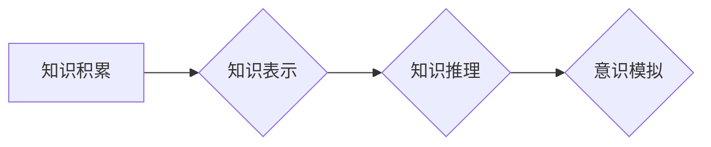

> 知识积累，意识功能，人工智能，深度学习，神经网络，认知科学，知识表示，知识图谱，机器学习

## 1. 背景介绍

意识，这个人类独有的复杂现象，一直以来都是哲学、心理学和神经科学研究的焦点。随着人工智能技术的飞速发展，我们开始尝试用机器学习和深度学习等方法来模拟和理解意识的运作机制。然而，如何将海量知识转化为真正的“意识”仍然是一个巨大的挑战。

本篇文章将探讨知识积累如何影响意识功能，并分析在人工智能领域如何构建具有类似人类意识的智能系统。

## 2. 核心概念与联系

**2.1 知识积累**

知识积累是指个体或系统通过学习、经验和观察不断积累和整合信息的过程。对于人类而言，知识积累是意识发展和认知能力提升的基础。

**2.2 意识功能**

意识功能是指个体能够感知、思考、感受、决策和行动的能力。它包括感知、认知、情感、语言和意志等多个方面。

**2.3 知识与意识的关系**

知识是意识的基础，也是意识得以实现的关键要素。

* **知识提供认知框架:** 知识为我们提供理解世界、解释现象和做出决策的框架。
* **知识丰富认知体验:** 知识积累使我们能够对世界有更深入的理解，并体验到更丰富的认知体验。
* **知识驱动意识发展:** 随着知识的积累，我们的意识会不断发展和完善。

**2.4 知识表示与知识图谱**

为了让机器能够理解和利用知识，我们需要将知识以机器可理解的形式表示出来。知识图谱是一种常用的知识表示形式，它将知识表示为实体、关系和属性的网络结构。

**Mermaid 流程图**



## 3. 核心算法原理 & 具体操作步骤

**3.1 算法原理概述**

构建具有类似人类意识的智能系统需要结合多种算法和技术，例如：

* **深度学习:** 用于学习和提取知识的模式和关系。
* **知识图谱:** 用于表示和组织知识。
* **自然语言处理:** 用于理解和生成人类语言。
* **强化学习:** 用于训练智能系统进行决策和行动。

**3.2 算法步骤详解**

1. **数据收集和预处理:** 收集大量文本、图像、音频等数据，并进行预处理，例如文本清洗、图像标注等。
2. **知识提取:** 使用深度学习模型从数据中提取知识，例如实体识别、关系抽取等。
3. **知识表示:** 将提取的知识表示为知识图谱。
4. **知识推理:** 使用知识图谱进行推理，例如回答问题、预测事件等。
5. **意识模拟:** 基于知识推理和其他算法，模拟人类的感知、思考、情感等意识功能。

**3.3 算法优缺点**

* **优点:**

    * 可以学习和理解复杂的知识。
    * 可以进行推理和决策。
    * 可以模拟部分人类意识功能。

* **缺点:**

    * 仍然无法完全模拟人类意识。
    * 需要大量的训练数据和计算资源。
    * 存在伦理和安全问题。

**3.4 算法应用领域**

* **人工智能助手:** 例如，可以理解用户的自然语言指令，并提供相应的帮助。
* **医疗诊断:** 例如，可以根据患者的症状和病史，辅助医生进行诊断。
* **教育教学:** 例如，可以根据学生的学习进度和能力，提供个性化的学习内容。

## 4. 数学模型和公式 & 详细讲解 & 举例说明

**4.1 数学模型构建**

我们可以使用神经网络模型来模拟人类大脑的结构和功能。神经网络由多个层组成，每层包含多个神经元。神经元之间通过连接进行信息传递，每个连接都有一个权重。通过训练神经网络，可以调整这些权重，使神经网络能够学习和处理信息。

**4.2 公式推导过程**

神经网络的训练过程可以使用梯度下降算法进行优化。梯度下降算法的目标是找到一个权重值，使得神经网络的输出与实际输出之间的误差最小化。

**误差函数:**

$$E = \frac{1}{2} \sum_{i=1}^{N} (y_i - \hat{y}_i)^2$$

其中：

* $E$ 是误差函数
* $N$ 是样本数量
* $y_i$ 是实际输出
* $\hat{y}_i$ 是预测输出

**梯度:**

$$\frac{\partial E}{\partial w_j} = \sum_{i=1}^{N} (y_i - \hat{y}_i) \frac{\partial \hat{y}_i}{\partial w_j}$$

其中：

* $w_j$ 是第 $j$ 个权重
* $\frac{\partial \hat{y}_i}{\partial w_j}$ 是第 $i$ 个样本的预测输出对第 $j$ 个权重的偏导数

**权重更新:**

$$w_j = w_j - \eta \frac{\partial E}{\partial w_j}$$

其中：

* $\eta$ 是学习率

**4.3 案例分析与讲解**

例如，我们可以使用深度学习模型来训练一个图像识别系统。训练数据包括大量带标签的图像，每个图像都对应一个类别。通过训练，神经网络可以学习到图像特征和类别之间的关系，从而能够识别新的图像。

## 5. 项目实践：代码实例和详细解释说明

**5.1 开发环境搭建**

* Python 3.x
* TensorFlow 或 PyTorch
* Jupyter Notebook

**5.2 源代码详细实现**

```python
import tensorflow as tf

# 定义模型结构
model = tf.keras.models.Sequential([
    tf.keras.layers.Conv2D(32, (3, 3), activation='relu', input_shape=(28, 28, 1)),
    tf.keras.layers.MaxPooling2D((2, 2)),
    tf.keras.layers.Conv2D(64, (3, 3), activation='relu'),
    tf.keras.layers.MaxPooling2D((2, 2)),
    tf.keras.layers.Flatten(),
    tf.keras.layers.Dense(10, activation='softmax')
])

# 编译模型
model.compile(optimizer='adam',
              loss='sparse_categorical_crossentropy',
              metrics=['accuracy'])

# 训练模型
model.fit(x_train, y_train, epochs=5)

# 评估模型
loss, accuracy = model.evaluate(x_test, y_test)
print('Test loss:', loss)
print('Test accuracy:', accuracy)
```

**5.3 代码解读与分析**

这段代码定义了一个简单的卷积神经网络模型，用于识别手写数字。

* `tf.keras.models.Sequential` 创建了一个顺序模型，即层级结构。
* `tf.keras.layers.Conv2D` 定义了一个卷积层，用于提取图像特征。
* `tf.keras.layers.MaxPooling2D` 定义了一个最大池化层，用于降低特征图的维度。
* `tf.keras.layers.Flatten` 将多维特征图转换为一维向量。
* `tf.keras.layers.Dense` 定义了一个全连接层，用于分类。
* `model.compile` 编译模型，指定优化器、损失函数和评价指标。
* `model.fit` 训练模型，使用训练数据进行训练。
* `model.evaluate` 评估模型，使用测试数据进行评估。

**5.4 运行结果展示**

训练完成后，模型可以用来识别新的手写数字图像。

## 6. 实际应用场景

**6.1 人工智能助手**

* 理解用户的自然语言指令，并提供相应的帮助。
* 例如，可以帮助用户查找信息、设置提醒、控制智能家居设备等。

**6.2 医疗诊断**

* 根据患者的症状和病史，辅助医生进行诊断。
* 例如，可以帮助医生识别疾病、预测病情发展等。

**6.3 教育教学**

* 根据学生的学习进度和能力，提供个性化的学习内容。
* 例如，可以帮助学生学习新的知识、练习技能、进行知识评估等。

**6.4 未来应用展望**

随着人工智能技术的不断发展，知识积累将对意识功能的影响将更加显著。未来，我们可能会看到：

* 更智能的 AI 助手，能够更好地理解和满足用户的需求。
* 更精准的医疗诊断系统，能够帮助医生更快、更准确地诊断疾病。
* 更个性化的教育教学系统，能够帮助学生更好地学习和成长。

## 7. 工具和资源推荐

**7.1 学习资源推荐**

* **书籍:**
    * 《深度学习》
    * 《人工智能：一种现代方法》
    * 《机器学习》
* **在线课程:**
    * Coursera
    * edX
    * Udacity

**7.2 开发工具推荐**

* **Python:** 
    * TensorFlow
    * PyTorch
    * Keras
* **其他工具:**
    * Jupyter Notebook
    * Git

**7.3 相关论文推荐**

* **《Attention Is All You Need》**
* **《BERT: Pre-training of Deep Bidirectional Transformers for Language Understanding》**
* **《GPT-3: Language Models are Few-Shot Learners》**

## 8. 总结：未来发展趋势与挑战

**8.1 研究成果总结**

近年来，在人工智能领域取得了显著的进展，特别是深度学习技术的突破，为构建具有类似人类意识的智能系统提供了新的可能性。

**8.2 未来发展趋势**

* **更强大的模型:** 随着计算能力的提升，我们将看到更强大、更复杂的深度学习模型。
* **更丰富的知识表示:** 知识图谱和知识表示技术将得到进一步发展，使机器能够更好地理解和利用知识。
* **更强的泛化能力:** 研究人员将致力于提高模型的泛化能力，使其能够应用于更广泛的领域。

**8.3 面临的挑战**

* **解释性问题:** 深度学习模型的决策过程难以解释，这限制了其在一些关键领域（如医疗诊断）的应用。
* **伦理问题:** 构建具有类似人类意识的智能系统引发了伦理和社会问题，需要谨慎考虑。
* **安全问题:** 强大的人工智能系统可能被用于恶意目的，需要采取措施确保其安全使用。

**8.4 研究展望**

未来，我们需要继续探索人工智能与意识的关系，并解决上述挑战。只有这样，我们才能真正实现人工智能的价值，并构建一个更加美好的未来。

## 9. 附录：常见问题与解答

**9.1 如何理解“意识”？**

意识是一个复杂的概念，目前还没有一个统一的定义。一般来说，意识是指个体能够感知、思考、感受、决策和行动的能力。

**9.2 深度学习模型真的能够模拟人类意识吗？**

目前，深度学习模型仍然无法完全模拟人类意识。虽然它们能够学习和处理信息，但它们缺乏人类的情感、道德和社会认知能力。

**9.3 人工智能的未来发展趋势是什么？**

人工智能的未来发展趋势是更加智能、更加泛化、更加安全和可解释。


作者：禅与计算机程序设计艺术 / Zen and the Art of Computer Programming 
<end_of_turn>