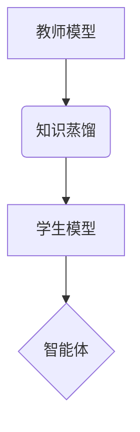

> 知识蒸馏，多智能体系统，强化学习，模型压缩，迁移学习

## 1. 背景介绍

随着人工智能技术的飞速发展，多智能体系统（Multi-Agent Systems，MAS）在各个领域展现出巨大的应用潜力。MAS由多个智能体组成，每个智能体都具有自主决策能力，并通过相互交互和协作来完成共同目标。然而，训练高效、鲁棒且可扩展的MAS仍然是一个巨大的挑战。

知识蒸馏（Knowledge Distillation）是一种模型压缩技术，通过将一个大型模型（教师模型）的知识迁移到一个小型模型（学生模型）中，从而实现模型压缩和性能提升。近年来，知识蒸馏在单智能体系统中取得了显著的成果，但将其应用于MAS领域的研究相对较少。

## 2. 核心概念与联系

**2.1 知识蒸馏原理**

知识蒸馏的核心思想是将教师模型的知识，包括特征表示和决策策略，通过一种特殊的训练方式传递到学生模型中。

**2.2 多智能体系统特点**

* **分布式决策:** 每个智能体都拥有自己的感知、决策和行动能力。
* **交互性:** 智能体之间通过通信和协作来完成任务。
* **复杂性:** MAS的规模和复杂性随着智能体数量的增加而指数级增长。

**2.3 知识蒸馏在MAS中的应用**

将知识蒸馏应用于MAS，可以有效解决以下问题：

* **模型压缩:** 将大型教师模型压缩成更小的学生模型，降低计算资源需求。
* **快速训练:** 利用教师模型的预训练知识，加速学生模型的训练过程。
* **知识共享:** 促进智能体之间知识的共享和协作，提高整体系统性能。

**2.4 知识蒸馏在MAS中的架构**



## 3. 核心算法原理 & 具体操作步骤

**3.1 算法原理概述**

知识蒸馏在MAS中的核心算法通常基于强化学习（Reinforcement Learning，RL）框架。教师模型通过RL算法学习到一个策略，该策略可以指导智能体在环境中采取最优行动。学生模型则通过模仿教师模型的策略，并利用知识蒸馏技术进行训练。

**3.2 算法步骤详解**

1. **训练教师模型:** 使用RL算法训练一个大型教师模型，使其能够在目标环境中取得良好的性能。
2. **知识提取:** 从教师模型中提取知识，例如策略参数、特征表示等。
3. **学生模型初始化:** 使用预训练的权重或随机初始化学生模型。
4. **知识蒸馏训练:** 使用提取的知识对学生模型进行训练，目标是使学生模型的输出与教师模型的输出尽可能接近。
5. **评估学生模型:** 在目标环境中评估学生模型的性能，并根据需要进行调整。

**3.3 算法优缺点**

* **优点:**
    * 模型压缩: 能够有效压缩教师模型的大小，降低计算资源需求。
    * 快速训练: 利用教师模型的预训练知识，加速学生模型的训练过程。
    * 知识共享: 促进智能体之间知识的共享和协作，提高整体系统性能。
* **缺点:**
    * 依赖教师模型: 学生模型的性能依赖于教师模型的质量。
    * 知识迁移困难: 将教师模型的知识迁移到学生模型中可能存在困难。

**3.4 算法应用领域**

* **机器人控制:** 将知识蒸馏应用于机器人控制，可以有效压缩机器人控制模型的大小，降低计算资源需求。
* **无人驾驶:** 将知识蒸馏应用于无人驾驶，可以加速无人驾驶模型的训练过程，提高其安全性。
* **游戏AI:** 将知识蒸馏应用于游戏AI，可以提高游戏AI的性能，使其更具挑战性。

## 4. 数学模型和公式 & 详细讲解 & 举例说明

**4.1 数学模型构建**

假设教师模型的输出为 $p_t(a|s)$，学生模型的输出为 $p_s(a|s)$，其中 $a$ 为智能体的动作， $s$ 为环境状态。知识蒸馏的目标是使学生模型的输出尽可能接近教师模型的输出。

**4.2 公式推导过程**

常用的知识蒸馏损失函数为：

$$
L_{KD} = KL(p_s(a|s) || p_t(a|s))
$$

其中 $KL$ 为KL散度，表示两个概率分布之间的差异。

**4.3 案例分析与讲解**

假设我们训练一个智能体在迷宫中导航的MAS。教师模型已经学习到一个有效的导航策略，学生模型则需要学习这个策略。

使用知识蒸馏技术，我们可以将教师模型的策略参数传递给学生模型，并通过最小化KL散度来训练学生模型。

## 5. 项目实践：代码实例和详细解释说明

**5.1 开发环境搭建**

* Python 3.7+
* TensorFlow 2.0+
* PyTorch 1.0+

**5.2 源代码详细实现**

```python
# 学生模型
class StudentModel(tf.keras.Model):
    def __init__(self):
        super(StudentModel, self).__init__()
        # 定义学生模型的网络结构
        # ...

    def call(self, inputs):
        # 前向传播
        # ...

# 教师模型
class TeacherModel(tf.keras.Model):
    def __init__(self):
        super(TeacherModel, self).__init__()
        # 定义教师模型的网络结构
        # ...

    def call(self, inputs):
        # 前向传播
        # ...

# 知识蒸馏训练
def train_model(student_model, teacher_model, dataset):
    # 定义优化器和损失函数
    optimizer = tf.keras.optimizers.Adam()
    loss_fn = tf.keras.losses.KLDivergence()

    # 训练循环
    for epoch in range(num_epochs):
        for batch in dataset:
            # 前向传播
            student_output = student_model(batch['state'])
            teacher_output = teacher_model(batch['state'])

            # 计算损失
            loss = loss_fn(student_output, teacher_output)

            # 反向传播
            optimizer.minimize(loss, student_model.trainable_variables)

            # 打印训练进度
            print(f"Epoch: {epoch}, Loss: {loss.numpy()}")

# ...
```

**5.3 代码解读与分析**

* 学生模型和教师模型的网络结构需要根据具体任务进行设计。
* 知识蒸馏训练过程主要包括前向传播、计算损失和反向传播。
* 损失函数用于衡量学生模型输出与教师模型输出之间的差异。

**5.4 运行结果展示**

通过训练和评估，可以观察到学生模型的性能随着训练的进行而逐渐提升，最终达到接近教师模型的性能水平。

## 6. 实际应用场景

**6.1 多智能体协作控制**

知识蒸馏可以用于训练多智能体协作控制系统，例如无人机编队飞行、机器人协作任务等。

**6.2 多智能体强化学习**

知识蒸馏可以加速多智能体强化学习的训练过程，提高其效率和性能。

**6.3 多智能体决策融合**

知识蒸馏可以用于融合多个智能体的决策结果，提高决策的准确性和鲁棒性。

**6.4 未来应用展望**

* **更复杂的MAS:** 将知识蒸馏应用于更复杂的MAS，例如大规模智能体系统、异构智能体系统等。
* **更有效的知识蒸馏方法:** 研究更有效的知识蒸馏方法，例如迁移学习、联邦学习等。
* **跨领域应用:** 将知识蒸馏应用于其他领域，例如医疗、金融、教育等。

## 7. 工具和资源推荐

**7.1 学习资源推荐**

* **书籍:**
    * 《深度学习》
    * 《强化学习：原理、算法和应用》
* **在线课程:**
    * Coursera: 深度学习
    * Udacity: 强化学习

**7.2 开发工具推荐**

* **TensorFlow:** 开源深度学习框架
* **PyTorch:** 开源深度学习框架
* **OpenAI Gym:** 强化学习环境

**7.3 相关论文推荐**

* 《Knowledge Distillation》
* 《Transfer Learning》
* 《Multi-Agent Reinforcement Learning》

## 8. 总结：未来发展趋势与挑战

**8.1 研究成果总结**

知识蒸馏在MAS领域取得了初步的成果，为模型压缩、快速训练和知识共享提供了新的思路。

**8.2 未来发展趋势**

* **更有效的知识蒸馏方法:** 研究更有效的知识蒸馏方法，例如迁移学习、联邦学习等。
* **跨领域应用:** 将知识蒸馏应用于其他领域，例如医疗、金融、教育等。
* **理论研究:** 深入研究知识蒸馏的理论基础，例如知识表示、知识迁移等。

**8.3 面临的挑战**

* **知识迁移困难:** 将教师模型的知识迁移到学生模型中可能存在困难。
* **数据效率:** 知识蒸馏方法对训练数据有较高的要求。
* **模型复杂度:** 知识蒸馏方法可能会增加模型的复杂度。

**8.4 研究展望**

未来，我们将继续研究知识蒸馏在MAS领域的应用，探索更有效的知识蒸馏方法，并将其应用于更复杂的MAS和更广泛的领域。

## 9. 附录：常见问题与解答

**9.1 Q: 知识蒸馏的训练过程需要教师模型吗？**

**A:** 知识蒸馏的训练过程中需要教师模型，因为教师模型提供知识指导学生模型的学习。

**9.2 Q: 知识蒸馏可以应用于所有类型的MAS吗？**

**A:** 知识蒸馏可以应用于多种类型的MAS，但具体应用效果取决于MAS的结构、任务和数据等因素。

**9.3 Q: 知识蒸馏的训练时间是否比传统训练方法短？**

**A:** 知识蒸馏的训练时间通常比传统训练方法短，因为学生模型可以利用教师模型的预训练知识。

**9.4 Q: 知识蒸馏的模型大小是否比传统模型小？**

**A:** 知识蒸馏可以有效压缩模型大小，但具体压缩程度取决于教师模型和学生模型的结构。

**9.5 Q: 知识蒸馏的性能是否一定优于传统方法？**

**A:** 知识蒸馏不一定总是优于传统方法，具体效果取决于具体的应用场景和模型设计。


作者：禅与计算机程序设计艺术 / Zen and the Art of Computer Programming 
<end_of_turn>