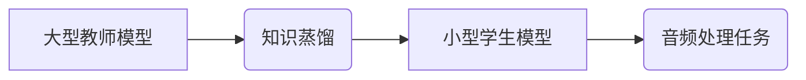

> 知识蒸馏，音频处理，深度学习，模型压缩，迁移学习

## 1. 背景介绍

音频处理领域近年来取得了显著进展，深度学习模型在语音识别、音乐生成、音频分类等任务中展现出强大的能力。然而，这些模型通常具有庞大的参数量和计算复杂度，难以部署在资源有限的设备上。知识蒸馏 (Knowledge Distillation) 作为一种模型压缩技术，通过将大型模型的知识“蒸馏”到小型模型中，有效降低了模型大小和计算成本，同时保持了较高的性能。

## 2. 核心概念与联系

知识蒸馏的核心思想是利用教师模型 (Teacher Model) 的知识来训练学生模型 (Student Model)。教师模型通常是一个大型、高性能的模型，而学生模型则是一个小型、轻量级的模型。知识蒸馏通过最小化教师模型和学生模型的输出分布之间的差异来实现知识传递。

**Mermaid 流程图:**



## 3. 核心算法原理 & 具体操作步骤

### 3.1  算法原理概述

知识蒸馏算法的基本原理是利用交叉熵损失函数来衡量教师模型和学生模型的输出分布之间的差异。教师模型的输出作为“软标签”，指导学生模型的学习。

### 3.2  算法步骤详解

1. **训练教师模型:** 首先，使用大量数据训练一个大型的教师模型，使其达到较高的性能。
2. **生成软标签:** 将教师模型的输出作为“软标签”，即每个样本的概率分布。
3. **训练学生模型:** 使用教师模型生成的软标签来训练小型学生模型。
4. **调整学习率:** 在训练过程中，可以根据学生模型的性能调整学习率，以加速收敛。
5. **评估模型性能:** 在测试集上评估学生模型的性能，并与教师模型进行比较。

### 3.3  算法优缺点

**优点:**

* 模型压缩: 显著降低模型大小和计算复杂度。
* 性能提升: 在某些情况下，学生模型的性能甚至可以超过教师模型。
* 迁移学习: 可以将教师模型的知识迁移到新的任务或数据集上。

**缺点:**

* 训练时间: 训练学生模型需要更多的时间，因为需要使用教师模型的输出作为软标签。
* 性能差异: 学生模型的性能可能无法完全达到教师模型的水平。

### 3.4  算法应用领域

知识蒸馏在音频处理领域有着广泛的应用，例如:

* 语音识别: 将大型语音识别模型的知识蒸馏到小型模型中，用于移动设备上的语音识别。
* 音乐生成: 使用知识蒸馏技术生成高质量的音乐，并降低模型的计算成本。
* 音频分类: 将大型音频分类模型的知识蒸馏到小型模型中，用于音频事件检测和识别。

## 4. 数学模型和公式 & 详细讲解 & 举例说明

### 4.1  数学模型构建

知识蒸馏的目标是最小化教师模型和学生模型的输出分布之间的差异。可以使用交叉熵损失函数来衡量这种差异。

### 4.2  公式推导过程

假设教师模型的输出为 $p_t(x)$, 学生模型的输出为 $p_s(x)$, 则交叉熵损失函数为:

$$
L = -\sum_{x} p_t(x) \log p_s(x)
$$

其中，$x$ 代表输入样本。

### 4.3  案例分析与讲解

例如，在语音识别任务中，教师模型的输出是一个概率分布，表示每个单词的可能性。学生模型的输出也是一个概率分布，表示每个单词的可能性。知识蒸馏的目标是使学生模型的输出分布尽可能接近教师模型的输出分布。

## 5. 项目实践：代码实例和详细解释说明

### 5.1  开发环境搭建

使用 Python 3.x 环境，安装必要的库，例如 TensorFlow 或 PyTorch。

### 5.2  源代码详细实现

```python
# 使用 TensorFlow 实现知识蒸馏
import tensorflow as tf

# 定义教师模型和学生模型
teacher_model = tf.keras.models.load_model('teacher_model.h5')
student_model = tf.keras.models.Sequential([
    # 学生模型的层结构
])

# 定义知识蒸馏损失函数
def distillation_loss(y_true, y_pred):
    # 计算交叉熵损失
    return tf.keras.losses.categorical_crossentropy(y_true, y_pred)

# 训练学生模型
student_model.compile(optimizer='adam', loss=distillation_loss)
student_model.fit(
    x_train,
    y_train,
    epochs=10,
    validation_data=(x_val, y_val)
)

# 保存学生模型
student_model.save('student_model.h5')
```

### 5.3  代码解读与分析

* 首先，加载教师模型和定义学生模型的结构。
* 然后，定义知识蒸馏损失函数，使用交叉熵损失函数来衡量教师模型和学生模型的输出分布之间的差异。
* 最后，使用训练数据训练学生模型，并保存训练好的学生模型。

### 5.4  运行结果展示

在测试集上评估学生模型的性能，并与教师模型进行比较。

## 6. 实际应用场景

### 6.4  未来应用展望

知识蒸馏在音频处理领域具有巨大的潜力，未来可以应用于:

* 语音助手: 将大型语音助手模型压缩到小型设备上，实现更流畅的语音交互。
* 语音翻译: 将大型语音翻译模型压缩到移动设备上，实现实时语音翻译。
* 音频增强: 使用知识蒸馏技术增强音频质量，例如降噪、降混响等。

## 7. 工具和资源推荐

### 7.1  学习资源推荐

* **论文:**
    * Hinton, G., Vinyals, O., & Dean, J. (2015). Distilling the knowledge in a neural network. arXiv preprint arXiv:1503.02531.
* **博客:**
    * https://blog.openai.com/knowledge-distillation/
    * https://towardsdatascience.com/knowledge-distillation-in-deep-learning-a-comprehensive-guide-a8999999999a

### 7.2  开发工具推荐

* **TensorFlow:** https://www.tensorflow.org/
* **PyTorch:** https://pytorch.org/

### 7.3  相关论文推荐

* **Teacher-Student Generative Adversarial Networks**
* **Multi-Task Learning with Knowledge Distillation**
* **Progressive Neural Networks**

## 8. 总结：未来发展趋势与挑战

### 8.1  研究成果总结

知识蒸馏技术在音频处理领域取得了显著的成果，有效降低了模型大小和计算成本，同时保持了较高的性能。

### 8.2  未来发展趋势

* **更有效的知识蒸馏方法:** 研究更有效的知识蒸馏方法，例如注意力机制、自监督学习等。
* **跨模态知识蒸馏:** 将知识蒸馏应用于跨模态任务，例如语音-文本对齐、语音-图像识别等。
* **边缘计算中的知识蒸馏:** 将知识蒸馏技术应用于边缘计算场景，实现高效的音频处理。

### 8.3  面临的挑战

* **知识蒸馏的泛化能力:** 知识蒸馏的泛化能力仍然需要进一步提升，尤其是在新的任务或数据集上。
* **知识蒸馏的效率:** 知识蒸馏的训练过程仍然比较耗时，需要进一步提高训练效率。

### 8.4  研究展望

未来，知识蒸馏技术将继续发展，在音频处理领域发挥越来越重要的作用。


## 9. 附录：常见问题与解答

* **Q: 知识蒸馏的原理是什么？**
* **A:** 知识蒸馏利用教师模型的知识来训练学生模型，通过最小化教师模型和学生模型的输出分布之间的差异来实现知识传递。

* **Q: 知识蒸馏有哪些优点？**
* **A:** 知识蒸馏可以有效降低模型大小和计算复杂度，同时保持较高的性能。

* **Q: 知识蒸馏有哪些缺点？**
* **A:** 知识蒸馏的训练时间较长，并且学生模型的性能可能无法完全达到教师模型的水平。


作者：禅与计算机程序设计艺术 / Zen and the Art of Computer Programming 
<end_of_turn>