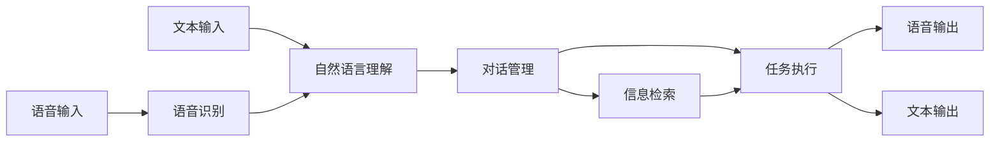

# 一切皆是映射：智能助手和语音交互系统的未来

## 1. 背景介绍

### 1.1 问题的由来

近年来，随着人工智能技术的飞速发展，智能助手和语音交互系统逐渐走进了千家万户。从苹果的Siri到亚马逊的Alexa，从谷歌助手到微软的小冰，这些智能助手正在改变着我们与机器交互的方式，也为我们的生活带来了极大的便利。然而，现有的智能助手仍然存在着许多不足，例如：

* **理解能力有限：** 对于复杂的语义、多轮对话、情感识别等方面，现有的智能助手还难以做到准确理解。
* **功能单一：** 大多数智能助手只能完成一些简单的任务，例如播放音乐、查询天气等，无法满足用户多样化的需求。
* **交互体验不佳：** 语音交互过程 often 存在着识别错误、响应迟钝、缺乏个性化等问题，影响用户体验。

### 1.2 研究现状

为了解决上述问题，学术界和工业界对智能助手和语音交互系统进行了大量的研究，并取得了一些突破性的进展。

* **自然语言处理技术（NLP）的进步：** 深度学习技术的应用，使得自然语言处理技术取得了显著的进步，例如BERT、GPT-3等预训练模型的出现，极大地提升了机器对自然语言的理解能力。
* **语音识别技术的提升：** 语音识别技术的精度和速度不断提高，为语音交互提供了更加可靠的技术基础。
* **多模态交互技术的兴起：** 将语音、图像、视频等多种模态信息融合到一起进行交互，可以为用户提供更加自然、丰富的交互体验。

### 1.3 研究意义

智能助手和语音交互系统作为人工智能领域的重要应用方向，对于推动人工智能技术的发展和应用具有重要的意义。

* **提升人机交互效率：** 语音交互作为一种自然的交互方式，可以有效地提升人机交互的效率和便捷性。
* **拓展人工智能应用领域：** 智能助手和语音交互系统可以应用于智能家居、智能客服、智能医疗等多个领域，为用户提供更加智能化的服务。
* **推动人工智能技术发展：** 智能助手和语音交互系统的发展，也将会推动自然语言处理、语音识别、机器学习等人工智能技术的进一步发展。

### 1.4 本文结构

本文将以“一切皆是映射”为主题，探讨智能助手和语音交互系统的未来发展趋势。本文的结构如下：

* 第二章将介绍智能助手和语音交互系统的核心概念，并阐述“一切皆是映射”的理念。
* 第三章将介绍智能助手和语音交互系统的核心算法原理，并详细解释其具体操作步骤。
* 第四章将构建智能助手和语音交互系统的数学模型，并通过公式推导和案例分析，深入浅出地讲解其工作原理。
* 第五章将通过代码实例，展示如何从零开始构建一个简单的智能助手。
* 第六章将探讨智能助手和语音交互系统的实际应用场景。
* 第七章将推荐一些学习资源、开发工具和相关论文，帮助读者进一步学习和研究。
* 第八章将总结智能助手和语音交互系统的未来发展趋势与挑战。
* 第九章将以附录的形式，解答一些常见问题。

## 2. 核心概念与联系

### 2.1 一切皆是映射

“一切皆是映射”是理解智能助手和语音交互系统的核心思想。简单来说，就是将用户的语音指令、文本输入、图像信息等，映射到相应的程序指令、数据库查询、知识图谱搜索等操作上。

例如，当用户对智能助手说“播放周杰伦的稻香”时，智能助手需要将这句话映射到以下操作：

1. **语音识别：** 将用户的语音信号转换为文本信息“播放周杰伦的稻香”。
2. **自然语言理解：** 理解用户的意图是“播放音乐”，歌曲名是“稻香”，歌手是“周杰伦”。
3. **信息检索：** 在音乐数据库中搜索歌曲“稻香”，并找到周杰伦演唱的版本。
4. **音乐播放：** 播放找到的歌曲。

### 2.2 智能助手架构

智能助手的架构通常包括以下几个模块：



* **语音识别模块：** 负责将用户的语音信号转换为文本信息。
* **自然语言理解模块：** 负责理解用户的意图，并将其转换为结构化的语义表示。
* **对话管理模块：** 负责管理对话的流程，跟踪对话状态，并根据用户的输入选择合适的回复。
* **信息检索模块：** 负责从数据库、知识图谱等数据源中检索相关信息。
* **任务执行模块：** 负责执行用户的指令，例如播放音乐、查询天气等。

### 2.3 语音交互流程

语音交互的流程通常包括以下几个步骤：

1. **用户说话：** 用户通过语音说出自己的需求。
2. **语音识别：** 智能助手将用户的语音信号转换为文本信息。
3. **自然语言理解：** 智能助手理解用户的意图，并将其转换为结构化的语义表示。
4. **对话管理：** 智能助手根据用户的意图和对话状态，选择合适的回复。
5. **任务执行：** 智能助手执行用户的指令，并返回结果。
6. **语音合成：** 智能助手将回复内容转换为语音输出。
7. **用户听到回复：** 用户听到智能助手的回复。

## 3. 核心算法原理 & 具体操作步骤

### 3.1 语音识别算法

语音识别算法是将语音信号转换为文本信息的关键技术。常用的语音识别算法包括：

* **隐马尔可夫模型（HMM）：** HMM是一种统计模型，用于描述一个系统在不同状态之间的转移概率和每个状态下观测到不同符号的概率。
* **深度神经网络（DNN）：** DNN是一种多层神经网络，可以学习语音信号的复杂特征，并将其转换为文本信息。
* **端到端语音识别（E2E）：** E2E语音识别是一种直接将语音信号转换为文本信息的模型，无需进行语音特征提取和声学模型训练。

### 3.2 自然语言理解算法

自然语言理解算法是理解用户意图的关键技术。常用的自然语言理解算法包括：

* **规则 based 方法：** 通过人工编写规则来识别用户的意图，例如正则表达式、语法分析树等。
* **统计 based 方法：** 利用机器学习算法，从大量的文本数据中学习语言的统计规律，例如朴素贝叶斯、支持向量机等。
* **深度学习 based 方法：** 利用深度神经网络，学习文本数据的深层语义表示，例如循环神经网络（RNN）、卷积神经网络（CNN）等。

### 3.3 对话管理算法

对话管理算法是管理对话流程的关键技术。常用的对话管理算法包括：

* **基于规则的对话管理：** 通过人工编写规则来定义对话的流程，例如状态机、决策树等。
* **基于统计的对话管理：** 利用机器学习算法，从大量的对话数据中学习对话的统计规律，例如马尔可夫决策过程（MDP）、强化学习等。
* **基于深度学习的对话管理：** 利用深度神经网络，学习对话的深层语义表示，例如端到端记忆网络（MemN2N）、Transformer等。

## 4. 数学模型和公式 & 详细讲解 & 举例说明

### 4.1 语音识别模型

以 HMM 语音识别模型为例，其数学模型可以表示为：

$$
P(W|O) = \frac{P(O|W)P(W)}{P(O)}
$$

其中：

* $W$ 表示词序列，$O$ 表示观测序列（即语音信号）。
* $P(W|O)$ 表示在给定观测序列 $O$ 的情况下，词序列 $W$ 出现的概率，也称为后验概率。
* $P(O|W)$ 表示在给定词序列 $W$ 的情况下，观测序列 $O$ 出现的概率，也称为似然概率。
* $P(W)$ 表示词序列 $W$ 出现的概率，也称为先验概率。
* $P(O)$ 表示观测序列 $O$ 出现的概率。

HMM 语音识别模型的目标是找到使得后验概率 $P(W|O)$ 最大的词序列 $W$。

### 4.2 自然语言理解模型

以 BERT 模型为例，其数学模型可以表示为：

$$
P(y|x) = softmax(W_oh + b_o)
$$

其中：

* $x$ 表示输入的文本序列。
* $y$ 表示输出的标签，例如用户的意图、情感等。
* $h$ 表示 BERT 模型编码后的文本表示。
* $W_o$ 和 $b_o$ 分别表示输出层的权重矩阵和偏置向量。

BERT 模型的目标是学习一个函数，将输入的文本序列映射到相应的标签上。

### 4.3 案例分析与讲解

以用户查询天气为例，假设用户说“今天北京天气怎么样？”，智能助手需要进行以下操作：

1. **语音识别：** 将用户的语音信号转换为文本信息“今天北京天气怎么样？”。
2. **自然语言理解：** 识别用户的意图是“查询天气”，地点是“北京”，时间是“今天”。
3. **信息检索：** 从天气数据库中查询北京今天的天气信息。
4. **语音合成：** 将查询到的天气信息转换为语音输出，例如“今天北京晴，最高温度25度，最低温度18度”。

### 4.4 常见问题解答

**Q：智能助手如何处理多轮对话？**

A：智能助手可以通过维护对话状态来处理多轮对话。对话状态可以记录用户的历史输入、当前意图、对话目标等信息。

**Q：智能助手如何进行个性化回复？**

A：智能助手可以通过学习用户的历史行为、偏好等信息，进行个性化回复。例如，根据用户的音乐播放历史，推荐用户可能喜欢的歌曲。

## 5. 项目实践：代码实例和详细解释说明

### 5.1 开发环境搭建

本节将介绍如何搭建一个简单的智能助手开发环境。

**1. 安装 Python**

Python 是一种常用的编程语言，也是开发智能助手的首选语言。

**2. 安装必要的 Python 库**

```
pip install speechrecognition pyttsx3
```

* `speechrecognition` 库用于语音识别。
* `pyttsx3` 库用于语音合成。

### 5.2 源代码详细实现

```python
import speech_recognition as sr
import pyttsx3

# 初始化语音识别引擎
r = sr.Recognizer()

# 初始化语音合成引擎
engine = pyttsx3.init()

def speak(text):
    """语音合成函数"""
    engine.say(text)
    engine.runAndWait()

def listen():
    """语音识别函数"""
    with sr.Microphone() as source:
        print("请说话：")
        audio = r.listen(source)
    try:
        text = r.recognize_google(audio, language="zh-CN")
        print("你说：", text)
        return text
    except sr.UnknownValueError:
        print("无法识别语音")
    except sr.RequestError as e:
        print("请求错误：", e)

if __name__ == "__main__":
    while True:
        text = listen()
        if text:
            if "你好" in text:
                speak("你好，请问有什么可以帮您？")
            elif "再见" in text:
                speak("再见！")
                break
            else:
                speak("抱歉，我不明白您的意思。")
```

### 5.3 代码解读与分析

* `listen()` 函数用于语音识别，它会监听用户的语音输入，并将其转换为文本信息。
* `speak()` 函数用于语音合成，它会将文本信息转换为语音输出。
* 主程序会循环监听用户的语音输入，并根据用户的输入进行相应的回复。

### 5.4 运行结果展示

运行程序后，用户可以通过语音与智能助手进行交互。例如，用户可以说“你好”，智能助手会回复“你好，请问有什么可以帮您？”。

## 6. 实际应用场景

智能助手和语音交互系统有着广泛的应用场景，例如：

* **智能家居：** 通过语音控制家里的电器设备，例如灯光、空调、电视等。
* **智能客服：** 通过语音与用户进行沟通，解决用户的问题。
* **智能医疗：** 通过语音与医生进行沟通，获取医疗建议。
* **智能教育：** 通过语音与学生进行互动，辅助学生学习。

## 7. 工具和资源推荐

### 7.1 学习资源推荐

* **斯坦福大学自然语言处理课程：** https://web.stanford.edu/class/cs224n/
* **麻省理工学院机器学习课程：** https://www.edx.org/course/machine-learning
* **Coursera 深度学习课程：** https://www.coursera.org/specializations/deep-learning

### 7.2 开发工具推荐

* **Python：** https://www.python.org/
* **TensorFlow：** https://www.tensorflow.org/
* **PyTorch：** https://pytorch.org/

### 7.3 相关论文推荐

* **BERT: Pre-training of Deep Bidirectional Transformers for Language Understanding**
* **Attention Is All You Need**
* **Neural Machine Translation by Jointly Learning to Align and Translate**

### 7.4 其他资源推荐

* **Hugging Face：** https://huggingface.co/
* **GitHub：** https://github.com/

## 8. 总结：未来发展趋势与挑战

### 8.1 研究成果总结

近年来，智能助手和语音交互系统取得了显著的进展，例如自然语言处理技术的进步、语音识别技术的提升、多模态交互技术的兴起等。

### 8.2 未来发展趋势

* **更加智能化：** 随着人工智能技术的不断发展，智能助手将会变得更加智能化，能够理解更加复杂的语义、处理更加复杂的任务。
* **更加个性化：** 智能助手将会更加注重用户的个性化需求，提供更加精准的服务。
* **更加自然化：** 语音交互将会变得更加自然流畅，用户体验将会进一步提升。

### 8.3 面临的挑战

* **数据安全和隐私保护：** 智能助手需要收集用户的语音、文本等信息，如何保护用户的隐私安全是一个重要的挑战。
* **技术瓶颈：** 现有的语音识别、自然语言理解等技术仍然存在着一些瓶颈，例如噪声环境下的语音识别、复杂语义的理解等。
* **伦理道德问题：** 智能助手的发展也带来了一些伦理道德问题，例如人工智能的责任问题、人工智能的偏见问题等。

### 8.4 研究展望

未来，智能助手和语音交互系统将会继续发展，并应用于更多的领域，为我们的生活带来更多的便利。

## 9. 附录：常见问题与解答

**Q：智能助手会取代人类吗？**

A：智能助手是人工智能技术的一种应用，它的目的是辅助人类，而不是取代人类。

**Q：如何提高智能助手的识别率？**

A：可以通过以下方式提高智能助手的识别率：

* 在安静的环境下使用智能助手。
* 使用标准的语音进行交互。
* 对智能助手进行个性化训练。

**Q：如何保护我的隐私安全？**

A：在使用智能助手的过程中，需要注意以下几点：

* 选择正规的智能助手产品。
* 不要泄露个人敏感信息。
* 定期更改智能助手的密码。

作者：禅与计算机程序设计艺术 / Zen and the Art of Computer Programming
