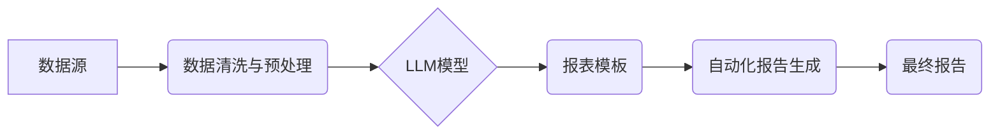

> Large Language Model (LLM), 商业智能 (BI), 自动化报告生成, 自然语言处理 (NLP), 数据可视化

## 1. 背景介绍

在当今数据爆炸的时代，商业智能 (BI) 已经成为企业决策的核心驱动力。BI系统通过收集、分析和可视化数据，帮助企业洞察市场趋势、识别商业机会和优化运营效率。然而，传统的BI报告生成过程通常耗时费力，需要专业人员进行数据处理、报表设计和文档撰写。随着大型语言模型 (LLM) 的快速发展，自动化报告生成技术逐渐成为BI领域的新兴趋势，为企业提供了一种更高效、更智能的报告解决方案。

## 2. 核心概念与联系

**2.1  大型语言模型 (LLM)**

LLM是一种基于深度学习的强大人工智能模型，能够理解和生成人类语言。通过训练海量文本数据，LLM可以学习语言的语法、语义和上下文关系，从而实现各种自然语言处理 (NLP) 任务，例如文本分类、机器翻译、问答系统和文本生成。

**2.2  商业智能 (BI)**

BI是指利用数据分析技术，从海量数据中提取有价值的信息，并将其转化为可理解的报表、图表和仪表盘，帮助企业决策者做出更明智的决策。BI系统通常包括数据收集、数据清洗、数据分析和数据可视化等环节。

**2.3  自动化报告生成**

自动化报告生成是指利用技术手段，自动生成BI报表，减少人工干预，提高效率和准确性。LLM可以作为自动化报告生成的核心引擎，通过理解数据和业务需求，自动生成高质量的报表文档。

**2.4  架构图**



## 3. 核心算法原理 & 具体操作步骤

**3.1  算法原理概述**

LLM在自动化报告生成中的核心算法原理是基于文本生成和数据理解。

* **文本生成:** LLM通过训练学习语言的语法和语义规则，能够根据输入的数据和模板，自动生成自然流畅的文本内容。
* **数据理解:** LLM可以理解数据中的结构和含义，例如数字、日期、类别等，并将其转化为可理解的文本描述。

**3.2  算法步骤详解**

1. **数据收集与预处理:** 从各种数据源收集相关数据，并进行清洗、转换和格式化，以便LLM能够理解和处理。
2. **报表模板设计:** 设计报表模板，定义报表结构、内容和格式，并使用标记语言（例如Markdown）标注数据占位符。
3. **LLM模型训练与调优:** 使用训练数据训练LLM模型，并根据实际需求进行调优，使其能够准确理解数据并生成高质量的报表文本。
4. **数据输入与文本生成:** 将预处理后的数据输入到LLM模型中，模型根据模板和数据生成相应的报表文本。
5. **报表格式化与输出:** 将生成的报表文本格式化，并将其输出为最终的报表文档，例如PDF、Word或HTML格式。

**3.3  算法优缺点**

**优点:**

* **自动化程度高:** 自动化生成报表，减少人工干预，提高效率。
* **可扩展性强:** 可以处理各种类型的数据和报表格式。
* **个性化定制:** 可以根据用户需求定制报表模板和内容。

**缺点:**

* **模型训练成本高:** 训练大型语言模型需要大量的计算资源和数据。
* **数据依赖性强:** 报表质量取决于数据的准确性和完整性。
* **解释性弱:** LLM模型的决策过程难以解释，难以进行故障诊断。

**3.4  算法应用领域**

* **金融行业:** 自动生成财务报表、风险报告和投资分析报告。
* **零售行业:** 自动生成销售报表、库存报表和客户分析报告。
* **医疗行业:** 自动生成患者诊断报告、治疗方案和药物使用情况报告。
* **教育行业:** 自动生成学生成绩报告、学习进度报告和教学评估报告。

## 4. 数学模型和公式 & 详细讲解 & 举例说明

**4.1  数学模型构建**

LLM的训练过程本质上是一个优化问题，目标是找到一个模型参数，使得模型在训练数据上的预测结果与真实值尽可能接近。常用的数学模型包括Transformer、BERT和GPT等。

**4.2  公式推导过程**

LLM的训练过程通常使用交叉熵损失函数，其公式如下：

$$
Loss = -\sum_{i=1}^{N} y_i \log(p_i)
$$

其中：

* $N$ 是样本数量。
* $y_i$ 是真实标签。
* $p_i$ 是模型预测的概率。

**4.3  案例分析与讲解**

假设我们训练一个LLM模型用于生成产品描述文本。训练数据包括产品名称、产品属性和产品描述。模型的目标是根据产品名称和属性，生成一个符合语义和风格的描述文本。

在训练过程中，模型会不断调整参数，使得预测的描述文本与真实描述文本的相似度最大化。通过交叉熵损失函数的优化，模型最终能够学习到产品描述的规律，并生成高质量的文本内容。

## 5. 项目实践：代码实例和详细解释说明

**5.1  开发环境搭建**

* Python 3.7+
* PyTorch 或 TensorFlow
* NLTK 或 SpaCy

**5.2  源代码详细实现**

```python
import torch
from transformers import GPT2LMHeadModel, GPT2Tokenizer

# 加载预训练模型和词典
model_name = "gpt2"
tokenizer = GPT2Tokenizer.from_pretrained(model_name)
model = GPT2LMHeadModel.from_pretrained(model_name)

# 定义输入数据
input_text = "这是一个产品描述的例子。"

# Token化输入数据
input_ids = tokenizer.encode(input_text, return_tensors="pt")

# 生成文本
output = model.generate(input_ids, max_length=50)

# 解码输出文本
generated_text = tokenizer.decode(output[0], skip_special_tokens=True)

# 打印输出文本
print(generated_text)
```

**5.3  代码解读与分析**

* 该代码示例使用预训练的GPT2模型进行文本生成。
* 首先加载预训练模型和词典。
* 然后将输入文本进行Token化，转换为模型可理解的格式。
* 使用模型的`generate`方法生成文本，并设置最大长度为50。
* 最后解码输出文本，并打印到控制台。

**5.4  运行结果展示**

运行该代码后，会输出一个基于输入文本生成的续写文本。例如，输入文本为"这是一个产品描述的例子。", 输出文本可能为"这是一个产品描述的例子。这款产品功能强大，操作简单，非常适合..."。

## 6. 实际应用场景

**6.1  自动化财务报表生成**

LLM可以自动生成财务报表，例如资产负债表、损益表和现金流量表，减少财务人员的重复劳动，提高效率。

**6.2  客户行为分析报告**

LLM可以分析客户购买行为、浏览记录和反馈信息，生成客户行为分析报告，帮助企业了解客户需求和优化营销策略。

**6.3  市场趋势预测报告**

LLM可以分析市场数据、新闻报道和社交媒体信息，生成市场趋势预测报告，帮助企业把握市场机会和规避风险。

**6.4  未来应用展望**

随着LLM技术的不断发展，自动化报告生成将在BI领域发挥更广泛的作用，例如：

* **个性化报表定制:** 根据用户的需求和权限，自动生成个性化的报表。
* **多语言报表生成:** 支持多种语言的报表生成，满足全球化需求。
* **交互式报表分析:** 结合LLM的自然语言理解能力，实现交互式报表分析，帮助用户更深入地理解数据。

## 7. 工具和资源推荐

**7.1  学习资源推荐**

* **论文:** "Attention Is All You Need"
* **书籍:** "Deep Learning"
* **在线课程:** Coursera、edX、Udacity

**7.2  开发工具推荐**

* **PyTorch:** 深度学习框架
* **TensorFlow:** 深度学习框架
* **Hugging Face Transformers:** 预训练模型库

**7.3  相关论文推荐**

* "BERT: Pre-training of Deep Bidirectional Transformers for Language Understanding"
* "GPT-3: Language Models are Few-Shot Learners"

## 8. 总结：未来发展趋势与挑战

**8.1  研究成果总结**

LLM在自动化报告生成领域取得了显著进展，能够自动生成高质量的报表文本，提高效率和准确性。

**8.2  未来发展趋势**

* **模型规模和性能提升:** 随着计算资源的不断发展，LLM模型规模将进一步扩大，性能将得到显著提升。
* **多模态数据处理:** LLM将能够处理多种数据类型，例如文本、图像和音频，生成更丰富和全面的报表。
* **可解释性增强:** 研究人员将致力于提高LLM模型的可解释性，使得模型的决策过程更加透明。

**8.3  面临的挑战**

* **数据安全和隐私保护:** LLM模型的训练需要大量数据，如何保证数据安全和隐私保护是一个重要挑战。
* **模型偏见和公平性:** LLM模型可能存在偏见和不公平性，需要采取措施进行缓解。
* **伦理问题:** LLM技术的应用可能引发一些伦理问题，例如自动生成虚假信息和侵犯知识产权。

**8.4  研究展望**

未来，LLM在自动化报告生成领域将继续发挥重要作用，推动BI领域的发展。研究人员将继续探索LLM模型的潜力，解决其面临的挑战，并将其应用于更多领域。

## 9. 附录：常见问题与解答

**9.1  LLM模型的训练成本高吗？**

是的，训练大型语言模型需要大量的计算资源和数据，成本较高。

**9.2  LLM模型的输出文本质量如何？**

LLM模型能够生成高质量的文本，但其质量取决于模型的训练数据和模型参数。

**9.3  LLM模型是否可以理解数据中的含义？**

LLM模型可以理解数据中的结构和关系，但其对数据的理解能力有限，无法完全理解数据的含义。


作者：禅与计算机程序设计艺术 / Zen and the Art of Computer Programming 
<end_of_turn>