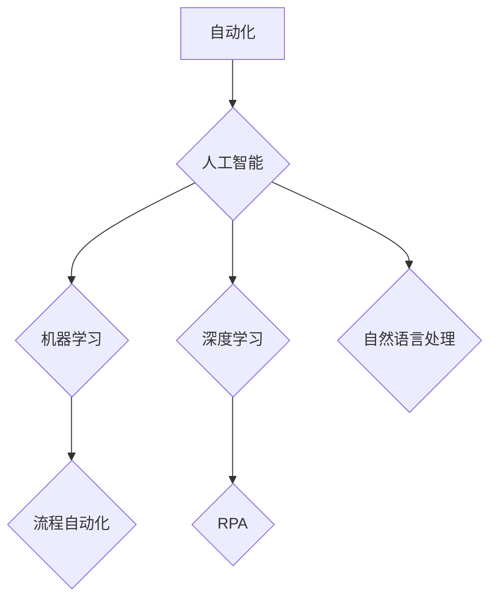

> 自动化、人工智能、机器学习、深度学习、自然语言处理、流程自动化、Robotic Process Automation (RPA)

## 1. 背景介绍

自动化一直是科技发展的重要驱动力，它旨在通过技术手段替代人工完成重复性、规则性或危险性任务，从而提高效率、降低成本和风险。随着人工智能 (AI)、机器学习 (ML) 和深度学习 (DL) 等技术的快速发展，自动化领域迎来了前所未有的机遇和挑战。

近年来，自动化技术取得了显著进展，从工业自动化到商业流程自动化，再到日常生活中的智能家居，自动化无处不在。然而，传统的自动化方法往往局限于预先定义的规则和流程，难以应对复杂、动态变化的环境。而人工智能技术的加入，为自动化带来了全新的可能性。

## 2. 核心概念与联系

**2.1 自动化**

自动化是指利用技术手段代替人工完成特定任务的过程。它可以分为：

* **硬自动化:** 通过机械设备和控制系统实现自动化，例如工业机器人、自动生产线等。
* **软自动化:** 通过软件程序和算法实现自动化，例如流程自动化、数据处理自动化等。

**2.2 人工智能 (AI)**

人工智能是指模拟人类智能行为的计算机系统。它包括以下几个关键领域：

* **机器学习 (ML):** 使计算机能够从数据中学习并改进性能的算法。
* **深度学习 (DL):** 基于多层神经网络的机器学习方法，能够处理更复杂的数据和任务。
* **自然语言处理 (NLP):** 使计算机能够理解和处理人类语言的算法。

**2.3 流程自动化**

流程自动化是指利用软件工具自动执行重复性、规则性任务，例如数据录入、报表生成、邮件发送等。

**2.4 Robotic Process Automation (RPA)**

Robotic Process Automation (RPA) 是流程自动化的一个子领域，它使用软件机器人模拟人类操作，自动执行桌面应用程序和网站上的任务。

**2.5 核心概念联系**

人工智能技术为自动化带来了革命性的变化，特别是机器学习和深度学习的应用，使得自动化能够处理更复杂、更灵活的任务。流程自动化和 RPA 都是人工智能技术应用的典型案例，它们利用 AI 技术自动执行重复性任务，提高效率和降低成本。



## 3. 核心算法原理 & 具体操作步骤

### 3.1 算法原理概述

机器学习算法的核心是通过训练模型来学习数据中的模式和规律。训练过程通常包括以下步骤：

1. **数据收集和预处理:** 收集相关数据并进行清洗、转换和特征工程等预处理操作。
2. **模型选择:** 根据任务类型和数据特点选择合适的机器学习算法。
3. **模型训练:** 使用训练数据训练模型，调整模型参数以最小化预测误差。
4. **模型评估:** 使用测试数据评估模型的性能，例如准确率、召回率、F1-score 等。
5. **模型部署:** 将训练好的模型部署到实际应用场景中，用于预测或决策。

### 3.2 算法步骤详解

以监督学习算法为例，详细说明其步骤：

1. **数据收集:** 收集包含输入特征和输出标签的数据集。
2. **数据预处理:** 清洗数据，处理缺失值，标准化特征，将数据转换为模型可理解的格式。
3. **特征工程:** 从原始数据中提取更具代表性的特征，提高模型性能。
4. **模型选择:** 根据任务类型选择合适的监督学习算法，例如线性回归、逻辑回归、决策树、支持向量机等。
5. **模型训练:** 使用训练数据训练模型，调整模型参数以最小化预测误差。
6. **模型评估:** 使用测试数据评估模型的性能，选择性能最好的模型。
7. **模型部署:** 将训练好的模型部署到实际应用场景中，用于预测或决策。

### 3.3 算法优缺点

**优点:**

* 自动学习数据模式，无需人工编程规则。
* 能够处理复杂、非线性关系的数据。
* 随着数据量的增加，模型性能不断提升。

**缺点:**

* 需要大量的数据进行训练。
* 模型训练过程可能耗时和耗能。
* 模型解释性较差，难以理解模型决策过程。

### 3.4 算法应用领域

机器学习算法广泛应用于各个领域，例如：

* **图像识别:** 人脸识别、物体检测、图像分类等。
* **自然语言处理:** 文本分类、情感分析、机器翻译等。
* **推荐系统:** 商品推荐、内容推荐、用户画像等。
* **金融领域:** 欺诈检测、风险评估、信用评分等。
* **医疗领域:** 疾病诊断、药物研发、医疗影像分析等。

## 4. 数学模型和公式 & 详细讲解 & 举例说明

### 4.1 数学模型构建

机器学习算法通常基于数学模型，例如线性回归模型、逻辑回归模型、决策树模型等。这些模型通过数学公式来描述数据之间的关系。

**4.1.1 线性回归模型**

线性回归模型假设数据之间存在线性关系，可以用以下公式表示：

$$y = w_0 + w_1x_1 + w_2x_2 + ... + w_nx_n + \epsilon$$

其中：

* $y$ 是目标变量
* $x_1, x_2, ..., x_n$ 是输入特征
* $w_0, w_1, w_2, ..., w_n$ 是模型参数
* $\epsilon$ 是误差项

**4.1.2 逻辑回归模型**

逻辑回归模型用于分类问题，它将线性回归模型的输出映射到0到1之间的概率值，表示样本属于某个类别的概率。

$$P(y=1|x) = \frac{1}{1 + e^{-(w_0 + w_1x_1 + w_2x_2 + ... + w_nx_n)}}$$

### 4.2 公式推导过程

机器学习算法的训练过程本质上是参数优化过程，通过调整模型参数，使模型的预测结果与真实值尽可能接近。常用的优化算法包括梯度下降法、随机梯度下降法、Adam 算法等。

**4.2.1 梯度下降法**

梯度下降法是一种迭代优化算法，它通过不断更新模型参数，沿着梯度方向下降，最终找到最优参数值。

**公式:**

$$w_{t+1} = w_t - \eta \nabla L(w_t)$$

其中：

* $w_t$ 是模型参数在第 $t$ 次迭代的值
* $\eta$ 是学习率
* $\nabla L(w_t)$ 是损失函数 $L$ 对参数 $w_t$ 的梯度

### 4.3 案例分析与讲解

**4.3.1 线性回归模型案例**

假设我们有一个数据集，包含房屋面积和房屋价格的信息。我们可以使用线性回归模型来预测房屋价格。

* 输入特征: 房屋面积
* 目标变量: 房屋价格

通过训练线性回归模型，我们可以得到一个模型参数 $w_0$ 和 $w_1$，表示房屋价格与面积之间的关系。

**公式:**

$$价格 = w_0 + w_1 * 面积$$

**4.3.2 逻辑回归模型案例**

假设我们有一个数据集，包含客户的购买行为信息。我们可以使用逻辑回归模型来预测客户是否会购买某个产品。

* 输入特征: 客户年龄、收入、购买历史等
* 目标变量: 是否购买 (0 或 1)

通过训练逻辑回归模型，我们可以得到一个模型参数，表示客户购买产品的概率。

## 5. 项目实践：代码实例和详细解释说明

### 5.1 开发环境搭建

* Python 3.x
* Jupyter Notebook 或 VS Code
* 机器学习库: scikit-learn, TensorFlow, PyTorch 等

### 5.2 源代码详细实现

```python
# 导入必要的库
import pandas as pd
from sklearn.model_selection import train_test_split
from sklearn.linear_model import LinearRegression

# 加载数据
data = pd.read_csv('housing_data.csv')

# 分割数据
X = data[['面积']]
y = data['价格']
X_train, X_test, y_train, y_test = train_test_split(X, y, test_size=0.2, random_state=42)

# 创建线性回归模型
model = LinearRegression()

# 训练模型
model.fit(X_train, y_train)

# 预测测试数据
y_pred = model.predict(X_test)

# 评估模型性能
from sklearn.metrics import mean_squared_error
mse = mean_squared_error(y_test, y_pred)
print(f'均方误差: {mse}')
```

### 5.3 代码解读与分析

* 首先，我们导入必要的库，并加载数据。
* 然后，我们将数据分割成训练集和测试集。
* 接下来，我们创建线性回归模型，并使用训练集训练模型。
* 训练完成后，我们使用测试集预测结果，并评估模型性能。

### 5.4 运行结果展示

运行上述代码后，会输出模型的均方误差值，该值越小，模型性能越好。

## 6. 实际应用场景

### 6.1 工业自动化

* **机器人控制:** 机器人可以自动完成重复性、危险性任务，例如焊接、喷漆、装配等。
* **生产线优化:** 通过自动化控制生产流程，提高生产效率和产品质量。
* ** Predictive Maintenance:** 利用传感器数据和机器学习算法预测设备故障，提前进行维护，降低停机时间和维修成本。

### 6.2 商业流程自动化

* **数据录入:** 自动化数据录入任务，例如从电子表格或网站提取数据。
* **报表生成:** 自动生成报表，例如销售报表、财务报表等。
* **邮件发送:** 自动发送邮件，例如订单确认邮件、客户服务邮件等。

### 6.3 生活场景自动化

* **智能家居:** 通过语音控制或手机APP控制家电设备，例如灯光、空调、电视等。
* **智能交通:** 自动驾驶汽车、智能交通信号灯等。
* **个性化推荐:** 基于用户行为数据，推荐个性化商品、内容和服务。

### 6.4 未来应用展望

随着人工智能技术的不断发展，自动化将应用于更多领域，例如：

* **医疗保健:** 自动化诊断、治疗、药物研发等。
* **教育:** 个性化学习、自动批改作业等。
* **金融:** 自动化交易、风险管理、欺诈检测等。

## 7. 工具和资源推荐

### 7.1 学习资源推荐

* **书籍:**
    * 《Python机器学习》
    * 《深度学习》
    * 《人工智能：一种现代方法》
* **在线课程:**
    * Coursera: 机器学习、深度学习
    * edX: 人工智能、机器学习
    * Udacity: 深度学习工程师

### 7.2 开发工具推荐

* **Python:** 广泛使用的编程语言，用于机器学习和人工智能开发。
* **Jupyter Notebook:** 用于交互式编程和数据可视化的工具。
* **TensorFlow:** 开源深度学习框架。
* **PyTorch:** 开源深度学习框架。
* **scikit-learn:** 机器学习库，提供各种算法和工具。

### 7.3 相关论文推荐

* **《ImageNet Classification with Deep Convolutional Neural Networks》**
* **《Attention Is All You Need》**
* **《BERT: Pre-training of Deep Bidirectional Transformers for Language Understanding》**

## 8. 总结：未来发展趋势与挑战

### 8.1 研究成果总结

近年来，自动化领域取得了显著进展，人工智能技术的应用为自动化带来了革命性的变化。机器学习算法能够自动学习数据模式，处理复杂、非线性关系的数据，